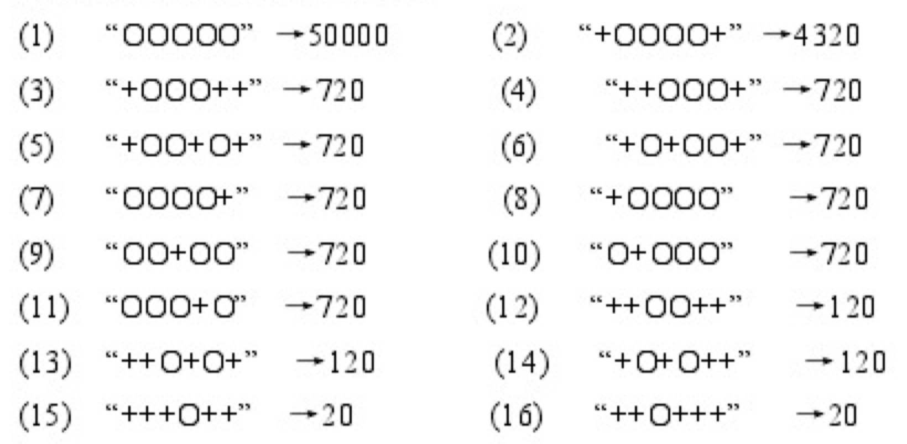

## 1. 迷宫搜索

### 1.1 使用方法

在搜索问题的目录下，

```bash
make #编译
./A_Star -1 #执行A*算法,-1表示input1.txt, -2表示input2.txt
cat output_A.txt #输出结果
./IDA_Star -1 #执行IDA*算法,-1表示input1.txt, -2表示input2.txt
cat output_IDA.txt #输出结果
make clean #清空
```


### 1.2 启发函数

两个算法都是用曼哈顿距离，即
$$
d=|x-d_x|+|y-d_y|
$$
原因在于走迷宫时，正好是只能走上下左右，然后只能是直上直下，所以这个启发函数满足
$$
h(n)\le h^*(n)
$$

除此之外，相对于欧式距离，曼哈顿距离不用计算平方，计算量小。

### 1.3 结果

#### input1

| 算法 | 执行时间 | 动作序列                                | 总步数 |
| ---- | -------- | --------------------------------------- | ------ |
| A*   | 1.6e-05  | RDDDRRRDDRDRDDDDRRRRDDRRRRRRRRDDDRRRRRR | 39     |
| IDA* | 6e-06    | RDDDRRRDDRDRDDDDRRRRDDDDDRRRRRRRRRRRRRR | 39     |

#### input2

由于input2中空格太多，导致可行路线很多很多，直接的IDA*算法搜索空间过大，无法得出结果。

需要采用一定的剪枝策略

| 算法 | 执行时间 | 动作序列                                                     | 总步数 |
| ---- | -------- | ------------------------------------------------------------ | :----- |
| A*   | 0.000109 | RRRRRRRRRRRRRRRRRRRDDRDRRDRRRRRRRRRRRRRRUUUURRDDD RRRRDDDDDDDDRRRRRRUUUUUURRDDRDRDRRRRRRDDDDDDDD DDDDDDDDLLLLLDDRRRRRR | 116    |
| IDA* | ×        | ×                                                            | ×      |


### 1.4 复杂度分析

设迷宫矩阵的规模为$n$

#### A*算法

##### 时间复杂度

搜索空间是一棵树，时间复杂度为$O(n)$

##### 空间复杂度

需要保存搜索的节点的信息$O(n^2)$

#### IDA*算法

##### 时间复杂度

几乎没有回溯，所以为$O(n)$

##### 空间复杂度

不需要保存额外的信息，所以为$O(n)$

### 1.5 优化方式

1. 在`A*`与`IDA*`算法仅仅使用$h()$矩阵同时保存迷宫的墙(-1)以及可通行并且相应的曼哈顿距离(>=0). 不仅节省了存储空间，也不需要不断计算$h$值，同时也考虑到性能层面的空间局部性和时间局部性。
2. 在`A*`算法中使用小根堆，相对于排序，可以更加快地取到最小的节点，然后展开。

## 2. 五子棋对弈

### 2.1 使用方法

在五子棋的目录下

```bash
make #编译
./gobang  #执行
#6,7 请按照 行,列 的输入方式输入自己的下法
cat output.txt #输出棋谱
# make clean
```


### 2.2 评分函数的设计

根据董红安2005年论文“计算机五子棋博弈系统的研究与实现”中的评分表，



得到如下的patterns序列，每次对横、竖、斜、反斜进行**字符串匹配**，得到相应的评分，评分是可叠加的，AI和Human各有自己的评分。

使用这种方式是在断定不同的排列方式有不同的赢的概率，比如`OOOOO`表示已经赢了，所以相应的值特别大。

```cpp
vector<pair<string,int>>paterns={
    {"11111",50000},
    {"011110",4320},
    {"011100",720},
    {"001110",720},
    {"011010",720},
    {"010110",720},
    {"11110",720},
    {"01111",720},
    {"11011",720},
    {"10111",720},
    {"11101",720},
    {"001100",120},
    {"001010",120},
    {"010100",120},
    {"000100",20},
    {"001000",20}
};
```

### 2.3 算法思想

使用$\alpha-\beta \text{ pruning}$显著降低了搜索的空间，使一些如果选择了可能使情况更差的分支被提前去掉，不需要下一步搜索。

### 2.4 实验结果分析

具体的对战在最后的`五子棋对战记录`，所有局都是AI与网上在线的五子棋对弈，而且全部胜利，由于是AI先手，而且没有任何禁手，所以可能是在搜索的过程中找到了必胜的策略。

至于我的棋力，完全不敌。

### 2.5 思考题

1. 思考加深，搜索的空间呈级数级增长，同时棋力也加倍增长，本代码采用深度为7.具体的优化策略在下一小节详细说明。
2. 剪枝的效率与节点的排列顺序非常相关，所以每次都会先计算不同落子位置的优势（也会考虑对方的优势），然后先搜索大的那些节点。具体在下一节详细说明。
3. 本代码没有自学习的能力，要想有自学的能力，可以尝试增加一些buffer, 存储一些败局，然后以后对弈的时候给这些可能的败局更大的权重。或者可以使用强化学习，棋盘使用CNN处理，得到固定长度的向量值作为state, 然后最终的输(-1)赢(+1)作为reward, 中间的reward为0. action 空间可以是整个棋盘，也可以是当前棋盘的有子位置的(+2)空间。最终算法使用DQN或者DDPG实现自学习。

### 2.6 具体实现及优化策略

#### 界面评分函数

每次落子都使用`void updateScore(const Position p)`来更新界面的评分，对AI和Human分别评分。为了考虑到效率，每次的评分不是对整个棋盘重新打分，而是仅仅考虑落子的位置。对横、竖、斜、反斜分别评分。评分的方式也是按照字符串匹配的方式。

#### 搜索与剪枝

每次往下搜索，都会对当前的可下的位置进行评分(另一种评分函数)，然后使用大根堆取出最大的几个，为了考虑到效率问题，并不每次都搜索全部的空间，而仅仅是**只取最多7个点**进行展开。这一点既保证了深度，又保障了棋力，效率还不会特别低。

可落子的空间为**正负2**也就是周围的+均为可落子的位置。

```+ + + + +
+ + + + +
+ + + + +
+ + O + +
+ + + + +
+ + + + +
```

为了提高效率，每次落子，都会更新一次可落子的空间，同时，每次回溯，都会滚回上次的记录。

### 2.7 五子棋对战记录

由于自己的棋力不行，所以找网上的在线五子棋。以下的对战均为开局两次，而且全胜。

#### 1. 

对战[在线五子棋小游戏 - aTool在线工具](<http://www.atool88.com/gobang.php>)


```
  AI 	  ME
[4,0]	[3,0]
[5,2]	[4,2]
[5,3]	[5,1]
[3,3]	[4,3]
[3,5]	[4,4]
[4,5]	[4,1]
[5,4]	[5,5]
[3,6]	[2,7]
[3,4]	[3,2]
[3,7]	

AI WIN!
```

**第二次仍然胜**


```
  AI 	  ME
[9,4]	[8,3]
[8,5]	[7,6]
[9,5]	[7,5]
[9,6]	[9,3]
[8,4]	[7,4]
[7,3]	[6,2]
[9,7]	[9,8]
[11,7]	[10,6]
[8,7]	[10,7]
[7,7]	[6,7]
[8,6]	[8,8]
[6,8]	[5,9]
[10,4]	

AI WIN!
```

#### 2. 

对战[在线五子棋](<http://html5.huceo.com/wzq/>)


```
  AI 	  ME
[12,13]	[11,12]
[9,11]	[10,12]
[9,12]	[9,13]
[12,10]	[10,13]
[12,11]	[12,12]
[10,10]	[8,13]
[7,13]	[8,12]
[7,11]	[8,11]
[8,10]	[13,12]
[14,12]	[7,12]
[9,9]	[6,12]
[9,10]	[9,8]
[11,10]	

AI WIN!
```

**第二次仍然胜利**


```
  AI 	  ME
[13,5]	[12,6]
[11,3]	[12,4]
[12,5]	[11,5]
[10,3]	[10,4]
[9,3]	[8,3]
[9,2]	[11,4]
[9,4]	[9,1]
[13,3]	[12,3]
[13,4]	[13,2]
[9,6]	[9,5]
[8,5]	[7,6]
[10,7]	[11,6]
[11,8]	[12,9]
[7,4]	

AI WIN!
```

#### 3.

对战[973五子棋](<http://www.973.com/p76698>)


```
  AI 	  ME
[3,6]	[2,6]
[4,8]	[3,8]
[4,7]	[5,8]
[4,9]	[4,6]
[5,7]	[3,9]
[6,7]	[7,7]
[2,7]	[3,7]
[4,5]	[3,10]
[3,11]	[1,8]
[6,3]	[5,4]
[6,4]	[2,8]
[6,5]	[6,6]
[5,5]	[1,9]
[0,10]	[7,5]
[7,8]	[5,6]
[4,10]	[4,11]
[6,2]	[6,1]
[5,12]	[2,9]
[0,7]	[7,6]
[8,6]	[7,4]
[7,3]	[1,10]
[1,11]	[1,7]
[1,6]	[3,5]
[0,8]	[4,4]
[5,3]	[4,3]
[0,9]	[0,6]
[0,11]	

AI WIN!
```

**再战仍然赢**


```
  AI 	  ME
[13,13]	[13,12]
[12,10]	[12,9]
[10,10]	[11,10]
[11,11]	[12,12]
[9,12]	[12,11]
[10,9]	[10,12]
[10,8]	[11,12]
[14,12]	[10,7]
[11,8]	[10,13]
[11,9]	[13,11]
[13,10]	[12,8]
[9,10]	[12,7]
[9,7]	[8,6]
[9,9]	[12,6]
[12,5]	[9,8]
[7,9]	[8,9]
[8,8]	[7,7]
[10,6]	[11,5]
[6,10]	

AI WIN!
```

#### 4.

对战[7k7k五子棋](<http://www.7k7k.com/swf/189065.htm>)


```
AI WIN!
  AI 	  ME
[5,12]	[5,13]
[6,11]	[4,13]
[6,13]	[6,12]
[8,11]	[7,11]
[8,10]	[7,12]
[8,9]	[8,12]
[3,10]	[7,10]
[4,11]	[2,9]
[7,14]	

AI WIN!
```

**再战仍然胜利**


```
  AI 	  ME
[2,0]	[3,0]
[5,2]	[6,3]
[5,4]	[5,3]
[4,3]	[6,2]
[3,4]	[6,1]
[6,4]	[4,4]
[3,5]	[7,1]
[8,0]	[2,5]
[3,2]	[3,3]
[6,5]	[2,1]
[7,6]	

AI WIN!
```

#### 5.

对战[Gobang V3.0.0-beta.3](<http://gobang.light7.cn/#/>)


```
  AI 	  ME
[2,13]	[3,12]
[5,11]	[2,11]
[4,13]	[3,13]
[3,10]	[2,9]
[7,11]	[2,8]
[2,10]	[4,10]
[7,9]	[4,11]
[4,8]	[6,10]
[5,7]	[3,9]
[6,8]	[1,7]
[0,6]	[8,10]
[4,9]	[7,8]
[5,10]	[5,9]
[3,5]	[4,6]
[6,11]	[7,12]
[5,5]	[5,12]
[5,4]	[4,12]
[6,12]	[2,12]
[1,12]	[3,11]
[1,13]	[1,11]
[0,11]	[0,10]
[4,14]	[5,6]
[8,11]	[9,11]
[6,5]	[4,5]
[6,7]	[6,6]
[7,6]	[5,8]
[4,3]	[3,2]
[8,7]	

AI WIN!
```

**再战仍然胜利**


```
  AI 	  ME
[6,8]	[7,9]
[6,10]	[7,10]
[7,8]	[5,8]
[6,9]	[6,7]
[5,10]	[4,11]
[6,11]	[6,12]
[7,6]	[8,7]
[7,7]	[8,6]
[8,8]	[7,5]
[10,8]	[9,8]
[9,9]	[6,6]
[11,7]	[8,10]
[10,10]	[11,11]
[10,9]	[10,7]
[12,9]	[11,6]
[8,9]	[11,9]
[10,11]	[10,12]
[11,10]	[9,11]
[11,13]	[12,5]
[13,4]	[9,12]
[7,12]	[4,9]
[9,10]	[11,12]
[8,11]	[6,13]
[11,8]	

AI WIN!
```

### Ref

[五子棋AI](<https://blog.lihongxun.com/categories/%E4%BA%94%E5%AD%90%E6%A3%8BAI/>)

[五子棋AI教程](<https://github.com/lihongxun945/myblog/issues?page=2&q=is%3Aissue+is%3Aopen>)

[如何设计一个还可以的五子棋AI](<https://kimlongli.github.io/2016/12/14/%E5%A6%82%E4%BD%95%E8%AE%BE%E8%AE%A1%E4%B8%80%E4%B8%AA%E8%BF%98%E5%8F%AF%E4%BB%A5%E7%9A%84%E4%BA%94%E5%AD%90%E6%A3%8BAI/>)

[五子棋入门级AI的设计与实现](<https://zhuanlan.zhihu.com/p/25650252>)


