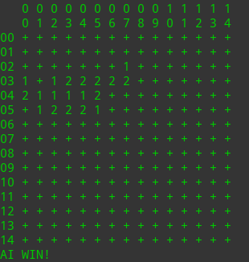
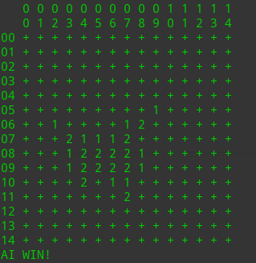
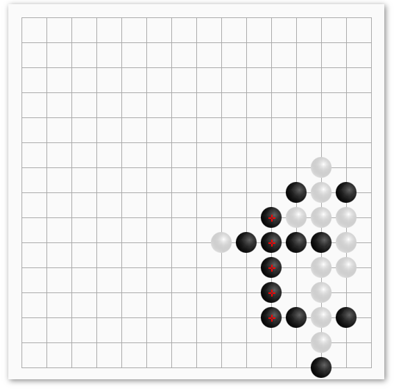
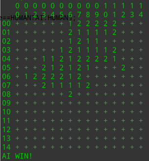
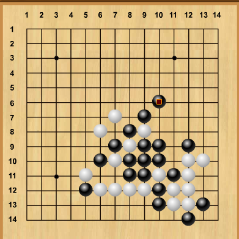
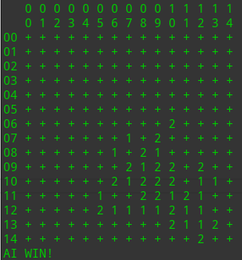
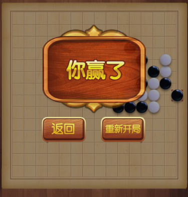
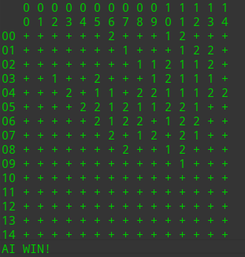
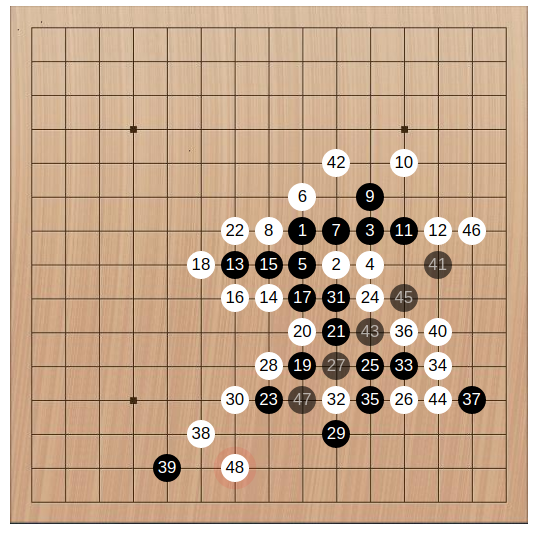

## 迷宫搜索

两个算法都是用曼哈顿距离，即
$$
d=|x-d_x|+|y-d_y|
$$
原因在于走迷宫时，正好是只能走上下左右，然后只能是直上直下，所以这个启发函数满足
$$
h(n)\le h^*(n)
$$


### A*算法


### IDA*算法


## 五子棋对弈

### 五子棋对战记录

对战[在线五子棋小游戏 - aTool在线工具](<http://www.atool88.com/gobang.php>)




```
  AI 	  ME
[4,0]	[3,0]
[5,2]	[4,2]
[5,3]	[5,1]
[3,3]	[4,3]
[3,5]	[4,4]
[4,5]	[4,1]
[5,4]	[5,5]
[3,6]	[2,7]
[3,4]	[3,2]
[3,7]	

AI WIN!
```

第二次仍然胜




```
  AI 	  ME
[9,4]	[8,3]
[8,5]	[7,6]
[9,5]	[7,5]
[9,6]	[9,3]
[8,4]	[7,4]
[7,3]	[6,2]
[9,7]	[9,8]
[11,7]	[10,6]
[8,7]	[10,7]
[7,7]	[6,7]
[8,6]	[8,8]
[6,8]	[5,9]
[10,4]	

AI WIN!
```

对战[在线五子棋](<http://html5.huceo.com/wzq/>)




```
  AI 	  ME
[12,13]	[11,12]
[9,11]	[10,12]
[9,12]	[9,13]
[12,10]	[10,13]
[12,11]	[12,12]
[10,10]	[8,13]
[7,13]	[8,12]
[7,11]	[8,11]
[8,10]	[13,12]
[14,12]	[7,12]
[9,9]	[6,12]
[9,10]	[9,8]
[11,10]	

AI WIN!
```

第二次仍然胜利


```
  AI 	  ME
[13,5]	[12,6]
[11,3]	[12,4]
[12,5]	[11,5]
[10,3]	[10,4]
[9,3]	[8,3]
[9,2]	[11,4]
[9,4]	[9,1]
[13,3]	[12,3]
[13,4]	[13,2]
[9,6]	[9,5]
[8,5]	[7,6]
[10,7]	[11,6]
[11,8]	[12,9]
[7,4]	

AI WIN!
```

对战[973五子棋](<http://www.973.com/p76698>)




```
  AI 	  ME
[3,6]	[2,6]
[4,8]	[3,8]
[4,7]	[5,8]
[4,9]	[4,6]
[5,7]	[3,9]
[6,7]	[7,7]
[2,7]	[3,7]
[4,5]	[3,10]
[3,11]	[1,8]
[6,3]	[5,4]
[6,4]	[2,8]
[6,5]	[6,6]
[5,5]	[1,9]
[0,10]	[7,5]
[7,8]	[5,6]
[4,10]	[4,11]
[6,2]	[6,1]
[5,12]	[2,9]
[0,7]	[7,6]
[8,6]	[7,4]
[7,3]	[1,10]
[1,11]	[1,7]
[1,6]	[3,5]
[0,8]	[4,4]
[5,3]	[4,3]
[0,9]	[0,6]
[0,11]	

AI WIN!
```

再战仍然赢





```
  AI 	  ME
[13,13]	[13,12]
[12,10]	[12,9]
[10,10]	[11,10]
[11,11]	[12,12]
[9,12]	[12,11]
[10,9]	[10,12]
[10,8]	[11,12]
[14,12]	[10,7]
[11,8]	[10,13]
[11,9]	[13,11]
[13,10]	[12,8]
[9,10]	[12,7]
[9,7]	[8,6]
[9,9]	[12,6]
[12,5]	[9,8]
[7,9]	[8,9]
[8,8]	[7,7]
[10,6]	[11,5]
[6,10]	

AI WIN!
```

对战[7k7k五子棋](<http://www.7k7k.com/swf/189065.htm>)




```
AI WIN!
  AI 	  ME
[5,12]	[5,13]
[6,11]	[4,13]
[6,13]	[6,12]
[8,11]	[7,11]
[8,10]	[7,12]
[8,9]	[8,12]
[3,10]	[7,10]
[4,11]	[2,9]
[7,14]	

AI WIN!
```

再战仍然胜利


```
  AI 	  ME
[2,0]	[3,0]
[5,2]	[6,3]
[5,4]	[5,3]
[4,3]	[6,2]
[3,4]	[6,1]
[6,4]	[4,4]
[3,5]	[7,1]
[8,0]	[2,5]
[3,2]	[3,3]
[6,5]	[2,1]
[7,6]	

AI WIN!
```

对战[Gobang V3.0.0-beta.3](<http://gobang.light7.cn/#/>)




```
  AI 	  ME
[2,13]	[3,12]
[5,11]	[2,11]
[4,13]	[3,13]
[3,10]	[2,9]
[7,11]	[2,8]
[2,10]	[4,10]
[7,9]	[4,11]
[4,8]	[6,10]
[5,7]	[3,9]
[6,8]	[1,7]
[0,6]	[8,10]
[4,9]	[7,8]
[5,10]	[5,9]
[3,5]	[4,6]
[6,11]	[7,12]
[5,5]	[5,12]
[5,4]	[4,12]
[6,12]	[2,12]
[1,12]	[3,11]
[1,13]	[1,11]
[0,11]	[0,10]
[4,14]	[5,6]
[8,11]	[9,11]
[6,5]	[4,5]
[6,7]	[6,6]
[7,6]	[5,8]
[4,3]	[3,2]
[8,7]	

AI WIN!
```

再战仍然胜利




```
  AI 	  ME
[6,8]	[7,9]
[6,10]	[7,10]
[7,8]	[5,8]
[6,9]	[6,7]
[5,10]	[4,11]
[6,11]	[6,12]
[7,6]	[8,7]
[7,7]	[8,6]
[8,8]	[7,5]
[10,8]	[9,8]
[9,9]	[6,6]
[11,7]	[8,10]
[10,10]	[11,11]
[10,9]	[10,7]
[12,9]	[11,6]
[8,9]	[11,9]
[10,11]	[10,12]
[11,10]	[9,11]
[11,13]	[12,5]
[13,4]	[9,12]
[7,12]	[4,9]
[9,10]	[11,12]
[8,11]	[6,13]
[11,8]	

AI WIN!
```

### Ref

[五子棋AI](<https://blog.lihongxun.com/categories/%E4%BA%94%E5%AD%90%E6%A3%8BAI/>)

[五子棋AI教程](<https://github.com/lihongxun945/myblog/issues?page=2&q=is%3Aissue+is%3Aopen>)

[如何设计一个还可以的五子棋AI](<https://kimlongli.github.io/2016/12/14/%E5%A6%82%E4%BD%95%E8%AE%BE%E8%AE%A1%E4%B8%80%E4%B8%AA%E8%BF%98%E5%8F%AF%E4%BB%A5%E7%9A%84%E4%BA%94%E5%AD%90%E6%A3%8BAI/>)

[五子棋入门级AI的设计与实现](<https://zhuanlan.zhihu.com/p/25650252>)


