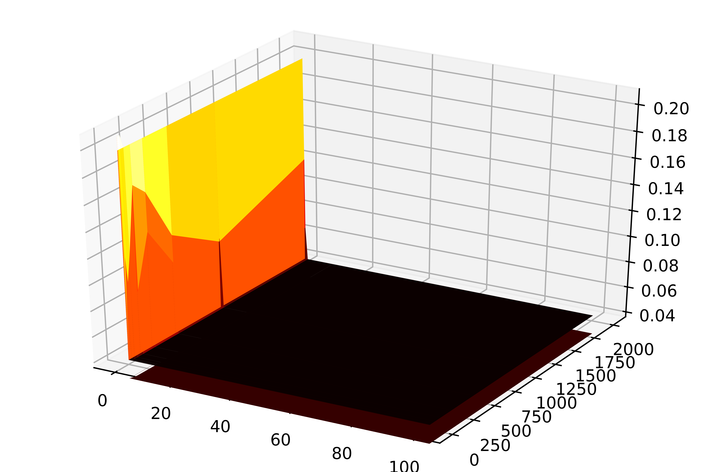
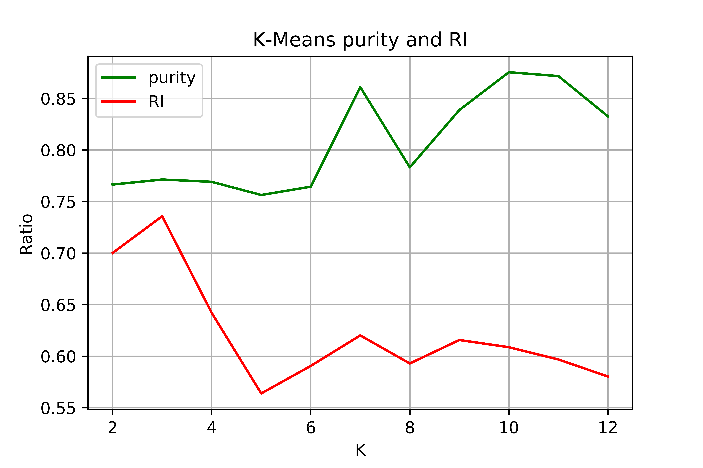
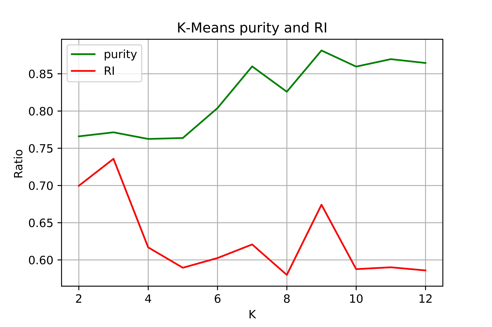
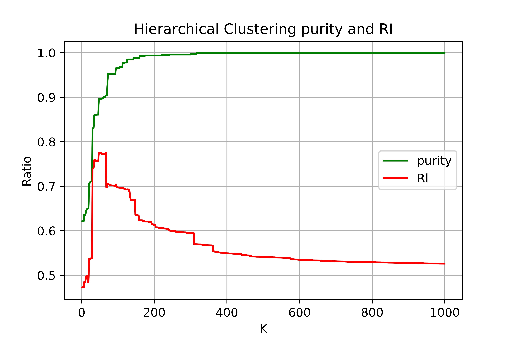
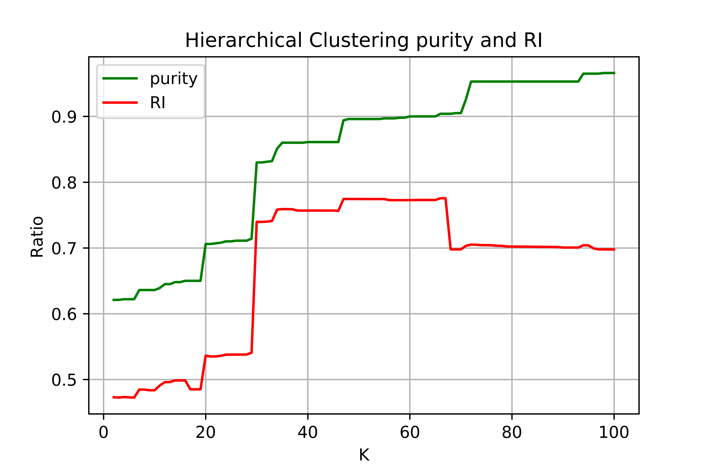

# Lab2 实验报告

**注**: 本实验使用`Jupyter Notebook`完成,而非单独的`.py`文件,所提交的文件是分割后的内容,并未进行测试.完整的实验代码见`overall_ipynb/Lab2.ipynb`

## Part I

### 数据预处理

需要处理的主要内容是将类别的字符串,换成数字.然后将数据存成`.npy`便于下次使用.

代码见`data_preprocessing.py`

### 常用函数

为了便于下面的计算,设计两个函数.

`classification_evaluation`是给预测分类和正确的结果,然后返回`Accuracy,Macro_F1,Micro_F1`

`split_data_5_fold`是用于分割验证数据的.

代码在`utils.py`

使用时需要加上

```python
from utils import classification_evaluation,split_data_5_fold
```

### kNN

#### 解决思路

先进行交叉验证,然后选择最优的`k`在测试集上测试

#### 伪代码

> 1、计算已知类别数据集中的点与当前之间的距离
>
> 2、按照距离递增次序排序
>
> 3、选取与当前点距离最6，小的k个点
>
> 4、确定前k个点所在的类别的出现频率
>
> 5、返回前k个点出现频率最高的类别作为当前点的预测分类

#### 结果

##### 交叉验证

对$k\in \{1,3,5,\cdots,19\}$进行5-fold cross validation. 得到的结果如下:


上图的点是对5-fold的`Micro_F1`取平均值,具体的数值为

```
(K, Micro_F1_Mean)
(1, 0.5329917576297617)
(3, 0.6051236355535754)
(5, 0.7188683448429494)
(7, 0.7240810871018044)
(9, 0.6980619291601693)
(11, 0.6760080196034751)
(13, 0.6625083537536199)
(15, 0.6543105368678993)
(17, 0.6485186010247271)
(19, 0.6404989975495656)
```

则可以发现使用`k=7`效果最好

##### 测试

在测试集上进行测试,得到结果如下

| Accuracy           | Macro_F1           | Micro_F1           |
| ------------------ | ------------------ | ------------------ |
| 0.7820352878274818 | 0.7820352878274818 | 0.7820352878274818 |

效果还是不错的. 在上述评价指标下,kNN是下面的几种监督学习中,最佳的.

### Decision Tree

#### 解决思路

因为本身的属性值为离散点,所以直接以离散点的值作为分支,这种情况下,每此分支数为4或8,如果强行作图也看不清楚,所以下面并未进行做图.

进行了一次交叉验证,目的是事先了解性能.

#### 伪代码

> ```
> Input:  训练集D={(x1, y1), (x2, y2), ..., (xm, ym)};
>         属性集A={a1, a2, ..., ad}.
> Output: 以node为根节点的一个决策树
> Process:
> ## 通过给定样本集D和属性集A构建决策树
> TreeGenerate(D, A){
> 1: 生成结点node;
> 2: if D 中样本全属于同一类别C then
> 3:      将node标记为 C类 叶节点; return
> 4: end if
> 5: if A = ∅ OR D中样本在A上取值相同 then
> 6:      将node标记为叶节点，其类别标记为D中样本数最多的类; return 
> 7: end if
> 8: 从 A 中选择最优化分属性 a*
> 9: for a* 的每一值a[i] do
> 10:      为node生成一个分支; 令Dv表示D中在 a* 上取值为 a[i] 的样本子集;
> 11:      if Dv is empty then
> 12:          将分支结点标记为叶节点，其类别为D中样本最多的类; return
> 13:      else
> 14:          以 TreeGenerate(Dv, A\{a*}) 为分支结点;
> 15:      end if
> 16: end for
> }
> ```

#### 结果

##### 交叉验证

```
fold=0,Micro_F1=0.5582535085765203
fold=1,Micro_F1=0.5591445756293161
fold=2,Micro_F1=0.5642682111828915
fold=3,Micro_F1=0.5593673423925151
fold=4,Micro_F1=0.5544664736021385
```

结果大概是`0.56` 效果明显不如`kNN` 但是决策的计算量上优于`kNN`

##### 测试

| Accuracy           | Macro_F1           | Micro_F1           |
| ------------------ | ------------------ | ------------------ |
| 0.5963286401710925 | 0.5495741554985076 | 0.5963286401710925 |

增加20%的数据, 对于决策树有一定的优化影响.

### SVM

#### 解决思路

SVM是这几个监督学习中,计算量最大,而且效果最不好的. 鉴交叉验证十分耗时,本实验将不进行交叉验证,只是用一部分测试数据进行参数的选取.

解决SVM需要二次规划,本实现使用的是`cvxopt.solvers.qp`

需要选择的参数包括, `sigma,C`

#### 伪代码

> 优化问题为
> $$
> \begin{equation} \min\limits_{\vec \alpha}\Psi(\vec\alpha)=\min\limits_{\vec \alpha}\frac{1}{2}\sum_{i=1}^N\sum_{j=1}^Ny_iy_jK(\vec x_i,\vec x_j)\alpha_i\alpha_j-\sum_{i=1}^N\alpha_i,\\0\leq\alpha_i \leq C,\forall i,\\ \sum_{i=1}^Ny_i\alpha_i=0.\end{equation}
> $$
> 需要满足KKT的为
> $$
> \begin{equation}\alpha_i=0\Leftrightarrow y_iu_i\geq1,\\0<\alpha_i<C\Leftrightarrow y_iu_i=1,\\ \alpha_i=C\Leftrightarrow y_iu_i\leq 1.\end{equation}
> $$
> 使用二次规划解决
>
> 得到的非0的`\alpha`对应的点构成支持向量.然后得到分类平面
>
> 由于是多分类,而SVM是二分类,所以需要重复对每个类进行,共18次.

#### 结果

##### 验证

首先要选择参数, 由于计算量过于大,耗时很长,所以这里先使用PCA进行降维(之后没有进行降维,仅此处,PCA是使用Part2的代码), 并且将训练量控制为`1200`将测试量控制为`100`. 得到的结果(`Micro_F1`)如下

| C\Sigma | 0          | 0.01       | 0.015      | 0.2        | 0.3        | 1/10/100   |
| ------- | ---------- | ---------- | ---------- | ---------- | ---------- | ---------- |
| 1       | 0.03960396 | 0.03960396 | 0.03960396 | 0.03960396 | 0.03960396 | 0.03960396 |
| 2       | 0.03960396 | 0.1980198  | 0.20792079 | 0.04950495 | 0.03960396 | 0.03960396 |
| 4       | 0.03960396 | 0.1980198  | 0.20792079 | 0.04950495 | 0.03960396 | 0.03960396 |
| 8       | 0.03960396 | 0.1980198  | 0.20792079 | 0.07920792 | 0.04950495 | 0.03960396 |
| 16      | 0.03960396 | 0.1980198  | 0.20792079 | 0.11881188 | 0.04950495 | 0.03960396 |
| 32      | 0.03960396 | 0.1980198  | 0.20792079 | 0.0990099  | 0.04950495 | 0.03960396 |
| 64      | 0.03960396 | 0.1980198  | 0.1980198  | 0.11881188 | 0.05940594 | 0.03960396 |
| 128     | 0.03960396 | 0.1980198  | 0.1980198  | 0.16831683 | 0.07920792 | 0.03960396 |
| 256     | 0.03960396 | 0.1980198  | 0.1980198  | 0.15841584 | 0.08910891 | 0.03960396 |
| 512     | 0.03960396 | 0.1980198  | 0.1980198  | 0.11640212 | 0.12871287 | 0.03960396 |
| 1024    | 0.03960396 | 0.1980198  | 0.1980198  | 0.09183673 | 0.09424084 | 0.03960396 |
| 2018    | 0.03960396 | 0.1980198  | 0.1980198  | 0.12       | 0.06504065 | 0.03960396 |

做一个图



此处并没有足够的计算资源做完全的验证,但是可以看到最佳的选择为`sigma=0.15,C=2~32`

考虑到可能是因为某些类的数据量太小,而导致不均匀,下面采用这样的验证/参数选择

1. 不使用PCA降维
2. 尽可能均匀地选择数据点,也就是限制最多的训练数据,然后每个类限制一个上限.

得到的结果如下`Micro_F1`

| C\Sigma | 0     | 0.01  | 0.015 | 0.2   | 0.3   | 1     |
| ------- | ----- | ----- | ----- | ----- | ----- | ----- |
| 4       | 0.138 | 0.176 | 0.176 | 0.187 | 0.153 | 0.133 |
| 8       | 0.138 | 0.185 | 0.185 | 0.184 | 0.183 | 0.133 |
| 16      | 0.138 | 0.189 | 0.189 | 0.175 | 0.181 | 0.137 |
| 32      | 0.138 | 0.201 | 0.201 | 0.173 | 0.178 | 0.139 |
| 64      | 0.138 | 0.186 | 0.186 | 0.173 | 0.176 | 0.139 |
| 128     | 0.14  | 0.196 | 0.196 | 0.173 | 0.174 | 0.127 |

同样做图得


不是很明显,但是选择`Sigma=0.015, C=32`是比较好的选择

##### 测试

下面就使用上面选择的参数进行测试,仍然满足这样的条件

1. 不使用PCA降维
2. 尽可能均匀地选择数据点,也就是限制最多的训练数据,然后每个类限制一个上限.

结果为

```
Accuracy=0.19836036357155587
Micro_F1=0.1983603635715559
```

效果比较差.

统计一下分类的数据为

|      | 0    | 1    | 2    | 3    | 4    | 5    | 6    | 7    | 8    | 9    | 10   | 11   | 12   | 13   | 14   | 15   | 16   | 17   |
| ---- | ---- | ---- | ---- | ---- | ---- | ---- | ---- | ---- | ---- | ---- | ---- | ---- | ---- | ---- | ---- | ---- | ---- | ---- |
| pred | 18   | 0    | 16   | 13   | 0    | 0    | 121  | 45   | 113  | 121  | 141  | 184  | 152  | 4157 | 89   | 187  | 146  | 108  |
| true | 5    | 16   | 49   | 16   | 40   | 94   | 118  | 137  | 287  | 342  | 397  | 571  | 719  | 839  | 911  | 433  | 78   | 559  |

可以看到分类的误差比较严重,总结原因可能是

1. 数据属性之间的相互关联
2. 使用二分类的SVM, 取最高的分类值,可能不适用于多分类.

## Part II

### 数据预处理

需要处理的主要内容是将类别的字符串,换成数字.然后将数据存成`.npy`便于下次使用.

代码见`data_preprocessing.py`

### 常用函数

`cluster_evaluation(label,C)`返回`purity,RI`

`cluster_save(C,file,k)`将聚类结果存在`.csv`文件总

见`utils.py`

使用时,加上如下代码

```python
from utils import cluster_evaluation,cluster_save
```

### kMeans

#### 解决思路

直接在训练集上进行验证

#### 伪代码

> 
>

#### 结果

使用不同的k,得到结果为

| K    | purity             | RI                 |
| ---- | ------------------ | ------------------ |
| 2    | 0.7665045170257123 | 0.7001602949566303 |
| 3    | 0.7713690062543433 | 0.7357551646679545 |
| 4    | 0.7691452397498263 | 0.6420101455096451 |
| 5    | 0.7563585823488533 | 0.5638403016334939 |
| 6    | 0.7644197359277276 | 0.5905586521699904 |
| 7    | 0.8610145934676859 | 0.620146160716511  |
| 8    | 0.78318276580959   | 0.5929136375904328 |
| 9    | 0.8387769284225156 | 0.6156845630180197 |
| 10   | 0.8754690757470466 | 0.6086936009333699 |
| 11   | 0.8717164697706741 | 0.5968032970105001 |
| 12   | 0.8326615705350938 | 0.580245216315117  |

做图如下



可以得知,k=7是比较好的结果

### PCA

#### 解决思路

先使用PCA进行降维,然后使用降低后的数据进行`kMeans`聚类

#### 伪代码

> （1）对输入数据去除平均值
>
> （2）计算去除平均值后的数据协方差矩阵的特征值和特征向量
>
> （3）按照大到小的顺序排列，取特征值的前n个对应的特征向量
>
> （4）最后按照逆过程重建数据

#### 结果

| K    | purity             | RI                 |
| ---- | ------------------ | ------------------ |
| 2    | 0.765948575399583  | 0.6995681869861824 |
| 3    | 0.7713690062543433 | 0.7357741751822758 |
| 4    | 0.7624739402362752 | 0.6168629057918894 |
| 5    | 0.763724808895066  | 0.5894776416838756 |
| 6    | 0.8038915913829048 | 0.6024981438667039 |
| 7    | 0.8599027102154274 | 0.6207749759808721 |
| 8    | 0.8258512856150104 | 0.5798653537820008 |
| 9    | 0.8813064628214038 | 0.6741000096018553 |
| 10   | 0.8596247394023627 | 0.5876250052404492 |
| 11   | 0.8696316886726894 | 0.5900924308980362 |
| 12   | 0.8644892286309938 | 0.585876501593966  |

做图如下



与直接的`kMeans`相比, 评估并没有多少减少,但是计算量减少很多.

对降维后的点生成图像为:


直观上降维后的点确实保留了聚类的特征.

### Hierachical Clustering

#### 解决思路

选择不同的`n_clusters`聚类即可.

由于数据量很大,为了减少计算量,控制数据为1000

#### 伪代码

> 将每个对象当成一个初始簇
>
> Repeat
>
> ​		根据两个簇中最近的数据点找到最近的两个簇
>
> ​		合并两个簇，生成新的簇的集合
>
> Until达到定义的簇的数目

#### 结果

`n_cluster`最大为1000时



可以看到在100之内是重点,于是将`n_cluster`设定最大为100时



可以看到最后去`n_cluster=50`效果比较好.

