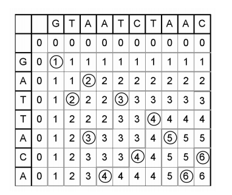
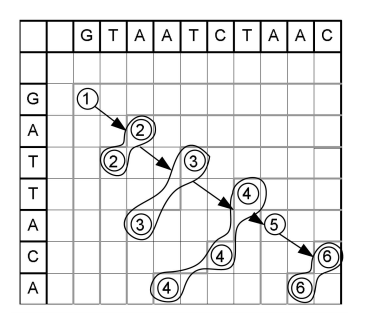
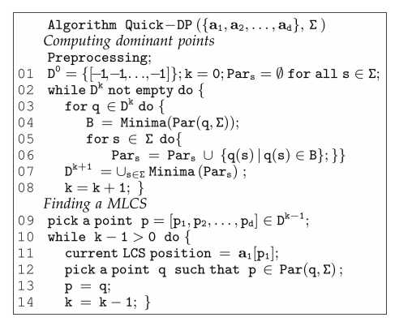
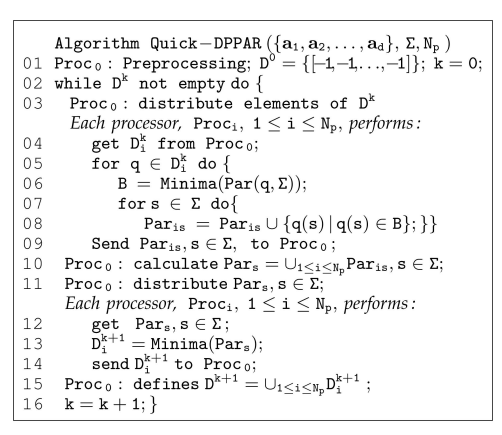

# Analysis

## Retrieval

通过[IEEE](https://ieeexplore.ieee.org/search/searchresult.jsp?queryText=Longest%20Common%20Subsequence&highlight=true&returnFacets=ALL&returnType=SEARCH&sortType=newest) 搜索`Longest Common Subsequence`  就很容易找到最新的一篇综述[An Analysis on Computation of Longest Common Subsequence Algorithm 2017](https://ieeexplore.ieee.org/stamp/stamp.jsp?tp=&arnumber=8389325)

其中有一个表格**List of existing LCS algorithms for two strings** 找到最后一行就能找到

> Qingguo Wang et. al 

具体内容查看这篇文章***A Fast Multiple Longest Common Subsequence (MLCS) Algorithm***可得知。

## Time Complexity

这篇文章实际上是针对多个String的最长公共子序列，而且提出了一个串行计算的算法，一个并行计算的算法。

对于串行的算法，其时间复杂度为
$$
T_{seq}=O\Big(n|\Sigma|d+|D||\Sigma|d\big (\log^{d-2}n+\log^{d-2}|\Sigma|\big)\Big)
$$
其中$\Sigma$为alphabet的大小, $n$为sequences的长度(假设长度均相等), $d$为sequences的数量, $D$为所有的*dominant points*集合

对于串行算法，其时间复杂度为
$$
T_{par}=\frac{1}{N_p}(1+\alpha(n))T_{seq}\quad \text{where}\quad \lim_{n\to \infty}=0
$$
其中$N_p$为slaves的数量(另有一个master)

## Algorithms

### Sequential

传统的Dynamic Programming Methods仅仅适用于两个Sequences, 要想适用于多个Sequences, 需要使用Dominant Point Methods.所以首先需要理解Dominant Point Methods

如上图，画圆圈的就是*Dominant Point* 具体定义参见论文。可以看到矩阵的每个元素都标注了数据，这个数据就相当于使用动态规划中建立的矩阵。而其中画圈的部分，是同样score的元素中最靠右上的部分，而且可能有多个，可以发现，这样的*Dominant Point*就是相应的字符串匹配的地方。其方法简要说明就是，如下图

在普通的动态规划中，需要一行一行完整计算整个矩阵，而在Dominant Point Methods中，不用完全计算所有的矩阵(或者多维张量)的值，而是直接计算所需要的几个点，也就是不同level的Dominant Points，这里面的每个大圈都是一个level,　表示相应的字符串在这里匹配，然后依次连接起来，就得到了最后的结果。

具体算法为

最核心的就是，从一个Dominant Point Level上升到下一个level,比如说$D^{(k)}\to D^{(k+1)} $ , 用公式来表示就是
$$
D^{(k+1)}=Minima(Par(D^{(k)},\Sigma))
$$
其中$Par(q,s)\ s\in\Sigma\ q\in D^{(k)}$表示从一个Dominant Point $q$按照字符$s$来找到下一个阶层的所有点。而$Par(D^{(k)},\Sigma)$ 实际上是对所有的上一个level按照所有字符找到下一个level的所有点，注意到这里面的点不一定全部是Dominant Point, 所以需要使用$Minima()$函数来过滤得到这个level中所有的Dominant Points. 然后依次递归。

找到所有的level的Dominant Points之后，就可以类似动态规划里面得到最后的结果一样，从末尾到开头找到最终的`LCS`

### Parallel

对于并行算法，就是在从低level的集合向高level的集合转移的时候，需要分别计算不同点的下一个level,然后做一个合并，那么就可以把不同点的计算分配给各个slaves来计算。具体算法如下

具体而言，其核心思想与串行的算法并无多大区别，只不过加上了并行的计算方法。

给定$N_p+1$个处理器，其中一个master另外$N_p$个slaves. 一开始由master计算$D^{(0)}$, 然后剩下每次计算$D^{(k)}$都由master平均分配给slaves计算某个点的$Par(q,s)\ s\in \Sigma$ 然后由master做一个union. 然后再由slaves计算$Minima$.

# Reference

***An Analysis on Computation of Longest Common Subsequence Algorithm*** Proceedings of the International Conference on Intelligent Sustainable Systems (ICISS 2017) IEEE Xplore Compliant - Part Number:CFP17M19-ART, ISBN:978-1-5386-1959-9

***A Fast Multiple Longest Common Subsequence (MLCS) Algorithm*** ,Qingguo Wang, Dmitry Korkin, and Yi Shang, IEEE TRANSACTIONS ON KNOWLEDGE AND DATA ENGINEERING, VOL. 23, NO. 3,
MARCH 2011. 

