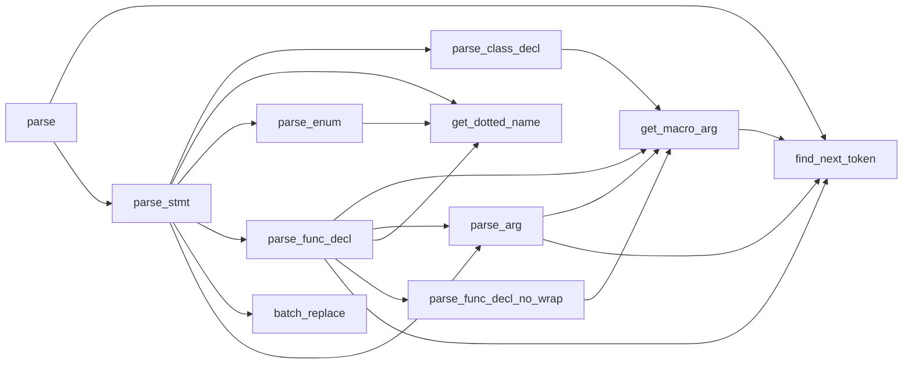

# 12.04-12.09工作

##检测对象所属的成员函数

首先，对于static的问题，我们选取dnn.cpp中的函数[line 2593](https://github.com/opencv/opencv/blob/master/modules/dnn/src/dnn.cpp#2593)：

```c++
int Net::addLayerToPrev(const String &name, const String &type, LayerParams &params)
{
    CV_TRACE_FUNCTION();

    int prvLid = impl->lastLayerId;
    int newLid = this->addLayer(name, type, params);
    this->connect(prvLid, 0, newLid, 0);
    return newLid;
}
```

显然，这个是对象的成员函数，那么我们找到它相应符号表的名称:

```
demangle:
cv::dnn::experimental_dnn_v4::Net::addLayerToPrev(cv::String const&, cv::String const&, cv::dnn::experimental_dnn_v4::LayerParams&)

mangle:
_ZN2cv3dnn19experimental_dnn_v43Net14addLayerToPrevERKNS_6StringES5_RNS1_11LayerParamsE
```

两者都无法显著找到this参数的存在，所以我们认为，这个参数在nm能够导出的符号表中是隐藏状态。

##分层结构

新增了flag用于表示位运算的结果，其中：

```python
item['flag'] = \
            16 if item['system'] else 0 + \
            8 if item['other'] else 0 + \
            4 if item['constructor'] else 0 + \
            2 if item['destructor'] else 0 + \
            1 if item['static'] else 0
```

即高位到低位依次为system、other、constructor、destructor、static

## mangle转换规则调研

来自[wiki](https://en.wikipedia.org/wiki/Name_mangling#How_different_compilers_mangle_the_same_functions)

所有的mangle符号以_Z开头，因为下划线+字母开头为c中的保留字，所以不会和用户标识符重复。

对于嵌套名（如名称空间和类名），_Z后面会跟着N，然后是一系列<length, id>对（length为下一个符号所占的大小），最后会以E结尾。

对于函数，E后面会跟着函数返回值类型信息，例如void函数会跟v。

为了具体说明这一点，我们使用了以下简单程序：

```c++
#include <iostream>
#include <stdlib.h>
using namespace std;

class StaticTest
{
public:
    StaticTest(int a, int b, int c);
    StaticTest & GetNumber(StaticTest &s);
    void GetSum();
    static void f1(StaticTest &s);
private:
    int A, B, C;
    static int Sum;
};


int StaticTest::Sum = 0;

StaticTest::StaticTest(int a, int b, int c)
{
    A = a;
    B = b;
    C = c;
    Sum += A + B + C;
}

StaticTest & StaticTest::GetNumber(StaticTest &s)
{
    cout << "Number = " << endl;
    return s;
}

void StaticTest::GetSum()
{
    cout << "Sum = " << Sum <<endl;
}

void StaticTest::f1(StaticTest &s)
{
    
    cout << s.A << endl;
    cout << Sum <<endl;
}
```

其中，`StaticTest(int a, int b, int c)`是构造函数，`void GetNumber()` `void GetSum()`是普通的成员函数，`static void f1(StaticTest &s)`是类静态函数。

对于mangle name,如下：

```
demangle name:
0000000000000b64 T StaticTest::f1(StaticTest&)
000000000020104c B StaticTest::Sum
0000000000000b10 T StaticTest::GetSum()
0000000000000ace T StaticTest::GetNumber(StaticTest&)
0000000000000a70 T StaticTest::StaticTest(int, int, int)
0000000000000a70 T StaticTest::StaticTest(int, int, int)

mangle name:
0000000000000b64 T _ZN10StaticTest2f1ERS_
000000000020104c B _ZN10StaticTest3SumE
0000000000000b10 T _ZN10StaticTest6GetSumEv
0000000000000ace T _ZN10StaticTest9GetNumberERS_
0000000000000a70 T _ZN10StaticTestC1Eiii
0000000000000a70 T _ZN10StaticTestC2Eiii
```

我们分析其中的类方法：

`_ZN10StaticTest2f1ERS_`

_Z开头符号，N表明是类函数，10是StaticTest大小，StaticTest是类id，2是f1大小，f1是函数id，E代表函数的结束，R代表引用

S代表的东西我们查询mangle.c[源码](https://github.com/gcc-mirror/gcc/blob/master/gcc/cp/mangle.c)

```c++
 /* NODE is a matched to a candidate if it's the same decl node or
	 if it's the same type.  */
if (decl == candidate
	  || (TYPE_P (candidate) && type && TYPE_P (node)
	      && same_type_p (type, candidate))
	  || NESTED_TEMPLATE_MATCH (node, candidate))
	{
	  write_substitution (i);
	  return 1;
	}

static void write_substitution (const int seq_id)
{
  MANGLE_TRACE ("substitution", "");

  write_char ('S');
  if (seq_id > 0)
    write_number (seq_id - 1, /*unsigned=*/1, 36);
  write_char ('_');
}
```

说明如果参数类型和函数类型一致，会使用S\_或S_\<id>\_简化表示。

至此，解析完毕，类方法`_ZN10StaticTest2f1ERS_`中没有表示static的参数。

再分析一个对象方法`_ZN10StaticTest6GetSumEv`

前面部分都与上面相同，v表示函数类型为void，也不存在this指针的表示部分。

## 调研gen2.py

关键文件有hdr_parser.py和gen2.py

对于hdr_parser，hdr_parser指定了转换的文件集合opencv_hdr_list和类CppHeaderParser

CppHeaderParser有如下关键方法：

```python
parse_arg(self, arg_str, argno)
```

把args字符串使用以下逻辑依次处理转换成arg_type, arg_name, modlist, argno

args字符串的基本格式为<arg_type> [arg_name]

STEP0预处理：

CV_OUT-->insert "/O" into modlist + sub to ''
CV_IN_OUT-->insert "/IO" into modlist + sub to ''
CV_CARRAY-->isarray set to True + insert "/A macro_arg" into modlist + remove () range
CV_CUSTOM_CARRAY-->isarray set to True + insert "/CA macro_arg" into modlist + remove () range
const-->insert "/C" into modlist
&-->insert "/Ref" into modlist

STEP1提取参数：

将[" ", "&", "*", "<", ">", ","]中符号分割的参数放入word_list中

STEP2解析word_list：

*-->if char then arg_type = c_string else w
<-->insert 0 into angle_stack
,-->arg_type += "_and_"

\>-->arg_type += "_end_"
angle_stack not []-->arg_type += w
arg_type == "stack"-->arg_type += " " + w
arg_type != "~" or ""-->

STEP3：从[]中解析出arg_name

```
parse_enum(self, decl_str)
```

将使用,分割的字符串转换成const + func name 的形式

```
parse_class_decl(self, decl_str)
```

处理类定义或者结构定义{class|struct} [CV_EXPORTS] <class_name> [: public <base_class1> [, ...]]

```
parse_func_decl(self, decl_str, mat="Mat", docstring="")
```

处理形如

> [([CV_EXPORTS] <rettype>) | CVAPI(rettype)][~]<function_name>
> ​    (<arg_type1> <arg_name1>[=<default_value1>][, [=] ...])
> ​    [const] {; | <function_body>}

的函数定义，将其解析成

>[<func name>, <return value C-type>, <list of modifiers>, <list of arguments>, <original return type>, <docstring>]

```
parse_stmt(self, stmt, end_token, mat="Mat", docstring="")
```

处理以;结尾的语句或以{开头的block头

解析成

> <block_type>, <block_name>, <parse_flag>, <declaration>

```
parse(self, hname, wmode=True)
```

处理输入文件

调用图



主函数将opencv_hdr_list中的文件依次使用parse处理得到decl list


对于gen2.py

首先指定了几个字符串模板

| name                                         | usage                                                        |
| -------------------------------------------- | ------------------------------------------------------------ |
| gen_template_check_self                      | 类型检查                                                     |
| gen_template_check_self_algo                 | 类型检查后进行dynamic_cast                                   |
| gen_template_call_constructor_prelude        | 构造器的初始化                                               |
| gen_template_call_constructor                | 构造器的调用                                                 |
| gen_template_simple_call_constructor_prelude | 另一种构造器的初始化                                         |
| gen_template_simple_call_constructor         | 另一种构造器的调用                                           |
| gen_template_parse_args                      | 参数的处理                                                   |
| gen_template_func_body                       | 函数结构体                                                   |
| gen_template_simple_type_decl                | 生成pyopencv结构体、pyopencv函数、dealloc函数、Converter结构 |
| gen_template_mappable                        | 返回cv_mappable_to内容                                       |
| gen_template_type_decl                       | 生成pyopencv结构体、pyopencv函数、dealloc函数、Converter结构 |
| gen_template_map_type_cvt                    | 生成pyopencv_to函数声明                                      |
| gen_template_set_prop_from_map               |                                                              |
| gen_template_type_impl                       |                                                              |
| gen_template_get_prop                        |                                                              |
| gen_template_get_prop_algo                   |                                                              |
| gen_template_set_prop                        |                                                              |
| gen_template_set_prop_algo                   |                                                              |
| gen_template_prop_init                       |                                                              |
| gen_template_rw_prop_init                    |                                                              |
| simple_argtype_mapping                       | 类型映射                                                     |

ToDo

## 完成python生成c hook代码

完成generator.py，根据上一步提取出的函数元信息，自动生成用于hook的c源码：

示例如下：

```c++
namespace cv {
	namespace dnn {
		namespace experimental_dnn_v4 {
			namespace Dict {
				typedef cv::String const&  (*PF0)(cv::String const&, cv::String const&);
				cv::String const&  set<cv::String>(cv::String const& a0, cv::String const& a1) {
					ENTRY_TRACE
					PF0 ori = (PF0) dlsym(RTLD_NEXT, "_ZN2cv3dnn19experimental_dnn_v44Dict3setINS_6StringEEERKT_RKS4_S7_");
					if (!ori) {
						fprintf(stderr, "%s\n", dlerror());
						exit(1);
					}
					cv::String const&  result = ori(a0, a1);
					return result;
				}
			}
		}
	}
}
```


## 调研issue

转包给@吴紫薇
