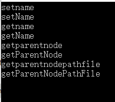

# Name Checker
## 简介
&emsp;&emsp;C语言变量命名的规范有助于增加代码的可读性和安全性。在我们使用的规范下，标识符的命名应当满足：除标识符的首字母（这也是第一个单词的首字母）外，所有单词的首字母都需要大写，其余字母小写。该工作主要是对变量进行分词，从而提出修改建议，增强变量命名的规范性。
## 编译
1. 需要llvm 7.0.0和Clang 7.0.0，并利用nasac2018中原有的CSA文件  
2. 在编译时，在CodingSpecChecker下（助教提供的案例，对应文件覆盖修改）：

   ```bash
   mkdir build
   cd build
   CC=/LLVM安装路径/llvm-install/bin/clang-7 CXX=/LLVM安装路径/llvm-install/bin/clang++ cmake ..
   make
   
   ```

   便可以操作。  
3. 目前还存在一个小问题，编译可能无法通过。不过我们给出了一个demo/trie.cpp用于阐述我们的中心思想，即基于trie树来进行分词和命名规范的检查。
#### Tips：
+ 如果遇到找不到filesystem.h 改为` experimental/filesystem.h`应该可以解决问题（函数中的引用加上experimental::）就行
## Demo
+ Demo的编译十分简单，只需要输入下面一条命令即可：
    ```bash
    g++ -o trie trie.cpp -std=gnu++11
    ```
+ 在trie.cpp文件中，实现了一个使用trie树进行变量命名检查的函数bm。对于输入的字符串（仅由大小写字母组成），根据trie树，按照双向最长匹配的原则进行分词，返回命名建议（除第一个单词外的其他单词首字母大写）。
+ 在最近的修改中，我们将最初的正向最长匹配（FMM）改为双向最长匹配（BM），准确率有所提高。
+ trie树根据词典words.txt构建，存储在trie_b.txt文件和trie_f.txt文件中，它应当是预先构建好的。trie.cpp中的build_b和build_f函数可以完成构建，将trie树存放在数组中，使用虚拟指针相互引用。
+ trie.cpp中的load函数可以从trie_f.txt和trie_b.txt中恢复trie树。
+ 在真正使用中，checker不需要使用build两个函数。
+ 执行编译后的可执行文件trie，输入一个标识符并回车，程序会返回该标识符的规范形式。如果匹配失败，会返回“Unknown Expression”。由于主函数是一个while(true)循环，该过程可以反复进行，应当使用ctrl+C退出程序。
+ 建议的输入样例：  
    + getname -> getName
    + failureflag -> failureFlag
    + setrelationship -> setRelationship
    + getparentnodepath -> getParentNodePath
    + getfailurehandlefunctionflag -> getFailureHandleFunctionFlag
+ 你还可以尝试更多的输入。
+ 下面是效果演示：  
    

## 主要思想
&emsp;&emsp;很多情况下，标识符的命名存在大小写混乱的情形。按照我们使用的规范，除标识符的首字母（这也是第一个单词的首字母）外，所有单词的首字母都需要大写，其余字母小写。假定输入的标识符是一个字母序列，它由多个完整的单词组成。为了得到它的规范命名，我们需要从连续的字母序列中分割得到单词序列（分词）。  
&emsp;&emsp;在自然语言处理中，英文默认由空格分割，基本没有从连续字母序列中分割得到单词的研究。然而，中文词语由于没有显式的分割，中文分词是自然语言处理中的重要方向。于是，我们决定借鉴中文分词的思想。  
&emsp;&emsp;基于字符串匹配的分词是中文分词的一类方法，包括正向最大匹配（FMM）、反向最大匹配（BMM）和双向最大匹配（BM）。FMM的基本思想是，从前往后找到一个最长的词并将其输出，反复进行；类似地，BMM则从后向前找到一个最长的词；而BM则综合上述两者的结果。  
&emsp;&emsp;在中文分词实践中，BMM可以取得较FMM更好的效果，但我们不知道在英文分词中是否有着同样的现象。第一步，我们实现了FMM。   
&emsp;&emsp;首先，我们需要一个词典，nasca2018的工作为我们提供了这个词典；接着，为了提高效率，我们决定使用trie树作为词典存储的数据结构；最后，根据输入字符串搜索trie树，对于每一个字母，进入当前结点的儿子中合适的一个，如果找不到合适的儿子，判断当前结点是否可以作为一个单词的结束，可以则得到一个单词，回到根结点，否则匹配失败。通过这种方法，我们可以完成对标识符的分词，从而得到规范的命名。  
&emsp;&emsp;经过测试，我们发现FMM可以处理一些字符串，但对于很多字符串仍然无能为力。于是，我们实现了BMM。两者的处理基本类似，只需要对所有的单词都进行反向，重新构建一棵反向的trie树即可。测试表明，同中文分词类似，BMM可以取得比FMM更好的效果。  
&emsp;&emsp;综合FMM和BMM并不困难，由于BMM效果更好，所以先进行BMM，如果成功就直接采用，只有当BMM匹配失败时才进行FMM。
## 重要数据结构
&emsp;&emsp;下面是trie树结点的数据结构，这里利用二叉链表存储多叉树。为了便于在文件中存储和恢复，这里使用的都是虚拟指针。整棵trie树存储在一个TrieNode数组中，根节点是下标为0的数组元素。
```C
struct TrieNode{
	int child,brother;
	char c;//当前结点存储的字符
	bool end;//当前结点是否可以作为单词结尾
};
```
## 后续改进
+ 基于字符串的匹配的分词效果对词典有着较大的依赖。我们使用的词典是一个通用的词典，后续如果使用领域相关的词典可以对效果进行改善。
+ 分词有着许多不同的方法，基于字符串的匹配的分词是一个比较经典的方法，但还有许多新的方法——如基于分割的方法、基于统计的方法和基于理解的方法等。新的方法也许可以改善分词性能。
## 我们的收获
+ 每一门课程都不是孤立的，看似没有联系的知识在后续的实践中可能发生关联。在日后的学习实践中，我们需要广泛联系各方面的知识。
+ 在合作当中，我们每个人都有不同的知识，有的人想到Google的编程规范，有人想到了Web课程的知识可以使用在我们的checker中，大家充分交流之后，都学到了许多超出这个课程范围的知识，受益匪浅。
