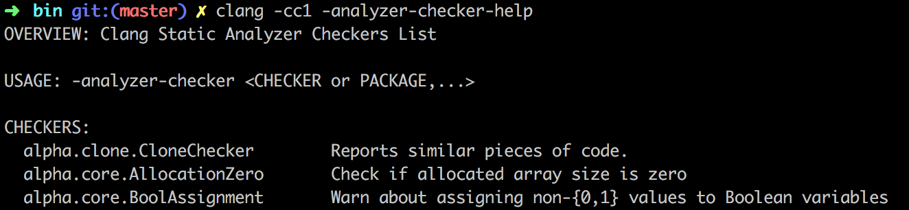
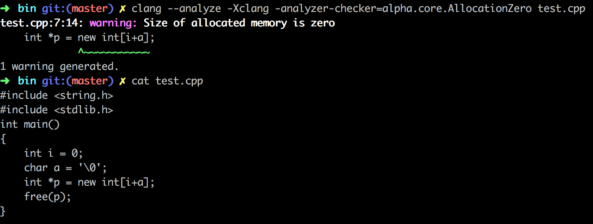

### 功能

AllocationZeroChecker检查用new[]分配内存空间时，分配的内存大小是否为0，如果是0将会报`Size of allocated memory is zero`的warning

### 如何使用

1. 修改`checkers.td`

   在clang的项目目录下（通常位于`llvm/tools/`下），在`include/clang/StaticAnalyzer/Checkers`

   `/Checkers.td`中的`let ParentPackage = CoreAlpha in`块中中添加如下内容：

   ```c
   def AllocationZeroChecker : Checker<"AllocationZero">,
   	HelpText<"Check if allocated array size is zero">,  								DescFile<"AllocationZeroChecker.cpp">;
   ```

2. 添加AllocationZeroChecker的源文件

   将源文件`AllocationZeroChecker.cpp`放到`lib/StaticAnalyzer/Checkers`目录下，并在该目录中的`CMakeList.txt`中添加AllocationZeroChecker.cpp。

3. 编译clang

4. 测试

   执行`clang -cc1 -analyzer-checker-help`列出所有checker就会发现定义的AllocationZeroChecker已经在其中：

   

   调用该checker，进行检查，如果存在错误，则会产生如下warning：

   


