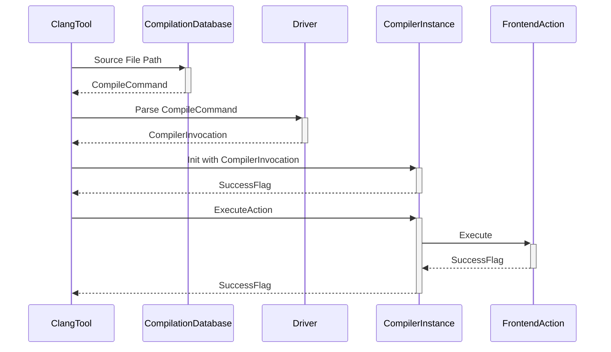
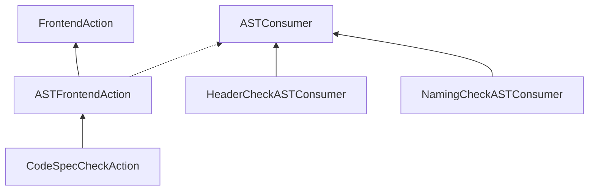
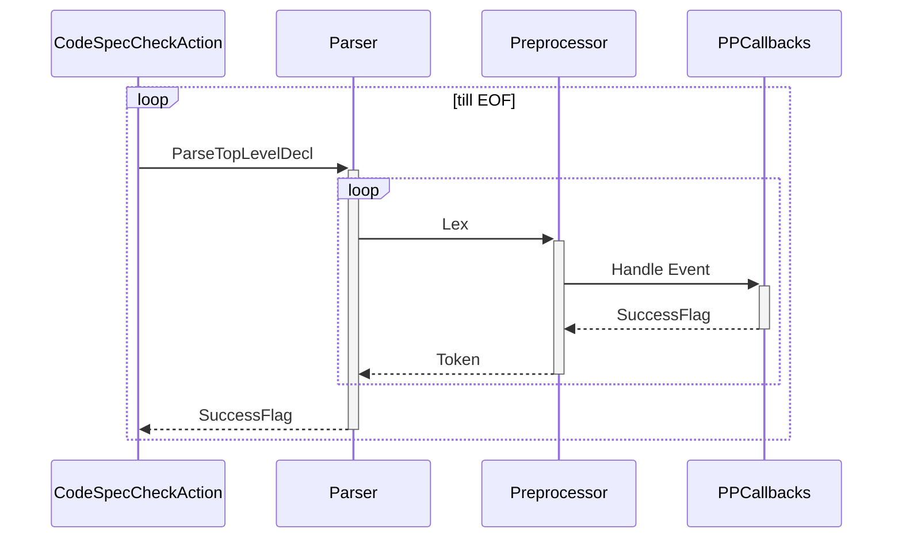
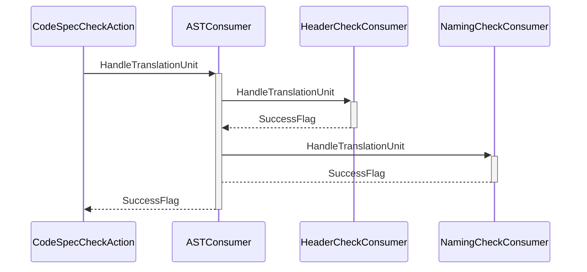

## 基于Clang框架实现

### ClangTool工作时序图

注释：整个序列图只是对ClangTool工作流程进行简化后的一个抽象表达，其中涉及到对象类型与执行逻辑与Clang源码并不是一一对应的。图中各对象的解释如下表。

| 对象                | 描述                                                         |
| ------------------- | ------------------------------------------------------------ |
| ClangTool           | Clang工具驱动对象，接收的外部输入包括CompilationDatabase、SourcePathList和FrontendAction。 |
| CompilationDatabase | 源文件编译命令数据库对象，存储项目中源文件编译时所处工作路径、源文件路径与使用的编译命令，包括编译器、编译选项、宏定义等等。该对象由ClangTool外部传入，通常是解析项目构建系统产生的compile_command.json文件得到的。 |
| Driver              | 驱动对象，这里主要用来解析编译命令中的各种参数。             |
| CompilerInstance    | 编译器实例对象，管理编译过程中涉及到的各种Clang对象。        |
| FrontendAction      | 前端动作对象，执行具体的前端编译动作，该对象由ClangTool外部传入，通常由工具开发者根据需求定制。 |
| CompilerInvocation  | 编译器调用对象，存储调用编译器时的各种选项，如使用使用静态分析器控制选项、预处理器控制选项、前端动作控制选项和代码生成选项等等 |

### FrontendAction类图

### CodingSpecCheckAction工作时序图

**解析源文件构建抽象语法树**

**遍历抽象语法树执行规范检查**

