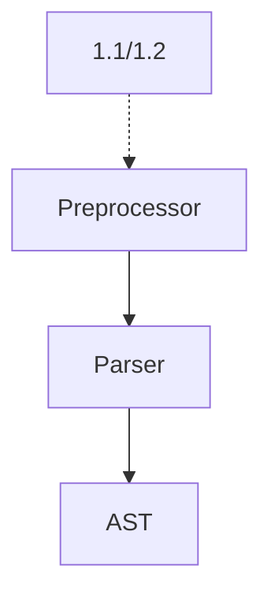

### 分析框架选型

个人倾向于[clang](https://clang.llvm.org/docs/Tooling.html) C/C++前端分析框架，clang和llvm可以说是程序编译、程序分析领域中的事实标准框架了，功能齐全且文档比较丰富。clang提供了一系列的基础功能供需要进行语法、语义分析的工具程序使用。这次比赛项目可以基于clang的[LibTooling](https://clang.llvm.org/docs/LibTooling.html)进行开发。

#### 框架版本

```
llvm-7.0.0
cfe-7.0.0
```

### 需求分析与概要设计

#### 1.1 头文件禁止循环依赖

**需求描述**

头文件循环依赖，指a.h 包含 b.h，b.h 包含 c.h，c.h 包含a.h， 导致任何一个头文件修改，都导致所有包含了a.h/b.h/c.h的代码全部重新编译一遍；而如果是单向依赖，如a.h包含b.h，b.h包含c.h，而c.h不包含任何头文件，则修改a.h不会导致包含了b.h/c.h的源代码重新编译。

**算法描述**

```python
def ISCyclic(G):
	// topological sort algorithm

G.V = {all header files}
for header in ListAllHeaderFiles(directory):
	for include in header:
		G.E += (header, include)
if (IsCyclic(G)):
	report
```

**实现方式**

编译器前端会在预处理阶段处理头文件包含，clang框架中预处理功能通过[Preproccessor](https://clang.llvm.org/doxygen/classclang_1_1Preprocessor.html)类进行实现，这个类接受[PPCallback](https://clang.llvm.org/doxygen/classclang_1_1PPCallbacks.html)类型对象实现预处理过程中特定事件的回调处理。其中关于头文件处理的回调函数为[InclusionDirective()](https://clang.llvm.org/doxygen/classclang_1_1PPCallbacks.html#ad5509ca394c21faaead91ec8add75dd2)，需要区分处理项目自定义头文件、外部依赖头文件和系统头文件（How to?）。

#### 1.2 头文件必须自包含

**需求描述**

自包含就是任意一个头文件均可独立编译。如果一个文件包含某个头文件，还要包含另外一个头文件才能工作的话，会给该头文件的用户增添不必要的负担。

**算法描述**

```python
for header in headers:
	if (Success != PercompilerHeader(header)):
		report
```

**实现方式**

验证一个文件是否自包含的一个简单方法是预编译头文件（[Precompile Header](https://en.wikipedia.org/wiki/Precompiled_header)），如果编译成功则说明头文件一定是自包含的。clang框架中通过[VerifyPCHAction](https://clang.llvm.org/doxygen/classclang_1_1GeneratePCHAction.html)类型（FrontendAction的子类）完成头文件的的预编译。

#### 2. 模块约束检查

**需求描述**

对于模块外部传入的参数，必须进行合法性检查，保护程序免遭非法输入数据的破坏。模块内部函数调用，缺省由调用者负责保证参数的合法性，如果都由被调用者来检查参数合法性，可能会出现同一个参数，被检查多次，产生冗余代码，很不简洁。由调用者保证入参的合法性，这种契约式编程能让代码逻辑更简洁，可读性更好。

笔者注释：这里一个主要的问题是如何理解模块的表现形式，按照之前非正式版本的10条需求，好像是把一个目录的内容作为一个模块，模块对外接口由模块头文件负责暴露。如果按照这种理解（需要进一步确认），那么上述需求分解为如下具体问题：

假设一个源文件中引用的所有的函数均在源文件中提供相应的声明或者定义

术语：模块

- 构建模块内函数集合$A$，分析模块头文件找出模块对外接口函数集合$E$，则模块内部函数集合为两者的差集$H=A-E$
- $E$集合内函数实现中检查参数
- $H$集合内函数实现中没有检查参数
- $A$集合内函数实现中调用外部模块函数时没有检查参数
- $A$集合内函数实现中调用内部模块函数时检查参数

**遗留问题**

子模块即多级目录的情况要如何定义检查操作？

- 下级模块函数调用上级模块函数实现时需要检查参数么？
- 上级模块函数调用下级模块函数实现时需要检查参数么？

检查参数的具体形式如何定义？

- ==哪些参数需要检查？函数的各个参数都需要检查么？==

- ==如何定义一个参数被检查了？==

检查所有的参数，要求每个实参第一次引用都是出于一个逻辑表达式中

**涉及配置**

- 如何划分模块
  - 按照目录划分
  - ......
- 模块头文件
  - 头文件名称与模块名称保持一致
  - 头文件名称列表

#### 3. 函数返回值检查

**需求描述**

一个函数（标准库中的函数/第三方库函数/用户定义的函数）能够提供一些指示错误发生的方法。这可以通过使用错误标记、特殊的返回数据或者其他手段，不管什么时候函数提供了这样的机制，调用程序应该在函数返回时立刻检查错误指示。

注意，当函数返回值被大量的显式(void)忽略掉时，应当考虑函数返回值的设计是否合理、有必要。如果所有调用者都不关注函数返回值时，请将函数设计成`void`型。

**遗留问题**

函数的错误处理方式可能不唯一

- C标准库的错误处理方式为函数返回值指示函数操作是否成功（int类型或者指针类型数据检查），不成功的情况下通过全局变量`errno`查询最后一次错误代号，并通过`strerror(int errnum)`等[函数](http://man7.org/linux/man-pages/man3/strerror.3.html)获取对应的错误描述
- 第三方库函数和用户定义函数的错误处理方式不一定与C标准库的处理方式保持一致。

如何识别需要错误处理的函数？如何识别函数已经错误处理？

#### 4. 标识符命名检查

**需求描述**

简短的命名总是方便阅读的，但前提是容易理解。在命名中，使用常见的、通用的缩写是允许并被推荐的。某个系统的专用缩写或局部范围内形成共识的缩写也是可以的。

**算法描述**

```python
word_bag = LoadWordBag()

def IdentifierChecker(unit):
    for name in unit.decl_name_table:
        words = SeperateNameToWords(name)
        words = UnifyCase(words)
        words = RemoveStopWords(words)
        words = RemoveAllowedAbbrivation(words)
        for word in words:
            if word not in word_bag:
                report
                break
```

**实现描述**

词袋数据可以使用[WordNet](https://wordnet.princeton.edu/)，停止词集合可以使用[textfixer](https://www.textfixer.com/tutorials/common-english-words.txt)。标志符分割策略要考虑不同的命名风格，比较常见的有Camal style、Unix style和Hungary style。一个编译单元中声明的标志符表在clang中由[DeclarationNameTable](https://clang.llvm.org/doxygen/classclang_1_1DeclarationNameTable.html)类型实现。

#### 5. 函数头注释

函数命名无法表达的信息需要加函数头注释辅助说明。函数头注释统一放在函数声明或定义上方。选择并统一使用如下风格之一：1.使用`//`写函数头；2.使用`/**/`写函数头。函数尽量通过函数名自注释，**按需**写函数头注释。不要写无用、信息冗余的函数头；不要写空有格式的函数头。函数头注释内容**可选**，但不限于：功能说明、返回值，性能约束、用法、内存约定、算法实现、可重入要求等等。模块对外头文件中的函数接口声明，其函数头注释，应当将重要、有用的信息表达清楚。

需求分解为如下基本问题：

- 判断项目内用户自定义文件中使用的函数头风格是否统一
- 判断一个函数是否需要函数头注释辅助说明
- 检查函数头注释是否满足约定格式
- 检查函数头注释是否空有格式
- 检查函数头注释是否信息冗余（？？？，评判信息冗余的标准是什么？）
- 检查函数头注释是否将重要的信息表达清楚（？？？，分析器如何知道哪些信息是重要的？这一点仅是对模块头文件进行要求的么？）

**算法描述**

```python
def CheckFunctionHeaderComment(function_decl):
    if (!NeedHeaderComment(function_decl))
    	return
    if (!HasHeaderComment(function_decl)):
        report
        return
    comment = GetHeaderComment(function_decl)
	comment_style = GetFunctionHeaderCommentStyle(comment)
    CheckFunctionHeaderCommentStyleConsistency(comment_style)
    if (!SatisfyPredefinedFunctionHeaderCommentFormat(comment)):
        report
        return
    entries = FormatFunctionHeaderComment(comment)
    for entry in entries:
        if (HasRedundantInformationInFunctionHeaderCommentEntry(function_decl, entry)):
            report
    if (!HasCoveredAllKeyInformationInFunctionHeaderComment(function_decl,entries)):
        report
```

**实现描述**

在clang框架中，表示函数声明与函数定义的AST节点类型均为[FunctionDecl](https://clang.llvm.org/doxygen/classclang_1_1FunctionDecl.html)，开启`-fparse-all-comments`选项即可将源文件中的注释纳入到AST表示中，对应的节点类型为 [FullComment](https://clang.llvm.org/doxygen/classclang_1_1comments_1_1FullComment.html)。函数头注释格式需要进行抽象方便用户自定义，可以提供默认实现。

判断是否需要函数头注释：

- 根据**函数是否对编译单元外部进行暴露**这一原则进行判断，不对外暴露，即static函数，则不需要函数头注释，否则需要进行函数头注释。函数头注释的目的是方便接口函数的使用者更好地理解和使用接口，这里假设一个编译单元通常有一个开发人员进行负责，编译单元内部不涉及开发人员对函数的理解歧义问题。这种标准可以减轻开发人员的负担。
- 考虑到开发人员的变动，一个编译单元仅有一个开发人员负责的假设可能不成立，那么就需要所有的函数声明或者定义都需要提供函数头注释。

判断是否信息冗余：

函数头注释不应重复函数签名中所涵盖的信息

- 不重复说明函数名、函数参数类型、函数返回值类型
- 函数功能介绍词向量与函数名分词后产生的词向量相似度小于某阈值
- 函数参数解释词向量与函数参数名分词后产生的词向量相似度小于某阈值

判断是否涵盖所有的关键信息：

~~性能约束~~、内存约定、~~算法实现~~、可重入要求。需求里提到的这些感觉只有内存约束可以通过静态分析实现检查。

内存约定：检查函数参数中如果存在指令类型，那么需要在函数头注释中声明内存约定条目
可重入要求：？？？

#### 6. 按需初始化

**需求描述**

初始化并不一定是赋零值或清零。变量定义时按需初始化。未赋值而直接使用，静态检查工具可以及时检查出来。冗余初始化不仅不简洁；如果初始化成无效值或错误值，工具则无法起到保护作用。C99不再限制局部变量定义必须在语句之前，可以按需定义，即在靠近变量使用的地方定义变量。这种简洁的做法，不仅将变量作用域限制更小，而且能解决定义变量时不知该怎么初始化的问题。如果编译环境支持，建议按需定义。


### 工具工作流程



### Clang基础设施

**Compilation Database**

基于C/C++抽象语法树进行分析的工具，需要知道解析一个编译单元的全部信息。很多情况下，一些信息隐含在项目的构建系统中。但为了获知这些信息就把分析工具集成到构建系统中显然不是一个好的解决方案，替代方案是让构建系统输出一份项目构建的详细记录，即Compilation Database文件，该文件记录了一次项目构建过程中各个编译单元的编译命令、文件位置和文件名称。Compilation Database提供的信息主要是用来指导条件编译、指导头文件查找。

### 驱动输入定义

```
USAGE: code-spec-checker.exe [options]

OPTIONS:

Generic Options:

  -help       - Display available options (-help-hidden for more)
  -help-list  - Display list of available options (-help-list-hidden for more)
  -version    - Display the version of this program

code-spec-checker options:

  -b=<string> - Build directory path
  -p=<string> - Project directory path / Source file paths
  ...

-b <build-path> is used to read a compile command database.

        For example, it can be a CMake build directory in which a file named
        compile_commands.json exists. Use -DCMAKE_EXPORT_COMPILE_COMMANDS=ON
        CMake option to get this output. When no build path is specified,
        working directory is used.

-p <project-path> | <source-path> ... specify targets to be checked.

        If a directory path is provided, the checking target is all files
        that can under this directory recusively, otherwise it is specifed
        source path list. All source paths need point into the source tree
        indicated by the compilations database. When nothing is specifed for
        this option, current working directory is used.

```

### 驱动流程

```
HeaderFileList, SourceFileList = ParseCommandLineOptions()

for HeaderFile in HeaderFileList:
	
```


### 项目进度情况

| 时间  | 进度描述                                                     |
| ----- | ------------------------------------------------------------ |
| 10-22 | 参赛小组成立，成员张宇翔、邓胜亮，指导教师张昱；各自理解需求文档 |
| 10-23 | 第一次集中讨论，分析需求，明确技术路线、工作计划与注意事项   |
| 10-24 | 完成工具驱动框架；确定命令行参数；框架在Windows平台编译通过  |
| 10-25 | 框架在Unix平台编译通过；完成命令行解析；新成员李森加入；功能点分配 |
| 10-29 | HeaderCheck和NamingCheck原型完成                             |
| 10-30 | 第二次集中讨论，统一诊断信息输出方式，明确一遍解析完成所有检查，讨论ModuleChecck算法 |
| 11-01 | 修正HeaderCheck和NamingCheck的诊断信息输出方式；修正驱动流程实现一遍解析完成左右检查；FullCommentsCheck原型完成 |
| 11-02 | 第三次集中讨论，确定ModuleCheck、InitInNeedCheck和ErrorHandling |
| 11-03 | 完成InitInNeedCheck、和ModuleCheck，修正预处理器注释解析问题 |

