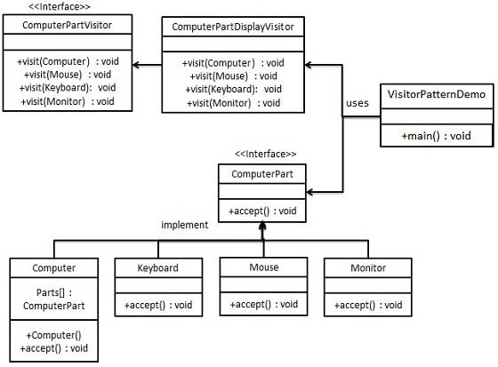
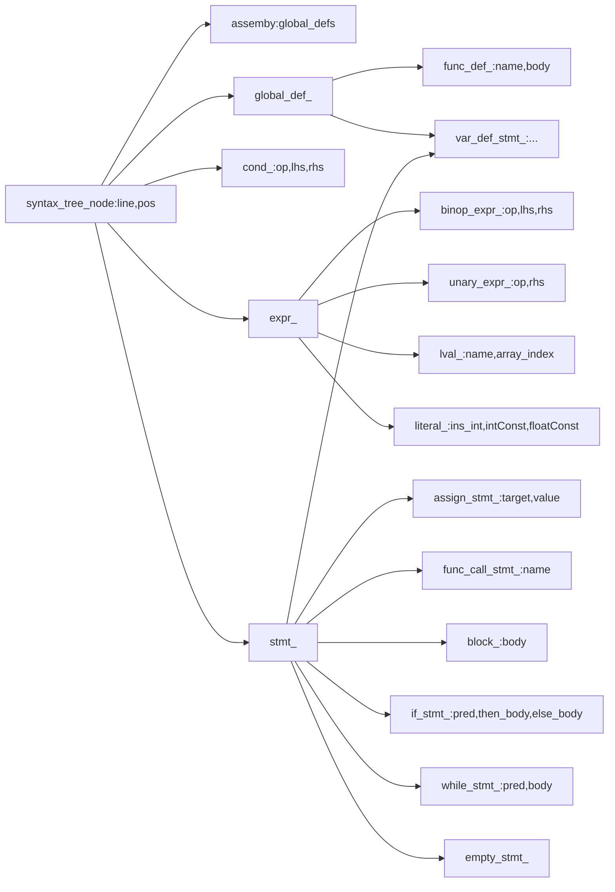

## 项目结构

### 编译流程

通过阅读`CMakeLists.txt`来理解项目的编译流程。

1. 设置相关要求。

   - 版本要求
   - 定义一些参数

   - 设置指向支持C++的antlr tool变量
   - 添加针对antlrcpp的外部build
   - 添加antrl4cpp组件到工程环境中

2. 调用宏来添加词法和语法文件到编译依赖中

   - `C1Lexer.g4`
   - `C1Parser.g4`

3. 包含外部工程。此处会下载`rapidjson`

4. 包含已经生成的文件到工程环境中。比如antlr4cpp

5. 添加已经生成的grammar到c1_recognizer binary target

   - 添加library`error_listener.cpp error_reporter.cpp syntax_tree.cpp syntax_tree_builder.cpp recognizer.cpp`
   - 添加依赖`antlr4cpp antlr4cpp_generation_c1_recognizer`
   - 添加链接库`antlr4-runtime`
   - 添加目录rapidjson
   - 添加可执行程序`c1r_test`基于`test/main.cpp`
   - 添加相关依赖`c1recognizer rapidjson`
   - 添加链接库`c1recognizer`

6. 安装

### 文件组织与结构

- `cmake/ExternalAntlr4cpp.cmake` 对antlr4cpp的cmake文件
- `grammar/C1Lexer.g4 C1Parser.g4`文法文件
- `include/C1recognizer/` 包含头文件
  - `error_reporter.h`声明`error_reporter`类，主要是输出错误信息，会用到`line`和`charPositionInline`表示行和列
  - `syntax_tree.h`为生成语法树而准备的数据结构
  - `recognizer.h`声明`recognizer`类
- `src/`
  - `error_listener.h/cpp` `error_reporter.cpp`与错误监听与报告相关
  - `recognizer.cpp`识别的实现
  - `syntax_tree.cpp`定义各类accept函数，仅仅是调用相关的`visit`函数
  - `syntax_tree_builder.h/cpp` 构建语法树的核心，实际上是基于`C1ParserBaseVisitor`实现的`visitor`，而后者是为类 `C1ParserVisitor` 提供的一个空的实现。

- `test/`
  - `syntax_tree_serializer.cpp`语法树序列化
  - `main.cpp`生成可执行测试文件的主函数
- `build/antlr4cpp_generated_src/`
  - 诸多对antlr4cpp的依赖文件

### 外部组件依赖

#### 外部组件

- `anltr4cpp`
- `rapidjson`

#### 模块间的交互关系

`rapidjson`最后根据生成的`syntax tree`输出`json`格式内容

### 功能模块

本实验主要的功能模块：语法分析树的生成-- >AST的生成-- >对树生成json输出。

语法分析树是lab1-2内容，生成节点类型为`C1Parser::xxxContext` ，访问树，并且构建AST, 每种节点的函数为`syntax_tree_builder::visitxxx(...)`, 最后得到的树，由rapidjson输出。

最中心的是通过访问分析树得到`syntax_tree`. 自上而下分析，就需要对产生式的情况进行分析。

主要编写的是`visitor`访问节点，然后返回`syntax`节点。

## 编译运行

**Attention** 需要对照[项目源码](https://github.com/ustc-compiler/2018fall/tree/master/c1recognizer)根据更新的日期，替换旧文件

在没有更改`recognizer.cpp`中的`exp`为`compilationUnit`之前，测试编译运行良好。

命令为

```bash
# 在c1recognizer目录下
mkdir build; cd build
cmake -DCMAKE_BUILD_TYPE=Debug -DANTLR4CPP_JAR_LOCATION=../../../ANTLR/antlr-4.7.1-complete.jar ..
make
cmake ..
make -j
./c1r_test ../test/test_cases/exp_example.c1
```

输出为

```json
{
    "type": "binop_expr_syntax",
    "line": 1,
    "pos": 0,
    "op": "plus",
    "lhs": {
        "type": "literal_syntax",
        "line": 1,
        "pos": 0,
        "is_int": true,
        "value": 1
    },
    "rhs": {
        "type": "literal_syntax",
        "line": 1,
        "pos": 6,
        "is_int": true,
        "value": 15
    }
}
```

使用`./c1e_ref_ubuntu`的时候出现如下错误

```
./c1r_ref_ubuntu: error while loading shared libraries: libantlr4-runtime.so.4.7.1: cannot open shared object file: No such file or directory
```

解决办法在项目github上下载相应的库

再`export LD_LIBRARY_PATH=$LD_LIBRARY_PATH:./Libs_for_c1r_ref`

然后可以运行。

## 学习构建AST

### Design Pattern

#### [Factory Pattern](http://www.runoob.com/design-pattern/factory-pattern.html)


1. `Shape`为抽象接口
2. `Circle Square Rectangle`为对`Shape`的三种实现
3. `ShapeFactory`为创建的工厂，之后对`Shape`类的获取都依赖于工厂
4. `Demo`为测试

#### [Visitor Pattern](http://www.runoob.com/design-pattern/visitor-pattern.html)



1. 表示元素的接口`ComputerPart`
2. 实现上面的接口。每个类都有一个`void accept(Visitor v)`函数，相当于迎接访问者，然后在该函数内部调用`v.visit(this)`即访问这个类的数据
3. 定义一个表示访问者的接口`ComputerPartVisitor`，里面重载了大量的`visit`函数
4. 实现上面的接口。覆盖相应的`visit`函数。函数内部是对数据的访问。

#### syntax_tree中类的关系



根据上面的图片，可以比较明确每个`context`节点的返回`syntax`节点及其内容。由此才能尽快发现`std::bad_cast exception`

## 构建AST

### 困难与解决

#### I. Syntax节点返回类型

比较繁杂的一点是`syntax`节点的返回类型。

`syntax_tree_builder`的`visit`函数是根据语法文件内容来写的。下面写出非终结符的相应返回的语义节点(根据`syntax_tree.h`内容来确定)，以便于之后写代码

由于`syntax`节点都继承自`syntax_tree_node`从而都有`line pos`属性，以下不再写出。

同时，每个返回的类型，要么是指针，要么是指针向量，涉及到指针的，不再标出`*`

另外，由于中间涉及到其他类型的属性的填写，虽然最终的返回类型都是一致的。所以把中间转换的类型写在中间，如果没有，则代表没有转化。

##### 1. 

````
compilationUnit: (decl | funcdef)+ EOF ;
````

```
assembly
ptr_list<global_def_syntax> global_defs;
```

##### 2.

```
decl:  constdecl | vardecl;
```

```
std::vector<var_def_stmt_syntax*>
```

##### 3.

```
constdecl:  Const (Int | Float) constdef (Comma constdef)* SemiColon;
```

```
std::vector<var_def_stmt_syntax*>
```

##### 4.

```
constdef: 
    Identifier Assign exp
    | Identifier LeftBracket  exp? RightBracket Assign LeftBrace exp ( Comma exp)* RightBrace;
```

```
var_def_stmt_syntax
```

##### 5.

```
vardecl: (Int | Float ) vardef (Comma vardef)* SemiColon;
```

```
std::vector<var_def_stmt_syntax*>
```

##### 6.

```
vardef: 
    Identifier 
    | Identifier LeftBracket exp RightBracket 
    | Identifier Assign exp 
    | Identifier LeftBracket  exp? RightBracket Assign LeftBrace exp ( Comma exp)* RightBrace;
```

```
var_def_stmt_syntax
```

##### 7.

```
funcdef: Void Identifier LeftParen RightParen block;
```

```
func_def_syntax
```

##### 8.

```
block: LeftBrace (decl | stmt)* RightBrace;
```

```
block_syntax
```

##### 9.

```
stmt: 
    lval Assign exp SemiColon
    | Identifier LeftParen RightParen SemiColon
    | block
    | If LeftParen cond RightParen stmt (Else stmt)? 
    | While LeftParen cond RightParen stmt
    | SemiColon;
```

```
stmt_syntax
```

##### 10.

```
lval: 
    Identifier
    | Identifier LeftBracket exp RightBracket;
```

```
lval_syntax
```

##### 11.

```
cond: exp ( Equal | NonEqual | Less | Greater | LessEqual | GreaterEqual ) exp;
```

```
cond_syntax
```

##### 12.

```
exp:
    (Plus | Minus) exp
    | exp (Multiply | Divide | Modulo) exp
    | exp (Plus | Minus) exp
    | LeftParen exp RightParen
    | number
    | lval;
```

```
expr_syntax
```

##### 13.

```
number: 
    FloatConst
   | IntConst;
```

```
expr_syntax
```

#### II.接口

使用到的接口函数

##### 1. 设置行与列

```cpp
result->line = ctx->getStart()->getLine();
result->pos = ctx->getStart()->getCharPositionInLine();
```

##### 2. 判断是否是某节点

```cpp
antlrcpp::is<C1Parser::DeclContext*>(child)
```

##### 3. 访问节点返回syntax node

```cpp
visit(child).as<func_def_syntax*>()
```

这是个非常重要的函数。而且非常容易出错。最核心的问题是：访问节点的类型要和`as<...>()`转化的类型一致。所以需要严格遵守上面的内容。

##### 4. 判断是否存在某子节点

```cpp
ctx->constdef()
```

相应的子节点均可以通过类似的方式获取

词法节点是开头大写，语法节点都是小写。

##### 5. ptr的设置

```cpp
result->array_length.reset(visit(exps[0]).as<expr_syntax*>());
```

凡是涉及到自定义类型`ptr`的，都要通过`reset`来改变它的值，无法通过`=`来改变。


## 测试

### 脚本

为了与给出的标准来比较，在`build`目录建立脚本如下

```bash
#!/bin/bash
./c1r_test ../test/test_cases/test.c1 >test1.txt
export LD_LIBRARY_PATH=$LD_LIBRARY_PATH:./Libs_for_c1r_ref
./c1r_ref_ubuntu ../test/test_cases/test.c1 >test2.txt
diff test1.txt test2.txt
rm -rf test1.txt test2.txt
```

如果什么都没有输出，代表正确。

### Bug

#### I. 

给出的框架中有一个错误即`visitExp`函数有一个`lval`没有相应的动作，如果测试中出现`a=a+1`就会出现`std::bad_cast`错误，具体解决办法是在最终下一个分支，内容如下

```C++
if (auto lval = ctx->lval())
    {
        //std::cout<<"visitExp-before-6"<<std::endl;
        auto result = visit(lval).as<lval_syntax*>();
        return static_cast<expr_syntax *>(result);
    }
```

#### II. 

之后仍然出现了`std::bad_cast`错误，具体原因猜测是在其他函数调用`visit(...).as<...>()`时，`visit`的节点的返回类型与`as`指定的类型不符。

解决办法是使用输出，来查看在哪里出现了错误。。。

#### III.

使用`int d[3]={1,2,3}`测试，发现会多出一个`literal_syntax`节点。

最终看代码发现是使用`auto exp:expression`时候使用了第一项的。

#### IV. 

之前一直使用的脚本是

```bash
#!/bin/bash
export LD_LIBRARY_PATH=$LD_LIBRARY_PATH:./Libs_for_c1r_ref
./c1r_test ../test/test_cases/test.c1 >test1.txt
./c1r_ref_ubuntu ../test/test_cases/test.c1 >test2.txt
diff test1.txt test2.txt
rm -rf test1.txt test2.txt
```

即先进行`export`再运行测试文件和对比文件，但是最后一天`make`之后（这次有antlr4cpp的更新），发现这样会出现`segment fault`错误，在几次尝试之后，把顺序改成

```bash
#!/bin/bash
./c1r_test ../test/test_cases/test.c1 >test1.txt
export LD_LIBRARY_PATH=$LD_LIBRARY_PATH:./Libs_for_c1r_ref
./c1r_ref_ubuntu ../test/test_cases/test.c1 >test2.txt
diff test1.txt test2.txt
rm -rf test1.txt test2.txt
```

这样才没有问题，一开始经助教的提醒，发现可能是原本的库没有被包含，即使用了`export LD_LIBRARY_PATH=./Libs_for_c1r_ref`, 所以改成了`export LD_LIBRARY_PATH=$LD_LIBRARY_PATH:./Libs_for_c1r_ref` 但是仍然没有效果。初步怀疑是更新的antlr4cpp导致的某种冲突。没有解决成功。。。只得把`export`调整到后面执行。

### 测试代码

测试的代码按照`lab1-2`的类似就可以了

