# Julia：A Fast Dynamic Language for Technical Computing

[TOC]

# Abstract 

> 一般动态语言特点：生产效率高，但是性能低

**Julia**：1、适应和扩展现代编译技术

​	    2、泛型函数和富类型系统->表达式编程模型+成功的类型推断->普遍性能提高

​	    3、可引用 `C/Fortran`，扩展性好


# 1 Intro：

> 为了性能和高效编程的结合：1、两层框架；2、对现有动态语言进行优化；

**两层框架**：上层使用动态语言、下层使用`C/Fortran`等提高执行性能。

​	缺点：1、不同语言的类型系统和内存管理机制不同，需要管理；

​		    2、层间接口增加了开销，整体优化困难；

​		    3、提高了社区成员做贡献的难度；

**Julia**：从底层设计，应用现代编译技术，获得了静态编译语言的性能和动态语言的高效编程；

​	    1、丰富的类型信息，提供多重调度；

​	    2、对运行时类型进行有效推断；

​	    3、使用`LLVM`框架进行`JIT`编译；


# 2 Language Design

> 使用复杂的类型系统，以获得足够的表达式和类型信息
>
> - 参数类型：使用前不需要声明，依赖运行时类型推断；
> - 方法：每个方法都是模板，其参数化和实例化由编译器进行；


## 2.1 理论：

研究人员认为具有以下特征的动态语言是`very useful`的：

- 加载编译时运行，并且可以消除系统与配置文件的干扰；
- 只有一个`Any`类型作为唯一静态类型；
- 语法良好；
- 表现只依赖于运行时类型；


**Julia**除了以上以外做以下约束：

- 类型不可变；

- 值的类型不可变；

- 本地环境变量不具体化；（存疑）

- 程序代码不可变；（存疑）

- 并非所有绑定都是可变的（`const`允许改变）

  

  

## 2.2 语言核心总览：

**核心components：**

- 语法层：将一开始的语法表示转化成给编译器看的中间表达形式（`IR`）
- 表示类型的符号语言以及数据结构，以及类型的运算(`meet`,`join`,`<=`)
- 基于类型的通用函数和动态多调度
- 用于访问对象模型的编译器内部函数（类型定义、方法）的定义、对象分配、元素访问、测试对象标识和访问类型）
- 编译器用于调用本地`C/Fortran`代码的功能
- 绑定顶级类型的机制


##2.3 类型

> **Julia**将类型作为值集合的描述，每个值都有唯一的不可变的运行时类型。对象带有类型的tag，类型也是对象，可以在运行时创建和检查。

**Julia具有的五种类型：**

- 抽象类型：可以声明子类型和父类型（`Sub <: Super`）
- 复合类型：类似于C语言结构体，已有名字域，已声明父类型
- 比特类型：值是bit类型，已声明父类型
- 元组类型：不可变的有序值集合，常用于可变函数参数以及多返回值
- 类型共用体：抽象类型联合


## 2.4 类型参数

> 抽象类型、复合类型、bit类型可以带有类型参数，用于表达类型的转换，比如`Array{Float64,1}`

类型参数是有边界的，可以使用`<:`声明，例如`Ratianal{T<:Integer}`

同时，`Julia`也允许不带类型参数的类型使用，比如`Array`代表可以是任何类型，`Array{Float64}`代表只类型是`Float64`的任意长数组，通过填写类型参数可以得到实例化的类型，而不是一个集合


## 2.5 泛型函数 

> 即含有多重定义，并不只是对于一种类型，而是类型的集合


## 2.6 方法定义

简单的多行定义或者单行定义：

```julia
function iszero(x::Number)
    return x==0
end

iszero(x)=(x==0)
```

- `::`用于类型声明，用于对类型进行调度约束，当类型声明缺省时，默认为`Any`，`::`可以用于任何代码表达式，用于运行时类型推断。当`::`作用于变量名时，即限制了变量的类型，在赋值时会进行类型转换。注意：当没有明显类型上下文时，类型会在运行时进行推断出来。
- 对于函数，可以限制其返回值类型，例如：`f(x)::Int`
- 匿名方法可以这么写：`x->x+1`
- 全局变量声明需要使用`global`声明
- 运算符（+/-等）是简单的函数，比如`x+y`等价于`+(x,y)`
- 当函数参数最后以`...`结尾时，代表可变参数


## 2.7 参数化方法

> 在方法内部引用参数类型的参数通常是有用的，并指定对这些参数的约束。

例如：

```julia
function assign{T<:Integer}(a::Array{T,1}, i, n::T)
```

以上表明一个元素个数为1的数组，元素类型是`Integer`的一种。参数化方法常用于编写应用于某集合类型的方法


## 2.8 构造函数

>构造函数是用于构造新复合类型对象的函数

例如以下定义的内部构造函数：

```julia
type Rational{T<:Integer} <: Real
	num::T
	den::T

    function Rational(num::T, den::T)
        if num == 0 && den == 0
            error("invalid rational: 0//0")
        end
        g = gcd(den, num)
        new(div(num, g), div(den, g))
    end
end
```


## 2.9 Singleton Kind

泛型函数的方法表实际上是一个字典，其中键值是类型。在调用时即需要对类型进行严谨的判断，所以引入`Singleton Kind` `Type{T}`，类型 `T` 是其唯一的值。

```julia
typemax(::Type{Int64}) = 9223372036854775807
```

类型在使用时是十分重要的，例如进行`I/O`操作时，我们使用`read(file,Int32)`以4字节读取数据，并且返回`Int32`类型的值，这样的使用比使用`enum`或者其他常量更加优雅


## 2.10 方法排序和歧义

> 方法定义后经排序后进行调用，所以第一个匹配的方法必然是最正确的要调用的方法。所以在排序时，需要引入很多的推理逻辑，比较方法的签名是十分重要的，而参数的推理是关键。以下规则用于推断A是比B更加特殊的类型：

- `A`是`B`的子类
- `A`有集合`T{P}`，B有集合`S{Q}`，对于一些参数值，`T`是`S`的子类
- `A`和`B`的交集是非空的，`A`比`B`更具体，并且不等于`B`，并且`B`并不比`A`更具体
- `A`和`B`是元组，并且`A`以`...`结尾
- `A`和`B`具有兼容的参数和结构，并且`A`为`B`的参数提供一致的分配，但是反过来则不然（存疑）

一些说明与解释：

- 规则2表明声明的子类型总是比它们声明的超类型更具体，而不考虑类型参数。

- 规则3对于`Union`很有效，例如当有`A`是`Union(Int32,String)`，`B`是`Number`时，`A`比`B`更加特殊

- 规则5的一个明显表达即，$$ \forall T(T,T)$$ 比$$ \forall X,Y (X,Y)$$ 更加特殊

   

Julia使用多分派，所有参数都一样重要，所以歧义的存在时很有可能的，例如同时定义`foo(x::Number,y::Int)`与`foo(x::Int,y::Number)`，当调用时传入参数为`(Int,Int)`时，是不明确的。当添加一个方法时，通过寻找一对签名来检测歧义。如果存在有一个非空集合，则表明 没有一个比另一个更具体。此时会抛出一个`warning`


## 2.11 迭代

根据迭代的接口`(start,done,and next)`一个`for`循环会转化为`while`循环，例如：

```julia
for i in range
    #body
end
```

会转化成

```julia
state = start(range)
while !done(range,state)
    (i,state) = next(range,state)
    #body
end
```

之所以选择迭代设计，是因为它不依赖于可变的堆分配状态


## 2.12 特殊运算

特殊的运算通过一些函数实现

| surface syntax |       lower form       |
| :------------: | :--------------------: |
|    `a[i,j]`    |      `ref(a,i,j)`      |
|   `a[i,j]=x`   |   `assign(a,x,i,j)`    |
|    `[a;b] `    |      `vcat(a,b)`       |
|    `[a,b]`     |      `vcat(a,b)`       |
|    `[a b]`     |      `hcat(a,b)`       |
|  `[a b; c d]`  | `hvcat((2,2),a,b,b,d)` |

## 2.13 调用C/Fortran

提供关键字`ccall`调用本地代码，看起来像调用函数一样简单

```julia
ccall(dlsym(libm,:sin),Float64,(Float64,),x)
```


## 2.14 并行

并行执行依赖于`Julia`标准库中的协程，语言设计通过提供对称的协同程序来支持这样的库的实现，这也可以被认为是协作调度线程，此特性允许异步通信隐藏在库中，而不要求用户设置回调


## 2.15 设计的限制

- 在设计中，类型始终与值相应，使得不能做返回值类型重载
- 多分派使得模块化困难，任何函数都可以应用于任何类型
- Julia使用的内存比预期得多，因为需要进行类型推断等工作


# 3 type inference

动态类型语言和静态类型语言的区别:

+ 动态类型语言:值具有类型，在运行时知道
+ 静态类型语言:表达式有类型，在编译时知道

Julia属于动态类型语言，代码的结果类型由执行时值流过的方式决定，该语言不包括在执行它们之前为表达式分配类型的任何规则。与许多动态语言不同，Julia有一个相当复杂的方法来讨论类型，你可以用类型注释表达式，例如：
```
x :: T
```
是断言x是类型T的值;如果为真，x :: T将计算x的值，否则会引发错误，并且表达式不返回任何值。在某些语言中，类型注释将语言从动态模式切换到静态模式：没有类型注释的方法是动态的，有类型注释的方法是静态的，在这些在静态代码中，必须给所有表达式指定类型，但Julia的类型注释的代码仍然是动态的，行为与没有类型注释的代码相同，Julia编译器会分析代码并尝试预测表达式类型，然后用这些信息生成更高效的机器码，对于那些无法预测推断的类型，就使用运行时类型，在Julia中类型推断是一种提高运行速度的方式，即使没有类型推断Julia照样能运行代码。

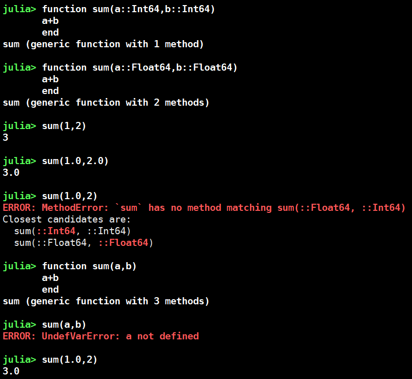


类型推断与多分派

> 多分派：函数或者方法的分派取决于运行时参数的对象类型。是对方法调用只能由调用者决定的单分派的扩展。多分派概括了两个或多个对象的动态分派。
>
> 单分派是指调用一个对象的方法仅由对象的类型决定。多分派是指调用一个对象的方法不仅由对象的类型决定，同时还由其他因素决定，比如方法参数的类型等等。   


## 3.1 方法缓存和特殊化

第一步：在每个方法缓存中查找参数类型，方法缓存中包含函数参数的每一组具体类型，具体类型是hash散列的，使得缓存查找比子类型预测更快。使用方法的第一个参数的ID作为主键

第二步：当未命中方法缓存时，进行子类型预测匹配

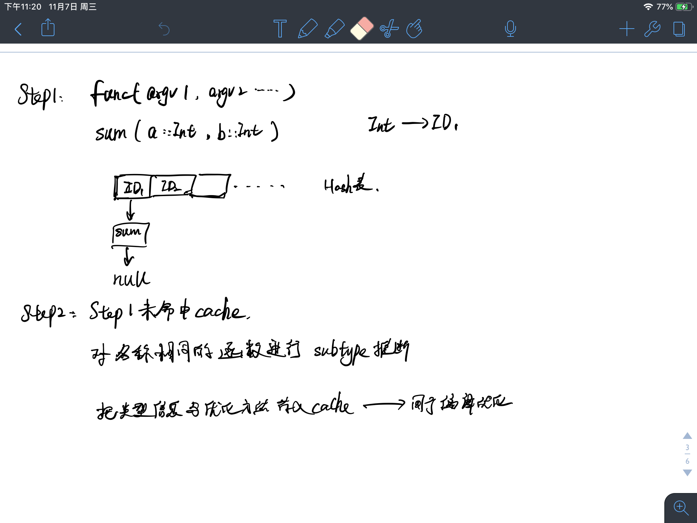


## 3.2 启发式的方法

1、要保证分派和启发式特殊化进程的结果是收敛的，一个很好的例子是形如`Type{Int32}`，`Type{Type{Int32}}`这样的迭代需要结束；

2、要避免的是元组的特殊化不能扩展为任意长度，例如`type(Any ...)`对任意元组实例都有效，可以采用已有元组的最大长度代替无限长度的元组推断；

3、理想情况下需要形成高级的类型，然而，这并不总是可能的，并且上界类型可能与另一个签名冲突。对于这种情况，找到覆盖类型与其他签名的所有非空交集，并为它们添加虚拟缓存条目；

4、关于`Singleton Kinds`，考虑到当传递参数为`(Any,Number,Int etc)`时，还会触发新的特殊化，但是并不是每个方法都对参数有要求，所以对于对参数无要求的方法，不进行；

5、使用唯一静态类型Any


## 3.3 返回类型推断

> 基于前向数据流分析对表达式、变量的类型进行推断


### 函数返回值类型推断

**MFP**（Maximum fixed-point）算法：跟踪state(所有变量的类型)，判断每个代码段对其影响，确保类型信息从一个代码段基于控制流传递到下一个代码段。

MFP算法初始时使用的类型信息是对已知函数在类型域上的评估，通过`interpret`调用子程序`eval`，处理变量后出现的新类型以及赋值语句

对于传递函数，其返回值的结果是递归调用类型推理后的结果。

对于`generic function`，返回值类型是所有实例化后的`method`返回值类型结果的交集。

在每个匹配方法(其函数签名$$s$$和参数不为空）上调用类型推断，并将结果连接在一起（求并集）

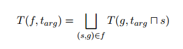

其中$$T $$ 是推断函数，$$t_{arg}  $$是参数的推断元组，元组$$(s,g)$$ 代表签名$$s$$ 和泛型函数$$f$$中的每个关联定义$$g$$,其中签名$$s$$蕴含了函数的类型信息

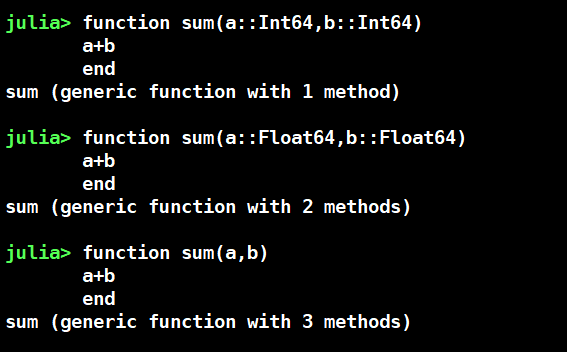

那么当`sum(1,2)`时，即有匹配方法`sum(a::Int64,b::Int64)`和`sum(a,b)`

具体算法：

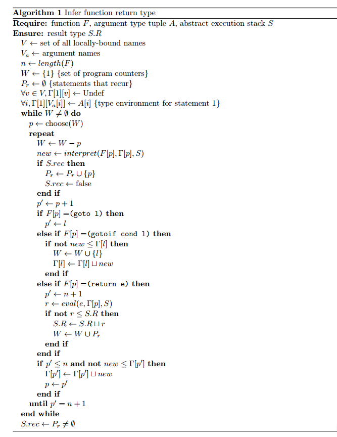


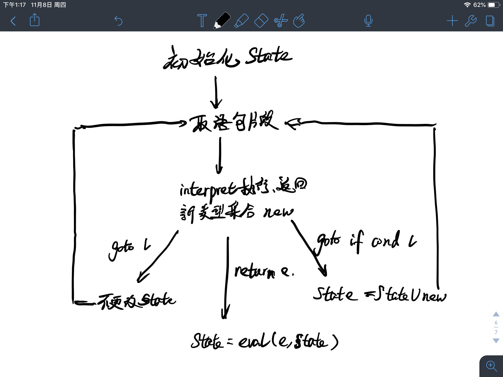


### 过程间类型推断

类型推断调用算法2（用于管理递归和记忆结果），保持一个栈用于已激活活动的记录，进行检测递归。

每个函数都有一个不完整的$$(F;A)$$属性，表明当发现关于其调用的函数的结果类型的新信息时需要重新访问它，作用与算法1中的$$W$$类似。

算法2中的外层循环用于寻找输入函数和参数类型的已激活记录，如果找到，就标记从该点到堆栈顶部的所有记录，标识调用周期中所涉及的所有函数。

当结果返回时，在算法1中找到这些标记，并且所有受影响的函数都被认为是不完整的。算法2继续对不完全函数重新运行推断，更新推断的结果类型，直到不发生递归或结果类型收敛。

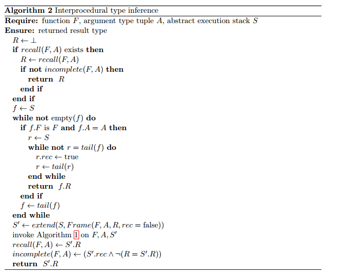

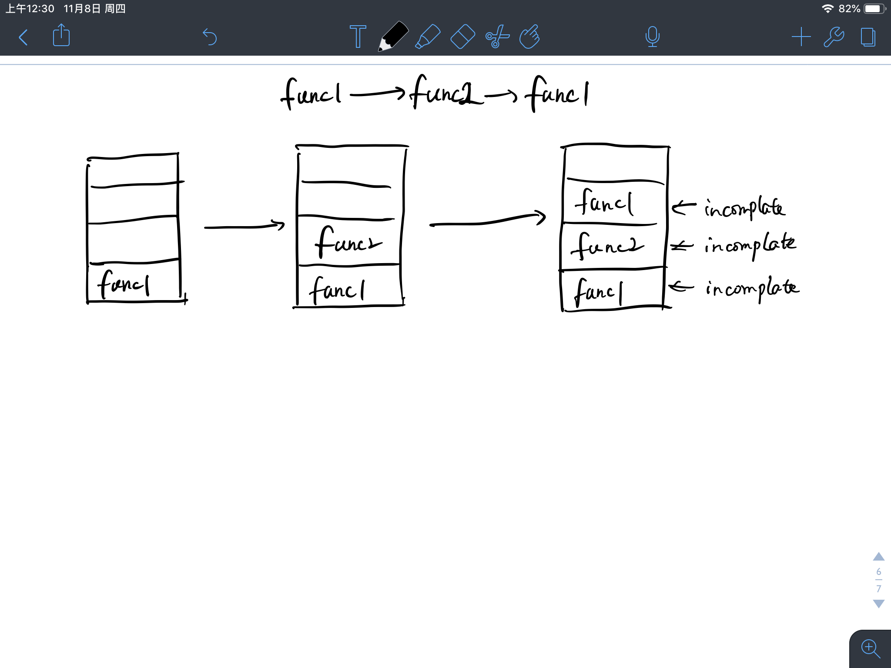


## 3.4 子类型推断


> 类型等价相当于计算$$(A\le B \land B \land A)$$ ，使用子函数$$p(A)$$和$$super(A)$$求类型$$A$$的类型参数和父类


算法3用于处理元组类型和Union类型的子类型推断：

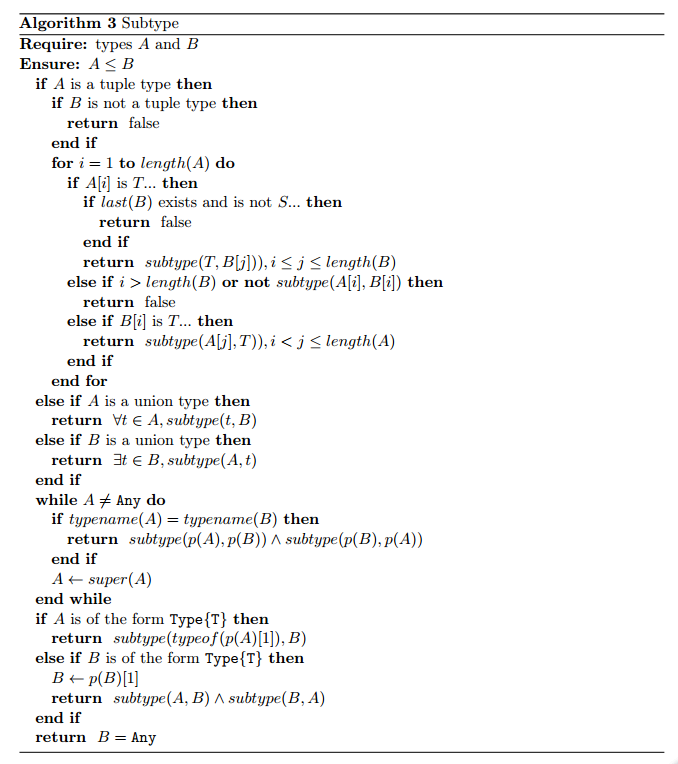

例如：

```julia
(Int32,Float64,Real)<:(Any...)
Union(Int64,String)<: Any
Int64<:Union(Int32,Real)
```


#### 类型的并集

求类型的并集是简单的，`T`和`S`类型的并集可以通过计算`T`和`S`的子类型集合组合起来。这里有一个可以简化的地方在于如果S是T的子类，则可以简化计算


#### 类型的交集

给出类型T和S，找到满足下列性质的最小类型R，$$\forall s,s\in S \land s \in T \rightarrow s \in R $$  ，这是比较困难的，转而寻找满足此性质的类型集合，但是这在实践中几乎没有价值。一个好一些的方法是找到满足上述的所有类型集合，然后检查一个类型是否是另一个的子类型，然后返回较小类型。对于不相交的情况，返回$$\bot$$ 

```julia
例如：Int64，Float64
满足的类型集合有{Real，Number，Signed}，然后判断子类型，Real是Number的子类型，所以去掉Number；Signed是Real的子类型，所以去掉Real，那么最后保留下来的就是满足条件的最小类型R是Signed
```


算法分为两部分：

在第一阶段中除了不建立约束环境，其余与分析子类型类似，输入T<=S用于当T处于协变上下文中，而输入T=S当T处于不可变的上下文中(存疑)

以Java为例：

有基类型`Object`，构造出类型`Object[]`，记为`Object[]`=`f(Object)`


> 协变：
>
> 当A ≦ B时,如果有f(A) ≦ f(B),那么f叫做协变(covariance)； 


在第二阶段，用类似于传统多态型系统的算法求解约束。

需要访问每个变量来收集需要的约束，另外需要确认变量是否相同，当一个参数是一个类型变量时，它是有效协变的，此时必须与其他类型的相应参数相交以形成最终的结果

当参数类型不是来自同一个`family`时，递归类型层次结构，看看其中一个参数的任何超类型是否匹配另一个参数，如果是，给出交叉的超类型 `sup`，然后我们需要将其映射到原始参数类型。

$$conform$$子程序确认两者是否拥有相同的结构

$$super\_decl(t)$$返回t用于实例化其超类型的类型模板

算法4用于获得类型的交集

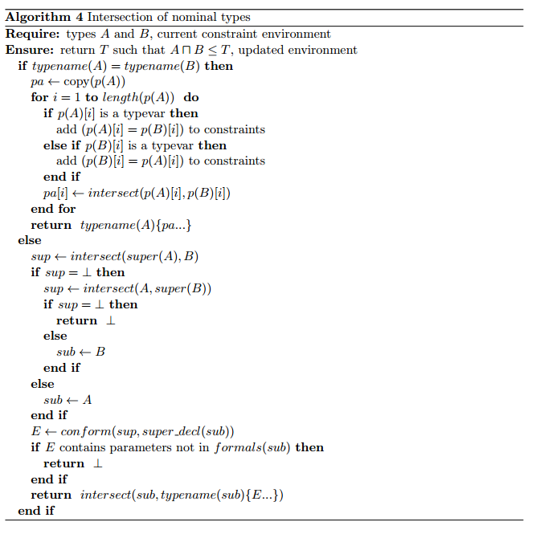


我们需要做的是访问每个参数来收集任何需要的约束，否则检查参数是相等的。当参数是类型变量时，它是有效协变的，并且必须与其他类型

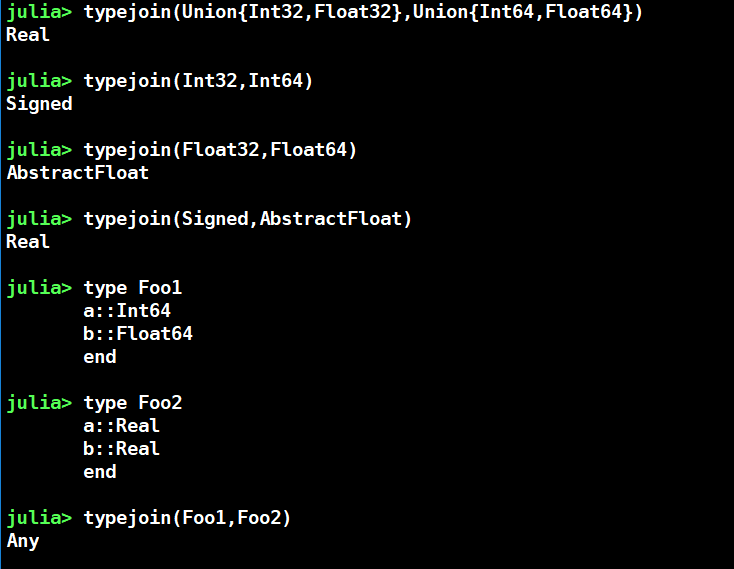


```hulia
Return the closest common ancestor of `T` and `S`, i.e. the narrowest type from which
they both inherit.
"""
typejoin() = (@_pure_meta; Bottom)
typejoin(@nospecialize(t)) = (@_pure_meta; t)
typejoin(@nospecialize(t), ts...) = (@_pure_meta; typejoin(t, typejoin(ts...)))
function typejoin(@nospecialize(a), @nospecialize(b))
    @_pure_meta
    if isa(a, TypeVar)
        return typejoin(a.ub, b)
    elseif isa(b, TypeVar)
        return typejoin(a, b.ub)
    elseif a <: b
        return b
    elseif b <: a
        return a
    elseif isa(a, UnionAll)
        return UnionAll(a.var, typejoin(a.body, b))
    elseif isa(b, UnionAll)
        return UnionAll(b.var, typejoin(a, b.body))
    elseif isa(a, Union)
        return typejoin(typejoin(a.a, a.b), b)
    elseif isa(b, Union)
        return typejoin(a, typejoin(b.a, b.b))
    elseif a <: Tuple
        if !(b <: Tuple)
            return Any
        end
        ap, bp = a.parameters, b.parameters
        lar = length(ap)::Int
        lbr = length(bp)::Int
        if lar == 0
            return Tuple{Vararg{tailjoin(bp, 1)}}
        end
        if lbr == 0
            return Tuple{Vararg{tailjoin(ap, 1)}}
        end
        laf, afixed = full_va_len(ap)
        lbf, bfixed = full_va_len(bp)
        if laf < lbf
            if isvarargtype(ap[lar]) && !afixed
                c = Vector{Any}(undef, laf)
                c[laf] = Vararg{typejoin(unwrapva(ap[lar]), tailjoin(bp, laf))}
                n = laf-1
            else
                c = Vector{Any}(undef, laf+1)
                c[laf+1] = Vararg{tailjoin(bp, laf+1)}
                n = laf
            end
        elseif lbf < laf
            if isvarargtype(bp[lbr]) && !bfixed
                c = Vector{Any}(undef, lbf)
                c[lbf] = Vararg{typejoin(unwrapva(bp[lbr]), tailjoin(ap, lbf))}
                n = lbf-1
            else
                c = Vector{Any}(undef, lbf+1)
                c[lbf+1] = Vararg{tailjoin(ap, lbf+1)}
                n = lbf
            end
        else
            c = Vector{Any}(undef, laf)
            n = laf
        end
        for i = 1:n
            ai = ap[min(i,lar)]; bi = bp[min(i,lbr)]
            ci = typejoin(unwrapva(ai), unwrapva(bi))
            c[i] = i == length(c) && (isvarargtype(ai) || isvarargtype(bi)) ? Vararg{ci} : ci
        end
        return Tuple{c...}
    elseif b <: Tuple
        return Any
    end
    while b !== Any
        if a <: b.name.wrapper
            while a.name !== b.name
                a = supertype(a)
            end
            if a.name === Type.body.name
                ap = a.parameters[1]
                bp = b.parameters[1]
                if ((isa(ap,TypeVar) && ap.lb === Bottom && ap.ub === Any) ||
                    (isa(bp,TypeVar) && bp.lb === Bottom && bp.ub === Any))
                    # handle special Type{T} supertype
                    return Type
                end
            end
            aprimary = a.name.wrapper
            # join on parameters
            n = length(a.parameters)
            if n == 0
                return aprimary
            end
            vars = []
            for i = 1:n
                ai, bi = a.parameters[i], b.parameters[i]
                if ai === bi || (isa(ai,Type) && isa(bi,Type) && ai <: bi && bi <: ai)
                    aprimary = aprimary{ai}
                else
                    pushfirst!(vars, aprimary.var)
                    aprimary = aprimary.body
                end
            end
            for v in vars
                aprimary = UnionAll(v, aprimary)
            end
            return aprimary
        end
        b = supertype(b)
    end
    return Any
end

```

