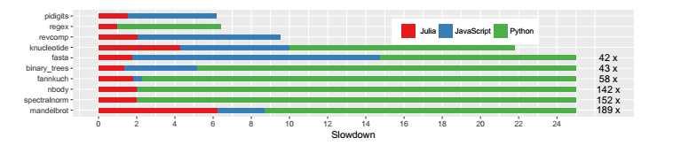
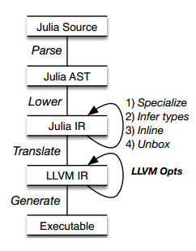

#  编写高效的Julia代码

## Julia 高效的原因

> Julia 在 Language Design、Implementation techniques、programmeing style三方面进行协调。

- `Language Design`：动态类型、可选类型注释、动态代码加载、垃圾回收等
- `Implementation techniques`：在IR中间代码进行三方面的优化，然后把IR交给LLVM。（1）简单methods内联；（2）对象拆箱，为了避免堆分配；（3）方法特殊化，避免多次编译；
- `programming style`：希望程序员能尽量使用类型注释，或者使用stable type的methods（即方法返回值类型是可以通过输入类型唯一确定的），这样可以在编译运行时不需要花更多的时间和内存开销去推断类型以及方法多分派。


## 性能的比较

挑选了是个programming language benchmark game，使用相同代码习惯和逻辑等编写，大部分是无类型参数的，去掉空白符后，所有benchmark的总size分别为

- Julia：6KB
- Javascript：7.4KB
- Python：8.3KB
- C：14.2KB

测试版本：

- Julia v6.0.2
- V8/Node.js v8.11.1
- CPython 3.5.3
- GCC 6.3.0 -O2

Debian 9.4 on a Intel i7-950 at 3.07GHz with 10GB of RAM ， 单线程，无其他优化参数 

测试结果：



测试结果表明，Julia的表现远好于Javascript以及Python，一般在C语言的1~2倍内，并且在Regex比C语言略快。knucleotide和mandelbrot的表现不是很好，原因在于Knucleotide中使用了太多的抽象类型，而mandelbrot在实现上，C语言是8pixel运算而Julia是单一的。

以上可以看出Julia在tiny benchmark上的表现是很快的。但是在大规模的benchmark上目前缺乏测试。但是有一个JuMP库（用于数学优化的库），它的表现在C++实现的2倍内，Matlab的表现在4~18倍内，Python70倍不止。可以预见Julia的在大规模benchmark上的表现也不会差。


## Julia的编译优化

由源代码生成AST，然后访问AST生成Julia的IR中间表示，并在语言层面进行优化，然后生成LLVM的IR中间表示，然后在执行时生成对应的机器码



四项优化：

- Method Specialization：在运行调用函数时，通过调用函数的参数确定，对方法进行特殊化过程，得到特殊化方法并进行缓存，当下次遇到相同情况时可以免去特殊化的消耗。

- Type Inference：对类型进行推断，用于优化函数等，当给出类型注释时，可以大大节省运行时推断的时间

  ```
  function f(a,b)						function f(a::Int,b::Int)
  	c = a + b						    c = a + b ::Int
  	d = c / 2.0							d = c / 2.0 ::Float 
  	return d							return d
  end 								end => Float
  ```

- Method Inlining：当出现方法调用，并且方法是type stable 时，可以将方法内联，从而节省保护恢复现场的开销。同时这样的方法内联也可以提高上下文类型推断的效率。

- Object Unboxing：Julia作为动态类型语言，一个变量的值可以是很多类型，对其拆箱装箱这会消耗大量资源，所以需要用启发式方法进行判断何时拆箱何时装箱


## 如何编写高效的Julia代码

[Julia Document：performance-tips](https://docs.julialang.org/en/v1/manual/performance-tips/)

### 输入声明

#### 避免使用抽象类型参数的容器

```julia
julia> a = Real[]
0-element Array{Real,1}

julia> push!(a,1);push!(a,1.1);push!(a,pi)
3-element Array{Real,1}:
  1                    
  1.1                  
 π = 3.1415926535897...
```

在这里a作为Real的数组类型，必需能存储任意的Real值，并不能对a进行连续地址的数据存储，而是指向一个Real对象的地址，使用Float64可以提高效率


#### 避免使用抽象类型的字段

```julia
julia> struct MyAmbiguousType
           a
       end

julia> b = MyAmbiguousType("Hello")
MyAmbiguousType("Hello")

julia> c = MyAmbiguousType(17)
MyAmbiguousType(17)
```

b和c都是抽象的类型MyAmbiguousType，但是在内存中的底层表示是完全不同的，更好的解决方案是使用类型参数

```julia
julia> mutable struct MyType{T<:AbstractFloat}
           a::T
       end
```

这样在构造b与c时，就可以知道其具体的类型和底层表示


上述对抽象容器也同样适用，其余的还有对值进行类型注释、声明关键字参数的类型等等


**总结：**当程序员知道其具体类型的时候，要尽量将自己知道的通过类型注释、类型参数等将自己所知道的与编译器共享，为语言层的优化提供足够的类型信息


### 将复合的函数尽量分解

```julia
using LinearAlgebra

function mynorm(A)
    if isa(A, Vector)
        return sqrt(real(dot(A,A)))
    elseif isa(A, Matrix)
        return maximum(svdvals(A))
    else
        error("mynorm: invalid argument")
    end
end
```

简单的分解为

```julia
norm(x::Vector) = sqrt(real(dot(x, x)))
norm(A::Matrix) = maximum(svdvals(A))
```

从而可以利用多分派


### 编写类型稳定的methods

比如

```julia
pos(x) = x < 0 ? 0:x
```

在这里，0 是整型，而x是未知的任意类型，应该使用zero(x)代替这里的0

```
pos(x) = x < 0 ? zero(x):x
```

zero函数对于zero(Int）返回Int型的0，对于Float返回Float型的0.0，保证了pos是type stable的


### 为值加上类型参数

```julia
julia> A = fill(5.0, (3, 3))
3×3 Array{Float64,2}:
 5.0  5.0  5.0
 5.0  5.0  5.0
 5.0  5.0  5.0
```

想生成任意维的3\* 3...数组

```2
julia> function array3(fillval, N)
           fill(fillval, ntuple(d->3, N))
       end
array3 (generic function with 1 method)

julia> array3(5.0, 2)
3×3 Array{Float64,2}:
 5.0  5.0  5.0
 5.0  5.0  5.0
 5.0  5.0  5.0
```

问题，由于N是未知的类型，编译器不知道这是一个数值，所以在优化时会比较保守，不能很有效的进行推断。但是如果加上类型参数Val{N}，告诉编译器这是一个数值，就会好很多。

```
julia> function array3(fillval, ::Val{N}) where N
           fill(fillval, ntuple(d->3, Val(N)))
       end
array3 (generic function with 1 method)

julia> array3(5.0, Val(2))
3×3 Array{Float64,2}:
 5.0  5.0  5.0
 5.0  5.0  5.0
 5.0  5.0  5.0
```


### 按内存顺序访问数组

Julia多维数组是列主序的，所以当访问数组时要注意其在内存中的连续性


### 内存的预分配

当调用函数会返回一个Array或者其余的复杂类型时，应通过预分配来避免在每个函数上分配内存的需要

```julia
julia> function xinc(x)
           return [x, x+1, x+2]
       end;

julia> function loopinc()
           y = 0
           for i = 1:10^7
               ret = xinc(i)
               y += ret[2]
           end
           return y
       end;
```

与

```julia
julia> function xinc!(ret::AbstractVector{T}, x::T) where T
           ret[1] = x
           ret[2] = x+1
           ret[3] = x+2
           nothing
       end;

julia> function loopinc_prealloc()
           ret = Vector{Int}(undef, 3)
           y = 0
           for i = 1:10^7
               xinc!(ret, i)
               y += ret[2]
           end
           return y
       end;
```

测试的结果：

```julia
julia> @time loopinc()
  0.529894 seconds (40.00 M allocations: 1.490 GiB, 12.14% gc time)
50000015000000

julia> @time loopinc_prealloc()
  0.030850 seconds (6 allocations: 288 bytes)
50000015000000
```


### 矢量化运算

使用`.`进行矢量化运算，这会在语法层面使用单一的循环，并且不会分配临时数组，减少了内存分配和循环次数

```julia
julia> f(x) = 3x.^2 + 4x + 7x.^3;

julia> fdot(x) = @. 3x^2 + 4x + 7x^3 # equivalent to 3 .* x.^2 .+ 4 .* x .+ 7 .* x.^3;

julia> x = rand(10^6);

julia> @time f(x);
  0.019049 seconds (16 allocations: 45.777 MiB, 18.59% gc time)

julia> @time fdot(x);
  0.002790 seconds (6 allocations: 7.630 MiB)

julia> @time f.(x);
  0.002626 seconds (8 allocations: 7.630 MiB)
```


## Style Guide

[Julia Document：Style Guide](https://docs.julialang.org/en/v1/manual/style-guide/)

- 编写函数而不是只是写脚本
- 尽量具有通用性
- 处理method的参数多样性
- 合理使用!，`!`是区别拷贝/修改的约定
- 不要出现奇怪的Union类型：`Union{Function,AbstractString} `
- 使用Julia Base库一致的method参数顺序
- 不要过度使用`try...catch...`
- 不要过度使用`...`
- 不要使用不必要的类型参数：`foo(x::T) where {T<:Real} = ... `改写为`foo(x::Real) = ...`

 ....