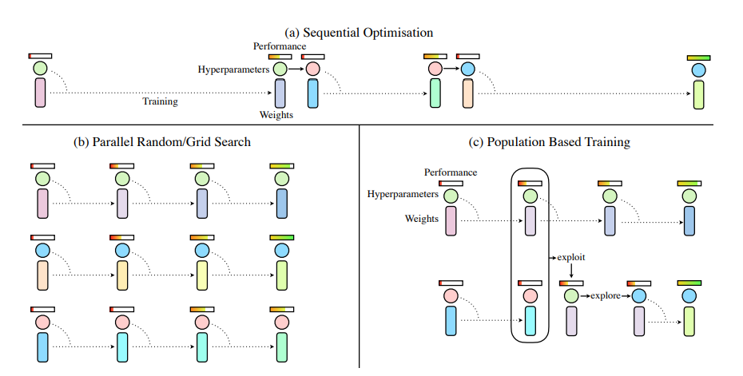
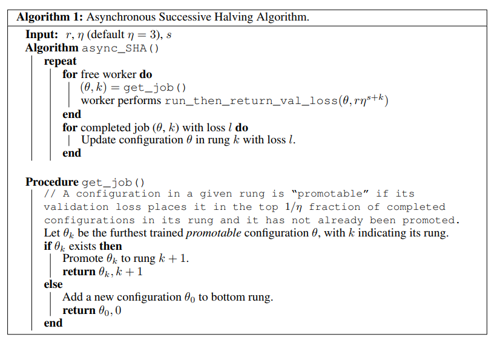
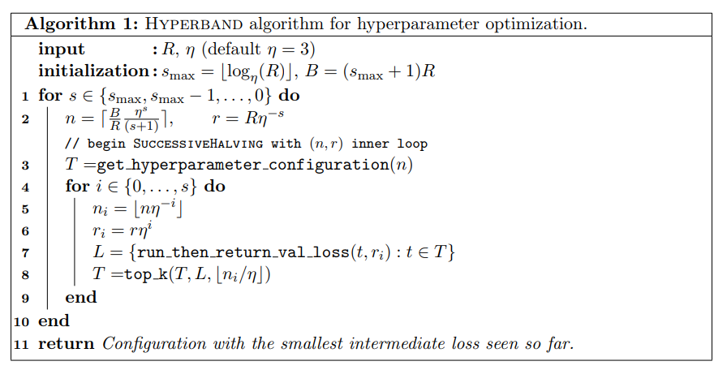
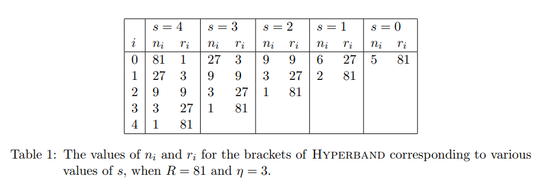
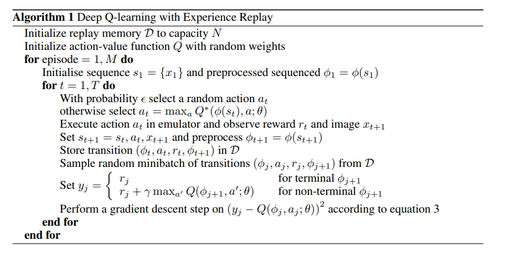

*讨论在整个ray系列中出现的算法*

## Tune

注意Trial Schedulers与Search Algorithms是不同的。前者安排一系列Trials如何执行执行顺序，后者确定每次的Hyperparameter Configuration.

### 1. Tune Trial Schedulers

#### 1.1. Popilation Based Training (PBT)

[DeepMind Blog-PBT](https://deepmind.com/blog/population-based-training-neural-networks/)

[Population Based Training of Neural Networks](https://arxiv.org/abs/1711.09846)

本论文首先介绍当前的hyperparameter调整的方式分为如下

- Parallel Search

  并行多个进程，每个进程不同的hyperparameter. 最后将结果比较，选择最好的那个

  - Grid Search
  - Random Search

- Sequential Optimisation

  每次运行一个，然后根据这个的结果，重新选择hyperparameter, 循环往复，直到比较好的结果

用流程图来表示就是：



而PBT就是，并行一系列hyperparameter不同的模型，然后在中间将那些结果不好的模型的parameter和hyperparameter换成较好的那个(exploit), 并且加上一些随机的噪声(explore).


#### 1.2. Asynchronous HyperBand

[Massively Parallel Hyperparameter Tuning](https://openreview.net/forum?id=S1Y7OOlRZ)

这个算法是下面的HyperBand异步推广的结果。它的算法为



论文中只给出了Successive Halving算法(SHA),　由于下面的HyperBand 使用了SHA的子过程，所以很容易补充成为Asynchronous HyperBand.

输入的参数为$r$ 最小资源，$\eta >0$ 表示reduction factor, $s$ 表示最小的early-stop rate.

注意到rung越大，表示这个超参的设定越有前景，则分配到的资源越大。

同时由于get_job()函数的存在，使得算法是异步的，当发现存在promotable设定的时候，就返回这个设定，并且将rung加一，如果不存在，也不用等待其他的结束，而是直接生成一个新的设定，且rung=0

#### 1.3. HyperBand

[standard version of HyperBand](https://arxiv.org/abs/1603.06560)

https://people.eecs.berkeley.edu/~kjamieson/hyperband.html

这个的实际目标是，资源B是有限的，尝试的次数n可以选择，每次尝试分配的资源是B/n, 那么如何分配资源，n可大可小。

提出的算法如下



设定一个案例如下：



将trial分成很多部分，每次trial最大资源为$R$, 分成$(s_{max}=\lfloor \log _{\eta} (R) \rfloor)+1$ 个阶段，每个阶段总资源为$B=(s_{max}+1)R$ 每个阶段又分成多个子部分，其中当尝试的个数$n_i$越大，分配的资源$r_i$越小，越会提早结束探索。每个SHA子过程都使用不同的early-stop rate.(由于现代的超参调试问题都有高维的搜索空间，并且模型有很大的训练代价，所以提前终止是很有必要的)

其中get_hyperparameter_configuration(n) 表示从超参的设定集合中采样n个独立同分布的样本。

run_then_return_val_loss(t,ri)表示超参为t, 资源为ri时的validation loss

python 代码如下

```python
# you need to write the following hooks for your custom problem
from problem import get_random_hyperparameter_configuration,run_then_return_val_loss

max_iter = 81  # maximum iterations/epochs per configuration
eta = 3 # defines downsampling rate (default=3)
logeta = lambda x: log(x)/log(eta)
s_max = int(logeta(max_iter))  # number of unique executions of Successive Halving (minus one)
B = (s_max+1)*max_iter  # total number of iterations (without reuse) per execution of Succesive Halving (n,r)

#### Begin Finite Horizon Hyperband outlerloop. Repeat indefinetely.
for s in reversed(range(s_max+1)):
    n = int(ceil(int(B/max_iter/(s+1))*eta**s)) # initial number of configurations
    r = max_iter*eta**(-s) # initial number of iterations to run configurations for

    #### Begin Finite Horizon Successive Halving with (n,r)
    T = [ get_random_hyperparameter_configuration() for i in range(n) ] 
    for i in range(s+1):
        # Run each of the n_i configs for r_i iterations and keep best n_i/eta
        n_i = n*eta**(-i)
        r_i = r*eta**(i)
        val_losses = [ run_then_return_val_loss(num_iters=r_i,hyperparameters=t) for t in T ]
        T = [ T[i] for i in argsort(val_losses)[0:int( n_i/eta )] ]
    #### End Finite Horizon Successive Halving with (n,r)
```

#### 1.4. Median Stopping Rule

[Google Vizier: A Service for Black-Box Optimization](https://ai.google/research/pubs/pub46180)

这篇文章介绍的是google研发的Black0Box Optimization系统。主要介绍了系统的组成。略。

### 2. Tune Search Algorithms

#### 2.1. Variant Generation (Grid Search/Random Search)

不必过多介绍。

#### 2.2. HyperOpt Search (Tree-structured Parzen Estimators)

[Hyperopt Distributed Asynchronous Hyperparameter Optimization in Python](http://hyperopt.github.io/hyperopt/)

这其实是一个Python库：

> `hyperopt` is a Python library for optimizing over awkward search spaces with real-valued, discrete, and conditional dimensions.

目前实现的算法有

- Random Search
- Tree of Parzen Estimators (TPE)

使用案例

安装`pip install hyperopt`

```python
from hyperopt import hp

# define an objective function
def objective(args):
    case, val = args
    if case == 'case 1':
        return val
    else:
        return val ** 2

# define a search space
from hyperopt import hp
space = hp.choice('a',
    [
        ('case 1', 1 + hp.lognormal('c1', 0, 1)),
        ('case 2', hp.uniform('c2', -10, 10))
    ])

# minimize the objective over the space
from hyperopt import fmin, tpe, space_eval
best = fmin(objective, space, algo=tpe.suggest, max_evals=100)

print(best)
print(space_eval(space,best))
```

输出为

```python
{'a': 1, 'c2': -0.08088083656564893}
('case 2', -0.08088083656564893)
```

注意到用法其实很简单，定义objective, 设定search space, 选择search aalgorithms, 设定evaluations数目。

ray里面其实是调用这个库来实现的。

## RLlib

### 1. RLlib Algorithms

#### 1.1. High-throughput architectures

##### 1.1.1. Distributed Prioritized Experience Replay (Ape-X)

[Distributed Prioritized Experience Replay](https://arxiv.org/abs/1803.00933)

是DQN与DDPG关于Apx-X的变体。使用一个GPU learner与多个CPU workers, 用于experience collection.

> Experience collection can scale to hundreds of CPU workers due to the distributed prioritization of experience prior to storage in replay buffers

***TODO***

##### 1.1.2. Importance Weighted Actor-Learner Architecture (IMPALA)

[IMPALA: Scalable Distributed Deep-RL with Importance Weighted Actor-Learner Architectures](https://arxiv.org/abs/1802.01561)

在IMPALA中，一个中心的learner在一个很紧凑的循环里执行SGD, 同时异步地从许多actor processes里面拉取样本batches

***TODO***

#### 1.2. Gradient-based

##### 1.2.1. Advantage Actor-Critic (A2C, A3C)

[Asynchronous Methods for Deep Reinforcement Learning](https://arxiv.org/abs/1602.01783)

***TODO***

##### 1.2.2. Deep Deterministic Policy Gradients (DDPG, TD3)

[Continuous control with deep reinforcement learning](https://arxiv.org/abs/1509.02971)

DDPG实现与DQN实现很像。

DDPG同时学习Q-Function和policy. 使用off-policy数据和Bellman等式来学习Q-function, 然后使用Q-function来学习policy.

这种方式与Q-learning联系非常紧密，也是有同样的动机：如果知道了optimal action-value函数$Q^*(s,a)$, 然后如果给定state, 就可以计算出optimal action:
$$
a^*(s) = \arg \max_a Q^*(s,a)
$$
DDPG交错学习一个$Q^*(s,a)的$approximator和一个$a^*(s)$的approximator,  

对于离散的action还可以直接计算最大值，但是对于连续的，就不能遍历计算。但是由于action space是连续的，$Q^*(s,a)$就假定对于$a$可微，policy $\mu (s)$就利用了这个事实。所以，现在不需要每次都耗费资源计算$\max_a Q(s,a)$, 而是用$\max_aQ(s,a)\approx Q(s,\mu(s))$来近似。

注意到DDPG是off-policy的，而且仅适用于连续的action spaces. 可以看为是连续版本的DQN.

DDPG包含两个部分：学习Q-function和学习policy

*The Q-Learning Side of DDPG*

首先是关于optimal action-value 函数的Bellman 等式
$$
Q^*(s,a) = \underset{s' \sim P}{{\mathrm E}}\left[r(s,a) + \gamma \max_{a'} Q^*(s', a')\right]
$$
其中$s'\sim P$表示下一个state $s'$ 是依据分布$P(\cdot|s,a)$来从环境中采样的。


*The Policy Learning Side of DDPG*


##### 1.2.3. Deep Q Networks (DQN, Rainbow, Parametric DQN)

[Playing Atari with Deep Reinforcement Learning](https://arxiv.org/abs/1312.5602)

[Rainbow: Combining Improvements in Deep Reinforcement Learning](https://arxiv.org/abs/1710.02298)

**DQN**

DQN是第一个使用DL直接从高维数据中学习control policy作为RL输入的成功的模型。

该论文中提到了DL应用于RL面临的困境：

- 大部分成功的DL应用都需要大量标注了的数据。另一方面，RL必须要从标量reward中学习，而这种reward通常是稀疏的、充满噪声的、延迟的。
- 大部分DL要求采样的数据必须是独立的。但是RL通常是连续的高度相关的状态。
- DL通常假设数据的分布是固定的，但是RL的数据分布却通常随着behaviours的不同而不同

本论文为了解决数据相关问题以及不稳定的分布问题，使用了Experience Replay机制，也就是每次的转移都存起来，训练的时候随机从存储里面抽取。

文章使用了Q Learning, 所以介绍了Q Learning

$Bellman\ equation$
$$
Q^*(s,a)=\mathbb{E}_{s' \sim \mathcal{E}}\Big[r+\gamma \max_{a'}Q^*(s',a')\Big|s,a\Big]
$$
可以使用$value\ iteration$来收敛到该optimal action-value funtion
$$
Q_{i+1}(s,a)=\mathbb{E}\Big[{r+\gamma\max_{a'}} Q_{i}(s',a')\Big|s,a\Big]
$$
$Q_i \to Q^*\ \text{as}\ i\to \infty $. 但是实际上这种方式是完全不可行的，因为对于每个sequence, action-value函数的估计是分开的，这样就失去了generalisation. 所以通常会使用function approximator来估计action-value 函数，即$Q(s,a;\theta)\approx Q^*(s,a)$. 通常会使用linear function, 偶尔使用non-linear函数近似，比如NN. 

这篇论文中使用的他们称为Q-network, 可以通过如下的loss function来优化($L_i(\theta_i)$表示每个循环i都会改变)
$$
L_i(\theta_i)=\mathbb{E}_{s,a\sim \rho(\cdot)}\Big[(y_i-Q(s,a;\theta_i))^2 \Big]
$$
其中$y_i$为target value.它会随着循环而改变，这不同于监督学习。
$$
y_i=\mathbb{E}_{s'\sim \mathcal{E}}\Big[r+\gamma\max_{a'}Q(s',a';\theta_{i-1}\Big|s,a\Big]
$$
$\rho$表示behaviour distribution.

Loss function的微分为
$$
\nabla_{\theta_i}L_i(\theta_i)=\mathbb{E}_{s,a\sim\rho(\cdot);s'\sim\mathcal{E}}
\Big[\Big(r+\gamma\max_{a'}Q(s',a';\theta_{i-1})-Q(s,a;\theta_i)\nabla_{\theta_i}Q(s,a;\theta_i)	 \Big)
\Big]
$$
注意上述算法有如下的特点

- model-free: 并没有构建关于estimator $\mathcal{E}$的模型
- off-policy: 学习的是greedy strategy $a=\max_{a}Q(s,a;\theta)$, 但是使用的behavior通常是$\epsilon$-greedy的

接下来就是详细介绍了DQN算法



需要注意的是，由于原始的像素数据太大，并不适合作为模型输入，所以添加了一个$\Phi$函数来预处理image

**Rainbow**

在DQN提出来之后，有许多的论文提出了改进意见，这篇文章是抽取6种改进，然后将它们组合进行评测。使用的extensions 如下:

1. Double Q-Learning

   首先注意到DQN是在减小如下loss
   $$
   (R_{t+1}+\gamma_{t+1}\max_{a'}q_{\bar{\theta}}(S_{t+1},a')-q_{\theta}(S_t,A_t))^2
   $$
   注意到其中的max部分，选择action使用的是target value, 对选用的action来评估也是使用target value, 这样有可能过高地估计某个action的效力，导致整个q都偏高。改进方式就是使用不同的value. 考虑到计算量，DDQN使用的是，$q_\theta$来选择action, 由$q_{\bar{\theta}}$来评估。式子如下：
   $$
   (R_{t+1}+\gamma_{t+1}q_{\bar{\theta}}(S_{t+1},\arg \max_{a'}q_{\theta}(S_{t+1},a'))-q_{\theta}(S_t,A_t))^2
   $$

2. Prioritized replay

   DQN从replay buffer中取样是均匀的，但是有一些数据更加有价值，应该更多地去学。所以该方法使用了某种概率$p_t$来选择，该概率与last encountered absolute TD error:
   $$
   p_t \propto \Big| R_{t+1}+\gamma_{t+1}\max_{a'}q_{\bar{\theta}}(S_{t+1},a')-q_{\theta}(S_t,A_t) \Big|^{\omega}
   $$
   其中$\omega$是决定分布形状的参数。新加进来的数据会有最大的可能性。

3. Dueling Network

   ***TODO***

4. Multi-step Learning

   注意DQN使用了第一个reward然后后面就是估计值，其实还可以使用多个
   $$
   R_t^{(n)}=\sum_{k=0}^{n-1}\gamma_{t}^{(k)}R_{t+k+1}\\
   $$
   相应的，loss改为
   $$
   (R_t^{(n)}+\gamma_t^{(n)}\max_{a'}q_{\bar{\theta}}(S_{t+n},a')-q_\theta(S_t,A_t))^2
   $$

5. Distributional RL

   ***TODO***

6. Noisy Nets

   ***TODO***

这里面好几个我自己没有接触过，更加详细的说明留在以后。

##### 1.2.4. Policy Gradients

[Policy Gradient Methods for Reinforcement Learning with Function Approximation ](https://papers.nips.cc/paper/1713-policy-gradient-methods-for-reinforcement-learning-with-function-approximation.pdf)

vabilla policy gradients.下面的PPO表现更好

算法的核心就是将那些能够获得高return的action的概率提高，而将地return的action概率降低。

首先这是一个on-policy的算法，适用的env的action可分离可连续。

用$\pi_\theta$表示含参数$\theta$的policy, 用$J(\pi_\theta)$表示有终结的没有discount的return. 相应的gradient为
$$
\nabla_{\theta}J(\pi_\theta)=\mathop{E}_{\tau\sim\pi_\theta}
\Big [ \sum_{t=0}^T \nabla_\theta \log \pi_\theta(a_t|s_t)A^{\pi_\theta}(s_t,a_t)
\Big]
$$
其中$\tau$表示trajectory, $A^{\pi_\theta}$表示advantage function, 也就是选择$a_t$与所以action的return的均值的差。

PG算法就是通过stochastic gradient ascent来更新policy的参数的
$$
\theta_{k+1}=\theta_k+\alpha \nabla_{\theta}J(\pi_{\theta_k})
$$
PG是一个on-policy的，也就是说它的exploration是依据最新的policy采样而来的。所以action 的随机性取决于初始的设置与训练的过程。随着训练的进行，policy通常会慢慢减小随机性，这样就容易导致得到一个局部最优解，而且没有办法出来。

其算法如下


#####  1.2.5. Proximal Policy Optimization (PPO)

[Proximal Policy Optimization Algorithms](https://arxiv.org/abs/1707.06347)

首先需要介绍Trust Region Policy Optimization(TRPO)

**TRPO**

TRPO是建立在PG基础上的。TRPO使用尽可能大的step来提高performance, 并且要满足新的policy要接近旧的policy. 由于policy也是一种概率，所以这种限制是使用KL-Divergence来实现的。

与普通的PG不同的是新旧的policy尽可能接近，这是因为一个小小的坏的step都可能使整个policy效果不好。TRPO解决了这个，能够很快并且单调地提升performance.

与PG类似，TRPO也是一个on-policy的，并且env的action空间可离散可连续。

理论上TRPO更新的是
$$
\begin{aligned}
\theta_{k+1} = \arg \max_{\theta} \; & {\mathcal L}(\theta_k, \theta) \\ \text{s.t.} \; & \bar{D}_{KL}(\theta || \theta_k) \leq \delta
\end{aligned}
$$
其中$\mathcal L(\theta_k, \theta)$是surrogate advantage, 就是在度量policy $\pi_\theta$相比与旧的policy $\pi_{\theta_k}$的性能
$$
{\mathcal L}(\theta_k, \theta) = \mathop{E}_{s,a \sim \pi_{\theta_k}}{\Bigg[     \frac{\pi_{\theta}(a|s)}{\pi_{\theta_k}(a|s)} A^{\pi_{\theta_k}}(s,a) }\Bigg]
$$
然后$ \bar{D}_{KL}(\theta || \theta_k)$是一种平均的KL-divergence, 关于旧的policy遍历的所有的states
$$
\bar{D}_{KL}(\theta || \theta_k) = \mathop{E}_{s \sim \pi_{\theta_k}}{\Big[     D_{KL}\left(\pi_{\theta}(\cdot|s) || \pi_{\theta_k} (\cdot|s) \right) \Big ]}
$$


但是理论上的update并不是很容易计算，所以TRPO做了一些近似，使用泰勒展开，同时对$\mathcal L$与$D_{KL}$
$$
\begin{aligned}
{\mathcal L}(\theta_k, \theta) &\approx g^T (\theta - \theta_k)				 \\ 
\bar{D}_{KL}(\theta || \theta_k) & \approx \frac{1}{2} (\theta - \theta_k)^T H (\theta - \theta_k)
\end{aligned}
$$
所以最终的近似的问题就变成
$$
\begin{aligned}
\theta_{k+1} = \arg \max_{\theta} \; & g^T (\theta - \theta_k) \\ \text{s.t.} 
\;  & \frac{1}{2} (\theta - \theta_k)^T H (\theta - \theta_k) \leq \delta
\end{aligned}
$$
这个问题可以通过Lagrangian duality方式得到分析解
$$
\theta_{k+1} = \theta_k + \sqrt{\frac{2 \delta}{g^T H^{-1} g}} H^{-1} g
$$
如果到此为止，使用上面的结果，那么算法就是在计算Natural Policy Gradient. 问题在于，由于泰勒展开的近似性，这个更新可能不满足KL的约束，或者实际上在更新surrogate advantage.

TRPO加上了一个小改动: a backtracking line search
$$
\theta_{k+1} = \theta_k + \alpha^j \sqrt{\frac{2 \delta}{g^T H^{-1} g}} H^{-1} g
$$
其中$\alpha \in (0,1)$是backtracking 系数，而$j$是使$\theta_{k+1}$满足KL约束的最小非负整数。

TRPO的exploration与exploitation同PG


**PPO**

PPO与TRPO有同样的动机：如何采用最大的step来更新policy而又不更新太多，导致崩坏。TRPO使用了二阶的方式，很复杂，而PPO使用一阶的方式，并且使用一些技巧是新的policy尽可能接近旧的policy.

有两个基本的PPO变体: PPO-Penalty和PPO-Clip

PPO-Penalty: 解决一个近似的问题，就像TRPO那样，但是是将KL限制加到objective中，而不是让它成为一个比较难的约束。同时加上一个系数，并且会随着训练的进行变化。

PPO-Clip: 在objective中没有KL, 根本没有约束。而是在objective中加上一个特殊的clipping, 修建那些可能使新的policy远离旧policy的因素。

与TRPO类似，PPO也是on-policy，同时适用于env的action为离散或者连续的。

PPO-Clip更新policy的方式为
$$
\theta_{k+1} = \arg \max_{\theta} \underset{s,a \sim \pi_{\theta_k}}{{\mathrm E}}\left[     L(s,a,\theta_k, \theta)\right]
$$
通常是使用使用几步的 minibatch SGD(SGA)来最大化objective. 其中$L$是：
$$
L(s,a,\theta_k,\theta) = \min\left( \frac{\pi_{\theta}(a|s)}{\pi_{\theta_k}(a|s)}  A^{\pi_{\theta_k}}(s,a), \;\; \text{clip}\left(\frac{\pi_{\theta}(a|s)}{\pi_{\theta_k}(a|s)}, 1 - \epsilon, 1+\epsilon \right) A^{\pi_{\theta_k}}(s,a) \right)
$$
其中$\epsilon$是一个很小的超参，就是在限制新旧policy的最大距离。

下面有一个简单的版本
$$
L(s,a,\theta_k,\theta) = \min\left( \frac{\pi_{\theta}(a|s)}{\pi_{\theta_k}(a|s)}  A^{\pi_{\theta_k}}(s,a), \;\; g(\epsilon, A^{\pi_{\theta_k}}(s,a)) \right)
$$
其中
$$
g(\epsilon, A) = \left \{     \begin{array}{ll}     (1 + \epsilon) A & A \geq 0 \\     (1 - \epsilon) A & A < 0.     \end{array}     \right .
$$


#### 1.3. Derivative-free

##### 1.3.1. Augmented Random Search (ARS)

[Simple random search provides a competitive approach to reinforcement learning](https://arxiv.org/abs/1803.07055)

***TODO***

##### 1.3.2. Evolution Strategies

[Evolution Strategies as a Scalable Alternative to Reinforcement Learning](https://arxiv.org/abs/1703.03864)

***TODO***