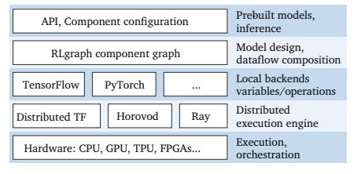
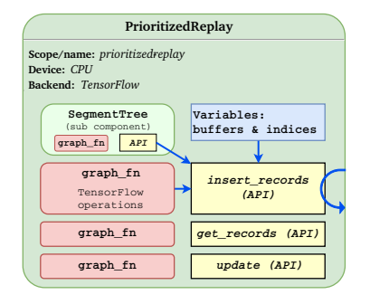
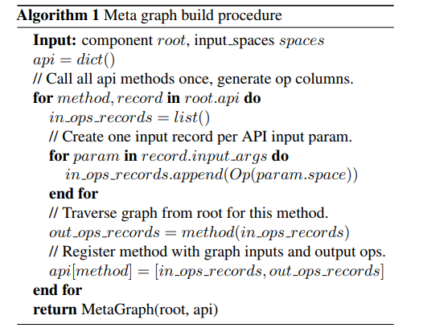
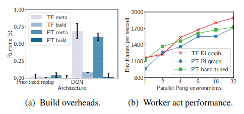
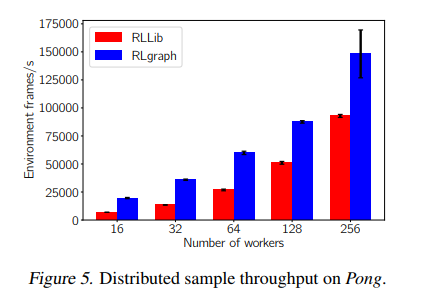
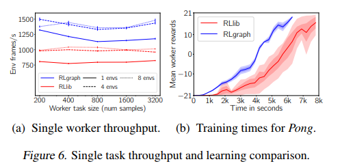

*介绍Ray系列的缺点并提出改进意见*

[RLgraph: Flexible Computation Graphs for Deep Reinforcement Learning](https://arxiv.org/abs/1810.09028)

Ray 本身并不是完美的，对于某些特性，有研究人员提出了别的改进的策略。也就是RLgraph, 其提出的基本问题就是，各个组件之间相互交错，对于测试、执行以及代码的重用都很不友好，于是提出了自己的解决方案，并且做了部分开源实现[RLgraph](https://github.com/rlgraph/rlgraph)以及相关文档[RLgraph docs](https://rlgraph.readthedocs.io/en/latest/). 

部分内容需要深入代码才能看明白。

由于算法的不稳定性、超参的敏感性以及特征不同的交流方式，RL任务的实现、执行、测试都很具有挑战性。

## 1. Introduction

针对不同的方面，已经有很多的RL库实现了。比如OpenAI, TensorForce, Ray RLlib. 虽然这些库都有各自不同的目的，但是都面临一些相似的问题，并且导致测试、分布式执行、扩展的困难。其根源就在于**a lack of separation of concerns**.  定义在RL算法中的逻辑组块部分与特定深度学习框架相关的代码紧紧结合在一起，比如说Ray RLlib里面就是这样，没有完整地分离，使用TensorFlow的部分就是完全依赖的。这就导致了API的不良定义，同时也让各个组块的重用与测试变得困难。相似地，RL复杂的dataflow与control flow也纠缠在一起。



这篇文章的核心贡献就是RLgraph. 解决上述麻烦的办法就在于将logical component composition, creation of operations, variables, placeholders, local and distributed execution of component graph分离。如上图所示。设计的核心就在于meta graph结构，这个graph主要作用是，集成、连接各个组块，比如buffers或NN, 并且将这些功能用统一的API表示。很重要的一点是，这个graph与特定的表示实现（比如TF变量）不依赖。这就意味着，meta graph可以同时建立static graphs和define-by-run execution. 也同时支持TensorFlow和PyTorch.

**sth omit there**

这种设计有如下几个优势：

1. **Distributed execution**. 将设计与执行分开，意味着agent可以实现在任何分布执行的框架里，比如distributed TensorFlow, Ray, Uber's Horovod.
2. **Static and define-by-run backends**. meta graph的设计并不强加限制在只能它自己的执行方式，这就意味着，不仅能支持end-to-end static graphs, 包括control flow, 也能支持define-by-run semantics 比如PyTorch, 这一点通过统一的接口实现
3. **Fast development cycles and testing**. 这是由于各个组件的分离。

## 2. Motivation

### 2.1 RL workloads

执行RL最中心的困难就在于需要频繁地与环境交互，贯穿于training, evaluatin 以及update.其特征如下：

- **State management**. 样本trajectories一般是分布式采样，workers同时与env的复制品进行交互。在一个或者多个learner与样本搜集者之间，算法必须保持model weights的一致性，这就需要同步和异步的策略了。另外，需要将样本高效地传递给learner, 有时候需要共享内存。
- **Resource requirements and scale**. 最近成功的RL算法需要成百上千的CPU以及几百个GPU. 与此相反，有的算法不易并行，却可能只能用一个CPU. 
- **Models and optimization strategies**. 模型可大可小，将硬件的作用用到极致很困难。

### 2.2. Existing abstractions

- **Reference implementations**. 很多的库仅仅作为一个实现的参考，帮助重新产生研究结果。比如OpenAI baselines和Google's Dopamine 提供了一系列以及优化好的benchmarks比如OPenAI gym以及ALE.  Nervana Coach包含相似的东西，但也加上了一些工具，比如可视化、Hierarchical learning、分布式训练。这种实现在很多组块之间共享了算法，比如NN结构并且通常叶忽略了实际应用的考虑。所以重新利用他们到不同的模式就很困难
- **Centralized control. **Ray RLlib定义了一系列抽象，它依赖Ray的actor模型来执行算法，正如前面讲到的，RLlib实现中很重要的就是optimizer, 每个optimization都有一个*step()*函数，这个函数分发采样任务给remote actor, 管理buffers以及更新weights. RLlib自己最宣传的一点就是，在optimizer的执行与RL算法的定义（由policy graph）分开。然而每个optimizer同时封装了local和distributed机器的执行，这意味着，比如说，只有专用的多GPU optimizer能够同步地在不同GPU上分离input. 使用optimizer驱动control flow的另一个坏处就是RLlib混合Python control flow, Ray call以及TensorFlow call进它的实现里。所以使用RLlib实现的算法就不容易移植，只能在Ray上执行。相反地RLgraph就不一样了，它支持端到端的计算图，包括in-graph control-flow, 然后就可以将它们分布在Ray, distributed TF等等任何其他的。
- **Fixed end-to-end graphs** 主要是TensorForce的问题，略。

## 3. Framework Design

### 3.1. Design principles

没有占优势的单一模式，设计框架就必须解决灵活的原型、可重用的组块以及易拓展机制之间的矛盾。RLgraph的设计是基于如下几个观点的：

- **Separating algorithms and execution** RL算法需要复杂的控制流，来协调分布式的采样与内部训练。分割这些组块很困难但是非常有必要。RLgraph通过graph executors来管理local execution. 分布式的就被指派给专用的distributed executors, 比如在Ray上，或者作为graph的一部分，组建到executor内部，比如distributed TF.
- **Shared components with strict interfaces** 
- **Sub-graph testing** 

### 3.2. Components and meta graph

**Components. ** 然后来讨论RLgraph中component graph的设计，为了简化，使用TF作为基本的后端，其他后端的实现，比如PyTorch留在后面。RLgraph的核心抽象就是Component 类，这个类通过graph function来封装任意的计算。考虑一个replay buffer component, 这个component对外的功能是插入experiences和根据优先权重来批量采样。实现这样的buffer在命令式的语言，比如python 是非常直接的，但是将它作为TF Graph的一部分却需要通过控制流操作创建和管理很多的变量。将很多种这样的组件按可重用的方式组建很困难。但是使用define-by-run的框架比如PyTorch却很简单，然而在大容量分布式执行与程序导出层面上却存在困难。

现有的高层次的NN API比如Sonnet, Keras, Gluon 或者TF.Learn都专注于构建于训练NN, 将RL实现在这样的框架里面通常需要将命令式的python与DL graph objects混合起来，这会导致上面提到的设计问题。

当构建在static graph后端上时，RLgraph的component API能够快速构建端到端的可微分的dataflow graph, 利用in-graph control flow. 并且，graph builder和executor会自动管理burdensome tasks,比如变量和placeholder的创建, scopes, input spaces以及device assignments.

**Example component** 下图是一个简化的prioritized replay buffer componenet.



所有的componenetd都继承自一个通用的component 类，然后使用它们自己的sub-components来构建逻辑。这个buffer有一个segment tree sub-component来管理优先级顺序。它暴露的API methods有insert, sample和update, 这些又关联一些graph function. 简单的对象mothod与RLgraph API method的不同点在于，registered API methods是identified然后被管理在build中。Input shape可以被自动推断，从inputs到root component.

开发者能够声明一个method为API method ，通过调用register function. 从技术上说，并不是一个component所有的功能都需要注册为API method. 用户也可以实现helper function或utilities, 比如说使用TF操作但是不将他们包含进API methos, 如果并不需要从外部components调用他们的话。

### 3.3 Building component graphs

RLgraph用三个不同的阶段来组装。

1. **Component composition phase** 这个阶段中，定义、结合component objects, 也包括sub-components的任意嵌套
2. **Assembly phase** 创建一个很少类型、维度的dataflow graph. 这是通过调用root componet的API实现的。
3. **Graph compilation/building phase** 

案例如下：

1. **Component composition and nesting** 所有的components都被定义为Python objects. Components很有逻辑地组织进root container component, 作为它的sub-components.而root component则对外暴露API. 注意到一个Agent 能够定义多个root component, 这样就能并行地act 和learn不同的policy

   ```python
   def init(self, *args, **kwargs):
   	self.register_api("update", self.update)
       
   def update(self, batch_size):
   	sample = self.call(memory.sample, batch_size)
   	s, a, r, next_s, t = self.call(splitter.split, sample)
   	loss = self.call(dqn_loss.get_loss, s, a, r, next_s, t)
   	variables = self.call(policy.get_variables)
   	update = self.call(optimizer.step, loss, variables)
   	return update, loss
   
   # Envisioned API: Implicit ’call’ via decorators.
   # Use space-hints to auto-split, merge nested spaces.
   @rlgraph.api_method(split=True)
   def observe(records)
   	self.memory.insert(records)
   ```

2. **Assembling the meta-graph** 然后用户可以定义流过model的dataflow, 这是通过components之间的连接实现的。在这个阶段data types和shape info都是不需要的。每个component都有一系列的API-methods. 如上面的程序所示。data在这些method中解释为抽象meta-graph operator objects, 它们的shapes和types会在build的时候推断出来。在prototype实现里面，显式地使用component call method, 对于所有的API唤醒。之后会实现一个更加友好的。

   API 调用的return值现在就可以传递给其他的API-methods或sub-component的API-method或者数值计算的graph function, 

   一个简单的meta graph算法如下

   

3. **Building computation graphs ** 

### 3.4 Agent API

```python
abstract class rlgraph.agent:
	# Build with default devices, variable sharing, ..
	def build(options)
	def get_actions(states, explore=True, preprocess=True)
    # Update from internal buffer or external data.
	def update(batch=None)
	# Observe samples for named environments.
	def observe(state, action, reward, terminal, env_id)
	def get_weights, def set_weights
	def import_model, def export_model
```

## 4. Executing Graphs

### 4.1 Graph executors.

### 4.2 Backend support and code generation

## 5. Evaluation

### 5.1 Results







### 5.2 Discussion


