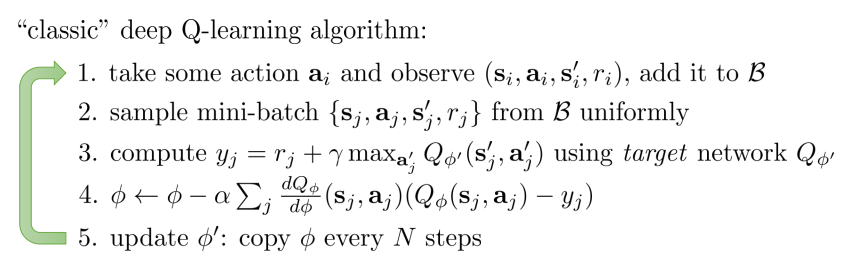
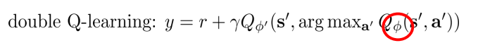
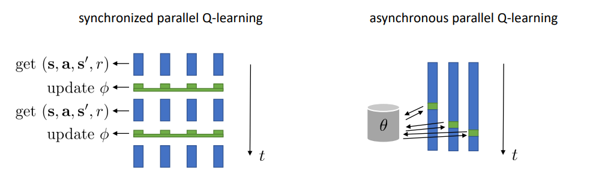

*继续深入RLlib的代码部分*

**PLAN**

- [x] 结合[RLlib文档](https://ray.readthedocs.io/en/latest/rllib.html) 阅读[RLlib代码](https://github.com/ray-project/ray/tree/master/python/ray/rllib)

- [ ] 学习了解最新的RL算法：[CS 294-112 at UC Berkeley](http://rail.eecs.berkeley.edu/deeprlcourse/)

  > 已完成**13/22**

  **其他资源**

  - [Sutton & Barto, Reinforcement Learning: An Introduction](http://incompleteideas.net/book/the-book-2nd.html)

    仅仅到了Policy Gradient 略陈旧

  - [Deep Reinforcement Learning](https://arxiv.org/abs/1810.06339)

    比较完善和新的一篇综述

  - [Resources for Deep Reinforcement Learning](https://medium.com/@yuxili/resources-for-deep-reinforcement-learning-a5fdf2dc730f)

    目前比较齐全和权威的资源合集

  - [OpenAI Spinningup](https://spinningup.openai.com/en/latest/)

    超级良心RL教程

### Overview

- 没有严格的接口。几乎所有的东西都可以自定义，包括算法、model、优化策略等等
- 提供一些方便的类(actor). 可扩充的地方很多，比如更多的算法实现，嵌入更多的DL模型
- 提供方便的参数调整(主要以config字典形式设定), 便于在现有模型的基础上，微调。同时提供已经优化好的参数案例`tuned_examples`。

### 工作流程

从一个运行的案例来说明其构造原理是合适的。

```bash
python ray/python/ray/rllib/train.py --run DQN --env CartPole-v0
```

#### **1. `train.py`**

- 基本的分解参数

- 调用相应算法和env

- 后续的运行交给`tune`库来控制.　在运行时候，自然会调用相应的`RLlib`内容

  > 这个库也有很多东西。暂时没有深入

#### **2. `agents/dqn/dqn.py`**

- agent作为最顶层的实现

  > DQN(Deep Q Network)是一种RL算法，基于这种算法封装成为一个agent, 便于train/store/restore等等

- 基本参数的设定(在通用agent设定的基础上改写)

  > 包括是否为double Q-learning, 设定hidden layers的大小, n-step的设定.
  >
  > replay buffer的设定, adam算法的设定,并行性的设定(workers数量)

- 定义了`DQNAgent`类，继承自`Agent`类，而`Agent`类继承自`tune`库中一个类`Trainable`. 这就是为什么`tune`库可以方便地控制运行agent

- 上述`DQNAgent`类使用`dqn_policy_graph`来构造`evaluator`

  > 上次提到evaluator是利用policy与环境交互，获得trajectory, 然后利用它来更新policy(在deep Q-learning中是更新两个Q network的参数). 这部分由policy graph来做，返回一定的度量metrics
  >
  > 同时evaluator可以使本地的也可以是remote. 相当于可以并行

- 最后的结果由`collect_metrics`来获取, 然后返回到`tune`内的控制单元，看是否需要继续训练

  **关于deep Q-learning**

  基本算法[CS 294-112 at UC Berkeley](http://rail.eecs.berkeley.edu/deeprlcourse/)

  

  double Q-Learning

  

  同步异步的并行方式

  

#### **3. `dqn_policy_graph.py`**

- 继承自`TFPolicyGraph`, 后者继承自`PolicyGraph`

  > 前面提到过，PolicyGraph就是将policy封装起来，然后实现一些方法，比如计算下一步action, 处理trajectory, 计算gradients, 更新参数等等
  >
  > `TFPolicyGraph`是实现的一个比较方便的基于tensorflow的模板，另外实现的还有`TorchPolicyGraph`以及`KerasPolicyGraph`　但是build-in算法里面大部分是使用tensorflow实现的

- 实现deep q-learning

####  4. `policy_evaluator.py` 

- 将`policy graph`与`env`包装起来，实现来收集experience

  >  可以有很多的复制品，在Ray中作为actor来实现。

#### **5. `policy_optimizer.py`**

- control plane

  > 需要将evaluator传入

- 继承此类的优化算法

  > 比如异步计算gradients, 异步/同步利用replay buffer, 异步/同步采样, 多GPU等等

### 其他重要组件

#### **1. `models`**

> 功能: 输入obeservations输出logits的神经网络

- 提供`tensorflow`和`pytorch`两种实现，但是后者实现不完全，所以基本上默认是使用`tensorflow`

- `Preprocessor`

  - image 预处理
  - One hot预处理
  - 等等

- 多种网络

  - fully connected
  - CNN
  - LSTM

- `ActionDistribution`

  > 由上面得到的logits来决定下一步的action

  - 离散的(Categorical)
  - 连续的(Gaussian)
  - 确定性的(Deterministic)
  - 多个动作等等

#### **2. `tuned_examples`**

> 已经优化好的算法的设定。比如dqn算法使用多少step, 比如使用多少gpu, 比如cnn如何设定卷积核等等

### 总结

从代码上来看RLlib与tune lib密不可分，而这两个又与Ray底层以及tensorflow密不可分

如果抛开这些依赖，实现顺序可能是：

1. model 各种神经网络
2. policy graph 在model的基础上实现action的选择
3. evaluator 将policy graph以及env包装起来，以实现交互
4. optimizer 复制evaluator到不同机器上，优化参数
5. agent 对整个训练的封装


另外还有一些事情没有做完

**TODO**

- [ ] 看完[CS 294-112 at UC Berkeley](http://rail.eecs.berkeley.edu/deeprlcourse/). 目的是对RL有个更加现代的看法，并能感知到未来算法的发展趋势，以对RL框架有新的认识，甚至是改进。
- [ ] 深入tune库，由于RLlib大量依赖tune

