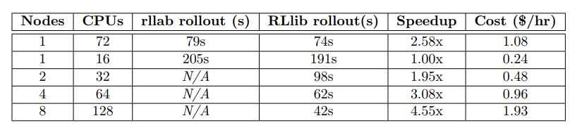
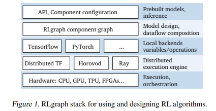
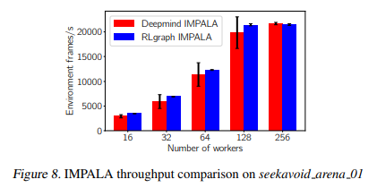

## Ray RLlib Performance

### papers

没有找到直接使用`RLlib`并且公开源码的学术论文，也没有找到相关的评测论文。

事实上在google scholar上能找到的相关论文如下

- 介绍ray或者rllib的原作者论文

- 基于`RLlib`或`RLlab`构建的另一个系统

  ***[Flow: Deep Reinforcement Learning for Control in SUMO](http://kanaad.me/res/sumo.pdf)***

  其中关于`RLlib`与`RLlab`的一个简短评测，很难作为完全可靠的依据。并且RLlab已经不是一个活跃的开发项目了，上一次的更新也是2个月前了

  

- 基于上述***Flow***做的benchmarks

- 针对当前的RL框架的不足构建新的框架

  ***[RLGRAPH: FLEXIBLE COMPUTATION GRAPHS FOR DEEP REINFORCEMENT LEARNING](https://arxiv.org/pdf/1810.09028.pdf)***

  

  


### others

在[rl-experiments](https://github.com/ray-project/rl-experiments)找到了他们自己做的测试，并且与公开的结果进行对比。

一部分是不同的算法比较scores, 一部分是相同的算法也比较scores, 并没有直接比较时间性能的。

比如：

| env           | RLlib Basic DQN | RLlib Dueling DDQN | RLlib Distributional DQN | Hessel et al. DQN | Hessel et al. Rainbow |
| ------------- | --------------- | ------------------ | ------------------------ | ----------------- | --------------------- |
| BeamRider     | 2869            | 1910               | 4447                     | ~2000             | ~13000                |
| Breakout      | 287             | 312                | 410                      | ~150              | ~300                  |
| QBert         | 3921            | 7968               | 15780                    | ~4000             | ~20000                |
| SpaceInvaders | 650             | 1001               | 1025                     | ~500              | ~2000                 |


*mainly introduce the concrete usage of `Ray, Tune, Rllib`*

## Install

1. Install anaconda for virtual environment

2. Install tensorflow for RLlib

   ```bash
   conda create -n tf_env tensorflow
   conda install nb_conda #支持jupyter notebook虚拟环境
   conda install jupyter
   conda activate tf_env
   conda deactivate
   ```

3. Install Ray

   ```bash
   pip install ray
   ```