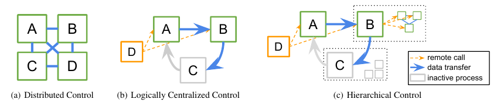

## Reference

[Markov Decision Process](https://en.wikipedia.org/wiki/Markov_decision_process)

[Q Learning](https://en.wikipedia.org/wiki/Q-learning)

[Playing Atari with Deep Reinforcement Learning](https://arxiv.org/abs/1312.5602)

[Trust Region Policy Optimization](https://arxiv.org/abs/1502.05477)

[Proximal Policy Optimization Algorithms](https://arxiv.org/abs/1707.06347)

## Ray的使用

记录`Getting_Started.ipynb`

## [RLlib的使用](https://github.com/ray-project/tutorial/tree/master/rllib_exercises)

记录`RLlib.ipynb`

有一个训练乒乓球的案例，但是电脑训练的时候崩溃了，暂时没法演示。

## RLlib 设计

### 目的

现代的RL算法高度irregular

- 每个task的时长与资源需求
- 交流的模式变化多端
- 计算是有可能嵌套在一起的
- 需要维护和更新很多的数据量

现在的计算架构很多都做不到这一点。

### RL的控制组块

**Logically centralized control for distributed RL**



(c)中

- D: driver program
- A,B: Worker(Active)
- C: Worker(Inacive)
- B方框：nested computation --> sub-workers 由B来指定的子任务

这种框架的优势是

1. 相应的算法更加容易设计（相对于完全分布式的）
2. 子任务的分离增加代码的可重用性
3. 任务之间可以彼此嵌套

### 使用ray来实现原因

1. Ray: Distributed Scheduler --> 天然地适合hierarchical control model. 在ray里面实现嵌套的计算不会出现中心化的任务分配瓶颈
2. Ray: Actor -->hierarchical delegation. 可以创建新进程和任务，也可以调用其他的actor

### 概要

- 实现的内容很复杂，并没有完全弄清楚。有些最近出现的RL算法我还没有了解
- 参考内容RLlib Document & RLlib Paper

综合来说：

1. 其实现依赖于ray的功能的实现


​	即需要上面的`task`与`actor`抽象实现以及`Local Scheduler`与`Global Scheduler`的实现。

1. 需要`tune`库的支持作为深度学习的超参调整。所有的RLlib agent都与Tune API兼容。

### High Level

#### Agent


包含一系列著名的算法和能够帮助计算新东西的扩展原语


在一个比较高的层次上，RLlib提供了一个agent类，内部存有policy, 便于与环境交互。

通过agent接口，policy能够被训练，暂存，或者能够计算下一步动作。

训练一个agent需要指定环境(任何OpenAI gym环境以及用户自定义的)，指定特定的算法( `PPO`, `PG`, `A2C`, `A3C`, `IMPALA`, `ES`, `DDPG`, `DQN`, `APEX`, and `APEX_DDPG`). 也可以改变默认设定(比如算法参数，资源参数等等)

**算法**

- Gradient-based

  - Advantage Actor-Critic(A2C, A3C)

    [[paper\]](https://arxiv.org/abs/1602.01783) [[implementation\]](https://github.com/ray-project/ray/blob/master/python/ray/rllib/agents/a3c/a3c.py) 

  - Deep Deterministic Policy Gradients (DDPG)

    [[paper\]](https://arxiv.org/abs/1509.02971) [[implementation\]](https://github.com/ray-project/ray/blob/master/python/ray/rllib/agents/ddpg/ddpg.py) 

  - Deep Q Networks (DQN, Rainbow)

    [[paper\]](https://arxiv.org/abs/1312.5602) [[implementation\]](https://github.com/ray-project/ray/blob/master/python/ray/rllib/agents/dqn/dqn.py) 

  - Policy Gradients

    [[paper\]](https://papers.nips.cc/paper/1713-policy-gradient-methods-for-reinforcement-learning-with-function-approximation.pdf) [[implementation\]](https://github.com/ray-project/ray/blob/master/python/ray/rllib/agents/pg/pg.py)

  - Proximal Policy Optimization (PPO)

    [[paper\]](https://arxiv.org/abs/1707.06347) [[implementation\]](https://github.com/ray-project/ray/blob/master/python/ray/rllib/agents/ppo/ppo.py) 

- Derivative-free

  - Augmented Random Search (ARS)

    [[paper\]](https://arxiv.org/abs/1803.07055) [[implementation\]](https://github.com/ray-project/ray/blob/master/python/ray/rllib/agents/ars/ars.py) 

  - Evolution Strategies

    [[paper\]](https://arxiv.org/abs/1703.03864) [[implementation\]](https://github.com/ray-project/ray/blob/master/python/ray/rllib/agents/es/es.py) 

### RLlib Abstraction

[RLlib 主要概念](https://ray.readthedocs.io/en/latest/rllib-concepts.html)

#### Policy Graph

##### 概念

Policy graph 类封装了RL 算法的核心数据组成。通常包括

- Policy model: 决定action
- Trajectory postprocessor: 处理路径以获取经验
- Loss function: 右上面给的postprocessed experiences 来改进policy

为了支持多种多样的框架，绝大部分与深度学习框架交互的部分被独立于[PolicyGraph interface](https://github.com/ray-project/ray/blob/master/python/ray/rllib/evaluation/policy_graph.py). 另外，为了简化policy graph的定义，还包含了两个模板[Tensorflow](https://github.com/ray-project/ray/blob/master/python/ray/rllib/evaluation/tf_policy_graph.py) and [PyTorch-specific](https://github.com/ray-project/ray/blob/master/python/ray/rllib/evaluation/torch_policy_graph.py)


上图是不同组件之间的数据流动概念图。

- Environment: 给一个action产生一个observation
- Preprocessor & Filter: 预处理observation
- Model: 神经网络，内部提供的网络包括：vision network(图像), fully connected network, LSTM
- ActionDistribution: 决定下一个动作

##### 具体

用户指定一个policy mode $\pi$, 将当前的observation $o_t$ 和(optional) RNN 隐藏状态$h_t$映射到一个action $a_t$ 以及下一个RNN状态$h_{t+1}$ 也可以是用户定义的值$y_t^i$ 比如说value predictions, TD error
$$
\pi (o_t,h_t) \Rightarrow (a_t,h_{t+1},y_t^1...y_t^N)
$$
大部分算法都会定义一个trajectory postprocessor $\rho$,  目的是转换一系列的$K$元组$X_{t,K}$ ${(o_t,h_t,a_t,h_{t+1},y_t^1...y_t^N,r_t,o_{t+1})}$, 其中，$r_t$为reward, $o_{t+1}$为在采取action之后新的observation.另外，为了支持multi-agent 环境，从其他的$P$个agents的experience batches $X_{t,K}^p$也可以获得
$$
\rho (X_{t,K},X_{t,K}^1...X_{t,K}^P) \Rightarrow X_{post}
$$
Gradient-based算法也会定义一个loss function $L$, 减小它就可以改进policy以及附加的网络
$$
L(\theta;X)\Rightarrow loss
$$
最后，开发者也可以定义一系列的效用函数$u^i$ ,在训练的时候调用，比如返回训练数据$s$更新网络
$$
u^1...u^M(\theta)\Rightarrow (s,\theta_{update})
$$
举例来说

```python
abstract class rllib.PolicyGraph:
	def act(self, obs, h): action, h, y* #policy model
	def postprocess(self, batch, b*): batch #trajectory postprocessor
	def gradients(self, batch): grads #计算梯度
	def get_weights; def set_weights; 
	def u*(self, args*) #效用函数
```

#### Policy Evaluation

##### 概念

给定environment和policy graph, policy evaluation会产生一系列的experiences([batches](https://github.com/ray-project/ray/blob/master/python/ray/rllib/evaluation/sample_batch.py) ). 就是所谓的"Environment interaction loop". 通常来说，这一项很繁重，特别是利用了向量化、RNN或者multi-agent环境。管理所有这一切的是一个类 [PolicyEvaluator](https://github.com/ray-project/ray/blob/master/python/ray/rllib/evaluation/policy_evaluator.py). 

也可以单独使用policy evaluation来生成一系列experience. `ev.sample()` 或者并行地`ev.sample.remote()`

##### 具体

为了收集experience, 提供了`PolicyEvaluator`类，将policy graph和环境包装起来，然后添加一个method `sample()`. Policy evaluator可以作为remote actors被创建，为了并行性，也可以在不同的集群直接复制。

考虑一个具体的案例，使用TensorFlow policy gradient. 可以使用RLlib实现的模板

```python
class PolicyGradient(TFPolicyGraph):
	def __init__(self, obs_space, act_space):
		self.obs, self.advantages = ...
		pi = FullyConnectedNetwork(self.obs)　# 全连接网络处理observation
		dist = rllib.action_dist(act_space, pi) #计算action 分布
		self.act = dist.sample() #采样，得到action
		self.loss = -tf.reduce_mean(
			dist.logp(self.act) * self.advantages)　#计算loss
	def postprocess(self, batch):
		return rllib.compute_advantages(batch)
```

开发者可以创建一系列policy evaluator `ev`，然后调用`ev.sample.remote()`来从环境中收集experience,　可以并行。 

```python
evaluators = [rllib.PolicyEvaluator.remote(
	env=SomeEnv, graph=PolicyGradient)
	for _ in range(10)]
print(ray.get([
	ev.sample.remote() for ev in evaluators]))
```

环境可以是[OpenAI Gym](https://gym.openai.com/)或者用户自定义的或者multi-agent或者batched environments.


#### Policy Optimization

##### 概念

与tensorflow的[gradient-descent optimizer](https://www.tensorflow.org/api_docs/python/tf/train/GradientDescentOptimizer) 来改进一个模型一样,  [policy optimizers](https://github.com/ray-project/ray/tree/master/python/ray/rllib/optimizers)也实现了一系列不同的策略来改进policy graph.

比如[AsyncGradientsOptimizer](https://github.com/ray-project/ray/blob/master/python/ray/rllib/optimizers/async_gradients_optimizer.py)实现了A3C, 在不同的worker上异步地计算梯度。

比如 [SyncSamplesOptimizer](https://github.com/ray-project/ray/blob/master/python/ray/rllib/optimizers/sync_samples_optimizer.py)　并行且同步地收集experiences, 然后中心化地优化模型。


#####　具体

RLlib将算法实现分为两个部分，一个是policy graph(随算法的不同而不同)，一个是policy optimizer(基本是相同的). 

policy optimizer主要做的是：分布式采样，参数更新，管理replay buffers. 为了将计算分布开，optimizer在一系列的policy evaluator复制品上操作。

如下，每个`optimizer.step()`都会运行一些remote tasks来改进model.另外，在每个`step`之间，policy graph的复制品也可以之间访问，比如打印一些东西。

```python
optimizer = rllib.AsyncPolicyOptimizer(
	graph=PolicyGradient, workers=evaluators) #定义在policy graph与evaluators上
while True:
	optimizer.step()　#改进算法
	print(optimizer.foreach_policy(
		lambda p: p.get_train_stats()))
```

实现的内容是典型的梯度下降优化
$$
step(L(\theta),X,\theta) \Rightarrow \theta_{opt}
$$
相应的，RLlib的policy optimizer在local policy graph $G$ 和一系列remote evaluator replicas上面操作。比如
$$
step(G,ev_1...ev_n,\theta) \Rightarrow\theta_{opt}
$$
此处可以调用policy evaluator上面的`sample()`来产生新的simulation数据

这种policy optimizer抽象的优势为有

- 将execution strategy和policy/loss 定义分开，可以让优化策略充分利用硬件调节，而无需修改其他算法
- policy graph类封装起来与深度学习框架交互，让算法设计者避免将分布式系统与数值计算混合
- optimizer可以不断被改进或在不同深度学习框架下重用

优化策略

- **Allreduce**

```python
grads = [ev.grad(ev.sample())
	for ev in evaluators] #取每个evaluator的采样
avg_grad = aggregate(grads) #综合
local_graph.apply(avg_grad)　#更新本地graph
weights = broadcast(
 	local_graph.weights())　#
for ev in evaluators:　#
	ev.set_weights(weights)
```

- **Local Mutil-GPU**

```python
samples = concat([ev.sample()
	for ev in evaluators])
pin_in_local_gpu_memory(samples)
for _ in range(NUM_SGD_EPOCHS):
 	local_g.apply(local_g.grad(samples)
weights = broadcast(local_g.weights())
for ev in evaluators:
 	ev.set_weights(weights)
```

- **Asynchronous**

```python
grads = [ev.grad(ev.sample())
         for ev in evaluators]
for _ in range(NUM_ASYNC_GRADS):
	grad, ev, grads = wait(grads)
	local_graph.apply(grad)
 	ev.set_weights(
  		local_graph.get_weights())
  	grads.append(ev.grad(ev.sample()))
```

- **Sharded Param-server**

```python
grads = [ev.grad(ev.sample())
	for ev in evaluators]
for _ in range(NUM_ASYNC_GRADS):
	grad, ev, grads = wait(grads)
 	for ps, g in split(grad, ps_shards):
 		ps.push(g)
 	ev.set_weights(concat(
 		[ps.pull() for ps in ps_shards])
 	grads.append(ev.grad(ev.sample()))
```

**Compatibility matrix**:

| Algorithm    | Discrete Actions | Continuous Actions | Multi-Agent | Recurrent Policies |
| ------------ | ---------------- | ------------------ | ----------- | ------------------ |
| A2C, A3C     | **Yes**          | **Yes**            | **Yes**     | **Yes**            |
| PPO          | **Yes**          | **Yes**            | **Yes**     | **Yes**            |
| PG           | **Yes**          | **Yes**            | **Yes**     | **Yes**            |
| IMPALA       | **Yes**          | No                 | **Yes**     | **Yes**            |
| DQN, Rainbow | **Yes**          | No                 | **Yes**     | No                 |
| DDPG         | No               | **Yes**            | **Yes**     | No                 |
| APEX-DQN     | **Yes**          | No                 | **Yes**     | No                 |
| APEX-DDPG    | No               | **Yes**            | **Yes**     | No                 |
| ES           | **Yes**          | **Yes**            | No          | No                 |
| ARS          | **Yes**          | **Yes**            | No          | No                 |
