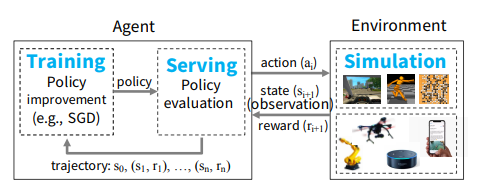
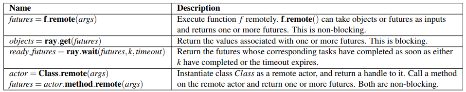
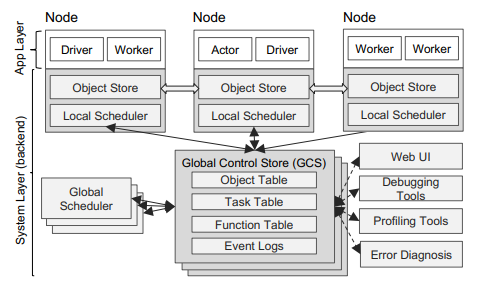
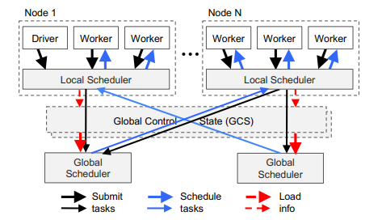
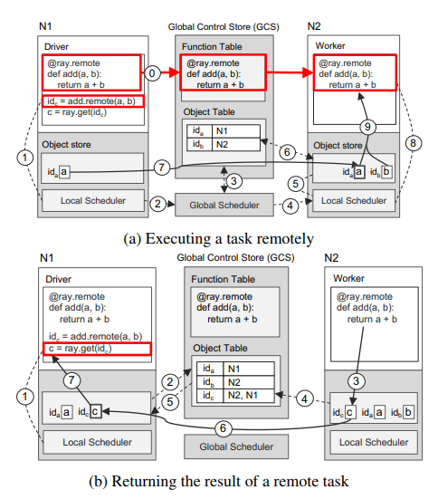

## 总述

ray的出现是为了解决AI应用创建过程中对框架灵活性和高效性的新要求。

为了达到这个要求，Ray采用了分布式的调度器和分布式的可容错的储存去管理系统的控制状态。

## 目的

### RL的出现

构建深度神经网络的复杂性，导致需要专门的框架来减小难度。这部分已经有了很多的系统，比如PyTorch, TensorFlow等等。但是更加广阔的应用需要我们与环境进行交互，而不单单是监督学习。这就需要强化学习。但是针对RL的系统目前达不到要求。

### RL的基本组成

1. **Simulation**

   探索不同的action之下的结果，由此对policy进行评估

2. **training**

   由上面的得到的类似路径的东西来训练，提高policy的能力

3. **serving**

   由policy以及当前的环境状态，判断采取何种action

### 对系统的需求

1. **fine-grained computations**

   比如，action需要在很短的时间内做出，需要同时做大量的simulation

2. **heterogeneity  both in time and in source usage**

   比如一个simulation可能需要几毫秒，也有可能几个小时

   或者traing需要GPU而simulation需要CPU资源等等

3. **dynamic execution **

   这是由于simulation 或者与环境的交互可能会改变未来的状态

### ray的出现

现在存在的系统没有能完全达到上述要求的

## Ray的设计

### 总述

#### 通用性

为了实现通用集群架构，同时满足simulation, traing, serving要求。

1. task-parallel
2. actor-based

#### 性能

将以前中心化的东西分布化

1. task scheduler
2. metadata

以及容错机制

### 模型

#### 编程模型

**task** : stateless

**actor** : stateful. 需要串行执行

#### 计算模型

使用计算图，表达依赖关系

比如数据依赖，串行执行的次序

### 架构

#### 应用层

1.  driver 执行用户程序的进程
2. worker 无状态的进程，执行tasks
3. actor 有状态的进程，依次invoke method

#### 系统层

##### Global Control Store(GCS)

目的是容错性与低延迟。同时也可以将task与task scheduling分离

概括来说，是有GCS的存在，系统的每个部分都可以是无状态的。这样就会简化系统的设计

##### Bottom-Up distributed Scheduler

有两个层次的调度器，global与local，在某个节点上创建的任务，先交给本地的调度器，如果分配不了，比如延迟太大或者资源不够，就会传达给全局的调度器。

这样不仅减小的全局调度器的负载，也减小了工作时延

##### In-Memory Distributed Object Store

同一个节点可能共享内存。

如果不在同一个节点，就会复制到执行的那个节点

#### 实现

已经可以通过pip来安装

大概有4万行代码，72%的C++实现系统层，28%的python代码实现应用层

### 执行流程

