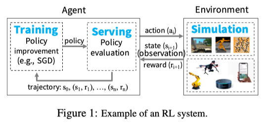
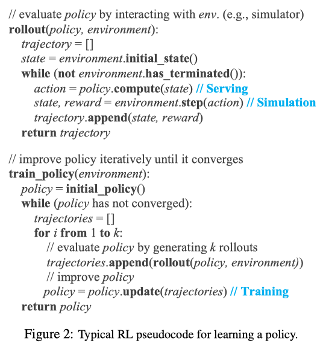
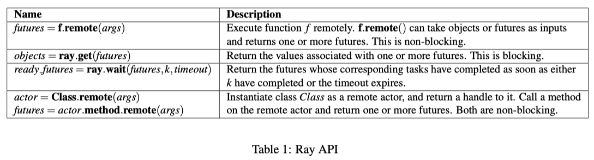
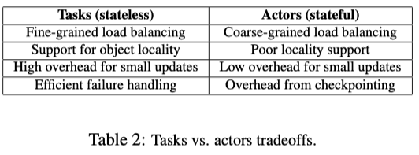
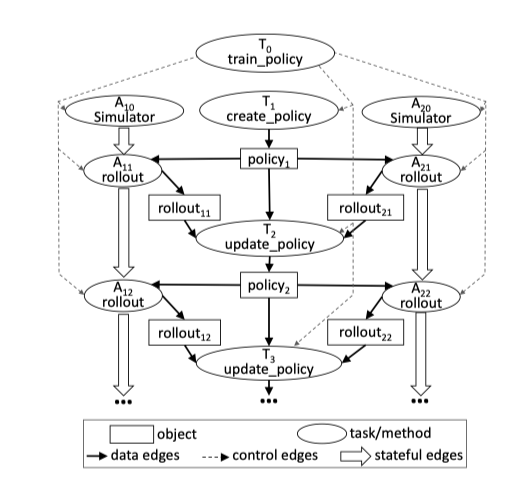
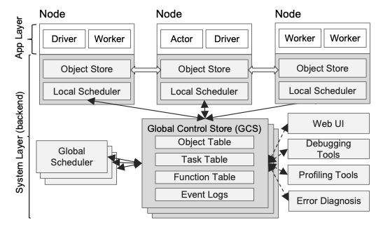
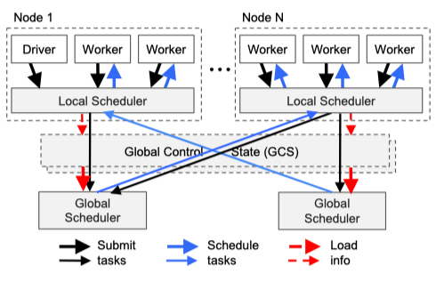

#Ray 论文阅读

**10.26 组会 **

## Introduction

由于当前 AI 领域十分火热，各种针对 DL 框架迭出，而对于 RL ，却没有一个很好的框架，一个 RL 应用需要满足如下需求：

1. RL 依赖模拟去评估策略
2. 需要分布式训练提升策略，即和模拟环境或真实环境互动
3. 在交互式开环和闭环控制场景中提供策略

综上，一个 RL 系统需要满足以下要求：

- 支持细粒度计算
- 支持时间和资源异质性
- 支持动态执行，模拟或交互的结果可以改变后续计算

除此之外，强大的任务处理能力和低延迟也是需求之一。在当前已有的框架中没有能够满足以上全部要求的框架，因此提出了 Ray 框架，其支持对 RL 应用的模拟，训练和服务。

Ray 分为两个组件：(1) 任务调度器 和 (2) 元数据存储器（保存计算的世系信息和数据元素目录），Ray 可以通过世系信息进行对计算节点的重建，提高了容错性。

## Motivation and Requirements

对于常见的 RL 系统，其工作流程及伪代码如下：

对于 RL，training, serving, simulation 三者是密不可分的。对于 Ray，并不是一个从轮子造起的框架，而是将现有的模拟器，深度学习框架进行紧密整合。

## Programming and Computation Model

### Programming Model

Ray 提供了如下 API 以供使用：

其提供了 `remote` 函数，通过 python 装饰器方法可以简单的调用该方法，将你定义的函数或是计算放入分布式系统中运行，具体的运算流程放在后面介绍。

Ray 还将 Tasks 和 Actors 在顶层进行了整合，其两者的区别如下：

### Computation Model

Ray 采用了动态计算图的机制，即数据或输入一准备好，remote 函数则会立即自动执行。对于计算图中采用了如下边和节点：

- 节点：
  - 数据对象 (data objects)
  - remote 函数调用 (tasks)
  - Actor method
- 边：
  - 数据边 (data edge)：当任务返回数据或者数据作为任务输入时连接
  - 控制边 (control edge)：任务调用任务是连接
  - 状态边 (stateful edge)：标示方法执行的先后顺序

如下即为上例的计算流程图：

## Architecture

Ray 整体架构：

### Application Layer

应用层分为三种进程：

- Driver：执行用户程序
- Worker：执行任务的无状态进程，可以自动启动，通过系统层分配任务
- Actor：有状态进程，只能通过其方法进行调用

### System Layer

系统层有三个主要组件构成：

1. 全局控制存储 (Clobal Control Stroe)
2. 自下而上分布式调度器 (Bottom-Up Distributed Scheduler)
3. 分布式对象存储 (In-Memory Distributed Object Store)

#### Global Control Store (GCS)

GCS 是一个基于 Redis 构建的中心化存储，其中存储了 tasks 的描述、计算图、世系信息、数据对象的位置以及控制调度事件等等。由于是中心化存储，其具有低延迟的好处，并且其将 task scheduling 和 task dispatch 进行了分离。除此之外，通过分片以及对分片进行拷贝实现容错，对于系统中其他部分出错，也可以通过 GCS 中的世系信息进行重建，提高了容错能力。

#### Bottom-Up Distributed Scheduler

对于任务调度器，Ray 设置了如下两类：

1. pre-node local scheduler
2. global scheduler

对于每个节点，其都有一个本地任务调度器，对于到来的任务，首先由本地调度器进行判断所需资源与时间是否满足，如果满足的话则直接在本地进行运行。如果本地调度器无法调度，则将该任务上推到全局调度器，在全局范围进行调度，寻找有资源，延迟低的节点进行任务的分配。

如上的调度方式具有良好的扩展性，运行速度快，并且调度延迟低。在上推任务时，还会将负载信息传输给 GCS，以便全局调度器对资源的查询。具体流程图如下：

#### In-Memory Distributed Object Store

Ray 的分布式数据存储是通过共享内存实现的，对于本地的不同进程，通过共享内存实现共用数据的访问，可以大大减少复制时间与内存空间。对于远程主机，在其分配到任务后，仅当全部相关数据存储到本地内存中后才会进行任务的执行，这样可以避免热数据的瓶颈以及可以加快任务的执行。当然数据的传输也需要时间，除此之外，Ray 也不支持分布式数据存储。

如此对于执行一个远程任务以及取回返回值的流程如下：

## References

[1] Philipp Moritz, Robert Nishihara. Ray: A Distributed Framework for Emerging AI Applications

[2\] [Ray 论文解读](http://whatbeg.com/2018/03/15/ray-paper.html)

[3\] [Ray - 面向增强学习场景的分布式计算框架](https://blog.csdn.net/colorant/article/details/80417412)