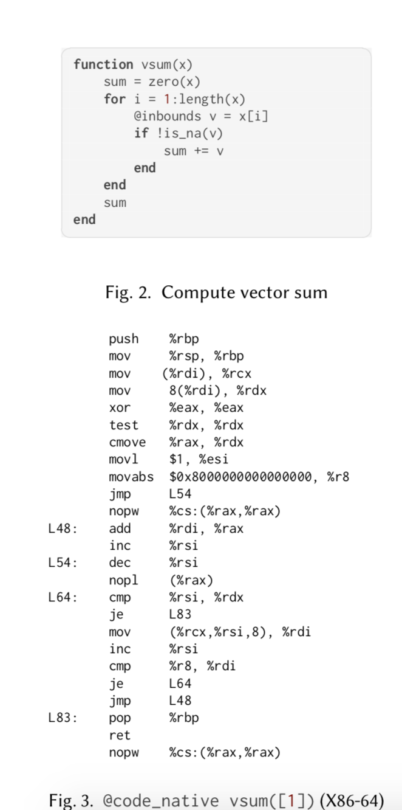
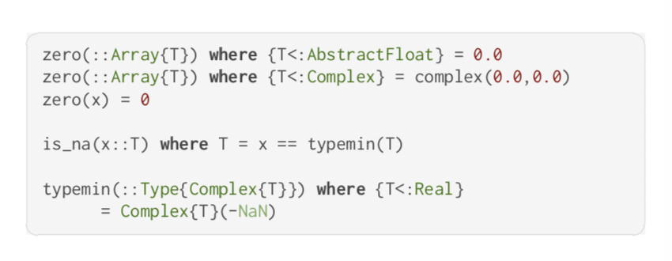
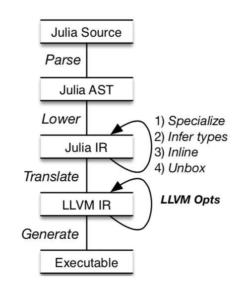
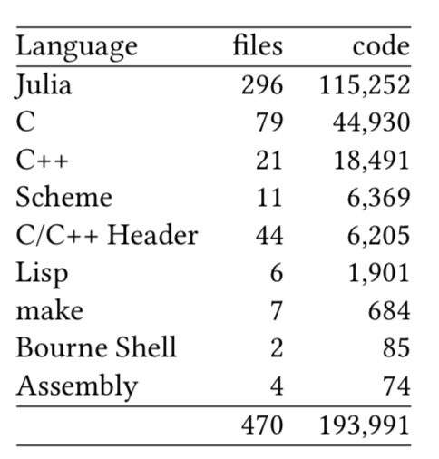

# Julia: Dynamism and Performance Reconciled by Design

## 1. INTRODUCTION
### Julia语言的目的
Julia旨在减小生产力语言(productivity languages)(Python, MATLAB, R) 和性能语言(performance languages)(C, C++, Fortran)之间的差距，一方面它提供了一些高效率的特点例如动态类型、垃圾回收机制、多重分派的特性，另一方面它使用JIT(just-in-time)编译器并且允许程序员控制内存中数据结构的布局。
### 如此高效的原因
Julia的高效性取决于几个方面的协调配合，分别是语言设计（Language design）、实现的技术（implementation techniques）以及编程的方法（programming style）：
+ Language design:正如我们之前所见的，Julia吸收了其他语言的很多特点，比如动态类型、可选的类型注释（optional type annotations）、反射、垃圾回收机制、多重分派、抽象类型等。
+ Language implementation:Julia的编译器相比其他动态语言的编译器来说要简单很多，它并没有为Julia的高效性作出很大的贡献，但它也做了一些优化，主要有三点
    + 方法内联(method inlining which devirtualizes multi-dispatched calls and inline the call target)

    + 对象拆箱以避免堆分配

    + 方法特化(method specialization where code is special-cased to its actual argument types)

      语言设计和实现技术上的协调配合就体现在这三种优化中，每次调用一个函数作为参数时，如果它具有之前未观察到的具体类型的组合，就会触发特化(specialization)，一个数据流分析算法使用参数的类型来接近专用函数中所有变量的类型，这样就能实现拆箱和内联，然后特化的函数被加入到一个函数分派表中，当之后继续调用这个函数且参数类型相同时，就可以复用之前生成的代码。
+ Programming style:为了写出高效的代码，编写代码的人也需要掌握一定的技巧来配合Julia的编译器，比如加入类型注释来为编译器提供更多的信息，也比如编写类型稳定(type stable)的方法，在Julia文档中类型稳定的解释是:输出的类型是可以由输入类型预测出来。特别地，这表示输出的类型不能因输入的值的变化而变化。下面这段代码不是类型稳定的:
```
function unstable(flag::Bool)
    if flag
        return 1
    else
        return 1.0
    end
end
```
这段代码视参数的值的不同而返回一个 Int 或是 Float64。 因为 Julia 无法在编译时预测 函数返回值类型， 任何使用这个函数的计算都得考虑这两种可能的返回类型， 这样很难生成快速的机器码。在论文中对类型稳定是这样定义的:A method is type stable if, when it is specialized to a set of concrete types, data-flow analysis can assign concrete types to all variables in the function。

## 2. JULIA IN ACTION
### 首先是举一个在编译方面的例子
下图展示了一个对任意类型向量求和的函数，使用@code_native(vsum([1]))得到x86的机器代码，值得注意的是生成的机器代码不包含对象的分配或方法调用，也不调用任何语言运行时组件，这个机器码类似c编译器产生的代码。


再次说明类型稳定的重要性，Julia编译器可以使用类型信息来做到一定的优化，对于表达式来说，对于给定类型的上下文中，它总返回相同类型的值，那么就说表达式是类型稳定的。上面的函数vsum(x)始终返回一个和x的元素类型一样的值，比如调用vsum([1])，该方法返回Int64，因为它的参数类型是Array{Int64,1}，当出现这样的调用Julia编译器对种方法的特定类型进行特化，特化提供足够的信息去确定用于计算的值的类型。因此不需要装箱所有调用就可以虚化(devirtualized)和内联。




## 3. EVALUATING RELATIVE PERFORMANCE
为了测试语言的相对性能，选择了10个在编程语言基准游戏(PLBG)中的小程序，它们可以在C、JavaScript和Python中实现。作者从开发人员用Julia写的PLBG程序开始，基准测试采用惯用风格编写，使用与c基准测试相同的算法，代码基本上是无类型的，类型注释只出现在结构字段上。使用PLBG的方式，通过删除注释和复制空白字符来测量程序的大小，最后所有基准测试的大小为：
+ Julia：6KB
+ JavaScript：7.4KB
+ Python：8.3KB
+ C：14.2KB

下面的图片展示了以C程序运行时间为标准，其他语言编写的程序的运行时间，各语言使用的版本为
+ Julia v0.6.2
+ CPython 3.5.3
+ V8/Node.js v8.11.1
+ GCC 6.3.0 -O2
+ 运行环境为Debian 9.4 on a Intel i7-950 at 3.07GHz with 10GB of RAM
所有测试都是单线程的，不使用任何其他优化参数(optimization flags)


测试的结果表明Julia的性能超过Python和JavaScript，Julia运行时间平均是C的两倍，速度慢的原因可能是因为内存操作，因为和其他动态类型语言一样，Julia依赖一个垃圾收集机制去管理内存，它禁止C语言的那种显示(explicit)内存管理，另外它在堆内分配结构体，栈分配只在有限的情况下进行，此外Julia也不允许使用指针。

有两个程序是运行得比较慢的，分别是knucleotide and mandelbrot，其中的knucleotide是因为使用了大量的抽象类型结构，在mandelbrot程序中，C代码被手动矢量化一次可以计算八个像素的分形图像，然而Julia的实现是一次计算一个像素。

目前缺少benchmarks去评测Julia在大规模程序中的性能，有些库发布了比较结果，JuMP是一种用于数学优化的库。JuMP将许多问题类型（e.g. linear, integer linear, convex, and nonlinear）转换为求解的标准形式。如果和其他语言的类似实现比较，以C++为基准，JuMP耗时是C++的两倍，而MARTLAB在4倍到18倍之间，Python是70倍左右。可见Julia的潜力。


## 4. THE JULIA PROGRAMMING LANGUAGE（类型、多重派发、元编程、反射）
（这里有个没有看懂的特性）
Epochs. The Julia implementation keeps a world age (or epoch) counter. The epoch is a monotonically increasing value that can be associated to each method de nition. When a method is compiled, it is assigned a minimum world age, set to the current epoch, and a maximum world age, set to typemax(Int). By default, a method is visible only if the current epoch is superior to its minimum world age. This prevents method rede nitions (through eval for instance) from a ecting the scope of currently invoked methods. However, when a method is rede ned, the maximum world age of all its callers is capped at the current epoch. This in turn triggers a lazy recompilation of the callers at their next invocation. As a consequence, a method always invokes its callee with its latest version de ned at the compile time of the caller. When the absolute latest (independent of compile epoch) version of a function is needed, programmers can use Base.invokelatest(fun,args) to bypass this mechanism; however, these calls cannot be statically optimized by the compiler.


## 5. IMPLEMENTING JULIA
Julia在运行时生成有效的本机代码，Julia编译器是一个优化的JIT编译器，编译过程分为三个阶段，首先源代码被解析为AST，然后将这些AST变成一种中间表示(IR)，这被用于Julia语言层面上的优化，优化完成后代码被转化为LLVM IR以及机器码。如下图所示：

 除了预编译的标准库之外，正在运行的程序执行的所有Julia代码都是按需编译的。 Julia的编译器是一个没有编译层基于JIT的相对简单的编译器， 一旦编译了方法，它们就不会改变，因为Julia不支持使用栈替换进行去优化。 
 下图是Julia v0.6.2版的实现概览（The standard library, Core, Base and a few other mod-
 ules）
 
 其中middle-end用C和Julia实现，C++用于生成LLVM IR，Scheme和Lisp则用于front end。

 ### Method Specialization
 Julia的编译策略基于运行时的类型信息，每次使用心得参数类型类型时，而且特化使得可以虚化(devirtualization)，虚化将方法调度替换为特化方法的直接调用，这能减少调度开销并实现内联。因为编译过程相当慢，所以结果会被缓存，因此只有第一次使用新的类型去调用方法时才会编译方法。这意味着只有使用有限数量的类型去调用函数这个过程才会收敛，如果使用许多不同类型的参数去调用函数，就会反复产生特化成本。而且Julia没办法彻底解决这个问题（这种函数很容易编写），为了缓解这个问题Julia也做了允许每组类型包含一个*Vararg*组件，该组件被视为具有Any类型。
 ### Type Inference
 ### Method Inlining
 在Julia中，因为特化和类型推断的特点使得方法内联能以一种十分有效的方式进行。因为如果方法主体是类型稳定的，那么内部的调用就可以内联，另一方面内联又可以帮助类型推断因为它提供了额外的上下文信息。例如内联可以避免被作为死代码消除的分支，这反过来就能传播更精确的类型信息。当然内联会产生一定的内存开销，而且它会需要额外的编译时间，因此使用启发式的方法来决定在哪些地方限制内联。
 ### Object Unboxing
 因为Julia是动态类型语言，所以一个变量可以有多种类型，因此在通常情况下，被分配在堆上的值会有一个标记来指定它的类型。拆箱允许直接操作值，这源于Julia的设计，因为具体类型是明确的，所以具体类型会指定值的大小和布局。此外Julia没有null值，因为如果有的话就需要为原始值添加额外标记。因此像integer和float之类的值可以以未装箱(unboxed)的方式存储。重复装箱和拆箱可能是昂贵的，并且有时候即使存在类型信息也无法实现拆箱，特别是对于递归数据结构，因此和内联一样，使用启发式的方法来决定何时来进行优化。

## 6. JULIA IN PRACTICE
（Typeful Programming、Multiple Dispatch、Specializations、Impact on Performance）


## 7. 名词参考
+ 内联：调用某个函数实际上将程序执行顺序转移到该函数所存放在内存中某个地址，将函数的程序内容执行完后，再返回到转去执行该函数前的地方。 这种转移操作要求在转去前要保护现场并记忆执行的地址，转回后先要恢复现场，并按原来保存地址继续执行。也就是通常说的压栈和出栈。 因此，函数调用要有一定的时间和空间方面的开销。那么对于那些函数体代码不是很大，又频繁调用的函数来说，这个时间和空间的消耗会很大。那怎么解决这个性能消耗问题呢，这个时候需要引入内联函数了。内联函数就是在程序编译时，编译器将程序中出现的内联函数的调用表达式用内联函数的函数体来直接进行替换。显然，这样就不会产生转去转回的问题，但是由于在编译时将函数体中的代码被替代到程序中，因此会增加目标程序代码量，进而增加空间开销，而在时间代销上不象函数调用时那么大，可见它是以目标代码的增加为代价来换取时间的节省

+ 装箱和拆箱：装箱就是自动将基本数据类型转换为包装器类型；拆箱就是自动将包装器类型转换为基本数据类型。之所以要将基本类型数据打包成为对象，原因很简单，是因为对象可以携带更多的数据。 
一个java的例子：
```
Integer data1 = new Integer(10);  // 手动装箱   
Integer data1 = 10；  // 自动装箱
```
+ 方法特化：简单理解，就是为具有泛型类型的函数指定具体的类型，可以参考C++的模版特化

+ 虚化：
