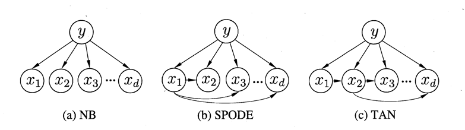
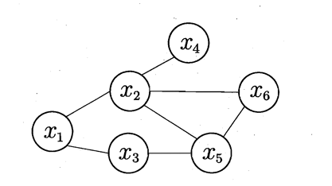

# 概率编程的设计探究

主要内容：

- 概率图模型
- 概率图在几个编程模型中的实现
- 概率编程模型的层次抽象
- 几个尚未解决的问题

---

## 概率图模型

要素：
- 关于数据的属性
- 属性之间的关系
    - 有向图：贝叶斯网
    - 无向图：马尔科夫网
    - 
    - 
- 采样、推断算法
    - MCMC
    - Gibbs

---

## 概率图模型的构建

---

### PyMc

```python
import pymc3 as pm
import numpy as np
with pm.Model() as model:
    mu = pm.Normal('mu', mu=0, sd=1)
    obs = pm.Normal('obs', mu=mu, sd=1, observed=np.random.randn(100))
```

---

Sample Method

```python
with pm.Model() as model:
    mu = pm.Normal('mu', mu=0, sd=1)
    obs = pm.Normal('obs', mu=mu, sd=1, observed=np.random.randn(100))

    trace = pm.sample(1000, tune=500)
```

---

Inference

```python
with pm.Model() as model:
    mu = pm.Normal('mu', mu=0, sd=1)
    sd = pm.HalfNormal('sd', sd=1)
    obs = pm.Normal('obs', mu=mu, sd=sd, observed=np.random.randn(100))

    approx = pm.fit()
```

---

Edward:

```python
from edward.models import Normal

X = tf.placeholder(tf.float32, [N, D])
w = Normal(loc=tf.zeros(D), scale=tf.ones(D))
b = Normal(loc=tf.zeros(1), scale=tf.ones(1))
y = Normal(loc=ed.dot(X, w) + b, scale=tf.ones(N))
```

---

```python
qw = Normal(loc=tf.get_variable("qw/loc", [D]),
            scale=tf.nn.softplus(tf.get_variable("qw/scale", [D])))
qb = Normal(loc=tf.get_variable("qb/loc", [1]),
            scale=tf.nn.softplus(tf.get_variable("qb/scale", [1])))
```

---

```python
inference = ed.KLqp({w: qw, b: qb}, data={X: X_train, y: y_train})
inference.run(n_samples=5, n_iter=250)
```

---

## 概率编程中需要什么

- 模拟随机变量
    - 各种分布的随机变量
    - 观察
- 采样、推断算法
    - MCMC
    - Bayesian Inference
- 模型中的属性关系构建和表示
    - 贝叶斯网络
    - 马尔科夫网
- API
    - 建立随机变量
    - 建立关系
    - 修改随机变量属性
    - 拟合、推断

## 问题

概率编程在机器学习模型构建中与其他模块之间的关系？