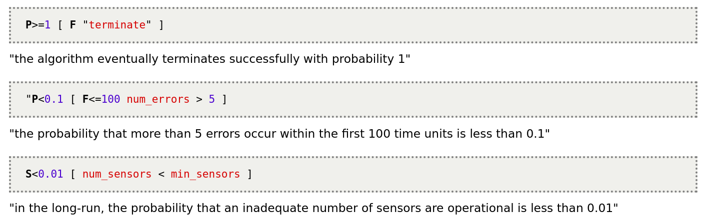

## PRISM 的功能、优势和局限性

PRISM 是一个“模型检查”的工具，用来建立、研究和评估随机模型的行为。目前可以提供构建的模型有：

- DTMC(离散时间马尔科夫链)
- CTMC(连续时间马尔科夫链)
- MDP(马科尔科夫决策)
- PA (概率自动机)
- PTA (随机时间自动机)

### 便于建模的语言

PRISM 提供四种基本模型 dtmc, ctmc, mdp 和 pta 。在模型首部声明。

**变量和模型的声明**：

模型声明在

> module name ... endmodule 

结构中。而变量声明格式为：

> x : \[0..2\] init 0; 

**命令**：

> [] x=0 -> 0.8:(x'=0) + 0.2:(x'=1); 

左边框中的内容可以用来控制状态转换的同步，x=0是捕捉条件 -> 右边的内容是

概率1：(转移1) + 概率2：(转移2) ....

这样声明了状态的转移概率和方式。

**关于PTA**：

```
pta

module M

    s : [0..2] init 0;
    x : clock;

    invariant
        (s=0 => x<=2) &
        (s=2 => x<=3)
    endinvariant

    [send] s=0 & x>=1 -> 0.9:(s'=1)&(x'=0) + 0.1:(s'=2)&(x'=0);
    [retry] s=2 & x>=2 -> 0.95:(s'=1) + 0.05:(s'=2)&(x'=0);

endmodule
```

pta 中有一个独特的 clock 类型变量，在每个“周期”clock会增加1，同时clock也可以当作普通的变量来使用。

### 模型的分析和检查

- PRISM支持对模型行为的观察和评估，例如：马尔科夫链n步到达某个状态的概率，模型中一个随机变量的均值和方差
- PRISM可以通过"costs and rewards"的方法为模型的各个行为增加“权重”，例如：从状态A到状态B的转移可以给我带来权重为50的损失，而状态B到状态B可以为我提供100的收入。
- PRISM对模型的检查
    - 需要检查内容的specification
    - 
    - 相当于检查器的配置文件.

### 优势和局限性

优势：可以很清楚详细地观察模型的行为，进行模型的评估检查。

局限性：只能对有限的几个模型进行静态建模、评估检查。

对于PRISM推断功能不足的情况，我认为PRISM并没有被设计用来做这方面的工作，PRISM的优势在于能方便地建模，对随机模型的行为进行细致地观察，
同时还可以评估模型的质量（例如一个随机状态机n次状态转移中进入非法状态次数的期望值）同时在评估的过程中还可以修改各种检查参数。
在模型检查过程中的可视化界面和逐步跟踪的实现非常好用，我觉得可以考虑将类似的功能引入其他概率编程工具中。