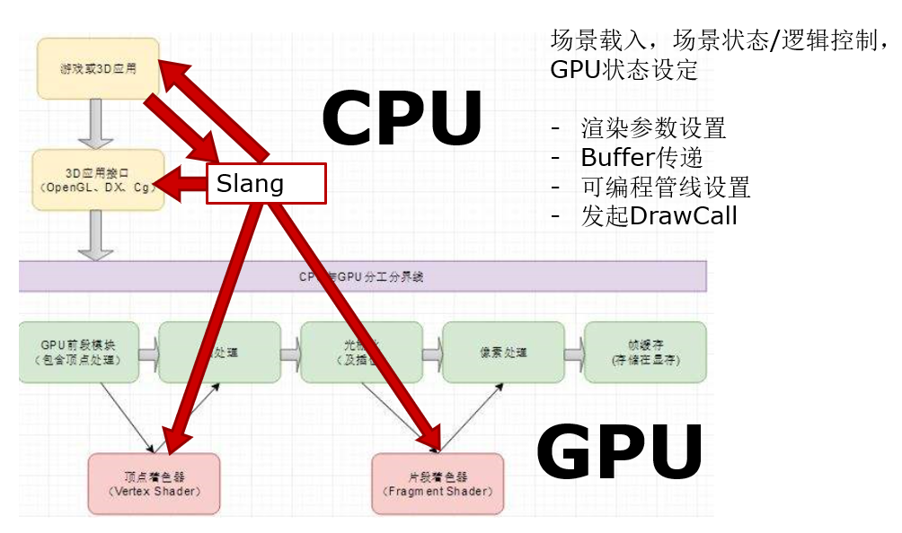
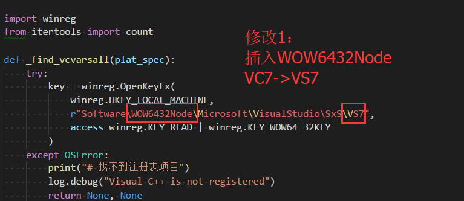
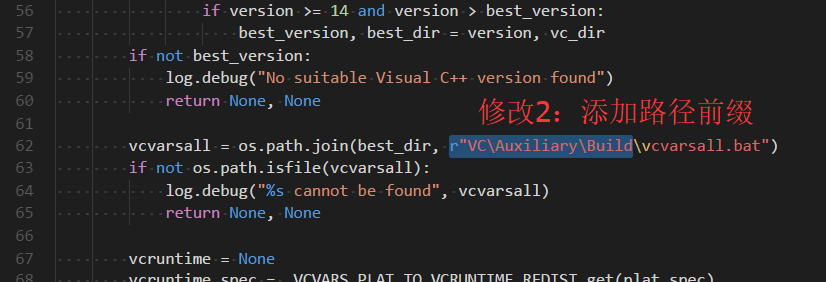

# 第二周记录

## 进展：理思路，了解HLSL，看论文了解传统渲染的问题
1. 概括课题目的
2. 3D渲染概述，Slang在3D渲染中的位置
3. 传统方案如何编写可扩展Shader系统，以及有关problem

## 课题目的，3D渲染概述，传统方案做法 @ PPT
ppt中值得注意的地方：
> Slang在3D渲染中的位置

ppt中值得跳过的地方：

> 3D渲染概述 HLSL速览

    这个，我自己对HLSL不熟，作为HLSL基本语法笔记。

## question与解答

> ppt中打问号的地方是自己有问题的地方，绝大多数得到了助教肯定的回答。  
> 有问题处也有修改补充。

## issue与解决
- 为了使用Flacor/Slang，卸载VS2015，安装VS2017后，算法课作业跑不了了。  原因在于，我用python写的代码，用cython编译了其中一个文件来加速，cython调用msvc来编译。  
    但是，cython调用msvc的方式不适合vs2017，注册表和编译器路径都变了。  
    而且，找不到的批处理文件 vcvarsall.bat 被移动到`C:\Program Files (x86)\Microsoft Visual Studio\2017\Community\VC\Auxiliary`

    所以，需要修改python库中distutils下边的`_msvccompiler.py`文件，修改两处内容如下：

    第一处：  
    

    第二处：  
    

- latex还没跑起来的问题

    零碎时间弄。

## 下步工作计划

- 看论文了解Slang如何解决传统做法的问题
- 尝试开始看使用Slang的范例代码

打算在对Slang语法清楚以后，再看Slang本身的源码。
