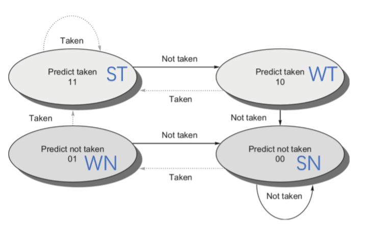
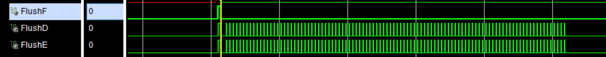
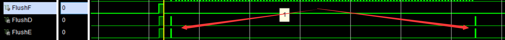
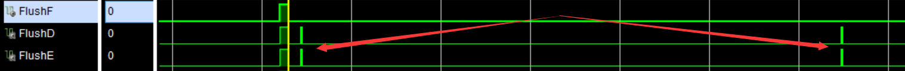
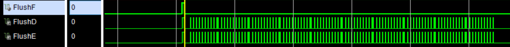
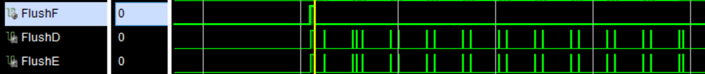
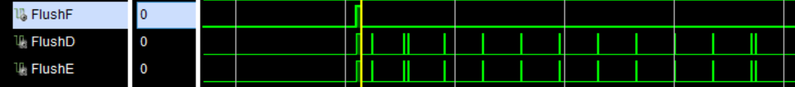

# 分支预测报告

## 1. 设计

对于BTB实现一个Buffer，当Branch 实际Taken的时候，不管预测如何，都直接更新buffer, 当Branch没有taken但是预测taken时，设置extra bit为上次未taken.

对于BHT在BTB的基础上实现一个状态转移图，实现2bits的转移。转移图按照如下



## 2. 预测表

| BTB  | BHT  | Real | NPC_Pred | flush | NPC_Real | BTB update |
| ---- | ---- | ---- | -------- | ----- | -------- | ---------- |
| Y    | Y    | Y    | BUF      | N     | BrNPC    | N          |
| Y    | Y    | N    | BUF      | Y     | PC_EX+4  | Y          |
| Y    | N    | Y    | PC_IF+4  | Y     | BrNPC    | Y          |
| Y    | N    | N    | PC_IF+4  | N     | PC_IF+4  | N          |
| N    | Y    | Y    | PC_IF+4  | Y     | BrNPC    | Y          |
| N    | Y    | N    | PC_IF+4  | N     | PC_IF+4  | N          |
| N    | N    | Y    | PC_IF+4  | Y     | BrNPC    | Y          |
| N    | N    | N    | PC_IF+4  | N     | PC_IF+4  | N          |

## 3. 波形图

### 3.1. 寄存器

未使用分支预测以及使用分支预测，寄存器的值都应该是如下内容。

#### i. btb.S

`x6=5051`


#### ii. bht.S

`x6=451`


下面为几个tx寄存器对应的寄存器编号

```
t0: x5
t1: x6
t2: x7
t3: x28
t4: x29
t5: x30
t6: x31
```

### 3.2 Flush

具体的周期以及分支数见下面的**总结表**。下面的flush表示**分支预测失败**的情况。

#### i. btb.S

##### a. No Prediction



##### b. BTB



##### c. BHT



#### ii. bht.S

##### a. No Prediction



##### b. BTB



##### **c. BHT**




## 4. 统计结果

**1. 分支收益和分支代价** 

预测错误代价 2 clocks

预测正确，无flush无stall

**2. 统计未使用分支预测和使用分支预测的总周期数及差值** 

下表为总周期数

| cycles        | btb.S | bht.S |
| ------------- | ----- | ----- |
| no prediction | 510   | 536   |
| btb.sv        | 314   | 382   |
| bht.sv        | 314   | 364   |

**3. 统计分支指令数目、动态分支预测正确次数和错误次数** 

下表为预测错误而flush的数目，其中btb.S总分支为101, 而bht.S的总分支数为110

| flush count   | btb.S(101) | bht.S(110) |
| ------------- | ---------- | ---------- |
| no prediction | 100        | 99         |
| btb.sv        | 2          | 22         |
| bht.sv        | 2          | 13         |

**4. 对比不同策略并分析以上几点的关系**

不使用动态分支时，如果一直假定not taken, 预测失败的次数很大，而采用动态预测的方式中，bht在存在循环某次not taken但是下一次taken情形下，预测成功的概率更大。

**5. 计算整体CPI和加速比**

btb.S总指令数为307, bht.S总指令数为335.

表项内容为，CPI/加速比

| CPI/speedup   | btb.S(307) | bht.S(335) |
| ------------- | ---------- | ---------- |
| no prediction | 1.66/1.00  | 1.60/100   |
| btb.sv        | 1.02/1.63  | 1.14/1.40  |
| bht.sv        | 1.02/1.63  | 1.09/1.47  |

