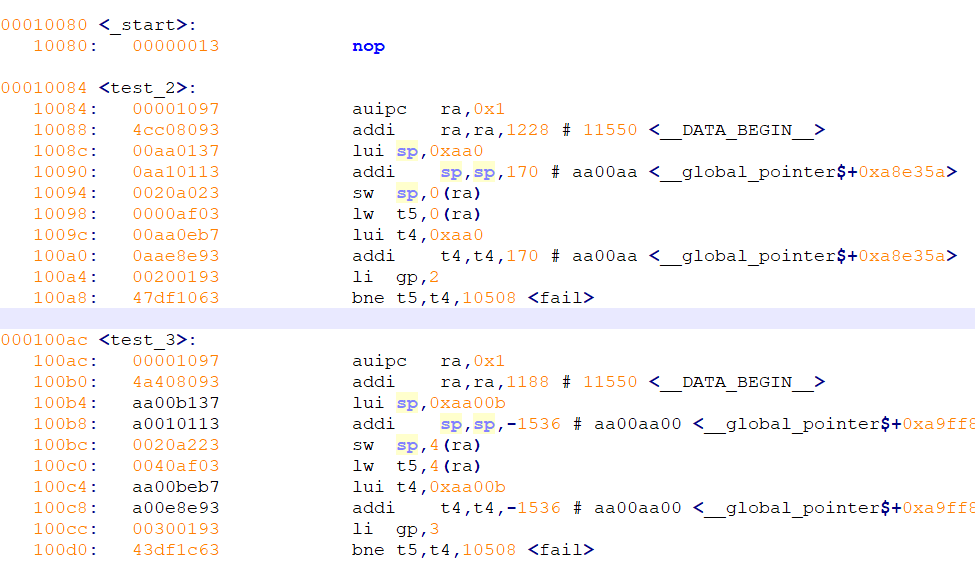
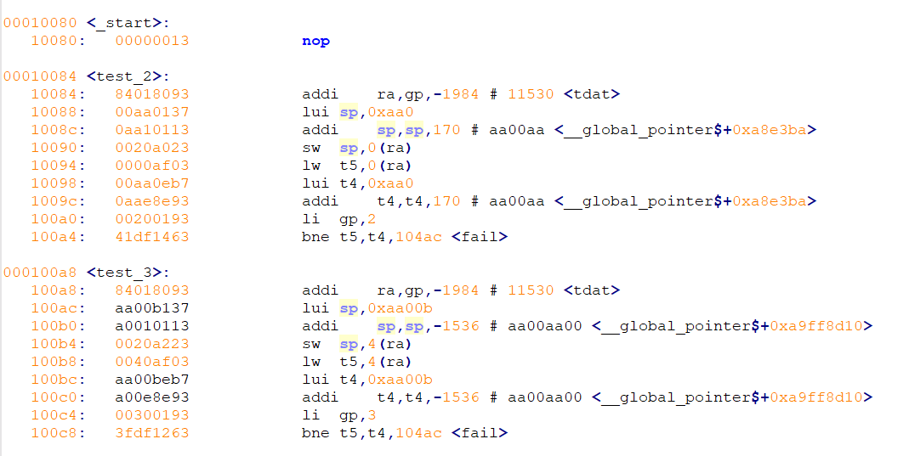
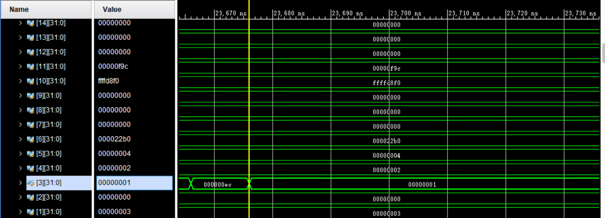
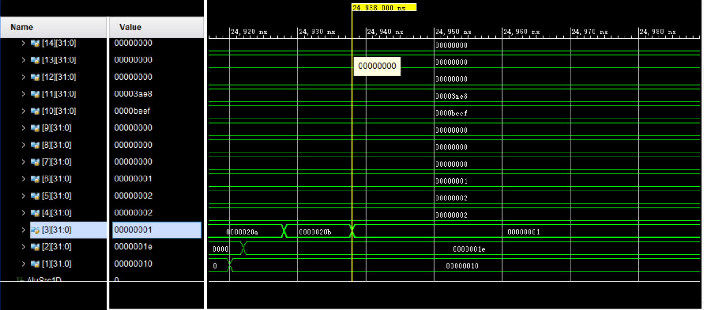
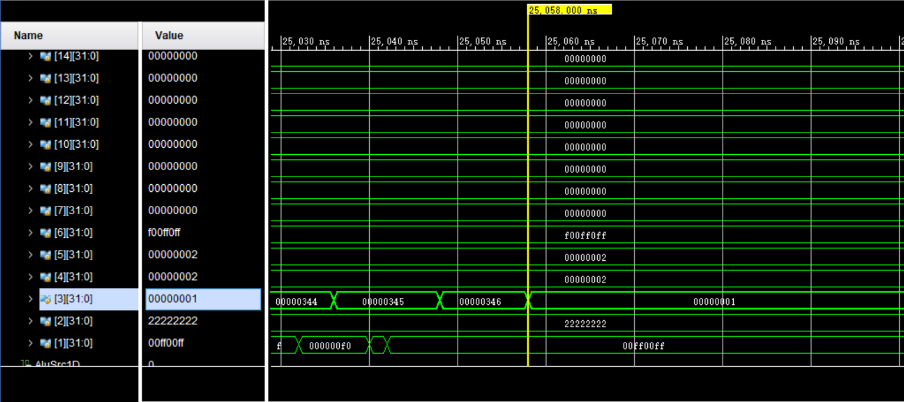

# RISC-V 仿真实验

## 1. 实验目标

通过全部的testAll测试

## 2. 实验环境和工具

```
OS: win10
CPU: Intel(R) Core(TM) i5-8250U CPU @ 1.60GHz 1.80GHz
Vivado: 2017.4
editor: notepad++
```

## 3. 实验内容和过程

本实验在CPU设计报告完成前已经通过全部测试，所以具体的设计在Lab1的报告中。

检查本实验时一次性跑完三个`testAll`，所以**没有分阶段的代码设计**。

本报告记录具体遇到的问题以及仿真的结果。

## 4. RISCV编译工具链配置和使用

### 安装

首先我们要从 git 仓库将工具链的源码 clone 下来，请注意不要漏掉 –rescursive 的选项，否则不会完整地获取所需的子模块代码。

```bash
git clone --recursive https://github.com/riscv/riscv-gnu-toolchain
```

### 配置

```bash
git clone --recursive https://github.com/riscv/riscv-gnu-toolchain
```

make

```bash
./configure --prefix=~/lx/riscv --with-arch=rv32i --with-abi=ilp32
make
```

### 使用

``` bash
export PATH=~/lx/riscv/bin:$PATH
```

然后就可以使用make指令编译为riscv了

另外还有一个反汇编指令在下面会使用到

```bash
riscv32-unknown-elf-objdump -d zj.om > zj_right.asm 
```

## 5. 遇到的问题

由于在设计CPU时候经过详细的思考，几乎对每一个细节都有考虑，所以在一点点测试单条指令时候遇到的bug也仅仅是某个字符写错，比如将`IType`写成了`JType`. 其他这样设计性的问题几乎没有。

花费我很长时间解决的一个问题，最终解释是编译链的问题，这个问题的解决也要感谢夏昊珺助教的帮助。下面详述。

### 编译链问题

#### 现象

除了一个地方，1,2,3testAll都能通过，就是sw.S这部分，单独测试sw.S可以，但是放在3testAll.S就不行。

sw.S单独可以通过，但如果在sw.S的内存部分前面加上一段新的内存，就会同样出错。
在仿真里原因是mem addr invalid, 然后发现在二进制代码里，对la的编译上，本来是auipc和addi, 但是出错的时候，就只有addi了，二进制为84018093, 这样imm[11:0]拓展地址就会是ffff_f840, invalid.

#### 分析

对编译成的东西进行反汇编

正常情况

la被编译成`auipc+addi`



异常情况

编译成`addi ra,gp`.....但是gp就是x3....用做其他作用了



#### 解决

最终在debug一天之后，发现时编译链出了问题，然后在助教给了编译工具之后顺利通过测试。[la=auipc+addi bug](<https://github.com/riscv/riscv-isa-manual/issues/144>)

## 6. 仿真结果

**1testAll**

Reg3 最终变成1



**2testAll **

Reg3 最终变成1



**3testAll**

Reg3 最终变成1



## 7. 实验总结

由于设计时经过仔细的思考，所以并没有遇到几个设计性的bug，而且大部分都是写错了字符。

遇到的最大的bug就是上面写的编译链的问题，耗费了我一天一夜去找问题，一开始还没有觉得是编译出了问题，一直看波形图，然后修改汇编码。最后在助教给出相应的已经编译好的文件运行成功后才完全相信是编译问题。

除了这个坑，花费最长时间是在设计上，每一个细节都需要仔细思考，这样就不会遇到多少设计的Bug就能大大节省时间。

至于写代码的时间，其实很少。

## 8. 实验意见

本实验与组成原理中的流水线CPU设计**有重复**，在做完那个实验后做这个会简单很多。

## 9. Ref

[RISC-V GNU 工具链：安装与使用](<http://blog.evensgn.com/riscv-gnu-toolchain/>)