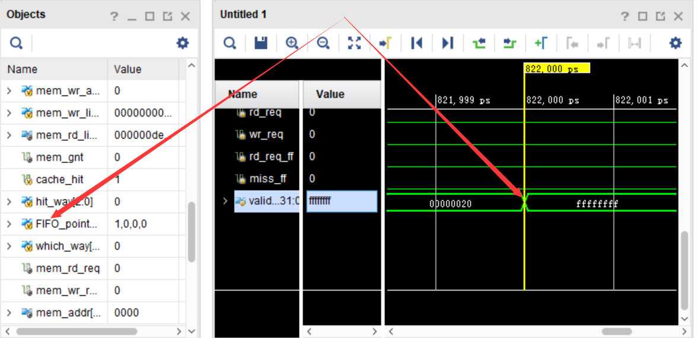
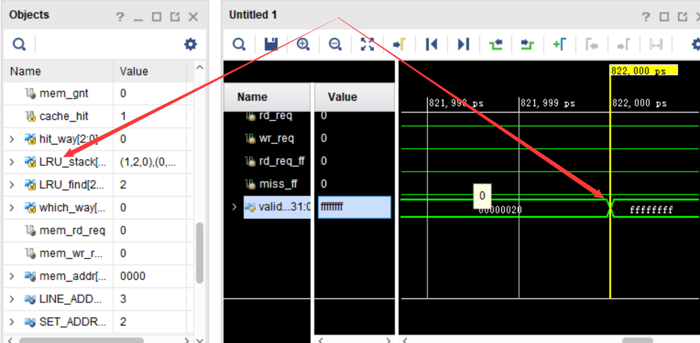

# Cache 实验报告

## Cache 设计简介

### FIFO

对每一个组都指定一个指针

```verilog
reg [WAY_CNT-1:0]FIFO_pointer[SET_SIZE];//对于FIFO,每一组都有一个写入的目标,依次递增
```

每次MISS的时候就将指针加一(mod n)，相当于下一个位置，首次进入时为位置0，以后是1,2,3.... 然后又是0, 如此表示First  In First Out.

### LRU

对每组都有一个队列

```verilog
reg [WAY_CNT-1:0]LRU_stack[SET_SIZE][WAY_CNT];//对于LRU,保存丿个栈,每次access丿个，就把它换到尾部，每次写入都是头部
```

值为某一路，初始化时为0,1,2,3..., 表示替换的优先级，每次替换都是第一个元素，然后更新的那一路会被转移到队尾。

### 切换

使用条件编译进行切换

```verilog
`define FIFO_LRU 
```

define时候表示LRU, 没有define表示FIFO

### 正确性

生成N=32结果如下

#### FIFO




#### LRU




## 参数搜索优化

**能够修改的参数**有：

1. 问题规模：为了便于比较，统一问题规模不修改。即为原始的值
2. 问题类型：快排与矩阵乘法，这两个可以分成两类分别进行
3. 替换策略：FIFO/LRU, 在某个特定的问题下，分别使用这两个进行测试
4. Cache size: 与LINE_ADDR_LEN和SET_ADDR_LEN都相关
5. WAY_CNT: 组相联度

综上所述，核心需要搜索的空间为Cache size(LINE_ADDR_LEN & SET_ADDR_LEN)和WAY_CNT.

**观测的量**有：

1. 资源占用：使用综合后的报告
2. 性能：使用时钟周期数，但是实际上什么时候完成并不能明确知道，所以使用(Hit/Miss)比较好，下面会使用命中率作为性能的度量Hit/(Hit+Miss)

LINE_ADDR_LEN=1,2,3,4

SET_ADDR_LEN=1,2,3,4

WAY_CNT=1,2,3,4,8


以下简写

L: LINE_ADDR_LEN

S: SET_ADDR_LEN

W: WAY_CNT

E: Estimation

A: Available

U: Utilization

### 快排

#### FIFO

首先是L的搜索

| (L,S,W) | Hit,Miss | LUT(E,U)   | FF(E,U)     |
| ------- | -------- | ---------- | ----------- |
| 4,3,3   | 139e,13  | 5525,69.06 | 14240,89.00 |
| 3,3,3   | 1336,4b  | 3521,44.01 | 7331,45.82  |
| 2,3,3   | 12b9,f8  | 2090,26.12 | 3876,24.23  |
| 1,3,3   | 10a9,308 | 1105,13.81 | 2141,13.38  |

对比后取L=3, 然后搜索S

| (L,S,W) | Hit,Miss | LUT(E,U)     | FF(E,U)       |
| ------- | -------- | ------------ | ------------- |
| 3,5,3   | 138b,26  | 9,378,117.23 | 26,280,164.25 |
| 3,4,3   | 138b,26  | 5368,67.10   | 13643,85.27   |
| 3,3,3   | 1336,4b  | 3521,44.01   | 7331,45.82    |
| 3,2,3   | 1330,81  | 2679,33.49   | 4167,26.04    |
| 3,1,3   | 12ca,e7  | 1451,18.14   | 2585,16.16    |

对比后取S=4, 然后搜索W

| (L,S,W) | Hit,Miss | LUT(E,U)   | FF(E,U)     |
| ------- | -------- | ---------- | ----------- |
| 3,4,5   | 138b,26  | 2059,25.74 | 5225,32.66  |
| 3,4,4   | 138b,26  | 2004,25.05 | 5225,32.66  |
| 3,4,3   | 138b,26  | 5368,67.10 | 13643,85.27 |
| 3,4,2   | 1382,2f  | 3772,47.15 | 9434,58.96  |
| 3,4,1   | 12fa,b7  | 1955,24.44 | 5225,32.66  |

取W=2

最终结果在考虑到性能与资源消耗之后，取(L,S,W)=(3,4,2)

#### LRU

首先是L的搜索

| (L,S,W) | Hit,Miss | LUT(E,U)   | FF(E,U)     |
| ------- | -------- | ---------- | ----------- |
| 4,3,3   | 139e,13  | 5523,69.04 | 14240,89.00 |
| 3,3,3   | 1371,40  | 3568,44.60 | 7327,45.79  |
| 2,3,3   | 12d5,dc  | 2121,26.51 | 3878,24.24  |

对比后取L=3, 然后搜索S    

| (L,S,W) | Hit,Miss | LUT(E,U)   | FF(E,U)     |
| ------- | -------- | ---------- | ----------- |
| 3,4,3   | 138b,26  | 5345,66.81 | 13643,85.27 |
| 3,3,3   | 1371,40  | 3568,44.60 | 7327,45.79  |
| 3,2,3   | 133c,75  | 2679,33.49 | 4167,26.04  |

对比后取S=3, 然后搜索W

| (L,S,W) | Hit,Miss | LUT(E,U)   | FF(E,U)    |
| ------- | -------- | ---------- | ---------- |
| 3,3,6   | 138b,26  | 1241,15.53 | 3117,19.48 |
| 3,3,5   | 138b,26  | 1242,15.53 | 3117,19.48 |
| 3,3,4   | 1383,2e  | 1280,16.00 | 3117,19.48 |
| 3,3,3   | 1371,40  | 3568,44.60 | 7327,45.79 |

取W=5

最终结果在考虑到性能与资源消耗之后，取(L,S,W)=(3,3,5)

### 矩阵乘法

#### FIFO

首先是L的搜索

| (L,S,W) | Hit,Miss | LUT(E,U)      | FF(E,U)       |
| ------- | -------- | ------------- | ------------- |
| 5,3,3   | 20e8,18  | 10,922,136.53 | 28,066,175.41 |
| 4,3,3   | 1d32,3ce | 5518,68.98    | 14238,88.99   |
| 3,3,3   | ee0,1220 | 3520,44.00    | 7330,45.81    |

对比后取L=4, 然后搜索S  

| (L,S,W) | Hit,Miss | LUT(E,U)     | FF(E,U)       |
| ------- | -------- | ------------ | ------------- |
| 4,4,3   | 20d0,30  | 9,872,123.40 | 26,697,166.86 |
| 4,3,3   | 1d32,3ce | 5518,68.98   | 14238,88.99   |

对比后取S=3, 然后搜索W

| (L,S,W) | Hit,Miss | LUT(E,U)   | FF(E,U)     |
| ------- | -------- | ---------- | ----------- |
| 4,3,5   | 20c2,3e  | 2241,28.01 | 5932,37.08  |
| 4,3,4   | 20c0,40  | 2205,27.56 | 5932,37.08  |
| 4,3,3   | 1d32,3ce | 5518,68.98 | 14238,88.99 |

取W=4

最终结果在考虑到性能与资源消耗之后，取(L,S,W)=(4,3,4)

#### LRU

首先是L的搜索

| (L,S,W) | Hit,Miss | LUT(E,U)    | FF(E,U)     |
| ------- | -------- | ----------- | ----------- |
| 5,3,3   | 20e8,18  | 10885136.06 | 28066175.41 |
| 4,3,3   | 1de3,31d | 5516,68.95  | 14238,88.99 |
| 3,3,3   | ef0,1210 | 3567,44.59  | 7326,45.79  |

对比后取L=4, 然后搜索S   

| (L,S,W) | Hit,Miss | LUT(E,U)    | FF(E,U)       |
| ------- | -------- | ----------- | ------------- |
| 4,4,3   | 20e8,18  | 10885136.06 | 28,066,175.41 |
| 4,3,3   | 1de3,31d | 5516,68.95  | 14238,88.99   |
| 4,2,3   | 1110,3fc | 5014,63.68  | 8007,50.04    |

对比后取S=3, 然后搜索W

| (L,S,W) | Hit,Miss | LUT(E,U)     | FF(E,U)       |
| ------- | -------- | ------------ | ------------- |
| 4,3,5   | 20d0,30  | 8,641,108.01 | 22,567,141.04 |
| 4,3,4   | 20d0,30  | 2210,27.63   | 5932,37.08    |
| 4,3,3   | 1de3,31d | 5516,68.95   | 14238,88.99   |

取W=4

最终结果在考虑到性能与资源消耗之后，取(L,S,W)=(4,3,4)

## 结论


参数：cache size、组相连度、替换策略(LRU/FIFO)

权衡：性能（时钟周期数. miss/hit ?）和电路面积（综合报告） for each program (快排/矩阵乘法)

仿真：cpu_tb.v

综合：WBSegReg.v


修改Cache的参数，体会**cache size、组相连度、替换策略**针对**不同程序**的**优化效果**，以及策略改变带来的**电路面积**的变化。

针对不同程序，**权衡性能和电路面积**给出一个**较优的cache参数和策略**。

“性能”参数使用运行仿真时的时钟周期数量进行评估

“资源占用”参数使用vivado给出的综合报告进行评估


不能仅仅进行理论分析，实验报告中需要给出实验结果（例如仿真波形的截图、vivado综合报告等）。

