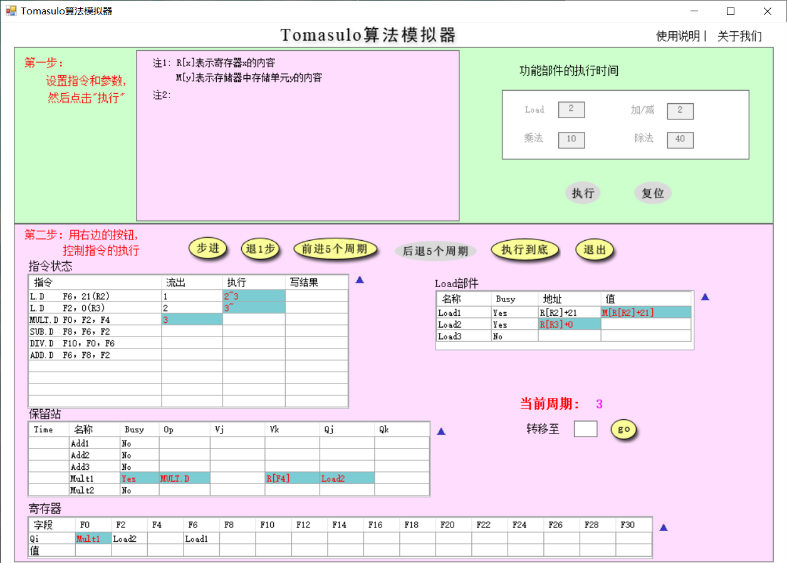
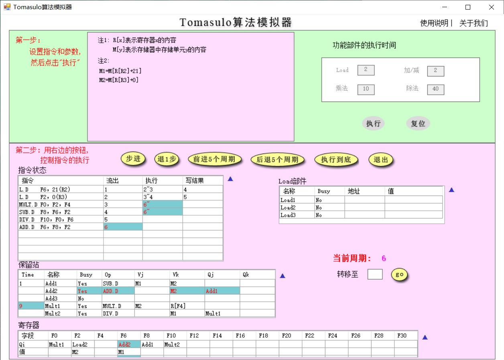
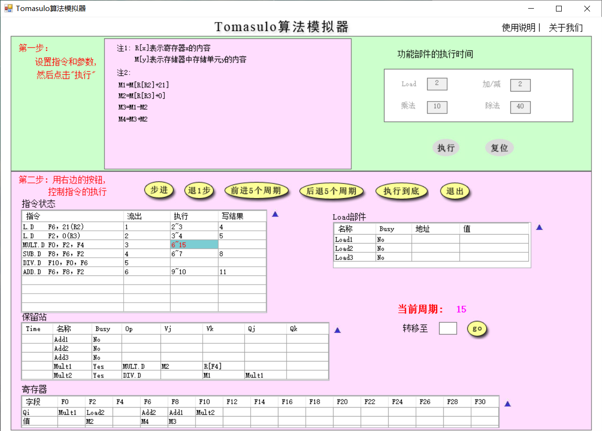
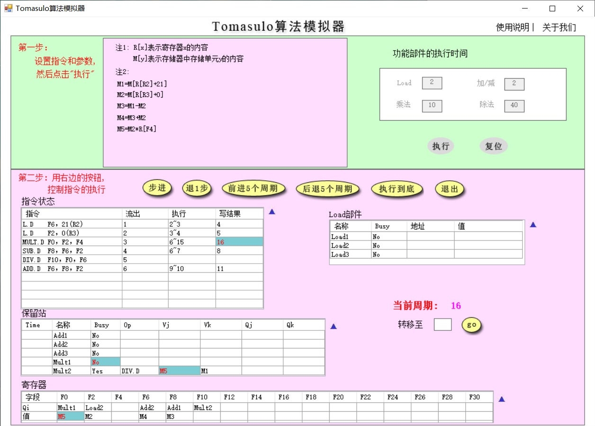
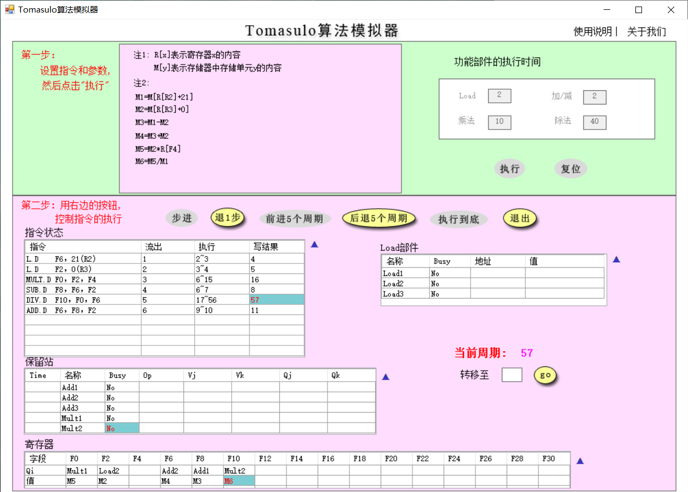
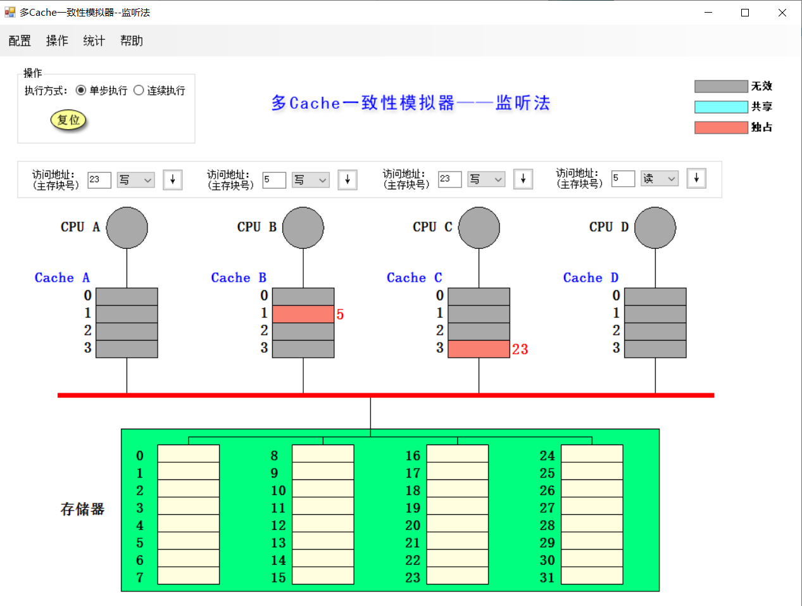
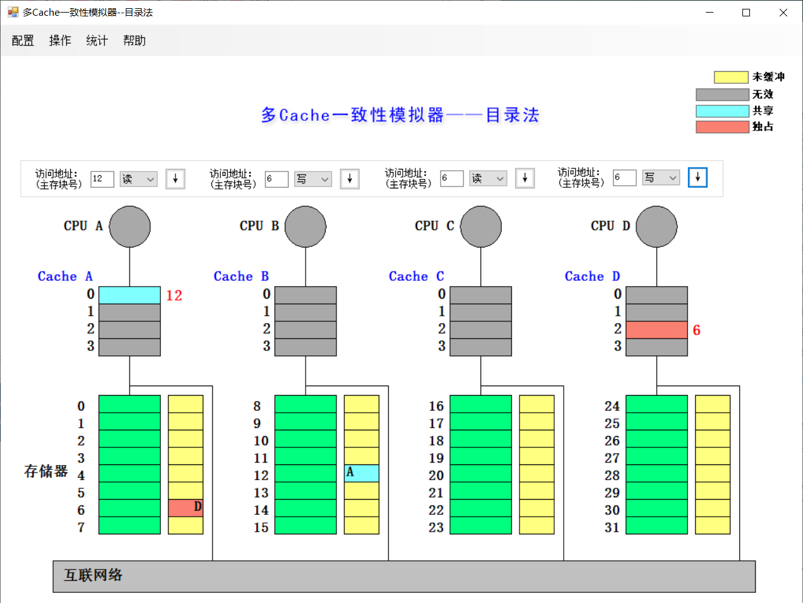

# Lab5 Tomasulo和cache一致性

#### 一、Tomasulo算法模拟器

使用模拟器进行以下指令流的执行并对模拟器截图、回答问题

L.D  F6, 21（R2）

L.D  F2, 0（R3）

MUL.D    F0, F2, F4

SUB.D     F8, F6, F2

DIV.D      F10, F0, F6

ADD.D    F6, F8, F2

假设浮点功能部件的延迟时间：加减法2个周期，乘法10个周期，load/store2个周期，除法40个周期。

1. 分别截图（当前周期2和当前周期3），请简要说明load部件做了什么改动

   **周期2**

   

   **周期3**

   

   **load部件做的改动**

   load1执行完毕，得到结果，保存在缓冲区还没有在总线上广播。

   load2开始执行，得到存储器地址。

2. 请截图（MUL.D刚开始 **执行** 时系统状态），并说明该周期相比上一周期整个系统发生了哪些改动（指令状态、保留站、寄存器和Load部件）

   

   指令状态: MULT.D与SUB.D开始执行; ADD.D流出;

   保留站: Add2由于ADD.D的流出改成Busy=Yes, Op=ADD.D, 但是Vj未知，由Qj=Add1确定，Vk=M2

   寄存器: F6将会作为Add2的目的寄存器

   Load部件: 没有变化，由于Load指令已经执行完毕，且结果已写

3. 简要说明是什么相关导致MUL.D流出后没有立即执行

   与L.D关于F2的RAW相关

4. 请分别截图（15周期和16周期的系统状态），并分析系统发生了哪些变化

   **15周期**

   

   **16周期**

   

   **系统发生的变化**

   指令状态: MULT.D指令执行完毕，写结果(广播)

   保留站: Mult1的Busy变成No; Mult2的Vj值得到(M5)

   寄存器: F0寄存器的值得到为M5

   Load部件: 没有变化，由于Load指令已经执行完毕，且结果已写

5. 回答所有指令刚刚执行完毕时是第多少周期，同时请截图（最后一条指令写CBD时认为指令流执行结束）

   57

   

 

#### 二、多cache一致性算法-监听法

1.       利用模拟器进行下述操作，并填写下表

| 所进行的访问 | 是否发生了替换？ | 是否发生了写回？ | 监听协议进行的操作与块状态改变 |
| ---------------- | -------------------- | -------------------- | ---------------------------------- |
| CPU   A 读第5块  | N | N | 向总线发读不命中，从mem读取，共享 |
| CPU   B 读第5块  | N | N | 向总线发读不命中，从mem读取，共享 |
| CPU   C 读第5块  | N | N | 向总线发读不命中，从mem读取，共享 |
| CPU   B 写第5块  | N | N | 向总线发作废，其他5均无效，B的5为独占 |
| CPU   D 读第5块  | N | Y(B的5) | 向总线发读不命中，B的5写回，变成共享，D从mem中读取 |
| CPU   B 写第21块 | Y(B的5换成21) | N | 向总线发写不命中，从mem读21， 独占 |
| CPU   A 写第23块 | N | N | 向总线发写不命中，从mem读23，独占 |
| CPU   C 写第23块 | N | Y(A的23) | 向总线发写不命中，A的23写回，且失效，读入到C,写后为独占 |
| CPU   B 读第29块 | Y(B的21换成23) | N | B写回21, 向总线发读不命中, 从mem读29, |
| CPU   B 写第5块  | Y(B的23换成5) | N | 向总线发写不命中, 从mem读5,其他的5均失效 |

2. 请截图，展示执行完以上操作后整个cache系统的状态。

   

 

#### 三、多cache一致性算法-目录法

1.       利用模拟器进行下述操作，并填写下表

| 所进行的访问 | 监听协议进行的操作与块状态改变 |
| ---------------- | ---------------------------------- |
| CPU   A 读第6块  | 读不命中，从本地mem A读取，A目录共享(6,A) |
| CPU   B读第6块   | 读不命中，从mem A读取, A目录共享(6,AB) |
| CPU   D 读第6块  | 读不命中，从mem A读取, A目录共享(6,ABD) |
| CPU   B 写第6块  | 写命中，从A目录获知ABD共享，作废AB cache 6, A目录独占(6,B), B cache 独占6 |
| CPU   C 读第6块  | 读不命中，从A目录获知在cache B, 改成共享，读到C, A目录共享(6,BC) |
| CPU   D写第20块  | 写不命中，从C中取，C目录改为独占(20,B) |
| CPU   A写第20块 | 写不命中，从C目录获知B独占，取并作废，C目录改为独占(20,A) |
| CPU  D写第6块    | 写不命中，从A目录获知BC共享，作废6(BC), 读并独占，A目录改成独占(6,D) |
| CPU  A 读第12块  | 读不命中，写回并修改共享集(A,20), 读不命中(A,20). 读取 |

2. 请截图，展示执行完以上操作后整个cache系统的状态。

   

#### 四、综合问答

1. 目录法和监听法分别是集中式和基于总线，两者优劣是什么？（言之有理即可）

   |        | 优势               | 劣势                   |
   | ------ | ------------------ | ---------------------- |
   | 目录法 | 可以减少总线的使用 | 实现复杂               |
   | 监听法 | 实现方便           | 集中式资源形成性能瓶颈 |

1. Tomasulo算法相比Score Board算法有什么异同？（简要回答两点：1.分别解决了什么相关，2.分别是分布式还是集中式）（参考第五版教材）

   |      | Tomasulo           | Scoreboard   |
   | ---- | ------------------ | ------------ |
   | WAR  | 用寄存器重命名避免 | stall 来避免 |
   | WAW  | 用寄存器重命名避免 | stall 来避免 |
   |      | 分布式             | 集中式       |

2. Tomasulo算法是如何解决结构、RAW、WAR和WAW相关的？（参考第五版教材）

   a) 结构相关: 有结构冲突时不发射

   b) RAW : 指令队列FIFO, CDB广播数据, 仅在操作数可用时才执行指令

   c) WAR: 用保留站重命名寄存器来避免

   d) WAW: 用保留站重命名寄存器来避免
