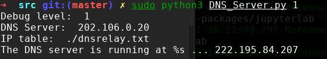
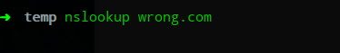
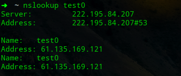
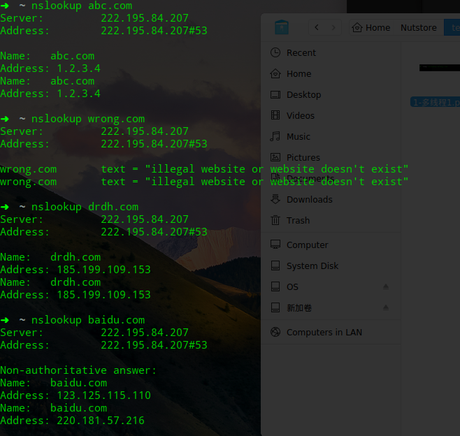
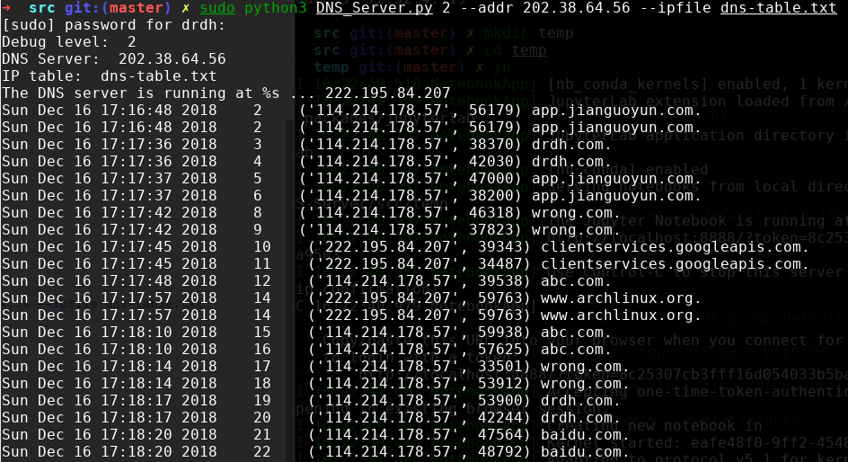
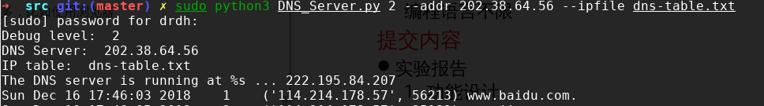
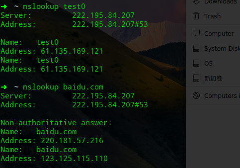
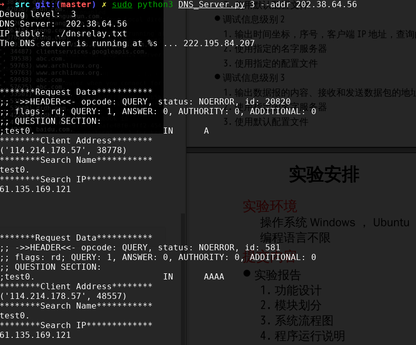
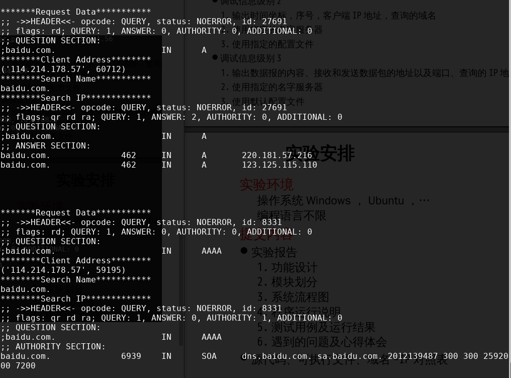

# 1. 功能设计

实验的内容如下

> 设 计一个D NS服 务器程序，读入“ 域 名- IP地 址” 对 照表，当客户端查询域 名对应的I P
> 地 址时，用域名检索该对照表， 要求实现三种 检 索结果：
>
> - 不 良网站（I P地 址为0 . 0. 0. 0） 拦截功能
>
>   检 索结果I P地 址为0 . 0. 0. 0， 则向客户端返回“ 域 名不存在” 的 报错消息
>
> - 服 务器功能
>   检 索结 果为普通I P地 址，则向客户返回这个地 址
> 
> - 中 继功能：
>   对 照表中 未 检测到该 域名，则向因特网D NS服 务器发出查询，并将结果返给客 户端

同时需要设计几个调试信息的等级

> - 调 试信息级别1
>
>   1.输 出查询的域名及其对应的I P地 址
>   2 .使 用默认名字服务器
>   3 .使 用默认配置文件
>
> - 调 试信息级别2
>
>   1.输 出时间坐标，序号，客户端I P地 址，查询的域名
>   2.使 用指定的名字服务器
>   3.使 用指定的配置文件
>
> - 调 试信息级别3
>
>   1.输 出数据报的内容、接收和发送数据包的地址以及端口、查询的I P地 址及其域名
>   2.使 用指定的名字服务器
>   3.使 用默认配置文件

功能的设计使用文档给出的即可。

# 2. 模块划分

其核心在于服务器的功能和DNS的解析。

为了支持多个客户端的功能，使用的服务器为`socketserver.ThreadingUDPServer`

为了便于解析DNS数据，使用的库为`dnslib`

充分利用库的情况下，模块的划分为：

- 根据参数判断调试级别。并且设定：

  - 外界的DNS服务器IP地址
  - 内部的IP文件

- DNS请求处理

  需要判断是否在内部IP文件中找到，如果找到，就构建DNS回答，如果找不到就向外部的DNS服务器请求，然后再回答。

# 3. 系统流程图

```flow
st=>start: Start
op=>operation: Initialize: Debug Level, Remote DNS Server,Local IP table
request=>inputoutput: Request from Client
cond=>condition: In local DNS table ?

remote_request=>operation: Requet to Remote DNS Server
remote_print=>inputoutput: Print message according to Debug Level
remote_response=>operation: Response to Client

is_illegal=>condition: IP == "0.0.0.0" ?
form_illegal=>operation: Form an illegal Response Data
form_legal=>operation: Form a legal Response Data
local_print=>inputoutput: Print message according to Debug Level
local_response=>operation: Response to Client

handle_over=>operation: Handled one Request and need to move on   

st->op->request->cond
cond(yes)->is_illegal
cond(no)->remote_request->remote_print->remote_response->handle_over
is_illegal(no)->form_legal->local_print
is_illegal(yes)->form_illegal->local_print
local_print->local_response->handle_over
handle_over->request
```

# 4. 程序运行说明

使用原本在`/etc/resolv.conf`文件内的外部DNS服务器作为默认的，速度会比较快。

# 5. 测试用例及运行结果

## 5.1. 测试环境

为了模拟真实的环境，使用两台电脑。（以下实验在一台电脑上仍然可以顺利测试）

- Server

  - `Arch Linux`

  - `Python 3.7.0`

  - 需要使用的包均可以通过`sudo pip3 install xxx`来安装

- Client 

  `Deepin 15.8 unstable`

## 5.2. 基本使用

### 5.2.1 准备文件

- 在server机上

  首先需要准备的ip地址文件(包括`dnsrelay.txt`, `dns-table.txt`)格式如下

  ```
  1.2.3.4 abc.com
  0.0.0.0 wrong.com
  185.199.109.153 drdh.com
  ```

### 5.2.2. 获取IP并修改

- 在server机上

  `ip link`或者`ip addr show`查看本机的ip地址`114.214.176.57`每次不一样

  编辑`/etc/resolv.conf`使DNS服务器为上面的地址

  编辑源码的ip字段，即最前面的`localIP="xxx.xxx.xxx.xxx"`部分

- 在client机上

  使用`create_ap`创建热点`sudo create_ap wlp9s0 enp0s20f0u3 Arch archwifi`在另一个电脑上连接，(这一条不是必须的)

  然后修改DNS服务器(`/etc/resolv.conf`)为上面的ip地址，就可以正常查询了

## 5.3. 测试结果

### 调试级别1

命令为

```bash
sudo python3 DNS_Server.py 1
```



测试多线程如下：

开两个终端。依次输入如下的命令





可以发现第一个还没有输出成功，第二个就已经完成。

### 调试级别2

```bash
sudo python3 DNS_Server.py 2 --addr 202.38.64.56 --ipfile dns-table.txt
```

依次查询如下



可以注意到每个分别代表了自定义的域名与ip, 定义为0.0.0.0的地址的返回错误信息，转发到外部DNS Server的内容。

在server的输出如下



注意到各类调试信息的正常输出。

测试打开浏览器如下

使用浏览器打开百度界面



界面可以正常打开。

### 调试级别3

命令如下

```bash
sudo python3 DNS_Server.py 3 --addr 202.38.64.56
```

这一条主要看信息的输出。

测试命令如下



分别对应的输出信息如下






# 6. 遇到的问题及心得体会

遇到的主要问题是需要了解DNS包的各个字段的含义，并依次来构建Response和Request.

心得体会是这实验挺有意思的。

# Reference

[DNS 介绍与粗实现](http://www.cnblogs.com/dongkuo/p/6714071.html); [相关代码](https://github.com/dongkuo/dns-server)

[DNS 使用dnslib案例](http://www.isnowfy.com/introduction-to-gevent/); [相关代码](https://github.com/isnowfy/dns)

[dnslib 介绍](https://bitbucket.org/paulc/dnslib/)


