## Chapter 1 Computer Networks and the Internet

- 
- 


- Internet Service Provider(ISP)
- 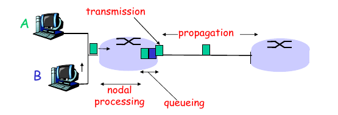

## Chapter 2 Application Layer

### 2.1 Principles of Network Applications

#### 2.1.1 Network Application Architectures

- 客户-服务器架构(Client-server)
- 对等架构(Peer-to-peer ,P2P)

#### 2.1.2 Processes Communicating

1. 两个进程
   - 客户进程: 发起通信的进程
   - 服务器进程: 等待联系的进程

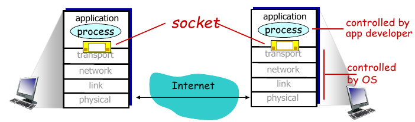

2. 进程标识
   - IP地址
   - 与该进程关联的端口号

3. 端口号的例子:
   - HTTP server: 80
   - Mail server: 25

#### 2.1.3 Transport Services Available to Applications

Data integrity, Timing, Throughput, Security

#### 2.1.4 Transport Services Provided by the Internet

1. TCP service:
   - **面向连接**: 客户进程和服务器进程需要建立连接
   - 发送进程和接收进程之间**可靠传输**
   - **流量控制**: 发送进程不会“压垮”接收进程
   - **拥塞控制**: 网络超载时抑制发送进程
   - *不提供*: 及时性,最低带宽保证
2. UDP service:
   - 发送进程和接收进程之间**不可靠传输**
   - 不提供: 连接建立,可靠传输,流量控制,拥塞控制,及时性,最低带宽保证

#### 2.1.5 Application-Layer Protocols

1. 应用层协议定义了:
   - 交换的报文类型, e.g., request, response
   - 报文语法: 报文中的字段及其描述
   -  报文语义: 各字段中信息的含义
   - 进程何时及如何发送/响应报文的规则

2. 公共领域协议: 在RFC文档中定义; 允许互操作 e.g., HTTP, SMTP

3. 专用协议: e.g., Skype

### 2.2 The Web and HTTP

#### 2.2.1 Overview of HTTP

1.  Web采用客户-服务器模式
   - client: 浏览器请求、接收和显示web对象

   - server: Web服务器应客户请求发送对象
2. 使用**TCP**作为传输层协议:客户发起到服务器 **80** 端口的 TCP 连接(客户端创建一个套接字)
3. HTTP是“无状态的”: 服务器不保存有关客户请求的任何信息
4.  HTTP 1.0(RFC 1945)    HTTP 1.1(RFC 2068)

#### 2.2.2 Non-Persistent and Persistent Connections

1. 非持久 HTTP

   - 在一个TCP连接上最多发送一个对象。

   -  HTTP/1.0 使用非持久连接。

     

   - RTT (Round-Trip Time), 下载一个对象的时间 = 2RTT+对象传输时间

2. 持久 HTTP

   - 在一个TCP连接上可以发送多个对象。
   - HTTP/1.1 缺省使用持久连接。
   - 无流水线方式: 客户仅当收到前一个响应后再发送新的请求, 请求每个对象用时1个RTT
   - 流水线方式: 客户每解析到一个引用对象就可以发送请求, **可在一个RTT时间内请求所有引用对象**,HTTP/1.1缺省使用该方式

3. 

#### 2.2.3 HTTP Message Format

1. HTTP 请求报文

   

   - 上传表单输入
     - Post 方法: Web页通常包含表单输入; 输入的**表单内容**放在报文体中上传到服务器
     - URL 方法: 使用 GET 方法, **输入内容**放在请求行的URL字段中上传,如: www.somesite.com/animalsearch?monkeys&banana
   - methods
     - HTTP/1.0
       - GET, POST
       - HEAD: 要求服务器不返回对象,只用一个报文头响应(实体为空),常用于故障跟踪。
     - HTTP/1.1
       - GET, POST, HEAD
       - PUT: 将文件放在报文实体中,传到URL字段指定的路径
       - DELETE: 删除URL字段指示的文件

2. HTTP 响应报文

   

#### 2.2.4 User-Server Interaction: Cookies

1.  服务器端: 信息保存在服务器端,返回一个ID给客户

2. 客户端: 信息发回客户端,保存在cookie文件中,并随请求报文发送给服务器

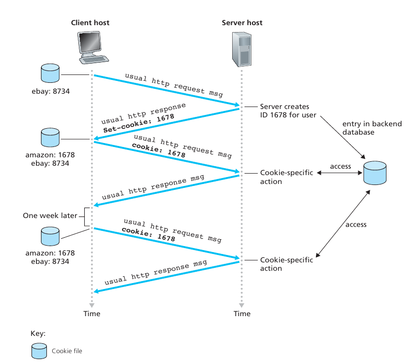

#### 2.2.5 Web Caching

代理服务器(Proxy Server): 代表原始服务器满足HTTP请求的网络实体,保存最近请求过的对象的拷贝。

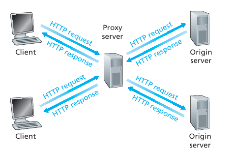

#### 2.2.6 The Conditional GET

判断Proxy Server的内容是否陈旧，若陈旧就更新


### 2.3 File Transfer: FTP

1. 用户通过FTP用户代理,从远程主机下载文件或向远程主机上传文件

2. FTP采用客户-服务器模式; 客户:启动传输的一方

3. 使用TCP协议

4.  ftp server: 使用端口21、20

   

5. 使用分离的控制连接和数据连接

   - 控制连接:
     - 使用端口21,传送客户命令和服务器响应。
     - 控制连接在整个会话期间一直保持。

   - 数据连接:

       - 使用端口20,传输文件

       - 每个数据连接只传输一个文件,发送方用关闭连接表示一个文件传输结束。

         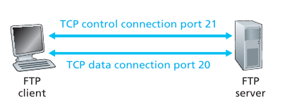

### 2.4 Electronic Mail in the Internet


- 三个主要组成部分:
  1. 用户代理(User Agent): Outlook, Mozilla Thunderbird

  2. 邮件服务器(Mail Server)
     - 用户信箱: 存放到来的邮件

     - 发送报文队列: 存放要发送出去的邮件
     - 报文传输代理MTA: 运行在服务器后台的系统守护进程,负责在邮件服务器之间传输邮件,及将收到的邮件放入用户信箱。
  3. 简单邮件传输协议(Simple Mail Transfer Protocol,SMTP)

#### 2.4.1 SMTP

1. 邮件服务器之间传输邮件采用客户-服务器模式:
   - 客户: 发送邮件的服务器
   - 服务器: 接收邮件的服务器

2. SMTP使用TCP作为传输层协议,服务器端口为25

3. 发送服务器和接收服务器之间直接传输邮件

4. SMTP采用命令/响应交互方式:

   - 命令: ASCII文本
   - 响应: 状态码和短语

5. 报文只能包含简单ASCII文本(7位ASCII码)

   

#### 2.4.2 Comparison with HTTP

- SMTP使用持久连接:
   可以在一条TCP连接上传输多个报文
   一个方向的报文传输结束后,可以在另一个方向上传输报文
- SMTP 服务器使用“.”表示报文结束(FTP使用关闭连接表示传输结束,HTTP使用长度域表示报文结束)
- SMTP要求报文(报头和实体)只包含简单ASCII文本(HTTP无此要求)

#### 2.4.3 Mail Message Format


#### 2.4.4 Mail Access Protocols


- POP: Post Office Protocol ; authorization (agent <-->server) and download
-  IMAP: Internet Mail Access Protocol ; more features (more complex);  manipulation of stored msgs on server
-  HTTP: gmail, Hotmail, Yahoo! Mail, etc.

### 2.5 DNS—The Internet’s Directory Service

DNS: Domain Name System)

- 由大量按层次组织的DNS服务器实现的分布式数据库
- 允许主机查询分布式数据库的应用层协议
- DNS是因特网的核心功能,但实现为一个应用层服务:
  - 使用客户-服务器模式运行在端系统之间
  - 利用传输层协议传输报文
  - 使用者不是用户,而是其它应用程序

#### 2.5.1 Services Provided by DNS

1. 主机名-IP地址转换
2. 主机别名
   - 允许拥有复杂主机名的主机具有一个或多个别名
   -  提供与主机别名对应的规范主机名及IP地址
3. 邮件服务器别名
   - 提供邮件服务器的规范主机名及IP地址
   - 允许用域名作为邮件服务器别名
4. 负载分配
   - 允许一个规范主机名 对应一组IP地址

   - 将http请求在一群相同功能的web服务器之间分配

#### 2.5.2 Overview of How DNS Works

1. 对于应用程序来说,DNS是一个提供直接转换服务的黑盒子。

2. 为什么不使用集中式的DNS?
   单点失效; 流量集中:单个DNS服务器需处理全部查询; 响应时间长:远距离的集中式数据库; 需要维护庞大的数据库

3.  DNS层次结构

   - 根域名服务器

     - 全球有13个根服务器
     - 根服务器知道所有顶级域(TLD)服务器的IP地址

   - 顶级域服务器(Top-Level Domain,TLD)

     -  每个TLD服务器负责一个顶级域

     - 知道其所有二级子域的域名服务器地址

   - 权威DNS服务器(Authoritative)

     - 机构的DNS服务器,提供机构内服务器(如Web,mail)的主机名-IP地址映射
     - 提供一个主域名服务器、一个或多个辅助域名服务器
     - 可由机构维护,也可委托ISP维护

   - 本地DNS服务器

     - 严格来说不属于DNS服务器的层次结构
     - 每个ISP都有一台本地DNS服务器,也称“**默认的DNS服务器**”
     - 解析器的DNS查询报文实际上发送给本地DNS服务器
     - 本地DNS服务器起着**代理**的作用,负责将DNS查询报文发送到DNS层次结构中,并将查找结果返回给解析器。

     

4. DNS缓存

   - 每当收到一个响应报文,DNS服务器将报文中的映射信息缓存在**本地**。
   - DNS服务器首先使用缓存中的信息响应查询请求
   - DNS缓存中的映射在一定时间后被丢弃
   - 特别地,本地DNS服务器通常会缓存TLD服务器的IP地址,因而**很少**去访问根服务器

#### 2.5.3 DNS Records and Messages

1. RR: Resource Record

   - RR format: (name, type, ttl, value); TTL: Time to Live
   - Type=A: Name:主机名+Value:IP地址

   - Type=NS: Name:域 (e.g. foo.com)+value:该域的权威DNS服务器的主机名
   -  Type=CNAME: Name:别名+Value:规范名

   - Type=MX: Name:域(e.g. foo.com)+Value:该域的邮件服务器名字

2. DNS protocol: 定义了查询和响应两种报文,查询和响应使用**相同**的报文格式

   

3. DNS报文的封装: DNS可以使用UDP,也可以使用TCP,服务器的熟知端口都是**53**。

   - 当响应报文的长度小于512字节时,使用UDP。
   - 当响应报文的长度超过512字节时,使用TCP。
   - 当解析器事先不知道响应报文的长度时,先使用UDP;若响应报文的长度超过512字节,服务器截断这个报文,置DNS报文首部的TC标志为1;解析程序打开TCP连接,并重复这个请求,以便得到完整的响应。

4. 往DNS中插入资源记录

   - 向DNS注册机构注册域名“networkuptopia.com”
     - 提供权威DNS服务器(主域名服务器,辅助域名服务器)的名字和IP地址

     - 对每个权威域名服务器,注册机构往 com TLD 服务器中插入两条资源记录,例如:
       (networkutopia.com, dns1.networkutopia.com, NS)
       (dns1.networkutopia.com, 212.212.212.1, A)
   - 建立权威DNS服务器,特别是:

        - 建立www.networkuptopia.com的Type A记录
        - 建立networkutopia.com的Type MX记录

### 2.6 Peer-to-Peer Applications

#### 2.6.1 P2P File Distribution


#### 2.6.2 Distributed Hash Tables (DHTs)

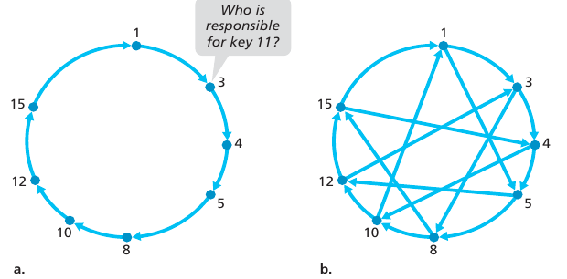
$$
Name\Longrightarrow [0,2^n-1]
$$

- 加入shortcut更快
- 保存(第一后继，第二后继)应对某个结点突然掉线

## Chapter 3 Transport Layer

### 3.1 Introduction and Transport-Layer Services

1. 在应用程序看来,传输层提供了进程间的**逻辑通信**, 不同主机上的进程可以认为它们是直接连接在一起的.
2. 传输协议运行在端系统上
   - 发送方: 将应用报文封装成报文段,交给网络层发送。
   - 接收方: 从收到的报文段中取出载荷,交给应用层

#### 3.1.1 Relationship Between Transport and Network Layers

- 网络层: 提供主机之间的逻辑通信
- 传输层: 提供进程之间的逻辑通信+依赖并增强网络层服务

#### 3.1.2 Overview of the Transport Layer in the Internet

1. 因特网的网络服务:尽力而为的服务:网络层IP尽最大努力在主机间交付分组(Best-Effort Delivery Service),但不提供任何承诺:不保证交付,不保证按序交付,不保证数据完整
2. 传输层不能提供的服务:延迟保证+带宽保证
3. 传输层可以提供的服务:
   - 保证可靠、按序的交付:TCP (Transmission Control Protocol)
   - 不保证可靠、按序的交付:UDP (User Datagram Protocol)

### 3.2 Multiplexing and Demultiplexing

1. 含义

   - 发送端多路复用: 从多个套接字收集数据,交给网络层发送
   - 接收端多路分解: 将收到的报文段交付到正确的套接字

2. 端口号是一个16比特的数, 其中0~1023保留给公共域协议使用,称众所周知的端口号。

3.  UDP套接字的标识为以下二元组: (IP地址,端口号)

   - 具有相同(目的IP地址,目的端口号)的UDP报文被交付给同一个套接字
   - 报文中的(源IP地址,源端口号)被接收进程用来发送响应报文

4. 每个TCP连接套接字与一个进程相联系,并由以下四元组标识:
   (源IP地址, 源端口号, 目的IP地址, 目的端口号)

   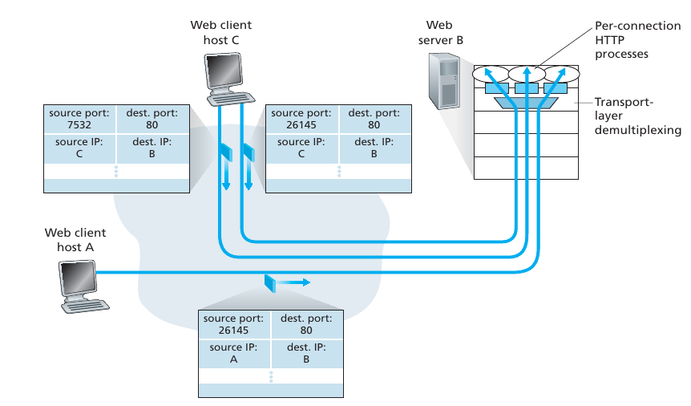

### 3.3 Connectionless Transport: UDP 

- 网络层提供尽力而为的服务
  - 尽最大努力将数据包交付到目的主机
  - 不保证可靠性和顺序

  - 不保证带宽及延迟
- UDP提供的服务:
  - 多路复用和多路分解(最基础的传输层服务)

  - 检测报文错误(但不尝试恢复)
- UDP不提供的服务:
  - 可靠交付
  - 按顺序交付
  - 延迟及带宽保证

#### 3.3.1 UDP Segment Structure

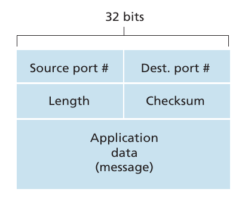

#### 3.3.2 UDP Checksum

1. 

   分成16bit => sum(带回卷) => 求反码 => checksum

   checksum 与 所有data的sum(带回卷) = 0xFFFF 则代表无错  

2. why is there a UDP?
   - 没有建立连接的**延迟**
   - 协议简单:发送端和接收端不需要保存连接状态
   - 报头开销小
   - 没有拥塞控制和流量控制:UDP可以尽可能快地发送报文
3. UDP的应用:
   - 流媒体(容忍丢包,延迟敏感)
   - DNS
   - SNMP
4. 若需要利用UDP可靠传输: 在应用层实现可靠性

### 3.4 Principles of Reliable Data Transfer

#### 3.4.1 Building a Reliable Data Transfer Protocol

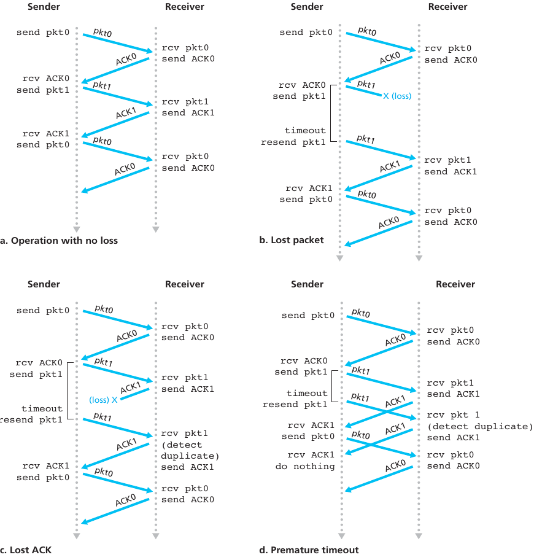

#### 3.4.2 Pipelined Reliable Data Transfer Protocols

- Pipelining: 允许发送方有多个已发送、未确认的分组
  - 分组的序号范围应扩大(停等协议只使用1比特序号)
  - 发送端和接收端可能需要缓存多个分组(停等协议中,发送端缓存一个分组,接收端不缓存)
  - 两种形式的流水线协议: Go-Back-N, Selective Repeat

#### 3.4.3 Go-Back-N (GBN)

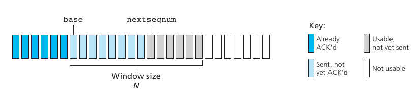

- 发送方
  - 收到上层的发送请求:
    - 若发送窗口满:拒绝请求
    - 若发送窗口不满:构造分组,发送
    - 若原来发送窗口为空:对基序号启动一个定时器
  - 收到正确的ACK:
    - 更新基序号(滑动窗口)
    - 若发送窗口空:终止定时器
    - 若发送窗口不空:对基序号启动一个定时器
  - 收到出错的ACK: 不做处理
  - 定时器超时: 启动定时器,重发从基序号开始的所有分组
- 接收方
  -  只使用ACK: 仅对正确收到的、序号连续的一系列分组中的最高序号进行确认
  - 收到失序的分组:
    - 丢弃(不在接收端缓存)

    - 重发前一次的ack分组(已正确收到、序号连续的一系列分组中的最高序号)

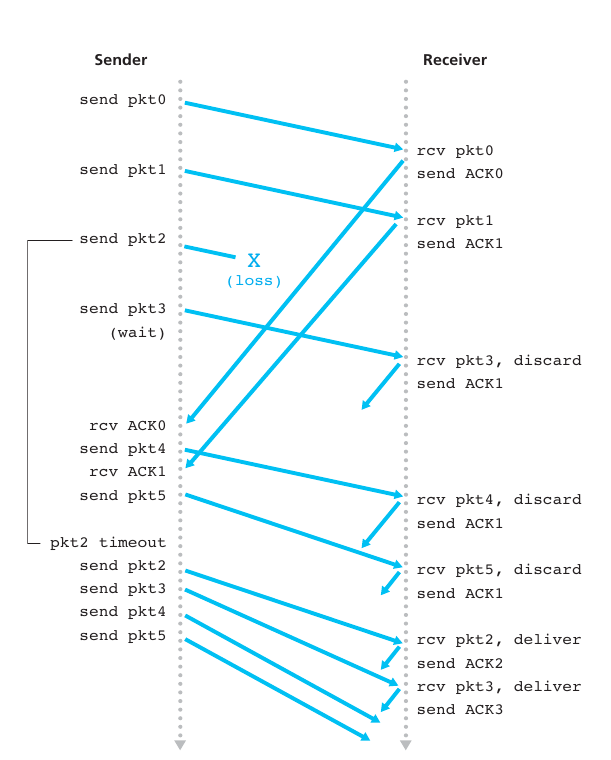

#### 3.4.4 Selective Repeat (SR)


- sender
  - 从上层接收数据: 若发送窗口未满,发送分组,启动定时器
  - 定时器 n 超时: 重传分组n, 重启定时器
  - 收到发送窗口内的ACK(n) : 
    - 标记分组n为已接收
    - 若n=基序号,滑动发送窗口,使基序号=最小未确认的序号
- receiver
  - 收到接收窗口内的分组n:
    - 发送ACK(n)
    - 若失序:缓存该分组
    - 若n=基序号:交付从n开始的若干连续分组;滑动接收窗口,使基序号=下一个期待接收的序号
  - 收到[rcvbase-N,rcvbase-1]内的分组n: 发送ACK(n)
  - 其余情形: 忽略该分组


- 窗口大小和序号空间的关系
  - 选择重传:通常发送窗口大小 =接收窗口大小
  - 考虑以下情形:发送方发送了一个窗口([0,N-1])的分组;接收方全都接收正确,发送了ACK,并滑动接收窗口至[N,2N-1] 。但N个**ACK**全都没有正确接收,发送端超时后逐个重发这N个分组。
  - 为使发送端能够移动发送窗口,接收端必须对窗口[0,N-1]中的分组进行确认。这回答了接收方为什么需要对[rcvbase-N,rcvbase-1]中的分组进行确认。
  - 为使接收端不会将重发的分组当成新的分组,窗口[0,N-1]和窗口[N,2N-1]不能有重叠。所以,N不能大于序号空间的一半。

### 3.5 Connection-Oriented Transport: TCP

#### 3.5.1 The TCP Connection

- 点到点通信: 一个发送者,一个接收者
- 全双工: 可以同时双向传输数据
- 面向连接: 通信前双方先握手(交换控制报文),建立数据传输所需的状态(缓存、变量等)
- 可靠、有序的字节流: 不保留报文(应用程序的输出)边界
- 流水式发送报文段: 发送窗口由拥塞控制和流量控制机制设置
- 流量控制: 发送方不会令接收方缓存溢出

#### 3.5.2 TCP Segment Structure


- 序号: 报文段中第一个数据**字节**的序号

- 确认号: 使用累积确认,指出**期望**从对方接收的**下一个字节**的序号

  

#### 3.5.3 Round-Trip Time Estimation and Timeout

$$
\begin{aligned}
\text{EstimatedRTT}&=(1-\alpha)\ \text{EstimatedRTT}+\alpha\ \text{SampleRTT}	\\
\text{DevRTT}&=(1-\beta)\ \text{DevRTT}+\beta\ |\text{SampleRTT}-\text{EstimatedRTT}|	\\
\text{TimeoutInterval}&=\text{EstimatedRTT}+4\times \text{DevRTT}
\end{aligned}
$$

通常$\alpha=0.125, \beta=0.25$

#### 3.5.4 Reliable Data Transfer

1. TCP 在不可靠的IP服务上建立可靠的数据传输
   可靠数据传输机制:

   - 发送端采用**流水式**发送报文段
   - 接收端采用**累积**确认
   - 发送端采用**重传**来恢复丢失的报文段

2. 高度简化版本

   - 接收方(累积确认,与GBN类似):
     - 仅在正确、按序收到报文段后,更新确认序号
     -  其余情况,重复**前一次**的确认序号
   - 发送方:
     - 流水式发送报文段
     - 仅对最早未确认的报文段使用一个重传定时器(与GBN类似)

     - 仅在超时后重发引起超时(最早未确认)的报文段(与GBN不同,与选择重传类似)
     - 收到更新的确认序号后,推进发送窗口

3. TCP发送方处理的事件

   - 收到应用数据:

     - 创建并发送TCP报文段
     - 若当前没有定时器在运行(没有已发送、未确认的报文段),启动定时器

   - 超时:

     - 重传包含最小序号的、未确认的报文段
     - 重启定时器

   - 收到ACK:

     - 如果确认序号大于基序号:推进发送窗口(更新基序号)
     - 如果还有未确认的报文段,启动定时器

     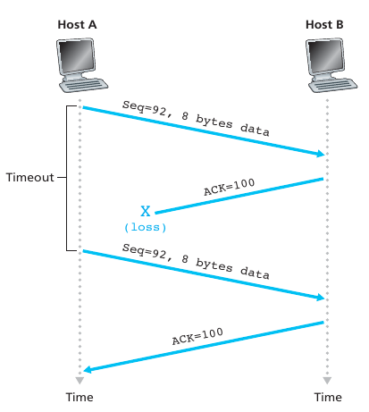

     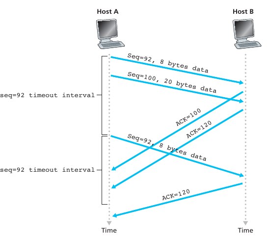

     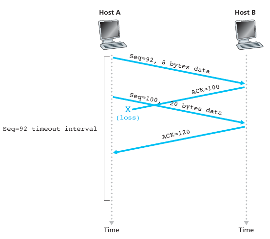

4. 定时器补偿：发送方每重传一个报文段,超时值就增大一倍。

5. Karn算法结合使用RTT估计值和定时器补偿策略确定超时值:

   - 使用EstimatedRTT估计初始的超时值
   - 若发生超时,每次重传时对定时器进行补偿,直到成功传输一个报文段为止。
   - 若收到上层应用数据、或某个报文段没有重传就被确认了,用最近的EstimatedRTT估计超时值。

6. 快速重传: 当发送方收到对同一序号的3次重复确认ACK时,**立即**重发包含该序号的报文段

   

7. TCP的差错恢复机制可以看成是GBN和SR的混合体

#### 3.5.5 Flow Control

1. 流量控制：不超过接受方的缓存

   拥塞控制：根据网络情况控制速度

2. 接受方

   

   将rwnd=RcvBuffer - [LastByteRcvd - LastByteRead]发送给发送方

3. 发送方：使LastByteSent- LastByteAcked <= rwnd

#### 3.5.6 TCP Connection Management

1. 建立连接

   

2. 关闭连接

   

### 3.6 Principles of Congestion Control

#### 3.6.1 The Causes and the Costs of Congestion

- 拥塞造成:
  - 丢包(缓存溢出)
  - 分组延迟增大(链路接近满载)
- 大量网络资源用于:
  - 重传丢失的分组
  - (不必要地)重传延迟过大的分组
  - 转发最终被丢弃的分组
- 结果: 网络负载很重,但网络吞吐量很低。

#### 3.6.2 Approaches to Congestion Control

1. 端到端拥塞控制:
   - 网络层不向端系统提供反馈
   - 端系统通过观察丢包和延迟推断拥塞的发生
   - TCP采用此类方法
2. 网络辅助的拥塞控制:
   - 路由器向端系统提供反馈:
     - 拥塞指示比特+发送速率指示
     - ATM采用此类方法

### 3.7 TCP Congestion Control

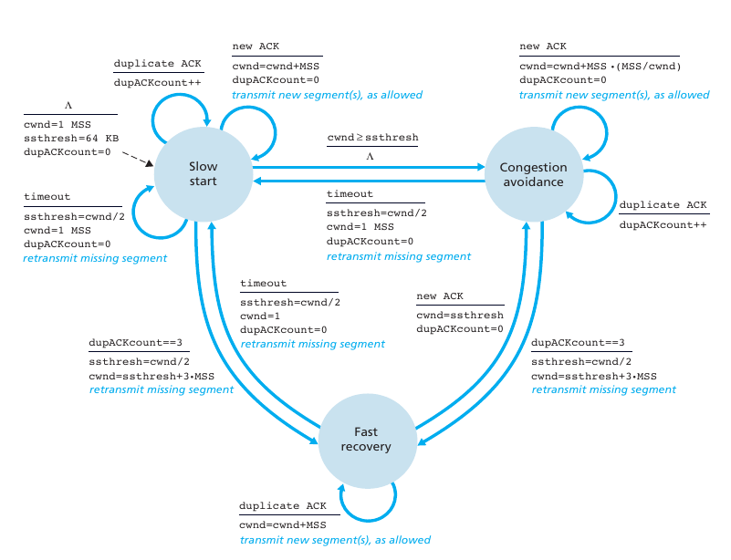

1. TCP拥塞控制

   - 发送方使用拥塞窗口cwnd限制已发送未确认的数据量:
     LastByteSent-LastByteAcked <=cwnd 
   - 拥塞窗口间接限制了发送速率:
     rate= cwnd / RTT (Bytes/Sec)
   - cwnd随所感知的网络拥塞程度而变化
   - 慢启动、拥塞控制、快速恢复

2. TCP慢启动

   - 连接刚建立时
     - cwnd = 1 MSS

     - 发送速度= MSS/RTT
   - 慢启动策略:每经过一个RTT,将cwnd**加倍**
     具体实施:每收到一个ACK段,cwnd增加一个MSS

3.  丢包事件:

   - 收到3个冗余ACK:说明网络仍有一定的交付能力
   - 超时:说明网络交付能力很差

4. Reno使用了快速恢复。Tahoe没有。

   - 超过ssthresh时，将指数增长改成线性增长(拥塞避免阶段)。
   - 收到timeout时，ssthresh=cwnd/2, cwnd=1 MSS. 并进入慢启动阶段
   - 收到3个冗余ACK:
     - Reno: ssthresh=cwnd/2, cwnd=ssthresh+3 MSS. 并进入快速恢复阶段
     - Tahoe: ssthresh=cwnd/2, cwnd=1 MSS.  并进入慢启动阶段

   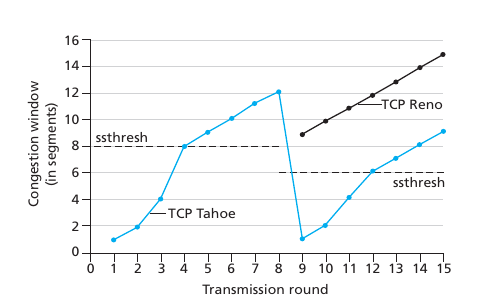

5. TCP吞吐量

   W=丢包发生时的cwnd

   平均吞吐量=0.75 W/ RTT

   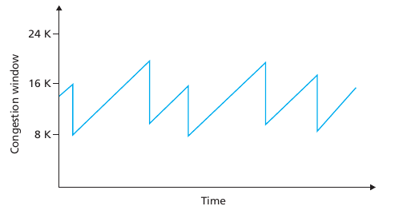

## Chapter 4The Network Layer

### 4.1 Introduction

网络层

- 作用:将报文段从发送主机传送到接收主机
- 每一台主机和路由器都运行网络层协议
- 发送主机:将传输层报文段封装到网络层分组中,发送给边缘路由器
- 路由器:将分组从输入链路转发到输出链路
- 接收主机:从边缘路由器接收分组,取出报文段交付给传输层

#### 4.1.1 Forwarding and Routing

- Forwarding: 将分组从路由器的输入端口转移到合适的输出端口

- Routing: 确定分组从源路由器到目的路由器的路径

#### 4.1.2 Network Service Models

### 4.2 Virtual Circuit and Datagram Networks

- 两种基本的网络类型:
  - 数据报网络:提供网络层无连接服务
  - 虚电路网络:提供网络层面向连接服务
- 网络层 v.s. 传输层
  - 网络层服务
    - 主机-主机
    - 一个网络不能同时提供两种服务
    - 在网络核心实现
  - 传输层服务
    - 进程-进程
    - 可同时提供两种服务
    - 在网络边缘实现

#### 4.2.1 Virtual-Circuit Networks

1. 网络层连接称为虚电路
2. 虚电路是一条端到端路径,其行为类似于电话电路:
   - 传输分组前建立虚电路,传输结束后拆除虚电路

   - 每个路由器为经过它的虚电路维护状态

   - 链路及路由器资源(带宽、缓存等)可以分配给虚电路,从而虚电路能提供可预期的网络服务。
3. 建立虚电路的本质是预先选好源主机到目的主机的路径,此后分组仅沿选好的路径传输,是否分配资源是可选的。
4. 每条虚电路应有标识(称虚电路号),每个分组应携带虚电路标识,表明其所属的虚电路。
5. 一条虚电路由以下几部分组成:
   1. 从源主机到目的主机的端到端路径
   2. 沿途每条链路上的VC号(VC号仅有本地意义)
   3. 沿途每个路由器中的转发表项(进入端口,进入VC号,输出端口,输出VC号)分组携带VC号,每一次转发前路由器用新的VC号替换分组中的VC号。
6. 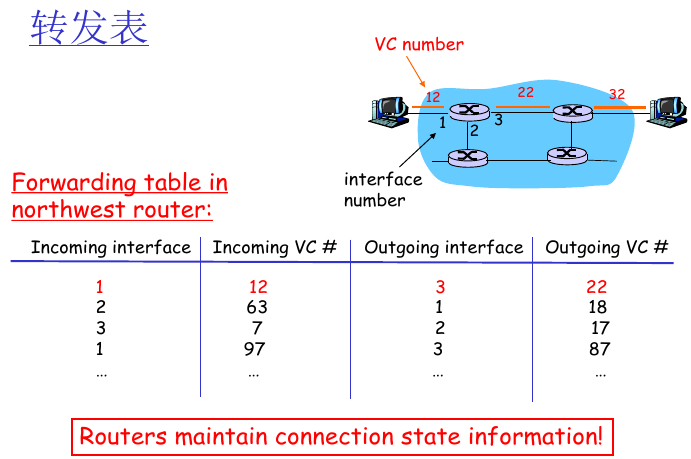
7. 虚电路: 信令(signaling)协议
   - 信令报文:专门用于建立、维护、拆除虚电路的控制报文
   - 信令协议:交换信令报文的协议

#### 4.2.2 Datagram Networks

- 分组携带目的主机地址,路由器按目的地址转发分组
- 路由器中的转发表记录目的地址到输出链路的映射：最长前缀匹配

### 4.3 What’s Inside a Router?


#### 4.3.1 Input Processing

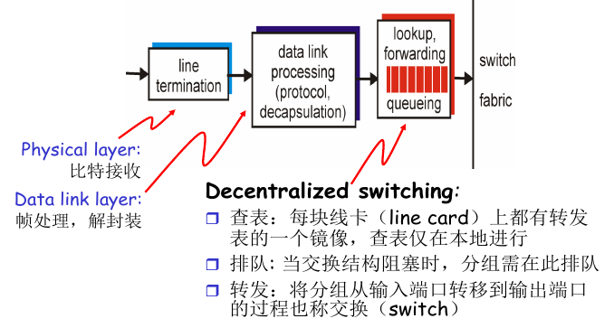

#### 4.3.2 Switching


#### 4.3.3 Output Processing

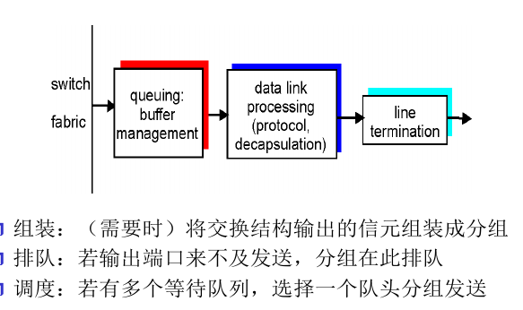

#### 4.3.4 Where Does Queuing Occur?

- 输入端口排队与丢包
  - 当交换结构不能及时将输入端口的分组转移到输出端口时,输入端口处形成排队。
  - 队头阻塞: 队头分组阻塞其后分组的转发。
  - 当输入队列溢出时,发生丢包。
  - 当交换结构速率至少为端口速率的n倍(n为输入端口数量)时,输入端口处不会出现排队。
- 输出端口排队与丢包
  - 当多个输入端口同时向一个输出端口发送时,形成排队。
  - 当输出队列满时,发生丢包。
  - 输出端口排队是不可避免的,设置多大的输出队列是一个研究问题。

#### 4.3.5 The Routing Control Plane

- 分组丢弃策略

- 弃尾(drop-tail):队列满时,丢弃到达的分组

- 主动队列管理:在队列满之前就开始丢弃分组

- Ramdom Early Detection(RED)

  - 主动队列管理的一种,与TCP的拥塞控制机制一起使用

  - 路由器在每个端口上维护输出队列的平均长度:
    $$
    AvgLen = (1- Weight)×AvgLen + Weight×SampleLen
    $$

    - 当平均队列长度达到第一个阈值$min_{th}$时,按照丢弃概率$p$ 丢弃到来的分组。

    - 当平均队列长度达到第二个阈值$max_{th}$时,丢弃每一个到达的分组。

    - 概率 $p$ 是平均队列长度和上一次丢弃距当前时间的函数,分组队列长度越大,丢弃间隔越大,$p$也越大。

### 4.4 The Internet Protocol (IP): Forwarding and Addressing in the Internet


#### 4.4.1 Datagram Format

1. 数据报格式


2. MF=More Fragments ?

   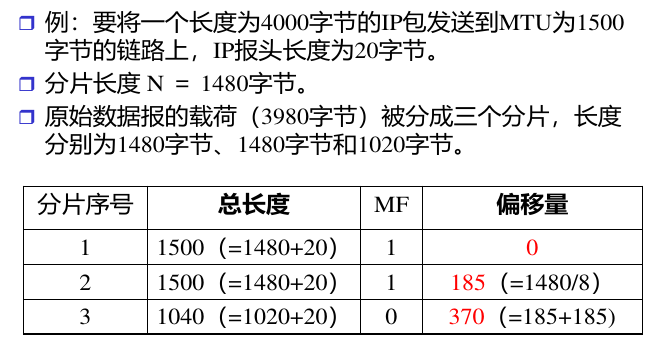

#### 4.4.2 IPv4 Addressing

1. 每个网络接口对应一个IP地址

2. IPv4地址: 32比特的数,通常用点分十进制形式表示。

3. 子网(subnet): 管理员可以利用路由器,将一个较大的网络划分成若干较小的网络,每个网络使用一部分地址空间。

   

   - 每个子网具有不同的子网地址

   - 子网之间被路由器隔开

   - 路由器的每个端口连接一个子网

   - 路由器是在子网之间转发的设备

   - 图示的系统中有6个子网

     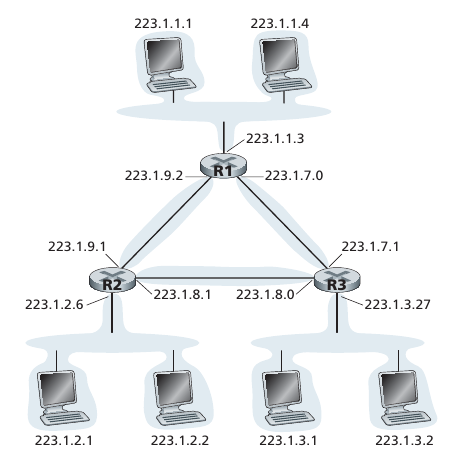

4. CIDR: Classless InterDomain Routing 无类别域间路由选择

   -  网络地址的表示方法: 

     - 用掩码指示网络地址的长度,如194.24.0.0 ,255.255.248.0。
     -  用“/长度”指示网络地址的长度,如194.24.0.0/21。

     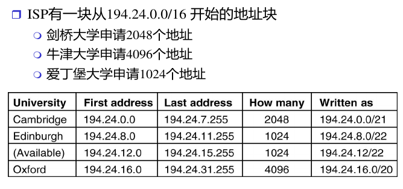

5. 主机/路由器如何获得IP地址?

   - 路由器: 管理员手工配置路由器各个接口的IP地址

   - 主机:
     - 管理员手工配置主机的IP地址
     - 主机使用动态主机配置协议DHCP(Dynamic Host Configuration Protocol)自动获取IP地址、子网掩码、默认网关、本地DNS服务器等配置信息

   - 使用DHCP的好处:

     - 免去手工配置的麻烦(即插即用)
     - 可用少量的IP地址服务较多的客户(地址重用)

     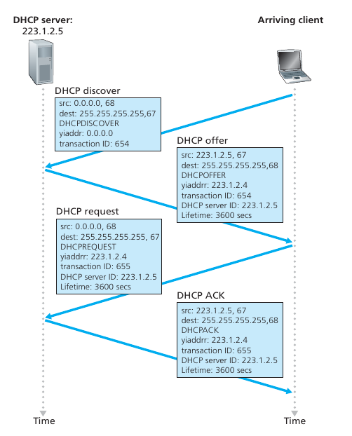

6. Network Address Translation (NAT) 网络地址转换

   -  Motivation:
     - 使用一个公用IP地址支持许多用户同时上网
     - 仅为公共可访问的节点分配公用IP地址(减少需要的公用IP地址数)
     - 网络内部节点对外是不可见的(安全考虑)
   - 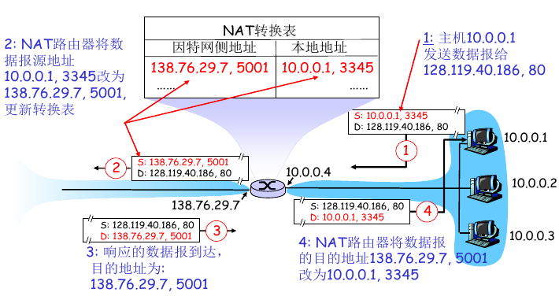
   - 16比特端口号: 允许一个NAT IP地址同时支持65535个对外连接
   - NAT的使用有争议:
     - 路由器应当只处理三层以下的包头(端口号在传输层)
     - 违反端到端原则(节点介入修改IP地址和端口号)
   - NAT妨碍P2P应用程序:需要NAT穿越技术

#### 4.4.3 Internet Control Message Protocol (ICMP)

1.  主机或路由器使用ICMP协议传递网络层上的一些信息。

2. ICMP报文有询问和错误报告两类:

   - 询问:用来请求一些信息,通常采用请求-响应模式交互
   - 错误报告:发现错误的节点向源节点报告错误信息,不需响应

3. 由于 ICMP报文可能需要经过几个网络才能到达源节点,**ICMP报文被封装在IP包中传输**。

   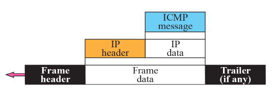

4. ICMP通常被认为是IP协议的一部分,因为**IP协议使用ICMP向源节点发送错误报告**。

5.  Ping利用ICMP报文测试目的主机是否活跃,以及去往目的主机的路径是否正常:

   - 源主机发送 Type=8,Code=0 的 Echo Request 报文

   - 若目的主机收到,发送 Type=0,Code=0 的 EchoResponse报文

   - 源主机计算并报告RTT
   - 若源主机连续几次超时(收不到Echo Response),向调用者报告目的不可达

6.  Traceroute测试到达目的主机的路由(经过的路由器):

   - 源主机的Traceroute程序向目的主机发送一个Echo Request报文,IP报头的TTL设为1。
   - 第一跳路由器对TTL减1,发现TTL变为0,向源主机发送一个TTL expired报文(IP报头中有路由器的IP地址)。
   - Traceroute记录第一跳路由器的IP地址,然后向目的主机发送第二个Echo Request报文,IP报头的TTL设为2。
   - 若收到第二跳路由器的TTL expired报文,记录第二跳路由器的IP地址;接着发送一个TTL为3的Echo Request报文。

   - 该过程不断重复,直至收到目的主机的Echo Response报文(使用错误端口号!)

#### 4.4.4 IPv6

1. IPv4: 32 位; IPv6: 128 位

2. IPv6与IPv4不兼容,但与其它所有因特网协议都兼容。
3. 从IPv4过渡到IPv6
   - 双协议栈方案
     - 
     -  支持IPv6的主机和路由器同时运行IPv4和IPv6

     - 源节点先查询DNS:若DNS返回IPv4地址,发送IPv4分组;若返回IPv6地址,发送IPv6分组

     - 双栈节点同时拥有IPv4和IPv6地址
     -  报头转换:
       - IPv4/IPv6节点(如路由器B)在将数据报传递给IPv4路由器(如路由器C)之前,将IPv6报头转换成IPv4报头

       - 缺点:报头转换不完全,有信息丢失。
   -  建立隧道:
     - IPv6/IPv4边界路由器将IPv6包封装到一个IPv4包中,送入IPv4网络,目的边界路由器取出IPv6包继续传输。

     - 优点:保留原始数据报的全部信息。
     - 

### 4.5 Routing Algorithms

#### 4.5.1 The Link-State (LS) Routing Algorithm

- 全局算法
- Dijsktra 算法
- 

#### 4.5.2 The Distance-Vector (DV) Routing Algorithm

- 局部算法

- $$
  d_x(y)=\min_{v\in \text{neighbor}(x)}c((x,v)+d_v(y))
  $$

- 

- 毒性逆转：如果我是通过你(下一跳)到达x, 那么我会欺骗你我到x的距离为$\infty$

  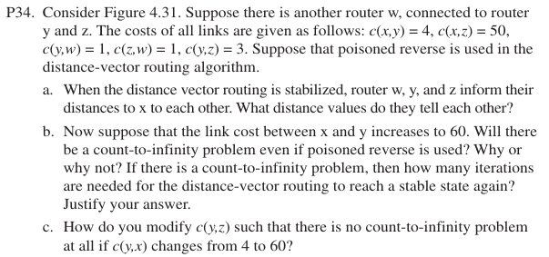

  

  

  

#### 4.5.3 Hierarchical Routing

1. AS: Autonomous System

   - 自治系统是由处于**同一个管理域下**的网络和路由器组成的集合
   - 每个AS被赋予一个AS编号,由ICANN分配
   - 同一个AS中的路由器运行相同的选路协议(称Inter-AS选路协议)
   - 不同AS中的路由器可以运行不同的Intra-AS选路协议
   - 网关路由器
     - 在一个AS内、直接连接到其它AS的路由器
     - 网关路由器之间运行Inter-AS选路协议
     - 所有AS必须运行相同的Inter-AS选路协议

2. 热土豆选路协议: 选择最近的网关路由器

   1. 从inter-AS协议了解到subnet x通过多个网关路由器可达
   2. 使用intra-AS协议确定到各网关路由器的最小代价路径
   3. 热土豆选路协议: 选择路径代价最小的网关路由器
   4. 从转发表中得知到最小代价网关的接口I,添加表项Enter (x,I) 到转发表中

3.  转发表由intra-AS和inter-AS配置:

   - intra-AS:设置到AS**内部**网络的路由

   - inter-AS & Intra-As: 设置到**外部**网络的路由

     

### 4.6 Routing in the Internet

- Intra-AS选路协议也称内部网关协议IGP(InteriorGateway Protocols),最常见的有:
  - RIP(Routing Information Protocol):较低层ISP和企业网中使用

  - OSPF(Open Shortest Path First):较顶层ISP中使用
-  Inter-AS选路协议也称外部网关协议EGP(ExteriorGateway Protocols),目前只有:
  - BGP: Border Gateway Protocol

#### 4.6.1 Intra-AS Routing in the Internet: RIP

1.  RIP采用距离矢量选路算法(局部信息)

2. 距离测度(代价)是跳数(hop count)

   - 跳(hop):相邻路由器之间的链路为一跳
   - 路径的跳数:从源路由器到目的子网(含)经过的子网数量
   - 一条路径的最大代价限定为15跳

   

3. RIP通告

   - 距离向量: 从路由器到AS内各个子网的最短路径跳数的估计值
   - RIP响应报文(RIP通告)
     - 距离向量封装在RIP响应报文中传输
     - 每个报文携带一个目的子网列表(最多包含25个子网),以及到每个目的子网的最短距离
   - RIP响应报文的发送:
     - 相邻路由器之间大约每30秒交换一次RIP响应报文
     - RIP报文封装在**UDP**报文中发送,使用UDP端口520(RIP是一个**应用层协议**!)
   - RIP: 链路失效与恢复: 若超过180秒未收到某个邻居的RIP通告,认为该邻居不可达:
     - 令通过该邻居的路径失效(距离设为16)
     - 发送RIP通告

#### 4.6.2 Intra-AS Routing in the Internet: OSPF

1. OSPF采用链路状态选路算法
2. 链路代价:由管理员配置(由选路策略决定)
3. OSPF分组:
   - OSPF定义了5种分组类型,分别用于探测邻居、通告链路状态等

   - OSPF分组被封装在IP包中传输,协议号为89
   - 路由器周期性地、或在链路状态改变时发送OSPF链路通告
4. OSPF协议负责OSPF链路通告在网络中的广播及可靠传输
5. 路由器根据收到的链路通告构造链路状态数据库
6. 路由器利用链路状态数据库及**Dijkstra**算法,计算以路由器为根的最短路径树

#### 4.6.3 Inter-AS Routing: BGP

- AS间选路只试图找到能够到达目的网络的路由,但不试图(也不可能)找到最佳路由。

- 当一对AS同意交换选路信息时,每个AS指定一个接近AS边缘的路由器(或主机),使用BGP协议交换选路信息。

- 运行BGP协议的边界路由器(或主机)称为BGP speaker。

- 一对BGP speaker通过一条半永久的TCP连接(端口179)建立BGP会话,交换BGP报文。
  (BGP是应用层协议!)

- BGP会话的两个端点互为BGP对等方。

- BGP会话

  - 不同AS的两个边界路由器之间建立的BGP会话,称为外部BGP(eBGP)会话。

  - 一个AS可能有多个边界路由器,它们必须通过半永久TCP连接构成全连通,它们之间的BGP会话称为内部BGP(iBGP)会话。

    

- BGP定义了4种类型的报文:

  - 打开报文:BGP路由器用来启动与邻居BGP路由器的联系。

  - 保活报文:BGP路由器定期交换保活报文,告知对方自己处于工作状态。

  - 通知报文:当检测到差错或路由器打算关闭连接时,发送通知报文。
  - 更新报文:BGP路由器使用该报文宣布新路由,以及撤销以前通告的路由。

- 可达性信息:以AS枚举形式通告的、到达目的前缀的完全路径(便于检测路径环)。

  

### 4.7 Broadcast and Multicast Routing

#### 4.7.1 Broadcast Routing Algorithms

1. 广播:将数据包从源节点发送到所有其它节点

2. 用N次单播实现广播(在源节点上复制分组)的缺点

   - 低效:相同的分组在某些链路上可能重复传输

   - 需其它机制支持:源节点需知道所有目的节点的地址

3. 洪泛

   - 节点收到广播分组后,向所有邻居节点(分组到来的链路除外)发送该分组的拷贝。

   - 缺点:在有环的网络中,广播分组在网络中无休止地循环,甚至产生广播风暴。

4. 受控洪泛

   - 目标:每个路由器仅转发它之前未转发过的广播分组

   - 两种方法:

     1. 节点记录之前转发过的分组ID,不重复转发分组(OSPF使用此方法:源地址+分组ID)。

     2. 反向路径转发: 利用节点内部的单播路由表,节点仅转发从本节点->源节点最短路径的反向路径上到来的广播分组。Reverse Path Forwarding(RPF)

        

5. 生成树

   - 选择一个节点作为核心(也称汇聚点)

   - 其它节点向核心发送单播的加入报文:

     - 路由器利用单播路由表向核心转发加入报文时,记录报文的输入端口及输出端口,这些端口就是位于生成树上的端口

     - 当加入报文到达已在生成树上的一个节点时,报文经过的路径被添加到生成树上

     

     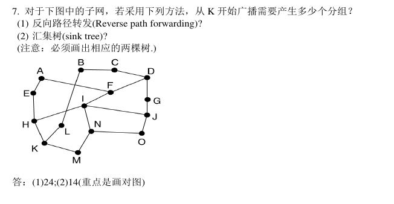

#### 4.7.2 Multicast

1. 多播:将分组交付给网络中的一组节点

2. IGMP(Internet Group Management Protocol)协议用于将局域网中主机的组成员关系报告给本网段的多播路由器

   **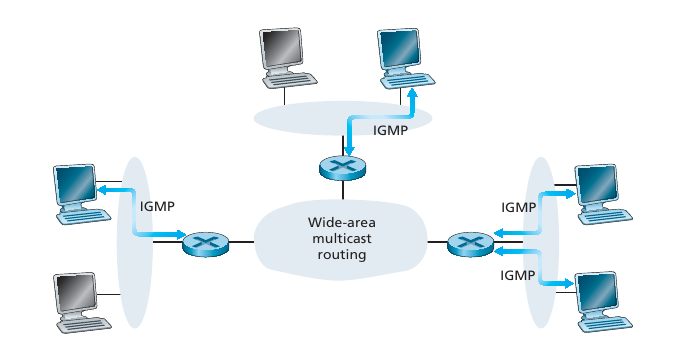**

3. 加入一个组

   - 主机:
     - 每个主机维护一张应用进程与多播组的对应表
     - 当主机上的一个进程要加入一个多播组时,向主机发送请求;若这是一个新组,主机向路由器发送加入组的报文。
   - 多播路由器:
     - 多播路由器维护一张各个网络接口与多播组的对应表
     - 当某个接口上出现一个新的多播组时,多播路由器在所有其它接口上发送加入组的报文。

4. 退出一个组

   - 主机发现某个多播组为空时,从表中清除该组,向路由器发送退出组的报文多播路由器收到退出报文后:
     - 在该网络接口上发送关于该多播组的查询报文(询问是否有成员属于该组)
     - 若在规定的时间内没有收到该多播组的任何成员关系报告,从表中清除该组,在其它网络接口上发送退出组的报文

5. 建立多播树的两种方法

   - 基于源的树:
     - 源节点建立一棵到多播组所有成员的最短路径树,源节点S和组G的每一种组合<S,G>构成一棵树。
     - 路由器必须有每棵<S,G>树的信息,根据多播分组的源地址及组地址确定使用哪棵多播树转发。
     - 优点:多播分组总是使用最佳路径转发
     - 缺点:路由器需要维护大量的多播树
   - 组共享树:
     - 每个多播组使用一棵树,树根为该多播组的核心。
     - 源节点先将多播分组发送给核心,核心再在多播树上发送。
     - 优点:路由器对于每个组只维护一棵多播树
     - 缺点:多播分组使用的转发路径可能不是最佳的

## Chapter 5The Link Layer: Links, Access Networks, and LANs

### 5.1 Introduction to the Link Layer

- 网络层:
  - **选路**:确定从源路由器到目的路由器的路径
  - **转发**:路由器将数据报从一个端口转移到另一个端口
- 链路层: 将数据报从一个节点传输到相邻的**下一个节点**,如:
  - 源主机 -> 源路由器
  - 路由器 -> **下一跳**路由器
  - 目的路由器-> 目的主机

#### 5.1.1 The Services Provided by the Link Layer

- **组帧**(基本服务): 将数据报封装到帧中,以及从帧中解封装数据报
- **链路接入**(广播链路): 在广播信道上协调各个节点的发送行为
- **可靠交付**(部分协议提供)
  - 通过确认、重传等机制确保接收节点正确收到每一个帧(停-等、GBN、SR)
  - 低误码率链路(如光纤、某些双绞线)上很少使用,高误码率链路(如无线链路)应当使用

- **流量控制**:
  - 调节发送速度,避免接收节点缓存溢出
  - 可以与可靠交付(如GBN、SR)集成,也可以是单独的机制
- **差错检测**: 检测传输错误
- **差错纠正**(有些提供): 检测并纠正传输错误(不是通过重传)
- 半双工和全双工: 半双工通信时,提供收/发转换

#### 5.1.2 Where Is the Link Layer Implemented?

- 路由器:链路层在线卡中实现
- 主机:链路层主体部分在网络适配器(网卡)中实现
- 网络适配器连接物理媒体,所以还实现物理层的功能。
- 链路层由硬件和软件实现:
  - 网卡中的控制器芯片:组帧、链路接入、检错、可靠交付、流量控制等

  - 主机上的链路层软件:与网络层接口,激活控制器硬件、响应控制器中断等
  - 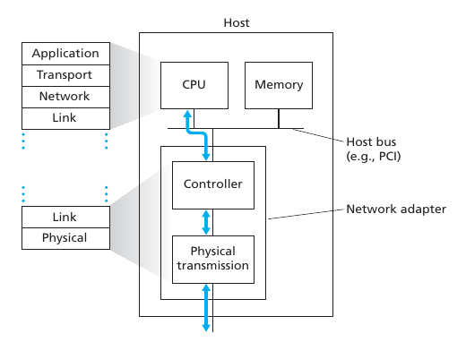

### 5.2 Error-Detection and -Correction Techniques

#### 5.2.1 Parity Checks

- 奇偶校验
- 

#### 5.2.2 Checksumming Methods

- 运输层

#### 5.2.3 Cyclic Redundancy Check (CRC)

- 链路层
- 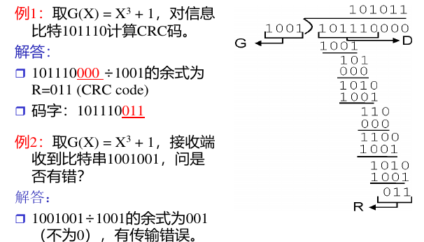

### 5.3 Multiple Access Links and Protocols

- 链路的两种类型
  - 点到点链路: 仅连接了一个发送方和一个接收方的链路
  - 广播链路: 连接了许多节点的**单一共享链路**,任何一个节点发送的数据可被链路上的其它节点接收到
- 多址接入(Multiple Access)
  - 冲突(collision): 在广播链路上,若两个或多个节点同时发送,发送的信号会发生干扰,导致接收失败。
  - 多址接入协议
    - 规定节点共享信道(谁可以发送)的方法
    - 多址接入协议也称**媒体接入控制(Medium Access Control,MAC)协议**
- 理想的多址接入协议(在速率为R bps的广播信道上)
  1. 当只有一个节点发送时,它应能以速率R发送
  2. 当有M个节点发送时,每个节点应能以 R/M的平均速率发送
  3. 协议是完全分布式的:
    - 不需要一个特殊的节点来协调发送
    - 不需要时钟或时隙同步
  4. 简单
- MAC协议的分类
  - 信道划分: 将信道划分为若干子信道,每个节点固定分配一个子信道,不会发生冲突。
  - 随机接入
    - 不划分信道,节点可自行决定何时发送;
    - 允许出现冲突,发生冲突后设法恢复。
  - 轮流使用信道: 不划分信道,有数据要发送的节点在信道上轮流发送,不会出现冲突。
- MAC协议比较
  - 信道划分MAC协议:
    - 重负载下高效:没有冲突,节点公平使用信道

    - 轻负载下低效:即使只有一个活跃节点也只能使用1/N的带宽
  - 随机接入MAC协议
    - 轻负载时高效:单个活跃节点可以使用整个信道
    - 重负载时低效:频繁发生冲突,信道使用效率低
  - 轮流协议(试图权衡以上两者)
    - 按需使用信道(避免轻负载下固定分配信道的低效)
    - 消除竞争(避免重负载下的发送冲突)

#### 5.3.1 Channel Partitioning Protocols

1. TDM:  时分多址
   - 将信道的使用时间划分成帧,每个节点在帧中被分配一个固定长度的**时间片(**可以发送一个分组)
   - 节点只能在分配给自己的时间片内发送
   - 若节点不发送,其时间片轮空
   - 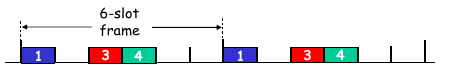
2. FDM: 频分多址
   - 将信道频谱划分为若干**子频带**
   - 每个节点被分配一个固定的子频带
   - 若节点不发送,其子频带空闲
   - 
3. CDMA: 码分多址
   - 将每个比特时间进一步划分为m个微时隙(称chip)
   - 每个节点被分配一个惟一的m比特码序列(称chip code)
   - 发送方编码:发送“1”=发送chip code;发送“0”=发送chip code的反码
   - 信号干扰:多个节点发送的信号在信道中线性相加
   - 接收方解码:用发送方的chip code与信道中收到的混合信号计算内积,恢复出原数据
   - 前提条件:**任意两个chip code必须是相互正交的**
   - CDMA允许所有节点同时使用整个信道!

#### 5.3.2 Random Access Protocols

1. 随机接入:

   - 当节点有数据要发送时,以信道速率R发送,发送前不需要协调
   -  随机接入MAC协议:规定如何检测冲突,以及如何从冲突中恢复

2. 随机接入MAC协议的例子:

   - 发送前不监听信道:ALOHA家族
   - 发送前监听信道:CSMA家族

3. Slotted ALOHA

   - 假设:

     - 所有帧长度相同
     - 时间划分为等长的时隙(传输一帧的时间)

     - 节点只给在时隙开始时发送

     - 节点是时钟同步的(知道时隙何时开始)

     - 若多个节点发送,所有节点可在时隙结束前检测到冲突

   - 操作:

     - 节点从上层收到数据后,在下一个时隙发送:

       - 若没检测到冲突:节点可在下一个时隙发送新的帧
       - 若检测到冲突:节点在随后的每一个时隙中以概率P重传,直至发送成功

       

   - 优点

     - 单个活跃节点可以信道速率连续发送

     - 高度分散: 节点自行决定什么时候发送

     - 简单

   - 缺点

     - 发生冲突的时隙被浪费了
     - 由于概率发送,有些时隙被闲置
     - 需要时钟同步

   -  最大效率 = 1/e = 0.37

4. Pure ALOHA

   - 基本思想:

     - 任何节点有数据发送就可以立即发送

     - 节点通过监听信道判断本次传输是否成功

     - 若不成功,立即以概率P重传,以概率(1-P)推迟至下一个帧时

       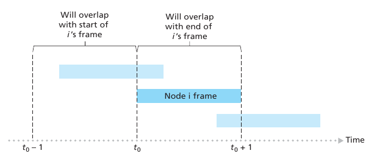

   - 最大效率 = 1/(2e) = 0.18

5. 载波侦听多址接入(CSMA)

   - 发送前监听信道:
     - 信道空闲: 发送整个帧
     - 信道忙:推迟发送
   - 冲突仍可能发生:
     - 由于存在传输延迟,节点可能没有监听到其它节点正在发送
     - 一旦发生冲突,整个帧传输时间被浪费

6. CSMA/CD (Collision Detection)

   - 带冲突检测的CSMA
     - 通过测量收到的信号强度检测冲突(冲突信号的强度较大)
     - **检测到冲突后立即停止传输损坏的帧**(减少信道浪费)
   - **以太网采用CSMA/CD协议**:

     1. NIC(Network Interface Card;网络接口卡)从网络层接收数据报,构造以太帧
     2. 若NIC**监听到信道空闲,立即发送帧**;若信道忙,坚持监听直至发现信道空闲,然后发送帧
     3. 若NIC发送完整个帧而没有检测到冲突,认为发送成功!
     4. 若NIC在**传输过程中检测到冲突,立即停止发送帧**,并发送一个阻塞信号
     5.  NIC进入**指数回退**阶段:
        - 第一次冲突: 从{0,1}中选择K,延迟**K· 512** **比特**时间
        - 第二次冲突后: 从{0,1,2,3}中选择K,......
        - 第三次冲突后: 从{0,1,2,3,4,5,6,7}中选择K,......
        - .....
        - 第10次冲突后,从{0,1,2,3,4,...,1023}中选择K,......

     6. 返回Step 2

#### 5.3.3 Taking-Turns Protocols

1. 轮询
   - 主节点轮流“邀请”从节点发送
   - 缺点: 引入轮询延迟+单点失效(主节点)
2. 令牌传递
   - 网络中有一个令牌,按照预定的顺序在节点间传递
   - 获得令牌的节点可以发送
   - 缺点: 令牌传递延迟+单点失效(令牌)

### 5.4 Switched Local Area Networks

#### 5.4.1 Link-Layer Addressing and ARP

1. 链路层编址

   - 每一块网络适配器(网卡)固定分配一个地址,称为MAC地址,也称物理地址、硬件地址、链路层地址等
   - MAC地址长6个字节,一般用由“ : ”或“ - ”分隔的6个十六进制数表示; FF-FF-FF-FF-FF-FF

2. ARP: Address Resolution Protocol

   - 地址解析: 获得与IP地址对应的MAC地址
   - 假设A想知道B的MAC地址:
     - A构造一个ARP请求,在发送方字段填入自己的MAC地址和IP地址,在目标字段填入B的IP地址。
     -  A将ARP请求封装在**广播帧**中发送

     - 每个收到ARP请求的节点用目标IP地址**与自己的IP地址比较**,地址相符的节点进行响应(B响应)。

     - B构造一个ARP响应,交换发送方与目标字段内容,在发送方硬件地址字段填入自己的MAC地址,修改操作字段为2

     - B将ARP响应封装在**单播帧**(目的地址为A的MAC地址)中发送。
   - ARP缓存: 
     - 每个节点在内存中维护一个地址映射(绑定)表,称**ARP表**。
     - 每次发送数据报前先查询ARP缓存,找不到需要的地址映射再发送ARP请求进行查询,并在收到ARP响应后将地址绑定缓存到ARP表中。
     - ARP缓存中的信息动态更新,并在超时(一般为15~20分钟)后删除。
     - 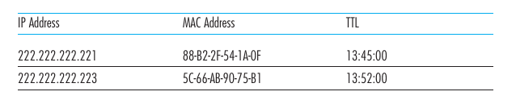

3. 发送数据到子网之外

   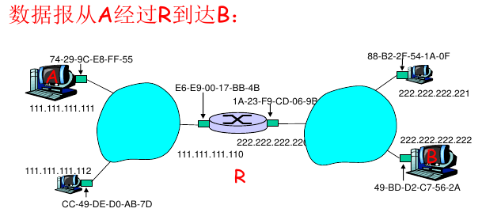

   - A知道下一跳地址为111.111.111.110(R-1)
     R知道B从其端口R-2直接可达
   -  A创建IP数据报,src IP=A, dest IP=B

   - A查找转发表,得到下一跳地址 111.111.111.110

   - A利用ARP获得下一跳111.111.111.110对应的MAC地址(R-1)

   - A创建链路层帧,封装IP数据包,src MAC =A, dest MAC = R-1,发送

   - R接收帧,取出IP数据报,发现目的地址为B

   - R查找转发表,得知B在其端口R-2的直连网络上

   - R利用ARP获得B的MAC地址

   - R创建链路层帧,封装IP数据报,src MAC=R-2, dest MAC = B, 发送

   - B的网卡接收帧,取出IP数据报,交给网络层

#### 5.4.2 Ethernet

1. 以太网
2. 无连接: 发送方NIC与接收方NIC之间没有握手
   不可靠: 接收方NIC不发送确认
   - **CRC检查出错的帧被丢弃**
   - 依靠上层协议(TCP或应用)恢复

#### 5.4.3 Link-Layer Switches

1. 自主学习

   - 当一个帧到达时,交换机从源MAC地址了解到发送节点,从帧到来的端口了解到发送节点的位置(从该端口可达)

   - 在转发表中记录发送节点和可达端口
   - 

2. 帧的过滤和转发

   当帧到来时:
   ```c
   记录帧的到来端口
   用帧的目的MAC地址查找端口转发表
   if 找到目的MAC地址 //已知节点
   	if 目的地址所在端口=帧的到来端口
       	丢弃帧//帧过滤
       else 
           转发帧到表项指定的端口 //按转发表转发
   else 
       扩散帧 //未知节点; 向输入端口以外的所有端口转发
   ```

3. 交换机 vs. 路由器

   - 均为存储-转发设备:
     - 交换机工作于链路层,根据MAC地址存储转发帧
     - 路由器工作于网络层,根据IP地址存储转发数据报
   - 内部都有转发表:
     - 交换机:使用“逆向学习法”学习转发表
     - 路由器:运行选路协议计算转发表
   - 初始化
     - 交换机是即插即用设备
     - 路由器需要手工配置
   - 速度与成本
     - 交换机转发速度快,成本低(二层设备)
     - 路由器转发速度慢,成本高(三层设备)
   - 结构
     - 交换机不能连接异构链路(即MAC协议不同的网络)
     - 路由器可以连接异构链路(重新封装链路层帧)
   - 阻断
     - 交换机不能阻断广播帧的传播: 交换机会扩散所有的广播帧,从而通过交换机连接的所有主机在同一个广播域中
     - 路由器可以阻断广播帧的传播: 每个路由器端口是一个独立的广播域

#### 5.4.4 Virtual Local Area Networks (VLANs)

1. 流量隔离的需要: 广播流量(如ARP)跨越整个局域网+安全/隐私问题

2. 若用路由器隔离流量: 增加路由器成本+降低交换机使用效率+网络重配置困难
3. 虚拟局域网(VLAN)的基本概念
   - 在一个物理局域网上,利用软件定义出若干个虚拟局域网
   - 每个VLAN在逻辑上是一个独立的IP子网:
     - 每个VLAN是一个单独的广播域,一个VLAN中的所有帧流量被限制在该VLAN中
     - 不同VLAN之间的通信要依赖于网络层路由

### 5.7 Retrospective: A Day in the Life of a Web Page Request

#### 5.7.1 Getting Started: DHCP, UDP, IP, and Ethernet

#### 5.7.2 Still Getting Started: DNS and ARP

#### 5.7.3 Still Getting Started: Intra-Domain Routing to the DNS Server

#### 5.7.4 Web Client-Server Interaction: TCP and HTTP

## Chapter 6Wireless and Mobile Networks

- 无线(wireless):使用无线链路通信,给物理层和数据链路层带来很多问题
- 移动(mobility):终端改变网络接入点,给网络层带来很大问题

### 6.1 Introduction

1. 无线网络的组成

   - 无线终端
   - 基站
     - 通常连接到固定网络,在无线终端和固定网络之间中继数据包,如**蜂窝塔,802.11 AP**
     - 通常负责协调与之关联的多个无线主机的传输
   - 无线链路
     - 连接无线终端和基站
     - 需要MAC协议协调无线链路的使用
     - 不同的无线链路具有不同的数据速率和传输距离

2. 无线网络的运行模式

   - 基础设施模式
     - 无线终端通过基站连接到固定网络(网络基础设施),所有传统的网络服务由固定网络提供
     - 切换:无线终端接入到不同基站的过程
   - 自组织模式
     - 网络中没有基站
     - 节点只能与其通信范围内的节点通信
     - 节点相互帮助转发分组,每个节点既是终端又是路由器

3. 无线网络的分类

   |            | 单跳                                                     | 多跳                                                         |
   | ---------- | -------------------------------------------------------- | ------------------------------------------------------------ |
   | 有基础设施 | 主机连接到基站,基站连接到固定网络(如WiFi,cellular)       | 主机通过多个无线节点的中继才能到达固定网络(如无线网状网络)   |
   | 无基础设施 | 无基站,不连接到固定网络,节点间通信不需要中继(如蓝牙网络) | 无基站,不连接到固定网络,节点间通信需要通过其它节点中继(如自组网,车载网) |

### 6.2 Wireless Links and Network Characteristics

- 无线链路的特性
  - 信号衰减: 信号在传播过程中能量逐渐减少(路径损耗)
  - 干扰: 受到其它信号源的干扰
  - 多径传播: 由于地面或物体的反射作用,信号沿多条不同长度的路径到达接收端

#### 6.2.1 CDMA

- 单一sender


- 多个sender


### 6.3 WiFi: 802.11 Wireless LANs

- IEEE 802.11无线局域网. 有多种b/a/g/n
  -  均使用CSMA/CA 作为MAC协议

  - 都支持基站模式和自组织模式
  -  物理层不同

#### 6.3.1 The 802.11 Architecture

1. 802.11无线LAN的基本组成单元是基本服务集(BSS, Basic Service Set)

   - 一个BSS 包括:

     - 若干无线终端
     - 一个无线接入点AP(Access Point)

   - 每个无线接口(终端及AP)均有一个全局唯一的MAC地址

     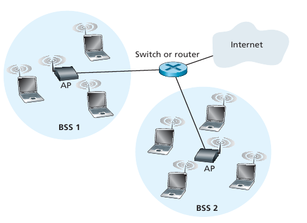

2. 802.11: 信道与关联

   - 802.11将通信频段划分成若干信道,每个BSS分配一个信道:
     - 管理员安装AP时,为AP分配一个服务集标识符(SSID; Service Set Identifier),并选择AP使用的信道
     - 相邻AP使用的信道可能相互干扰
   - 主机必须与一个AP关联:
     - 扫描信道,监听各个AP发送的信标帧(Beacon Frame; 包含AP的SSID和MAC地址)
     - 选择一个AP进行关联(可能需要身份鉴别)
     - 使用DHCP获得AP所在子网中的一个IP地址
   - 802.11: 主动/被动扫描
     - 被动扫描:
       (1)主机监听AP发送的信标帧
       (2)主机选择一个AP发送关联请求帧
       (3)AP向主机发送关联响应帧
     - 主动扫描:
       (1)主机广播探测请求帧
       (2)AP发送探测响应帧
       (3)主机从收到的探测响应中选择一个AP发送关联请求
       (4)AP发送关联响应帧
     - 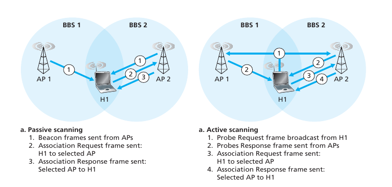

#### 6.3.2 The 802.11 MAC Protocol

1. 采用CSMA: 发送前监听信道,不与当前正在进行的发送冲突

   - 不检测冲突:
     - 发送过程中检测冲突很困难(接收信号的强度远小于发送信号的强度)
     - 不能检测出所有的冲突(隐藏节点)
   - 目标:避免冲突: CSMA/C(ollision)A(voidance)

2. 802.11的操作模式--PCF

   - PCF(Point Coordination Function)模式:
     - 该模式只能用于有基础设施(基站)的无线网络,由基站控制单元内的所有通信活动。
     - 轮询:基站依次询问单元中的节点,被询问到的节点可以发送它们的帧,不会有冲突发生。
     - 新节点注册:新加入的节点可以注册一个恒定速率的轮询服务,声明自己希望得到的带宽。
   - PCF的实现是**可选的**

3. 802.11的操作模式--DCF

   - DCF(Distributed Coordination Function):
     - 可用于有基础设施的无线网络和无基础设施的无线网络,所有实现**必须**支持DCF模式
     - 所有节点(AP和无线终端)使用CSMA/CA协议竞争信道
   - CSMA/CA支持两种机制:
     - 信道预约机制(可选)
     - 无信道预约的机制

4. 使用信道预约机制的CSMA/CA

   - A欲向AP发送一个数据帧:

     - A向AP发送一个RTS(Request to Send)帧,帧中给出随后要发送的数据帧及确认帧需要的总时间

     - AP收到后回复一个CTS(Clear to Send)帧,帧中给出同样的时间

     - A收到CTS帧后开始发送

     - AP收到帧后,发送一个ACK帧进行确认

     - (A附近)收到RTS帧及(AP附近)收到CTS帧的节点均沉默指定的时间,让出信道让A完成发送

     - 若A和B同时发送RTS帧,产生冲突,不成功的发送方随机等待一段时间后重试

       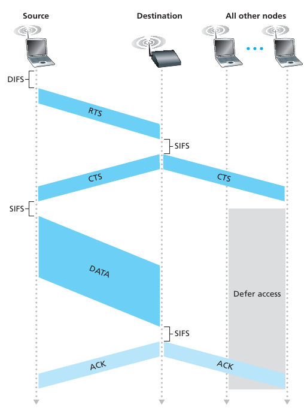

5. 帧间距机制

   - 802.11允许DCF和PCF在一个单元内共存,这是通过帧间距机制实现的。
   - 
   - SIFS:允许正处于会话中的节点优先发送,如收到RTS的节点发送一个CTS,收到数据帧的节点
     允许发送一个ACK帧。
   - PIFS:如果在SIFS后没有节点发送,在PIFS之后PCF模式的基站可以发送一个信标帧或一个轮询帧。
   - DIFS:如果PIFS后没有基站发送,DIFS之后任何节点可以竞争信道。
   - EIFS:如果以上间隔都没有发送,EIFS之后收到坏帧或未知帧的节点可以发送一个错误报告帧。

6. 不使用信道预约机制的CSMA/CA

   - 当节点有帧要发送时,侦听信道:
     1)若一开始就侦听到信道空闲,等待**DIFS**时间后发送帧
     2)若信道忙,选取一个**随机回退值**,在侦听到信道空闲时开始递减该值;在此过程中若侦听到信道忙,冻结计数值
     3)当计数值减为0时,发送整个帧并等待确认。
     4)若收到确认帧,表明帧发送成功,若还有新的帧要发送,从第2步开始CSMA/CA;若未收到确认,节点重新进入第2步中的回退阶段,并从一个更大的范围内选取随机值。
   - 如果有k个节点等待发送,它们随机选取的回退值确定了它们的发送顺序。
   - 

7. CSMA/CA与CSMA/CD的不同

   - 最根本的不同: CSMA/CD在发送过程中检测冲突,而CSMA/CA在发送过程中不检测冲突。
   - 由此带来的协议处理方面的不同: 在CSMA/CD中,节点侦听到信道空闲时立即发送;在CSMA/CA中,节点侦听到信道空闲后要随机回退。
   - 原因:冲突对无线网络损害很大,要尽可能避免。

#### 6.3.3 The IEEE 802.11 Frame


- 802.3 以太网: 有线
- 802.11 WIFI: 无线


#### 6.3.4 Mobility in the Same IP Subnet

- 主机停留在同一个IP子网中:IP 地址保持不变

- 交换机: 哪个AP与主机关联?
  自主学习:交换机收到主机发送的帧后,了解到从哪个交换机端口可以到达主机

  

#### 6.3.5 Advanced Features in 802.11

- 速率适应: 当主机移动或信噪比变化时,基站和主机动态改变传输速率(物理层调制技术)
- 功率管理
  - 节点设置功率管理比特,告知AP它将进入休眠状态:
    - AP缓存发往该节点的帧
    - 节点在下一个信标帧之前醒来
  - AP发送信标帧,其中包含一个移动节点列表--这些节点有帧缓存在AP中
    -  列表中的节点向AP请求帧,其余节点重新进入休眠

### 6.5 Mobility Management: Principles

#### 6.5.1 Addressing


- home network: 归属网络
- Permanent address: 永久地址
- COA: Care-of-Address: 转交地址

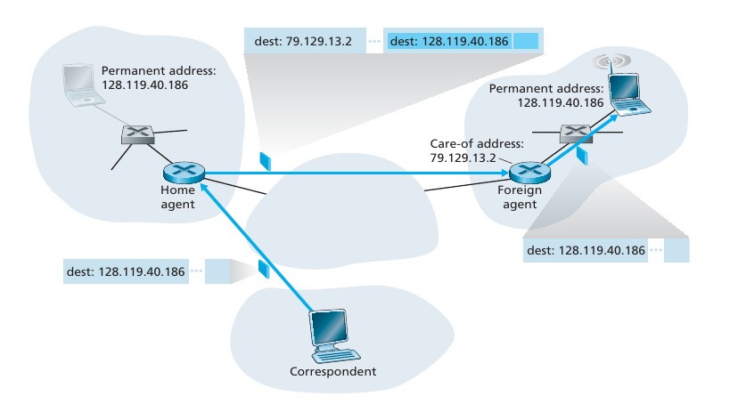

#### 6.5.2 Routing to a Mobile Node

1. 间接选路:终端在外地网络间移动

   - 假设节点移动到另一个网络:
     - 向新的外地代理注册
     - 新的外地代理向归属代理注册
     - 归属代理更新移动节点的转交地址
     - 归属代理使用新的转交地址向移动节点转发包
   - 节点移动及变换外地网络等对通信者都是透明的:正在进行的通信可以保持!

2. 直接选路到移动节点

   

   - 克服了三角选路的问题

   - 对通信者不透明:

     - 通信者需要知道移动节点的转交地址
     - 通信者(包括固定节点)需要增加对移动通信的支持

   - anchor foreign agent

     

### 6.6 Mobile IP

1. 代理发现

   - 愿意充当归属代理或外地代理的路由器定期在网络上发送代理通告,宣布自己的存在及IP地址
   - 愿意充当外地代理的路由器在代理通告中会提供一个或多个转交地址(通常使用自己的IP地址作为转交地址)
   - 移动节点通过接收和分析代理通告,判断自己是否处于外地网络以及是否切换了网络
   - 如果发现在外地网络上,移动节点从外地代理提供的转交地址中选择一个作为自己的转交地址

2. 移动主机注册

   - 移动节点向外地代理发送一个注册请求,给出自已的永久地址、转交地址、归属代理地址以及认证信息等

   - 外地代理记录相关信息,向归属代理转发注册请求归属代理处理注册请求,若认证通过,将移动节点的永久地址及转交地址保存在绑定表中,发回一个注册响应

   - 外地代理收到有效的注册响应后,将移动节点记录在自己的转发表中,向移动节点转发注册响应

   - 当移动节点回到归属网络时,要向归属代理注销

   - 注册请求和响应

     

3. 数据报间接选路

   - 数据包首先被归属代理得到

   - 归属代理查找地址绑定表,获得移动节点当前的转交地址

   - 归属代理将数据包发送到转交地址

   - 外地代理将数据包转发给移动节点

   - 归属代理通过隧道转发数据包

     

### 6.8 Wireless and Mobility: Impact on Higher-Layer Protocols

- 逻辑上,没什么影响:
  - 为上层协议提供的仍然是尽力而为的服务
  - TCP和UDP也可以运行无线网络上
-  性能上,有很大影响:
  - 传输出错或切换都会导致丢包(丢包率高),链路层重传会产生很大延迟
  - TCP将丢包(长延迟也当作丢包)解释为拥塞,不必要地减小拥塞窗口,导致应用吞吐率很低(无线链路的带宽本来就很低)

## Chapter 8Security in Computer Networks

### 8.1 What Is Network Security?

1. 网络中的通信安全
   - 机密性:
     - 报文内容的机密性
     - 通信活动的机密性
   - 端点鉴别: 发送者和接收者能够证实对方的身份
   - 报文完整性: 报文来自真实的源,且传输过程中未被修改
   - 运行安全性: 网络不受攻击,网络服务可用
2. 常见的安全机制
   - 加密:使用数学算法对数据进行变换,使其不易理解
   - 鉴别:通过报文交换确信一个实体的身份,以防假冒
   - 数据完整性:用于保护数据单元或数据单元流的完整性,以防报文修改
   - 数字签名:附加在一个数据单元后面的数据,用来证明数据单元的起源及完整性,以防伪造及抵赖
   - 流量填充:在数据流间隙中插入比特,以挫败流量分析的企图
   - 访问控制:通过授权机制限制用户对资源的访问,防止越权

### 8.2 Principles of Cryptography

- 针对加密系统的密码分析攻击
  - 惟密文攻击: 密码分析者知道算法,但仅能根据截获的密文进行分析,以得出明文或密钥
  - 已知明文攻击: 密码分析者除了有截获的密文外,还有一些已知的“明文-密文对”来帮助破译密码,以得出密钥
  - 选择明文攻击: 密码分析者可以任意选择一定数量的明文,让被攻击的加密算法加密,得到相应的密文,以利于将来更有效地破解由同样加密算法及相关密钥加密的信息。
  - 一个安全的加密系统必须能抵御选择明文攻击

#### 8.2.1 Symmetric Key Cryptography

- 密码块链接(Cipher Block Chaining)

  - 若每个明文块被独立加密,相同的明文块生成相同的密文块,容易被重放攻击利用。

    

  - 密码块链接(CBC):

    -  发送方生成一个随机的初始向量c(0),用明文发送给接收者

    - 每一个明文块加密前,先与前一个密文块进行异或,然后再加密: 第一个明文块与c(0)异或

    - 相同的明文块几乎不可能得到相同的密文块

      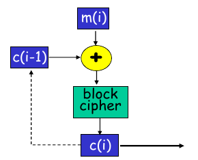

      $$
      c(i)=K_s(m(i)\oplus c(i-1))	\\
      m(i)=K_s(c(i)\oplus c(i-1))
      $$


#### 8.2.2 Public Key Encryption

$$
m=K^+(K^-(m))=K^-(K^+(m))
$$

- RSA算法

  1. 随机大素数$p,q,p\ne q$
  2. $n=pq$
  3. 选取小奇数$e$与$\phi(n)=n(1-1/p)(1-1/q)=(p-1)(q-1)$互素
  4. 计算$d$，其中$ed\equiv 1 \pmod{\phi(n)}$
  5. 公钥$P=(e,n)$则$C=M^e\pmod n$
  6. 私钥$S=(d,n)$则$M=C^d \pmod n$

  

### 8.3 Message Integrity and Digital Signatures

#### 8.3.1 Cryptographic Hash Functions

#### 8.3.2 Message Authentication Code(MAC)

- 报文鉴别码: Message Authentication Code(MAC)
- 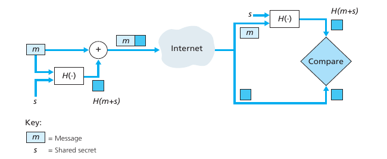
- 目的是：验证报文的完整性。

#### 8.3.3 Digital Signatures

- 数字签名：报文来源+报文完整性

  - 方法：对H(m)进行私钥加密

  

- 应用数字签名：公钥认证

  为使公钥密码体系有实际应用,每个实体必须能够确认它得到的公钥确实来自声称的实体。

  - 证书的获取

    - Bob向CA(Certification Authority)注册其公钥:

      - Bob向CA提供身份证明

      -  CA验证了Bob的身份后创建证书,绑定Bob及其公钥

      -  证书包含Bob的公钥,并有CA的**数字签名**

        

  - 证书的验证

    -  当Alice需要Bob的公钥时:

      - 获取Bob的证书

      - 使用CA的公钥验证Bob的证书,得到Bob的公钥 

        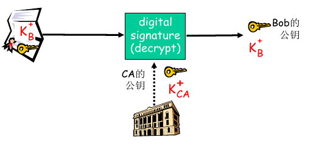

### 8.4 End-Point Authentication

#### 8.4.5 Authentication Protocol ap4.0

- Goal: 避免重放攻击
- Nonce: 只用一次的数(不重数)
- ap4.0: Bob向Alice发送不重数R,Alice用共享密钥加密R,回送给Bob。
- 缺点:需要一个共享的对称密钥
- 

#### 8.4.5 Authentication Protocol ap5.0

-  采用公开密钥算法加密不重数
- 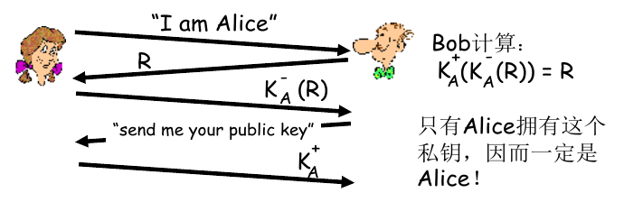

### 8.5 Securing E-Mail

#### 8.5.1 Secure E-Mail

- Alice ==> Bob
- 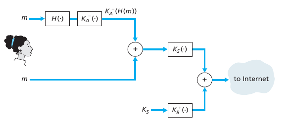
- 鉴别发送方与报文完整性：数字签名$S=(m,K^-_A(H(m)))$
- 报文加密（对称密钥快）$c=K_S(S)$
- 对称加密密钥的发送：$ks=K^+_B(K_S)$

#### 8.5.2 PGP

-  PGP:一个开放源码的安全电子邮件软件包,提供对邮件的保密、鉴别、数字签名和压缩服务。PGP较多地用于个人电子邮件安全。(因特网安全电子邮件的事实标准)

### 8.6 Securing TCP Connections: SSL

1.  向基于TCP的网络应用提供安全的传输层服务:
    如支持Web浏览器和服务器之间的安全通信(https) 

2. 安全服务: 服务器鉴别,数据加密,客户鉴别(可选)

   

### 8.9 Operational Security: Firewalls and Intrusion Detection Systems

#### 8.9.1 Firewalls

1. 在可信的内部网络与不可信的外部网络之间执行访问控制策略的硬件或软件系统

2. 目的是保护内部网络免受来自外部网络的攻击。

   

3. 防火墙的类型

   - 包过滤防火墙

     -  内部网络通过有包过滤功能的路由器连接到因特网上

     - 路由器对数据包进行逐包过滤,基于以下字段决定转发包还是丢弃包:

       - 源IP地址,目的IP地址
       - TCP/UDP源端口号、目的端口号
       - ICMP 报文类型
       - TCP SYN标志和 ACK标志

     - 例子

       | 策略                                                        | 防火墙设置                                              |
       | ----------------------------------------------------------- | ------------------------------------------------------- |
       | 不允许访问外部Web网站                                       | 丢弃所有外出的、目的端口为80的包                        |
       | 不允许外部发起的TCP连接,<br/除非访问的是内网的公共web服务器 | 丢弃进入的TCP SYN包,除非<br/去往130.207.244.203的端口80 |
       | 防止因特网广播吞噬网络带宽                                  | 除DNS包和路由器广播包,丢弃其它进入的UDP包               |
       | 防止网络拓扑被探测(traceroute)                              | 丢弃所有外出的ICMPexpired包TTL状态检测防火墙            |

   - 状态检测防火墙

   - 状态检测防火墙

     - 包过滤防火墙孤立地过滤每个包,仍会允许一些异常的包进入
     - 状态检测防火墙可以跟踪TCP连接的状态:跟踪连接的建立(SYN)和关闭(FIN)等状态,判断收到的包是否有意义

   - 应用网关

     -  应用网关除了检查网络层及传输层协议头,还检查应用层数据

#### 8.9.2 Intrusion Detection Systems

- IDS: intrusion detection system

  - 深度数据包检查: 查看包内容(如检查包中是否包含已知的病毒特征、攻击特征等)

  - 检查多个包之间的关联性:

    - 端口扫描
    - DoS攻击

  -  网络中可以设置多个IDS: 在不同位置进行不同类型的检查

    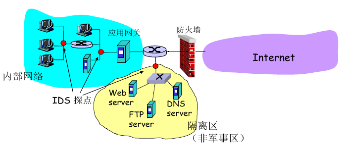