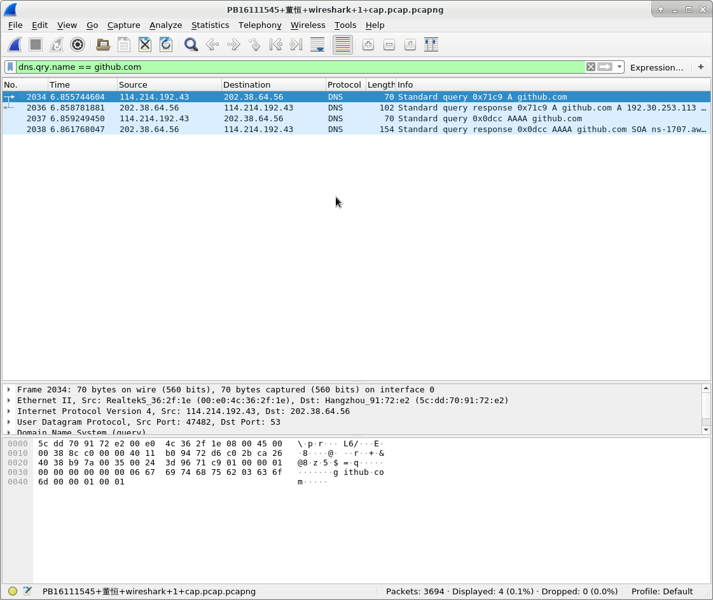
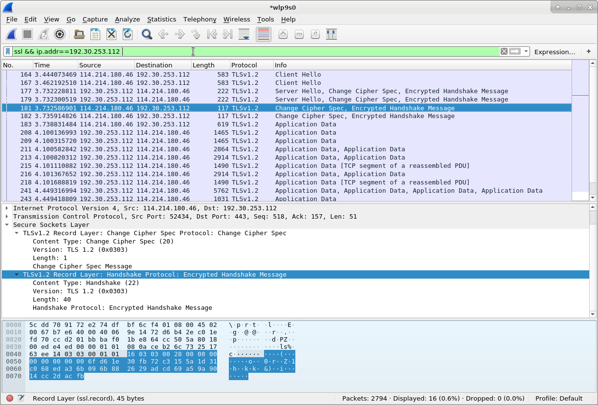

## 实验平台

`Archlinux`

## Wireshark 安装与使用

### 安装

 ```bash
yaourt wireshark
 ```

选择`qt`或者`gtk`

我选择`qt`的

### 使用

使用`ctrl+E`开始抓包，但是一开始会显示权限错误，

```
couldn't run /usr/bin/dumpcap in child process permission denied
```

使用下面的命令处理

```bash
sudo chmod +x /usr/bin/dumpcap
```

安装`nslookup`

```bash
sudo pacman -S dnsutils
```

## 实验内容

### 1. 保存结果

### 2. 分析DNS解析过程

#### 显示过滤器

定义显示过滤器为

```
dns.qry.name == github.com
```



#### 数据包解释

```
2034:查询github.com: type A, class IN
2036:回复2034的查询，回复内容为github.com: type A, class IN, addr 192.30.253.113; github.com: type A, class IN, addr 192.30.253.112
2037:查询github.com: type AAAA, class IN
2038:回复2037的查询，回复内容为github.com: type SOA, class IN, mname ns-1707.awsdns-21.co.uk
```

#### 交互过程的多次DNS query

[A、MX、CNAME、URL、NS、AAAA解析类型的区别](https://www.dns.la/support/art_328.aspx)

[DNS 原理入门](http://www.ruanyifeng.com/blog/2016/06/dns.html)

仅仅观察github.com的DNS域名解析的话，有两次，一次得到了IPv4的地址，另一次得到了IPv6的权威DNS地址

考虑到其他内容的话，是相关网页的域名的解析。

也有可能是timeout. 也有可能是同时一开始同时遇到多个需要query的内容，依次触发，而首次的query还没有完成。

### 3. https握手

#### reference

[关于https 和 ssl握手的理解](https://blog.csdn.net/nyyjs/article/details/72832896)

[从wireshark抓包看百度的https流程](https://blog.csdn.net/u010536377/article/details/78989931)

#### 截图

使用的过滤条件

```
ssl && ip.addr==192.30.253.112 
```



#### 握手

图中是出现了两个同样的握手，下面给出第一次的图解

```
-->164 Client Hello 
<--177 Server Hello, Change Cipher Spec, Encrypted Handshake Message
-->181 Change Cipher Spec, Encrypted Handshake Message
-->183	Application Data
<--208	Application Data
```


```sequence
Client-->Server : <164> Client Hello
Server-->Client : <177> Server Hello, Change Cipher Spec, Encrypted Handshake Message
Client-->Server : <181> Change Cipher Spec, Encrypted Handshake Message
```


