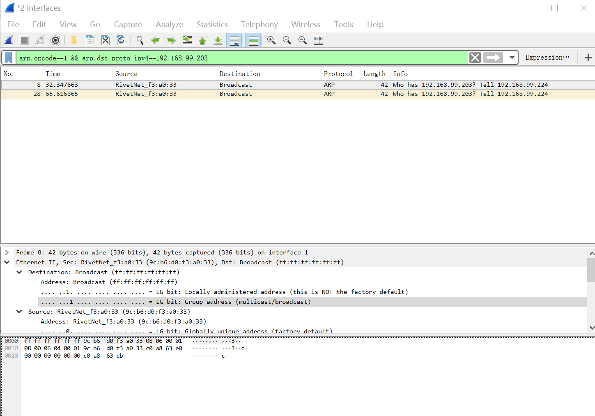
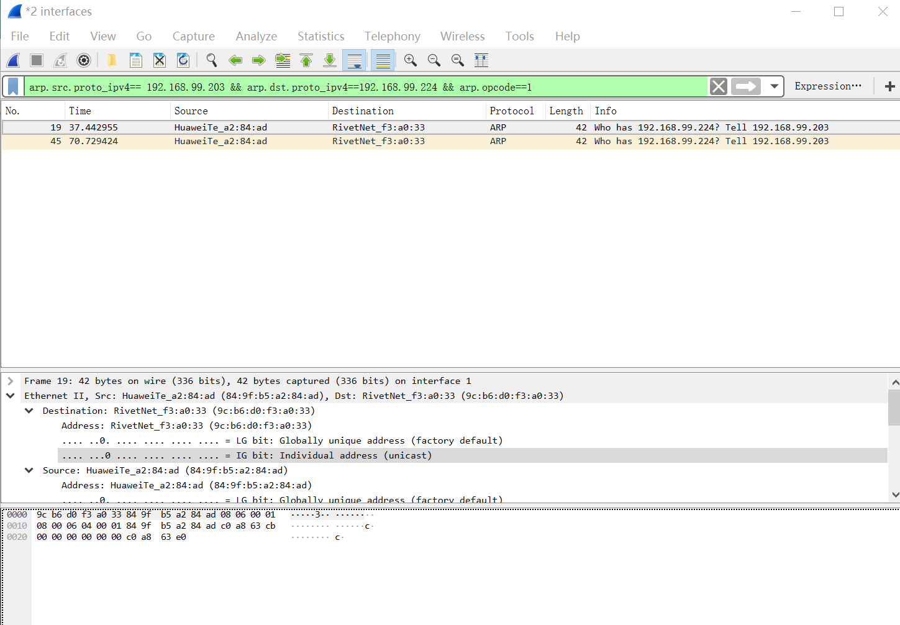
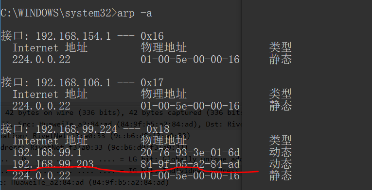
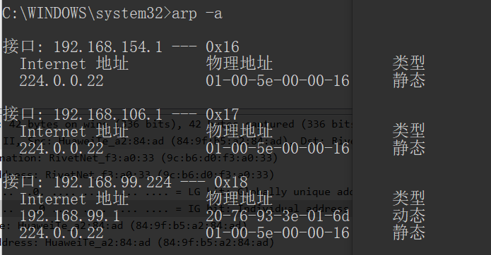
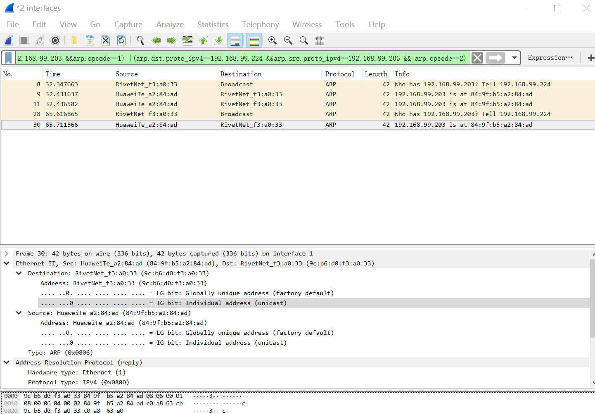

# 实验内容

>  利用wireshark观察arp数据包.

## (1) 

>  指定显示过滤器, 只显示”请求指定IP的MAC地址”的arp数据包.

首先使用`ipconfig`得到本机的`ip==192.168.99.224` 默认网关`default gateway==192.168.99.1`

先打开管理员权限的`cmd` 然后清空`arp -d`

然后打开`wireshark` 

过滤条件为`arp`

ping 某个地址(手机的ip)连在同一个wifi上

```
ping 192.168.99.203
```

所要求的显示过滤为

```
arp.opcode==1 && arp.dst.proto_ipv4==192.168.99.203
```

表示现在要知道`192.168.99.203`对应的MAC地址




## (2) 

>  指定显示过滤器, 只显示指定主机发送的”请求指定IP的MAC地址”
> 的arp数据包.

比如现在请求主机为(手机)`192.168.99.203` 它想知道(电脑) `192.168.99.224`的MAC地址。那么使用的显示过滤条件为

```
arp.src.proto_ipv4== 192.168.99.203 && arp.dst.proto_ipv4==192.168.99.224 && arp.opcode==1
```



## (3)

>  删除本地缓存的某个主机的arp条目, 然后ping该主机, 定义过滤器,只显示重建该arp条目的数据包. 

先`arp -a`



```
arp -d 192.168.99.203
```

此时再`arp -a`



没有那个地址了

然后再`ping 192.168.99.203`

由于本机的ip为`192.168.99.224`那么过滤条件设为

```
(arp.src.proto_ipv4== 192.168.99.224 && arp.dst.proto_ipv4==192.168.99.203 &&arp.opcode==1)||(arp.dst.proto_ipv4==192.168.99.224 &&arp.src.proto_ipv4==192.168.99.203 && arp.opcode==2)
```

