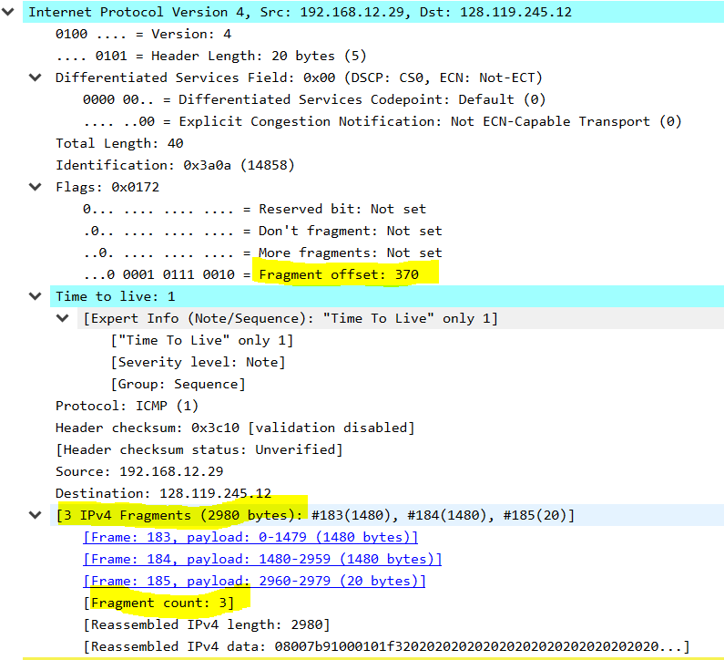
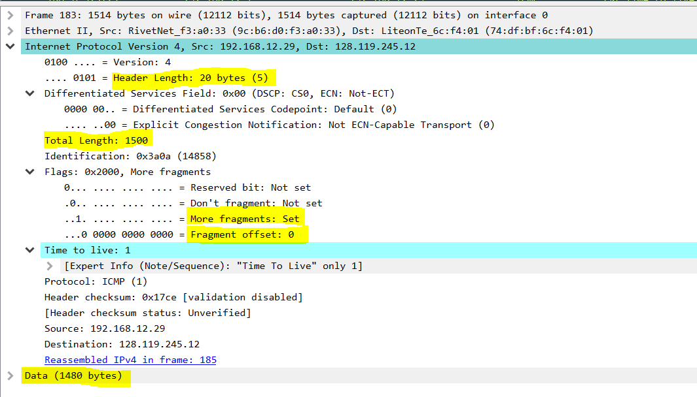
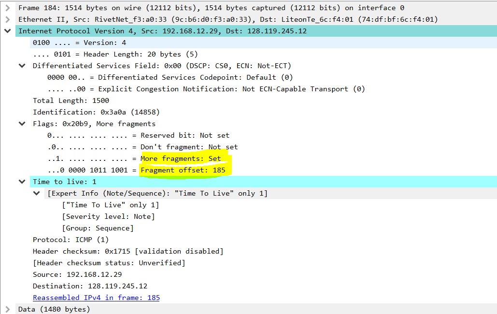

## 实验平台

win10,  wireshark, PingPlotter

由于这次需要用到PingPlotter.exe在linux上没有（虽然也有替代品），为了实验平台的一致性，转到win10做实验

## 实验内容

利用 wireshark 和 PingPlotter 观察网络层数据包

1. 下载并安装wireshark以及PingPlotter
2. 配置PingPlotter发包大小为3000Bytes
3. 启动wireshark
4. 启动PingPlotter追踪 gaia.cs.umass.edu，大约count值为3-4次时停止

## 结果分析

### 1. 

> 使用显示过滤器，过滤出本机到目的主机的所有IP和ICMP数据包

使用的过滤条件为

```
(icmp||ip) && ip.dst==128.119.245.12 &&ip.src==192.168.12.29
```


### 2. 

> 查找本机发送的第一个 TTL等于1 的 ICMP Echo Request 消息，请问此IP
> 数据报是否被分片（fragmented）？

分片了。查看info部分的`ttl`很容易找到找到`ttl=1`的部分。

点进去查看，就可以看到下面的fragment部分。然后可以发现前两个都是此分片之一（见高亮部分）。



### 3. 

> 打印出碎片IP数据报的第一个片段。IP 头中的哪些信息表明数据报已碎
> 片化？IP报头中的哪些信息表明这是第一个片段还是后一个片段？这个
> IP 数据报header有多少个字节？有效负载有多少个字节？

打印出ip报头如下：

```
Frame 183: 1514 bytes on wire (12112 bits), 1514 bytes captured (12112 bits) on interface 0
Ethernet II, Src: RivetNet_f3:a0:33 (9c:b6:d0:f3:a0:33), Dst: LiteonTe_6c:f4:01 (74:df:bf:6c:f4:01)
Internet Protocol Version 4, Src: 192.168.12.29, Dst: 128.119.245.12
    0100 .... = Version: 4
    .... 0101 = Header Length: 20 bytes (5)
    Differentiated Services Field: 0x00 (DSCP: CS0, ECN: Not-ECT)
        0000 00.. = Differentiated Services Codepoint: Default (0)
        .... ..00 = Explicit Congestion Notification: Not ECN-Capable Transport (0)
    Total Length: 1500
    Identification: 0x3a0a (14858)
    Flags: 0x2000, More fragments
        0... .... .... .... = Reserved bit: Not set
        .0.. .... .... .... = Don't fragment: Not set
        ..1. .... .... .... = More fragments: Set
        ...0 0000 0000 0000 = Fragment offset: 0
    Time to live: 1
        [Expert Info (Note/Sequence): "Time To Live" only 1]
    Protocol: ICMP (1)
    Header checksum: 0x17ce [validation disabled]
    [Header checksum status: Unverified]
    Source: 192.168.12.29
    Destination: 128.119.245.12
    Reassembled IPv4 in frame: 185
Data (1480 bytes)
```

截图如下：



从高亮部分的`More fragments`看出已经碎片化，而且不是最后一个片，从`Fragment offset=0`可以看出是第一个片。header可以从`Header Length: 20 Bytes`看出，有效负载为`Total Length=1500`减去header部分，从而为1480 bytes，同时也可以从`Data (1480 bytes)`看出。

### 4. 

> 打印出碎片 IP 数据报的第二个片段。IP 报头中的哪些信息表明这不是第
> 一个数据报片段？是否还有更多的片段？

打印如下

```
Frame 184: 1514 bytes on wire (12112 bits), 1514 bytes captured (12112 bits) on interface 0
Ethernet II, Src: RivetNet_f3:a0:33 (9c:b6:d0:f3:a0:33), Dst: LiteonTe_6c:f4:01 (74:df:bf:6c:f4:01)
Internet Protocol Version 4, Src: 192.168.12.29, Dst: 128.119.245.12
    0100 .... = Version: 4
    .... 0101 = Header Length: 20 bytes (5)
    Differentiated Services Field: 0x00 (DSCP: CS0, ECN: Not-ECT)
        0000 00.. = Differentiated Services Codepoint: Default (0)
        .... ..00 = Explicit Congestion Notification: Not ECN-Capable Transport (0)
    Total Length: 1500
    Identification: 0x3a0a (14858)
    Flags: 0x20b9, More fragments
        0... .... .... .... = Reserved bit: Not set
        .0.. .... .... .... = Don't fragment: Not set
        ..1. .... .... .... = More fragments: Set
        ...0 0000 1011 1001 = Fragment offset: 185
    Time to live: 1
        [Expert Info (Note/Sequence): "Time To Live" only 1]
            ["Time To Live" only 1]
            [Severity level: Note]
            [Group: Sequence]
    Protocol: ICMP (1)
    Header checksum: 0x1715 [validation disabled]
    [Header checksum status: Unverified]
    Source: 192.168.12.29
    Destination: 128.119.245.12
    Reassembled IPv4 in frame: 185
Data (1480 bytes)

```

截图如下



从高亮部分的	`Fragment offset`不为0可以看出不是第一个片。由`More fragment`可以看出还有更多的片。

### 5. 

> 从原始数据报创建了多少个片段？如何判断是最后一个片段？最后一个
> IP数据报负载有多少个字节？TTL的值？下层协议字段？

打印出最后一个片段如下

```
Frame 185: 54 bytes on wire (432 bits), 54 bytes captured (432 bits) on interface 0
Ethernet II, Src: RivetNet_f3:a0:33 (9c:b6:d0:f3:a0:33), Dst: LiteonTe_6c:f4:01 (74:df:bf:6c:f4:01)
Internet Protocol Version 4, Src: 192.168.12.29, Dst: 128.119.245.12
    0100 .... = Version: 4
    .... 0101 = Header Length: 20 bytes (5)
    Differentiated Services Field: 0x00 (DSCP: CS0, ECN: Not-ECT)
        0000 00.. = Differentiated Services Codepoint: Default (0)
        .... ..00 = Explicit Congestion Notification: Not ECN-Capable Transport (0)
    Total Length: 40
    Identification: 0x3a0a (14858)
    Flags: 0x0172
        0... .... .... .... = Reserved bit: Not set
        .0.. .... .... .... = Don't fragment: Not set
        ..0. .... .... .... = More fragments: Not set
        ...0 0001 0111 0010 = Fragment offset: 370
    Time to live: 1
        [Expert Info (Note/Sequence): "Time To Live" only 1]
            ["Time To Live" only 1]
            [Severity level: Note]
            [Group: Sequence]
    Protocol: ICMP (1)
    Header checksum: 0x3c10 [validation disabled]
    [Header checksum status: Unverified]
    Source: 192.168.12.29
    Destination: 128.119.245.12
    [3 IPv4 Fragments (2980 bytes): #183(1480), #184(1480), #185(20)]
        [Frame: 183, payload: 0-1479 (1480 bytes)]
        [Frame: 184, payload: 1480-2959 (1480 bytes)]
        [Frame: 185, payload: 2960-2979 (20 bytes)]
        [Fragment count: 3]
        [Reassembled IPv4 length: 2980]
        [Reassembled IPv4 data: 08007b91000101f320202020202020202020202020202020...]
Internet Control Message Protocol
```


从`Fragment count: 3`看出共创建了3个片段。`More fragments: not set`表明是最后一个片段。

`Totol Length: 40` `Header Length: 20`可以知道最后一个片段20 bytes. 

`Time to Live: 1`表明`TTL=1` 

`Protocol: ICMP`

 

