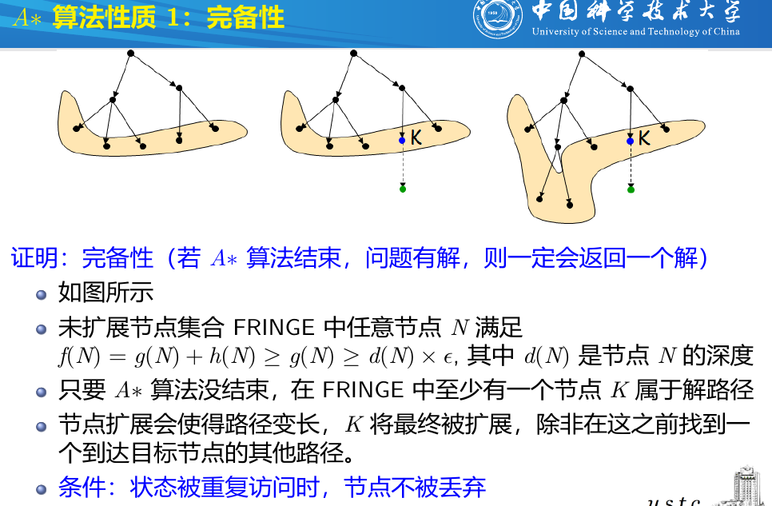
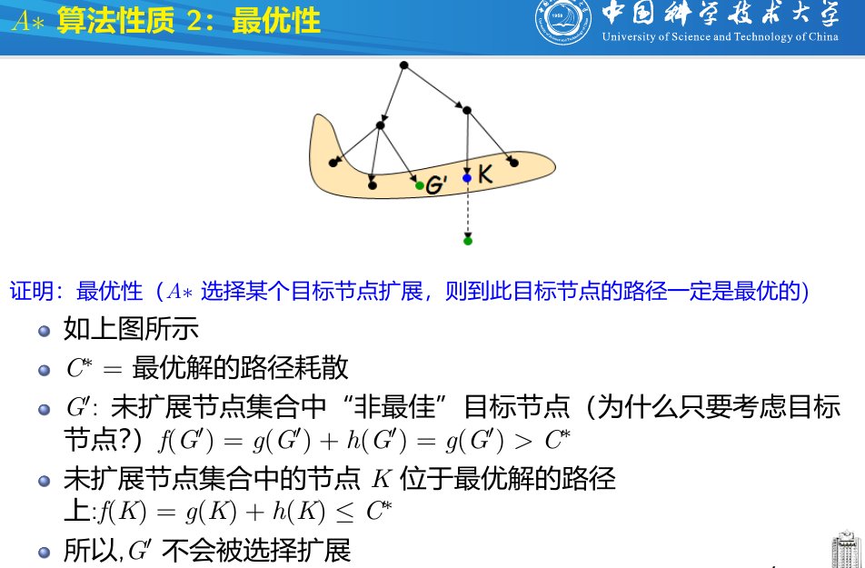
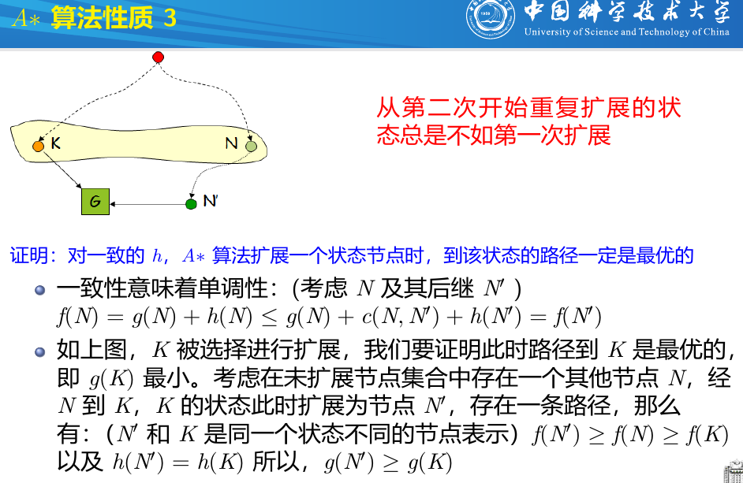
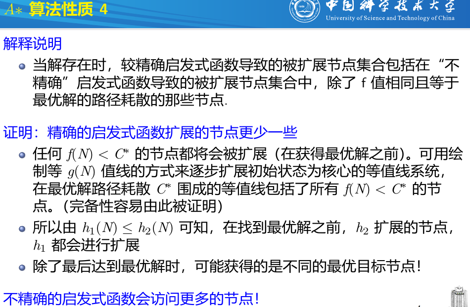
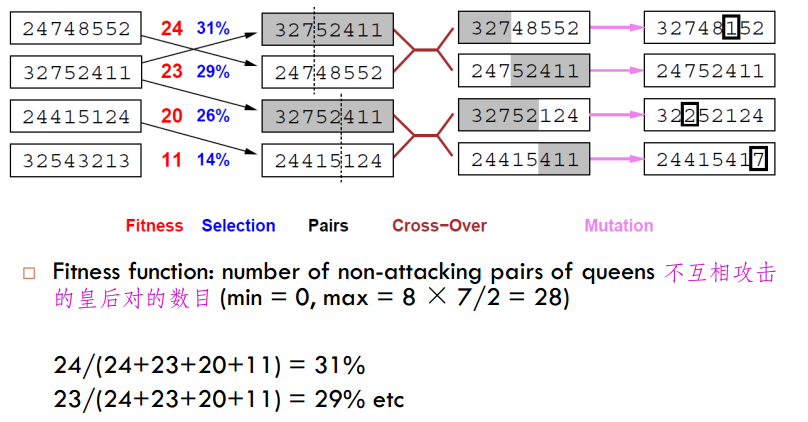
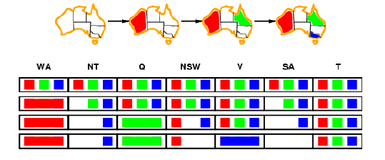
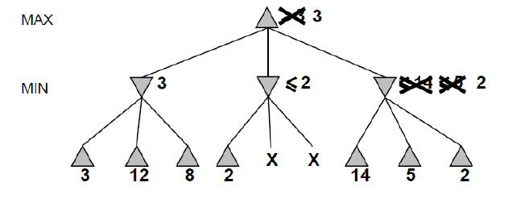
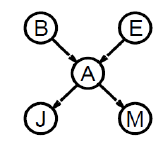
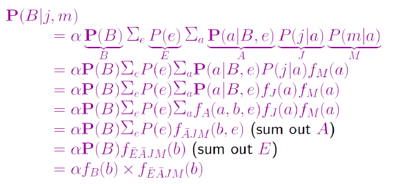
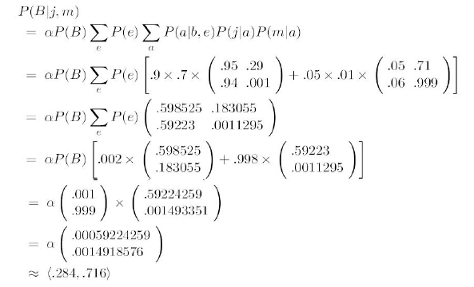

# 人工智能基础复习

搜索问题形式化: :状态空间、初始状态、后继函数、目标测试、路径耗散

## 无信息搜索策略

| Criterion | Breadth-First | Uniform-Cost                                               | Depth-First  | Depth-Limited     | Iterative Deepening |
| --------- | ------------- | ---------------------------------------------------------- | ------------ | ----------------- | ------------------- |
| Complete? | Yes           | Yes                                                        | No(无限深度) | No                | Yes                 |
| Time      | $O(b^{d+1})$  | $O(b^{\lceil C^* /\epsilon \rceil})$ $C^*$最优解cost       | $O(b^m)$     | $O(b^l)$          | $O(b^d)$            |
| Space     | $O(b^{d+1})$  | $O(b^{\lceil C^* /\epsilon \rceil})$ $\epsilon$ 每一步cost | $O(bm)$      | $O(bl)$           | $O(bd)$             |
| Optimal?  | Yes           | Yes                                                        | No           | No                | Yes                 |
| 描述      | FIFO每一层    | 优先展开cost最小的节点                                     |              | DFS加上限制的深度 | 左边的每轮增大限制  |

> b: Branching Factor; d: Solution depth; m: Maximum depth 

在有环的图中，需要标记visited

## 有信息搜索策略

A*搜索

$f( n) = g (n) + h (n)$ 

- $g (n)$ = 从开始到节点n的耗散
- $h (n)$ =  启发函数：从节点n到目标节点的最低耗散路径的耗散估计值
- $f ( n) $= 经过节点n的整体最低耗散的估计函数

可采纳启发式：$h (n) ≤ h ^*( n)$ 其中 $h ^*( n)$ 是从n到目标的真实代价 (也要求$h (n) ≥ 0 $, 所以对于任何目标有$h (G) = 0$ )

- $f(n) = g(n)$: Uniform Cost

- $f(n) = h(n)$: Greedy

- $f(n) = g(n) + h(n)$: A*

一致的: $h(n)\le c(n,n')+h(n')$ 避免重复访问节点

启发函数设计: 可采纳的, 更精确的, 一致的

**Local search algorithms** (局部搜索算法)

原因:　A*算法所需的储存状态的内存空间太大，对于大问题不适用。

- **Hill-climbing search** (爬山法搜索)

  每次都选择下一步最好的状态。可能是局部最大值。

  Hill-Climbing with Random Restarts

- **Simulated annealing search** (模拟退火搜索)

  与爬山算法最大的区别是，允许一些不好的moves, 但是会逐渐降低这种概率。

- **Local beam search** (局部剪枝搜索)

  开始随机k个状态搜索，每次选择后继，然后从后继中选择k个状态作为最优的。

- **Genetic algorithms** (遗传算法)

  自然选择，每个后继都由两个parent状态结合而成，从k个随机的状态开始，每个状态都由一个有限的字母表排列的string表示，有一个Evaluation Function(fitness function 适应度函数)，越高就越好。产生下一代的方式有，selection, crossover, mutation

  

  

## CSP

Constraint Satisfaction Problem

带回溯的搜索

优化 

- 变量？
  - 具有最少合法值
  - 约束最多

- 值？

  - 给剩下变量最多余地的值

    Forward checking（向前检验）

    

- 提早检测失败？

  - Arc consistency （弧相容）

    X取任意x, 则Y总可找到y满足约束

## minimax

永远假设对方取最优的值

$\alpha-\beta$剪枝

$\alpha$为对MAX来说，可以容忍的最小的

$\beta$为对MIN来说，可以容忍的最大的

## Bayes‘ Rule 

Prior probability（先验概率）:在没有任何其它信息存在的情况下关于命题的信度

Chain Rule
$$
\begin{aligned}
P(X_1,\cdots,X_n) =\prod_{i=1}^n P(X_i|X_1,\cdots,X_{i-1})
\end{aligned}
$$
Independence and Bayes‘ Rule 

Conditionally Independent: A and B are conditionally independent given C
$$
\begin{aligned}
&P(A|B,C) =P(A|C) \\
&P(B|A,C)=P(B|C)\\
&P(A,B|C)=P(A|C)P(B|C)
\end{aligned}
$$
Bayes' Rule
$$
P(ab)=P(a|b)P(b)=P(b|a)P(a)	\\
\Longrightarrow P(a|b)=\frac{P(b|a)P(a)}{P(b)}
$$
or
$$
P(Y|X)=\frac{P(X|Y)P(Y)}{P(X)}=\alpha P(X|Y)P(Y)
$$
or
$$
P(\text{Cause}|\text{Effect})=\frac{P(\text{Effect}|\text{Cause})P(\text{Cause})}{P(\text{Effect})}
$$
Naive Bayes model
$$
P(\text{Casue},\text{Effect}_1,...,\text{Effect}_n)=P(\text{Cause})\prod_i P(\text{Effect}_i | \text{Cause})
$$

## Bayesian networks

### Bayesian networks

有向无环

Global semantics: 全联合概率分布可以表示为贝叶斯网络中的条件概率分布的乘积
$$
P(x_1,\cdots,x_n)=\prod_{i=1}^n P(x_i|\text{parents}(X_i))
$$
Local semantics

给定父节点，一个节点与它的非后代节点是条件独立的

Theorem: Local semantics $\Leftrightarrow$ global semantics

- **Causal Chains**

> X ==> Y ==> Z

$$
P(x,y,z)=P(x)P(y|x)P(z|y)
$$

X is independent of Z given Y
$$
P(z|x,y)=\frac{P(x,y,z)}{P(x,y)}=\frac{P(x)P(y|x)P(z|y)}{P(x)P(y|x)}=P(z|y)
$$

- **Common Cause**

> Y ==> X, Y ==> Z

X  and Z **are** **not** independent

X and Z **are** independent given Y
$$
P(z|x,y)=\frac{x,y,z}{P(x,y)}=\frac{P(y)P(x|y)P(z|y)}{P(y)P(z|y)}=P(z,y)
$$

- **Common Effect**

> X == Y, Z == Y

X and Z **are** independent

X and Z **are not **independent given Y

### Inference in Bayesian networks

$$
\begin{align}
P(B|j,m)&= \frac{P(B,j,m)}{P(j,m)}\\
&= \alpha P(B,j,m)	\\
&= \alpha \sum_e \sum_a P(B,e,a,j,m)	\\
&= \alpha \sum_e \sum_a P(B)P(e)P(a|B,e)P(j|a)P(m|a)	\\
&= \alpha P(B) \sum_e P(e) \sum_{a}P(a|B,e)P(j|a)P(m|a)
\end{align}
$$

变量消去法

## Decision Trees

 熵(entropy)度量随机变量的不确定性，熵越大，不确定性越大
$$
H(X)=-\sum_{i=1}^np_i \log p_i	\\
0\le H(X) \le \log n
$$
条件熵，给定$X$时随机变量$Y$的不确定性
$$
H(Y|X)=\sum_{i=1}^n p_i H(Y|X=x_i)	\\
p_i=P(X=x_i)
$$
信息增益
$$
g(D,A)=H(D)-H(D|A)
$$
信息增益的算法

设训练集为$D$，　$|D|$表示样本容量，设有$K$个类$C_k$，设特征$A$有$n$个不同的取值$\{a_1,a_2,\cdots,a_n\}$, 将样本划分为$n$个子集$D_1,D_2,\cdots, D_n$. 子集$D_i$中属于类$C_k$的样本为$D_{ik}$

计算数据集$D$的经验熵$H(D)$
$$
H(D)=-\sum_{k=1}^K\frac{|C_k|}{|D|}\log_2 \frac{|C_k|}{|D|}
$$
计算特征$A$对于数据集$D$的经验条件熵$H(D|A)$
$$
H(D|A)=\sum_{i=1}^n \frac{|D_i|}{|D|} H(D_i)
=-\sum_{i=1}^n \frac{|D_i|}{|D|} \sum_{k=1}^K \frac{|D_{ik}|}{|D_i|}\log_2 \frac{|D_{ik}|}{|D_i|}
$$
计算信息增益
$$
g(D,A)=H(D)-H(D|A)
$$
选择信息增益最大的那个

## Linear predictions

$$
h(\mathbf{x})=\text{sign}(\mathbf{w}^\top \mathbf{x}+b)
$$

$$
\begin{aligned}
& L_{0/1}(h(\mathbf{x}),y)=
\begin{cases}
0 &\text{if }h(\mathbf{x})=y	\\
1 &\text{if }h(\mathbf{x})\ne y
\end{cases}
\\
&L_2(h(\mathbf{x}),y)=(y-\mathbf{w}^\top \mathbf{x} -b)^2=(1-y(\mathbf{w}^\top \mathbf{x}+b))^2	\\
&L_1(h(\mathbf{x}),y)=|y-\mathbf{w}^\top \mathbf{x} -b|=|1-y(\mathbf{w}^\top \mathbf{x}+b)| \\
&L_{\text{hinge}}(h(\mathbf{x},y))=(y-\mathbf{w}^\top \mathbf{x} -b)_+
\end{aligned}
$$

对$L_2$的公式推导
$$
\mathbf{X}=
\begin{bmatrix}
1 & x_{11} & \cdots & x_{1d} \\
\vdots & \vdots & \ddots & \vdots \\
1 & x_{N1} & \cdots & x_{Nd}
\end{bmatrix}
,\
\mathbf{y}=
\begin{bmatrix}
y_1\\
\vdots \\
y_N
\end{bmatrix}
,\
\mathbf{w}=
\begin{bmatrix}
b \\
\vdots \\
w_d
\end{bmatrix}
$$
而
$$
\begin{aligned}
& \mathbf{w}^*=\min_{\mathbf{w}}L=\min_{\mathbf{w}} \sum_{i} (\mathbf{y}-\mathbf{X}\mathbf{w})_i^2
=\min_{\mathbf{w}}(\mathbf{X}\mathbf{w}-\mathbf{y})^\top (\mathbf{X}\mathbf{w}-\mathbf{y})	\\
& \frac{\partial L}{\partial \mathbf{w}} =2(\mathbf{X}\mathbf{w}-\mathbf{y})^\top \mathbf{X}=0 \\
& \mathbf{X}^\top  \mathbf{X} \mathbf{w}- \mathbf{X}^\top  \mathbf{y}=0 \\
&  \mathbf{w}^* = ( \mathbf{X}^\top  \mathbf{X})^{-1} \mathbf{X}^\top  \mathbf{y} 	\\
\end{aligned}
$$
其中微分的规则为
$$
\begin{aligned}
&d(\mathbf{Ax+b})^T\mathbf{C}(\mathbf{Dx+e})=((\mathbf{Ax+b})^T \mathbf{CD}+(\mathbf{Dx+e})^T\mathbf{C}^T\mathbf{A})d\mathbf{x}	\\
& d(\mathbf{Ax+b})^T(\mathbf{Ax+b})=2(\mathbf{Ax+b})^T\mathbf{A}d\mathbf{x}\\
& d(\mathbf{x}^T \mathbf{a})=d(\mathbf{a}^T\mathbf{x})=\mathbf{a}^T d \mathbf{x}
\end{aligned}
$$
另外，其中$X^+=(X^\top X)^{-1}X^\top$称为$X$的伪逆，Moore-Penrose pseudoinverse
$$
\hat{y}=\text{sign} \left(\mathbf{w}^* 
\begin{bmatrix}
1 \\
\mathbf{x}_0
\end{bmatrix}
\right)
=
\text{sign} \left(\mathbf{y}^\top \mathbf{X^{+}}^{\top}	
\begin{bmatrix}
1 \\
\mathbf{x}_0
\end{bmatrix}
\right)
$$
General linear classification

Basis (nonlinear) functions （基函数）
$$
f(\mathbf{x},\mathbf{w})=b+w_1\phi_1(\mathbf{x})+w_2\phi_2(\mathbf{x})+\cdots+w_m\phi_m(\mathbf{x})
$$
Prediction Errors

Training errors (apparent errors) — 训练误差 

Test errors — 测试误差 

Generalization errors — 泛化误差 (未知记录上的期望误差)

规范化加上$L_p$ norm
$$
||v||_p=\left(\sum_i |v_i|^p	\right)^{\frac{1}{p}}
$$
多个classes

$X\in \mathbb{R}^{N\times d}, Y\in\mathbb{R}^{N\times k} $其中$N$为数据集大小，$d$为特征数，$k$为target数

目标函数$\min_{W} tr((XW-Y)(XW-Y)^\top)$
$$
\frac{d}{dW}=2X^\top(XW-Y)=0	\\
\Longrightarrow\quad X^\top XW=X^\top Y	\\
\Longrightarrow\quad W=(X^\top X)^{-1}X^\top Y
$$

## Support vector machines

分类$\hat y=\text{sign}(w^\top x +b)$

点到分类平面的距离
$$
\frac{w^\top x +b }{||w||}
$$
最大间距分类
$$
\max_{w,b}\frac{1}{||w||}\quad \text{s.t. }y_i(w^\top x_i+b)\ge 1
$$
也即
$$
\min_{w,b}w^\top w\quad\text{ s.t. } 1-y_i(w^\top x_i +b)\le 0, \forall i
$$
The Lagrangian
$$
\begin{align}
L(w,b,\alpha)=& \frac{1}{2}w^\top w -\sum_{i=1}^n \alpha_i [y_i (w^\top x_i +b )-1]\\
=& \frac{1}{2}w^\top w+ \sum_{i=1}^n \alpha_i [1-y_i (w^\top x_i +b)]
\end{align}
$$
考虑一下约束
$$
\begin{align}
\max_{\alpha_i \ge 0}\alpha_i[1-y_i(w^\top x_i +b)] &=0 \quad \text{if }w,b\text{ satisfies primal constraints}\\
&= \infty \quad \text{otherwise}
\end{align}
$$
从而
$$
\begin{align}
\max_{\alpha \ge 0}L(w,b,\alpha) &=\frac{1}{2}w^\top w \quad \text{if }w,b\text{ satisfies primal constraints}\\
&= \infty \quad \text{otherwise}
\end{align}
$$
所以问题可以重新描述为
$$
\min_{w,b}\max_{\alpha \ge 0}L(w,b,\alpha) 
$$
其对偶问题为
$$
\max_{\alpha \ge 0}\min_{w,b}L(w,b,\alpha)
$$
先关于$w,b$对$L$最小化
$$
\begin{align}
&\frac{\partial L}{\partial w}(w,b,\alpha)= w^\top -\sum_{i=1}^n \alpha_i y_i x_i^\top =0	\\
&\frac{\partial L}{\partial b}(w,b,\alpha)=-\sum_{i=1}^n \alpha_i y_i =0
\end{align}
$$
第一个公式意味着
$$
w=\sum_{i=1}^n \alpha_i y_i x_i
$$
将这几个公式带入$L$得到
$$
L(w,b,\alpha)=\sum_{i=1}^n \alpha_i -\frac{1}{2}\sum_{i,j=1}^n \alpha_i\alpha_j y_i y_j (x_i^\top x_j)
$$
所以现在问题变成
$$
\max_\alpha \sum_{i=1}^n \alpha_i -\frac{1}{2}\sum_{i,j=1}^n \alpha_i\alpha_j y_i y_j (x_i^\top x_j) \\
\text{s.t. }\alpha_i \ge 0, \forall i\\
\sum_{i=1}^n \alpha_i y_i =0
$$

$$
w=\sum_{i=1}^n \alpha_i y_i x_i	\\
b=y_i -w^\top x_i, \text{ for any i that }\alpha_i \ne 0
$$

而kernel 为$x_i^\top x_j$

由于
$$
\begin{align}
\max_{\alpha_i \ge 0}\alpha_i[1-y_i(w^\top x_i +b)] &=0 \quad y_i(w^\top x_i +b)\ge 1	\\
&= \infty \quad \text{otherwise}
\end{align}　
$$
所以当$x_i$不是支持向量时，$\alpha^* =0$

所以$w$的值由不为$0$的$\alpha$决定
$$
w=\sum_{i=1}^n \alpha_i y_i x_i=\sum_{i\in SV}\alpha_i y_i x_i
$$

硬间隔
$$
\min_{w,b}w^\top w\quad \text{s.t. }y_i (w^\top x_i +b )\ge 1,\forall i 
$$
软间隔
$$
\min_{w,b}\frac{1}{2}w^\top w+C\sum_i \xi_i \quad \text{s.t. }y_i (w^\top x_i +b )\ge 1-\xi_i ,\xi \ge 0 ,\forall i
$$

- $x_i=0$ 表示$x_i$没有错误
- $C$越大，表示对错误的容忍度越高

相应的约束问题为
$$
\max_{\alpha }\sum_{i=1}^n \alpha_i -\frac{1}{2}\sum_{i,j=1}^n \alpha_i \alpha_j y_i y_j (x_i^\top x_j)\\
\text{s.t. }0\le \alpha_i \le C ,\forall i\\
\sum_{i=1}^n \alpha_i y_i =0
$$
核函数
$$
K(x_i,x_j)=\phi(x_i)^\top \phi(x_j)
$$

$$
\max_{\alpha }\sum_{i=1}^n \alpha_i -\frac{1}{2}\alpha^\top (yy^\top \oplus K)\alpha \\
\text{s.t. }0\le \alpha_i \le C ,\forall i\\
\sum_{i=1}^n \alpha_i y_i =0
$$

微分规则
$$
\begin{aligned}
&d(\mathbf{Ax+b})^T\mathbf{C}(\mathbf{Dx+e})=((\mathbf{Ax+b})^T \mathbf{CD}+(\mathbf{Dx+e})^T\mathbf{C}^T\mathbf{A})d\mathbf{x}	\\
& d(\mathbf{Ax+b})^T(\mathbf{Ax+b})=2(\mathbf{Ax+b})^T\mathbf{A}d\mathbf{x}\\
& d(\mathbf{x}^T \mathbf{a})=d(\mathbf{a}^T\mathbf{x})=\mathbf{a}^T d \mathbf{x}
\end{aligned}
$$

## PCA

Principle Component Analysis
$$
P\in \mathbb{R}^{d\times m}: x\in \mathbb{R}^d \to y=P^\top x \in \mathbb{R}^m \quad (m\ll d)
$$
给定样本$\{x_1,x_2,\cdots,x_n\}\in \mathbb{R^d}$

先投影到一维空间$u_1\in \mathbb{R}^d: u_1^\top u_1 =1$
$$
\{u_1^\top x_1,u_1^\top x_2,\cdots, u_1^\top x_n	\}
$$
最佳的直线$u_1$,最小化到直线的距离就是最大化投影数据的variance
$$
\frac{1}{n}\sum_{i=1}^n (u_1^\top x_i -u_1^\top \bar{x})^2 =u_1^\top S u_1	\\
\text{where }\bar{x}=\frac{1}{n}\sum_{i=1}^n x_i\quad S=\frac{1}{n}\sum_{i=1}^n (x_i -\bar x)(x_i -\bar x)^\top
$$
形式化也就是
$$
\max_{u_1}u_1^\top S u_1 \quad \text{s.t. }u_1^\top u_1=1
$$
令$\lambda$ 为Lagrangian Multiplier
$$
L=u_1^\top S u_1 +\lambda_1 (1-u_1^\top u_1)
$$
满足的是等式的约束，求导取０
$$
\begin{align}
L &= u_1^\top S u_1 + \lambda_1 (1-u_1^\top u_1)	\\
\frac{\partial L}{\partial u_1 } &= Su_1 -\lambda_1 u_1 =0 \\
Su_1&=\lambda_1 u_1	\\
\end{align}
$$
从而$u_1$为$S$最大特征值$\lambda_1$对应的特征向量。

而下一个主成分，应该是，第二大的特征值对应的特征向量，而且与$u_1$垂直，即
$$
\max_{u_2} u_2^\top S u_2\\
\text{ s.t. }u_2^\top u_2 =1, u_1^\top u_2=0
$$
从而最终的步骤为

计算Covariance matrix S $S=\frac{1}{n}\sum_{i=1}^n (x_i-\bar x)(x_i -\bar x)^\top$

或者先中心化，然后计算$S=XX^\top$

找最大的$m$个特征向量$\{u_i \}_{i=1}^m$

得到投影矩阵$P=[u_1\ u_2\ \cdots\ u_m  ]\in \mathbb{R}^{d\times m}$

所以投影方式为$x\in \mathbb{R}^d \to P^\top x \in \mathbb{R}^m$

而重构方式为$PP^\top x$, 但是会丢失数据
$$
\begin{align}
&\text{Reduction}\quad Y=P^\top X\\
&\text{Reconstruction}\quad X'=PY=PP^\top X	\\
&\text{where}\quad X\in \mathbb{R}^{d\times n},Y\in\mathbb{R}^{m\times n},P\in\mathbb{R}^{d\times m}

\end{align}
$$
理论分析如下
$$
\begin{align}
\arg \min_{P\in \mathbb{R}^{d\times m}} ||X-X'||^2 
&=\arg \min_{P\in \mathbb{R}^{d\times m}}  ||X- PP^\top X||^2	\\
&= \arg \max_{P\in \mathbb{R}^{d\times m}}  \text{trace}(X^\top PP^\top X) \\
&= \arg \max_{P\in \mathbb{R}^{d\times m}}  \text{trace} (P^\top XX^\top P)	\\
&= \arg \max_{P\in \mathbb{R}^{d\times m}}  \text{trace} (P^\top S P)	\\
\text{s.t. }P^\top P=I_m
\end{align}
$$

使用kernel的非线性PCA

假设数据已经中心化$\sum_i x_i=0$, 则$S=\frac{1}{n}\sum_i x_i x_i^\top$
$$
Su=\frac{1}{n}\sum_i x_ix_i^\top u=\lambda u \Longrightarrow u=\frac{1}{n\lambda}\sum_i (x_i^\top u)x_i
$$
使用矩阵表述
$$
S=\frac{1}{n}XX^\top, \text{where }X=[x_1,x_2\cdots,x_n]	\\
u=\sum_{i}\alpha_ix_i=X\alpha	\\
Su=\frac{1}{n}XX^\top X \alpha =\lambda X\alpha \\
\frac{1}{n}(X^\top X)(X^\top X)\alpha= \lambda (X^\top X)\alpha	\\
\frac{1}{n}(X^\top X)\alpha= \lambda \alpha	\\
\frac{1}{n}K\alpha = \lambda \alpha	\\
u^\top \phi(x')=\sum_i \alpha_i \phi(x_i^\top)\phi(x')=\sum_i \alpha_i K(x_i,x')
$$

## K-means

K-means 算法流程:

> 1. 随机产生 k 个聚类中心点
> 2. 每个数据点归类到与它最近的那个中心所代表的类
> 3. 每个类重新计算中心点,返回第2步
> 4. 算法迭代到所有数据点的类归属不再改变

K-means 算法优化目标:

> 每个数据点到它所属的类中心距离的平方和最小

K-Means算法的流程如下：

随机初始化k个中心
$$
\mu^{(0)}=\mu^{(0)}_1,\cdots,\mu^{(0)}_k
$$
对于每个点$j=1,\cdots,n$划分到离它最近的中心
$$
C^{(t)}(j)\leftarrow \arg \min_i ||\mu_i-\mathbf{x}_j||^2
$$
重新选择中心
$$
\mu_i^{(t+1)}\leftarrow \arg \min_{\mu} \sum_{j\in \text{cluster }i}||\mu-\mathbf{x}_j||^2	\\ 
\Longrightarrow \mu_i^{(t+1)}=\sum_{j\in \text{cluster }i}\frac{\mathbf{x}_j}{C_i}
$$
所以实际上在优化
$$
\min_{\mu}\min_{C}F(\mu,C)
$$
其中
$$
F(\mu,C)=\sum_{j=1}^n||\mu_{C(j)}-\mathbf{x}_j||^2
$$
那么固定$\mu$然后优化$C$就是在为每个点找最近的中心，固定$C$优化$\mu$就是在重新计算中心点。

K-means 收敛性分析:

> 均方差函数单调递减而有界
>
> 非凸函数，意味着我们不能保证算法取得的最小值是全局最小值，也就是说k-means对质心初始位置的选取比较敏感。
