# Part I. CLRS Textbook

## 1. Introduction	

## 2. Getting Start

###  (1) Insertion sort

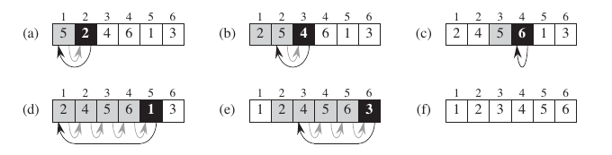

**注** 算法使用python语法的高亮，而不是用pseudocode，主要原因是使用`//`作为下取整，使用pseudocode会被当做注释。但是语法是C与python的混合物，仅用于清晰表达。

```python
Insertion_Sort(A)
	for j=2 to A.length
		key=A[j]
		# Insert A[j] into the sorted sequence A[1..j-1]
		i=j-1
		while i>0 && A[i]>key
			A[i+1]=A[i]
			i--
		A[i+1]=key
```

### (2) Designing algorithms

####  The divide-and-conquer approach

> - Divide
> - Conquer
> - Combine

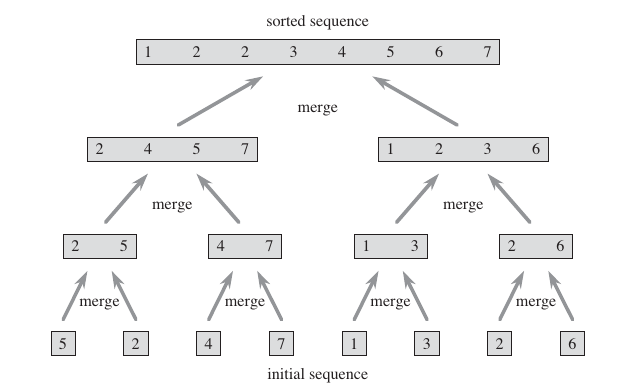

**注** `//`表示下取整

```python
Merge_Sort(A,p,r)
	if p < r
		q=(p+r)//2
		Merge_Sort(A,p,q)
		Merge_Sort(A,q+1,r)
		Merge(A,p,q,r)
```

```python
Merge(A,p,q,r)
	n1=q-p+1 #A[p,..,q]大小
	n2=r-q #A[q+1,r]大小
	new L[1...n1+1],R[1...n2+1] #复制两个子数组
	for i=1 to n1
		L[i]=A[p+i-1]
	for j=1 to n2
		R[j]=A[q+j]
	L[n1+1]=R[n2+1]=infinite #哨兵
	i=j=1
	for k=p to r
		if L[i]<=R[j]
			A[k]=L[i]　#写入原址
			i++
		else
			A[k]=R[j] 
			j++
```

$$
T(n)=
\begin{cases}
\Theta(1) & \mbox{if n=1} \\
2T(n/2)+\Theta(n) & \mbox{if n>1}
\end{cases}
$$


## 3. Growth of Functions

有用的公式
$$
\begin{aligned}
\log (n!)&=\Theta(n\log n)	\\
\sum_{k=1}^n \frac{1}{k}&=\ln n +O(1)	\\
\sum_{k=0}^\infty x^k&=\frac{1}{1-x}\quad |x|<1		\\
\sum_{k=0}^\infty kx^k &= \frac{x}{1-x^2}\quad \text{上式求导再乘以}x	\\
\end{aligned}
$$
标准增长函数及其大小关系
$$
O(1)<O(\log n)<O(n)<O(n\log n)<O(n^2)	
$$
指数时间阶的大小关系
$$
O(2^n)<O(n!)<O(n^n)
$$

## 4. Divide and Conquer

### Master Theorem

$$
T(n)=aT(\frac{n}{b})+f(n) \qquad
a\ge1\ and\ b>1
$$

其中$\frac{n}{b}$解释为$\lfloor \frac{n}{b} \rfloor\ or\ \lceil \frac{n}{b} \rceil$

1. If $f(n)=O(n^{\log_b a-\epsilon})$ for some constant $\epsilon>0$, then $T(n)=\Theta(n^{\log_b a})$
2. If $f(n)=\Theta(n^{\log_b a})$, then $T(n)=\Theta(n^{\log_b a}\log n)$
3. If $f(n)=\Omega (n^{\log_b a +\epsilon})$ for some constant $\epsilon>0$,and if $af(\frac{n}{b})\le cf(n)$ for some constant $c<1$ and all sufficiently large $n$, then $T(n)=\Theta (f(n))$

## 5. Heapsort

### (1) Heap

大根堆：父节点值大于子节点

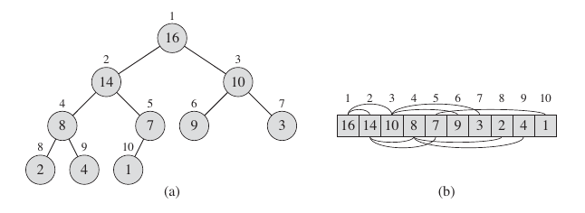

使用数组实现`A[1..n]`

```python
Parent(i)
	return i//2
Left(i)
	return 2*i
Right(i)
	return 2*i+1
```

### (2) Maintaining the heap property

`A[i]`的左右子树已满足堆性质。


```python
Max_Heapify(A,i)
	l=Left(i)
	r=Right(i)
	#find the lagest of A[i],left,right
	if l<=A.heap_size && A[l]>A[i]
		largest=l
	else 
    	largest=i
	if r<=A:heap_size && A[r]>A[largest]
		largest=r
	if largest!=i
		swap(A[i],A[largest])
		Max_Heapify(A,largest)
```

共$n$个节点，当最底层恰好半满的时候，左子树至多为$2n/3$
$$
T(n) \le T(2n/3) +\Theta(1)
$$
使用master定理，解为$T(n)=O(\log n)$

### (3) Buildinga heap

`1 ... A.length//2`均为非叶节点，后面的均为叶节点

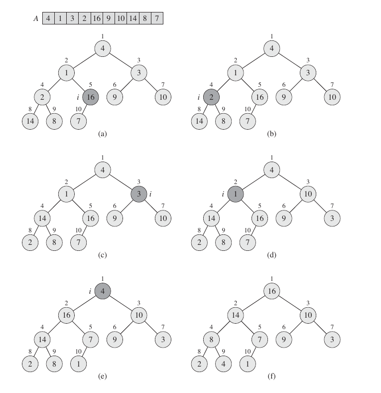

```python
Build_Max_Heap(A)
	A.heap_size=A.length
	for i=A.length//2 downto 1
 		Max_Heapify(A,i)	
```

在高度为$h$的节点上运行`Max_Heapify`代价为$O(h)$, 参见上面的证明。从而总代价为
$$
\sum_{h=0}^{\lfloor log\ n \rfloor} \lceil \frac{n}{2^{h+1}}\rceil O(h) 
= O\left(n \sum_{h=0}^{\lfloor log\ n \rfloor} \frac{h}{2^h}\right )
$$
由公式
$$
\sum_{k=0}^{\infty}kx^k=\frac{x}{(1-x)^2}
$$
可得时间复杂度为
$$
O(n \sum_{h=0}^{\infty} \frac{h}{2^h})=O(2n)=O(n)
$$
即在线性时间内将无序数列构造成一个大根堆

###  (4) The heapsort algorithm


```python
Heapsort(A)
	Build_Max_Heap(A)
	for i=A.length downto 2
 		swap(A[1],A[i])
		A.heap_size--
        Max_Heapify(A,i)
```

调用一次`Build_Max_Heap`为$O(n)$. 后面再$n-1$调用`Max_Heapify`每次为$O(\log n)$

总的为$O(n\log n)$

###  (5) Priority queues

**返回最大的**

```python
Heap_Maximum(A)
	return A[1]
```

时间复杂度为$O(1)$

**弹出最大的**

```python
Heap_Extract_Max(A)
	if A.heap_size < 1
		error 'heap underflow'
	max=A[1]
	A[1]=A[A.heap_size]
	A.heap_size--
	Max_Heapify(A,1)
	return max
```

时间复杂度为$O(\log n) $

**增大`A[i]`为`key`**

```python
Heap_Increase_Key(A,i,key)
	if key<A[i]
 	error 'new key is smaller than current key'
	A[i]=key
	while i>1 && A[Parent(i)]<A[i]
		swap(A[i],A[Parent(i)])
        i=Parent(i)
```

时间复杂度为$O(\log n) $

**插入某个值**

```python
Max_Heap_Insert(A,key)
	A.heap_sizeA++
	A[A.heap_size]= - infinite
	Heap_Increase_Key(A,A.heap_size,key)
```

时间复杂度同上

## 6. Quicksort

### (1)  Description of quicksort


调用方式为`Quicksort(A,1,A.length)`

```python
Quicksort(A,p,r) # A[p...r]
	if p<r
		q=Partition(A,p,r)
        Quicksort(A,p,q-1)
        Quicksort(A,q+1,r)
```

```python
Partition(A,p,r)
	x=A[r]
	i=p-1
	for j=p to r-1
 		if A[j]<=x
			i++
 			swap(A[i],A[j])
	swap(A[i+1],A[j])
    return i+1
```

###  (2) Performance of quicksort

**Worst-case partitioning**

划分产生$0$与$n-1$的情况
$$
T(n)=T(n-1)+T(0)+\Theta(n)=T(n-1)+\Theta(n)
$$
使用代入法(替换法)，
$$
\begin{aligned}
T(n) & =   T(n - 1) + c_2n \\
     & \le c_1(n - 1)^2 + c_2n \\
     & =   c_1n^2 - 2c_1n + c_1 + c_2n & (2c_1 > c_2, n \ge c_1 / (2c_1 - c_2)) \\
     & \le c_1n^2. 
\end{aligned}
$$
解为$T(n)=\Theta(n^2)$

**Best-case partitioning**

均等划分
$$
T(n)=2T(n/2)+\Theta(n)
$$
使用master定理解为$T(n)=\Theta(n\log n)$

**Balanced partitioning **

常数比例的划分，会产生$\Theta(\log n)$的递归树，每一层的代价都为$O(n)$

从而总代价为$O(n\log n)$

### (3) A randomized version of quicksort

排序中调用如下随机化划分即可

```python
Randomized_Partition(A,p,r)
	i=random(p,r)
    swap(A[r],A[i])
    return Partition(A,p,r)
```

期望运行时间为$\Theta(n\log n)$.

## 7. Sorting in Linear Time

### (1) Lower bounds for sorting


比较排序是一个决策树。叶节点为$n!$个不同的排序,其中$l$为可达叶节点
$$
n! \le l \le 2^h
$$
高为$h$的二叉树最多有$2^h$个叶节点。如此对两边取对数可得
$$
h\ge \log(n!)=\Omega(n\log n)
$$

### (2) Counting sort

$n$个在区间$[0,k]$的整数，$k$也为整数

对于每个输入$x$确定小于$x$的个数，然后就可以直接放到相应的位置了。

`A`为输入数组，`C`为辅助的计数数组，`B`为输出数组


```python
Counting_Sort(A,B,k)
	new C[0..k]
	for i=0 to k
		C[i]=0 #初始化计数数组
	for j＝1 to A.length
		C[A[j]]++ #计数每个i数值出现的次数
	for i＝1 to k
		C[i]+=C[i-1] #现在变成小于等于i的数字的个数
	for j＝A.length downto 1 #倒序是为了稳定性
		B[C[A[j]]]=A[j]
        C[A[j]]--
```

第1,3个`for`循环为$\Theta(k)$, 第2,4个`for`循环为$\Theta(n)$, 从而总共为$\Theta(n+k)$

当$k=O(n)$时，代价为$\Theta(n)$ 线性时间

### (3)  Radix sort


先按最低有效位排序。

基本的排序算法要求是要稳定，相对次序不能变

```python
Radix_Sort(A,d) 
	for i=i to d #从低位到高位
		Stable_Sort(A,i)
```

如果稳定排序算法(比如Counting Sort)为$\Theta(n+k)$, 则总代价为$\Theta(d(n+k))$

### (4)  Bucket sort

假设数据是均匀分布的。比如下面假设数据均匀分布在$[0,1)$之间


```python
Bucket_Sort(A)
	new B[0..n-1]
	n=A.length
	for i=0 to n-1
		B[i]=empty list
	for i=1 to n
		B[floor(n*A[i])].insert(A[i]) #分别装入每个桶
	for i=0 to n-1
		Insertion_Sort(B[i])　#然后在桶内插入排序
```

平均情况下时间代价为$O(n)$

### (5) Sorting Comparison

| Algorithm      | Worst-case running time | Average-case/Expected running time |
| -------------- | :---------------------: | :--------------------------------: |
| Insertion sort |      $\Theta(n^2)$      |           $\Theta(n^2)$            |
| Merge sort     |    $\Theta(n\log n)$    |         $\Theta(n\log n) $         |
| Heapsort       |      $ O(n\log n)$      |                 -                  |
| Quicksort      |      $\Theta(n^2)$      |   $\Theta(n\log n) $ (expected)    |
| Counting sort  |      $\Theta(k+n)$      |           $ \Theta(k+n)$           |
| Radix sort     |    $\Theta(d(n+k))$     |          $\Theta(d(n+k))$          |
| Bucket sort    |      $\Theta(n^2)$      |     $\Theta(n)$ (average-case)     |

## 8. Medians and Order Statistics

###  (1) Minimum and maximum

同时找到最大最小

- 奇, `(A[1],A[1])` 之后。每两个之间进行比较
- 偶,`(A[1],A[2])`　同上

### (2)  Selection in expected linear time

返回第i小的元素

```python
Randomized_Select(A,p,r,i)
	if p == r
		return A[p]
	q=Randomized_Partition(A,p,r)
	k=q-p+1
	if i == k #the pivot value is the answer
		return A[q]
	else if i < k
		return Randomized_Select(A,p,q-1,i)
	else 
    	return Randomized_Select(A,q+1,r,i-k)
```

 **最好**:每次划分为相等的左右区间
$$
T(n)=T(n/2)+n \Rightarrow T(n)=\Theta(n)
$$
**最坏**:每次划分为不均等的左右区间
$$
T(n)=T(n-1)+n \Rightarrow T(n)=\Theta(n^2)
$$
**平均(期望)**:分析略
$$
T(n)=\Theta(n)
$$

### (3)  Selection in worst-case linear time

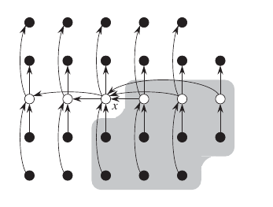

**算法步骤**

```python
while n>1 do
```

- step 1. 将$n$个元素分成$5$个$1$组，共$\lceil n/5 \rceil$组。其中最后$1$组有$n\ mod\ 5$个元素。

- step 2. 用插入排序对每组排序，取其中值。若最后1组有偶数个元素，取较小的中值。

- step 3. 递归地使用本算法找找$\lceil n/5\rceil $个中值的中值$x$.

- step 4. 用$x$作为划分元对$A$数组进行划分,并设$x$是第$k$个最小元。

- step 5. 

  ```python
  if i=k
  	return x
  else if i<k
  	找左区间的第i个最小元
  else 
  	找右区间的第i-k个最小元
  ```

**时间分析**

- 大于$x$的元素(上图阴影部分)有$3(\lceil \lceil n/5 \rceil /2 \rceil -2) \ge 3n/10-6$

- 那么step 5.中递归调用最大长度为$n-(3n/10-6)=7n/10+6$

- 运行时间递归式

  step 1,2. $O(n)$

  step 3. $T(\lceil n/5 \rceil)$

  step 4. $O(n)$

  step 5. 至多$T(7n/10+6)$
  $$
  \Rightarrow T(n) \le
  \begin{cases}
  \Theta(1) & if\ n\le 140 \\
  T(\lceil \frac{n}{5} \rceil)+T(\frac{7}{10}n+6)+\Theta(n) & if\ n>140
  \end{cases}
  $$


- 使用替代法求解$T(n)\le cn$, 可得$T(n)=O(n)$

## 9. Red-Black Trees

### (1)  Properties of red-black trees


**基本性质**

满足下面性质的二叉搜索树

1. 每个节点为Red或Black
2. 根为Black
3. 叶nil为Black
4. Red节点两个子节点必为Black
5. 每个节点到叶节点的所有路径都含有相同数量的黑节点

**黑高**

$bh(x)$:  到叶节点的黑节点数(不包括自身) $bh(T.nil)＝０$

**基本定理**

有$n$个内部节点的红黑树，$h \le 2\log(n+1)$

简证如下：

归纳法证明$x \text内点数=左/右孩子内点数+1\ge 2(2^{bh(x)}-1)+1=2^{bh(x)}-1$

$n$个内点，则$n\ge 2^{bh(T.root)}-1\ge 2^{h/2}-1$

取对数即可得 $h\le 2\log(n+1) $

### (2) Rotations

保持了二叉搜索树的性质 $left \le root \le right$　具体而言$\alpha \le x \le \beta \le y \le \gamma$

对黑高进行了调整


**具体步骤**


需要变动的是三根粗链

```python
1. y=x.right #记录指向y的指针
2. x.right=y.left; y.left.p=x #β连x.right
3. y.p=x.p; x.p.(left||right)=y #y连x.p
4. y.left=x; x.p=y　#x连y.left
```

相应的右旋为

```python
1. x=y.left #记录指向x的指针
2. y.left=x.right; x.right.p=y #β连y.left
3. x.p=y.p; y.p.(left||right)=x #x连y.p
4. x.right=y; y.p=x #y连x.right
```

**具体算法**

```python
Left_Rotate(T,x)
	y=x.right #step 1.
    x.right=y.left #step 2.
 	if y.left!=T.nil
 		y.left.p=x
 	y.p=x.p #stpe 3.
 	if x.p == T.nil
 		T.root=y
 	else if x == x.p.left
 		x.p.left=y
 	else
    	x.p.right=y
 	y.left=x #step 4.
 	x.p=y
```

```python
Right_Rotate(T, y)
    x=y.left #step 1.
    y.left = x.right #step 2.
    if x.right!=T.nil
        x.right.p=y
    x.p = y.p #step 3.
    if y.p == T.nil
        T.root = x
    else if y == y.p.right
        y.p.right = x
    else y.p.left = x
    x.right = y #step 4.
    y.p = x
```

### (3)  Insertion

**步骤**

- step 1. 将z节点按BST树规则插入红黑树中，z是叶子节点
- step 2. 将z涂红
- step 3. 调整使其满足红黑树的性质

```python
RB_Insert(T,z)
	y=T.nil #记录插入的父节点
	x=T.root　#搜索
	while x!=T.nil
		y=x
		if z.key<x.key
			x=x.left
		else 
        	x=x.right
	z.p=y
	if y == T.nil #z为第一个节点
		T.root=z
	else　if z.key < y.key #选择左边或者右边插入
		y.left=z
	else 
    	y.right=z
	z.left=T.nil #z的属性设置
	z.right=T.nil
	z.color=RED
	RB_Insert_Fixup(T,z)
```

**调整分析**

通过旋转和重新涂色，自下而上调整。插入后可能违反的条件

1. `z`是根，但是为红色
2. `z.p`为红色，而z也为红色

其他均满足。调整的分类讨论

- `z`为根，将其涂黑

- `z`不是根，则`z.p`存在

  - `z.p`为黑，无需调整

  - `z.p`为红。需要调整。

    此时，由于它为红，它不是根，`z.p.p`存在，且为黑

    ```python
    case1~3: z.p==z.p.p.left
    case4~6: z.p==z.p.p.right
    ```

    定义`z`的叔叔`y=z.p.p.right`对于`case1~3`

    而对于`case4~6`将`left/right`全部翻转即可

    - `case1:  y.color==RED`

      

      *注* ： (1) `z`上溯，最多到根

      ​	  (2) 到根时，变为黑色即可

      ​	  (3) `z`为`z.p`的左右孩子同样处理，没影响

    - `case2: y.color==BLACK && z=z.p.right`

    - `case3: y.color==BLACK && z=z.p.left`

      

**算法**

```python
RB_Insert_Fixup(T,z)
	while z.p.color == RED # 为黑时无需调整. z为根时，z.p为nil也为黑
		if z.p==z.p.p.left #case1~3
			y=z.p.p.right
			if y.color == RED #case1
				z.p.color=BLACK　#重新涂色
				y.color=BLACK
				z.p.p.color=RED
				z=z.p.p #上溯
			else #case2~3
    			if z== z.p.right #case2
                	z=z.p
                    Left_Rotate(T,z)
				z.p.color=BLACK #case3
				z.p.p.color=RED
                Right_Rotate(T,z.p.p)
		else
        	#将所有的left/right互换即可
	T.root.color=BLACK
```


**时间复杂性**

插入: $O(\log n)$

调整: $O(\log n)$ 最多使用两个旋转

### (4) Deletion

**z删除后BST的调整**

- `case1:　z为叶子`

  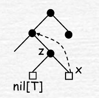

- `case2: z只有一个孩子`

  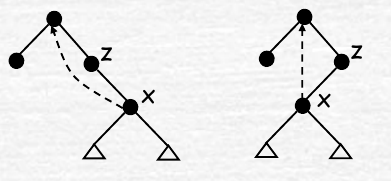

  case1 是case2的特例。处理方式一致：`删z,连接x,x为z的中序后继`

  当`z==z.p.left`时候，类似。`x为z的中序前导`

- `case3: z的两个孩子均非空`

  


  `y`为`z`的中序后继，即`z`右子树的最左下节点

  删除`y`将`y`的内容复制到`z`,再将`y`的右子连到`y.p`左下

对RBT的影响：删红点不影响，删黑点需要调整

```python
RB_Transplant(T,u,v) #v替代u
	if u.p == T.nil
	T.root=v
	else if u == u.p.left
		u.p.left=v
	else 
    	u.p.right=v
	v.p=u.p
```

```python
RB_Delete(T,z)
	y=z
	y_original_color=y.color
	if z.left == T.nil
		x=z.right
		RB_Transplant(T,z,z.right)
	else if z.right == T.nil
		x=z.left
		RB_Transplant(T,z,z.left)
	else 
    	y=Tree_Minimum(T,z.z.left) #y为z的中序后继
		y_original_color=y.color
		x=y.right
		if y.p == z 
			x.p=y
		else
        	RB_Transplant(T,y,y.right)
			y.right=z.right
			y.right.p=y
		RB_Transplant(T,z,y)
		y.left=z.left
		y.left.p=y
		y.color=z.color
	if y_original_color == BLACK
    	RB_Delete_Fixup(T,x)
```

**调整算法**

```
case1~4: x==x.p.left
case5~8: x=x.p.right
```

以下讨论`case1~4`对于其他情况，`left/right`倒转即可

定义`x`的兄弟`w=x.p.right`

- `case1: w.color==RED`

  由于`w`为红，`x.p`必为黑。转化成`case2,3,4`

  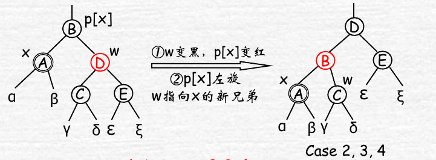

- `case2: w.color==BLACK && w.left.color==BLACK && w.right.color==BLACK`

  x上移到B，通过A和D黑色上移

  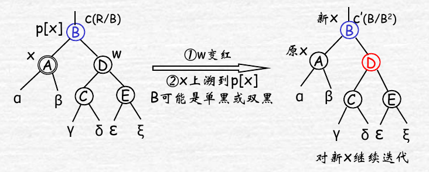

- `case3: w.color==BLACK && w.left.color==RED && w.right.color==BLACK`

  转化成case4

  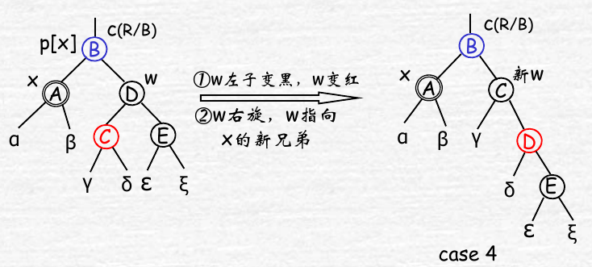

- `case3: w.color==BLACK && w.right.color==RED`

  终结处理。x的黑色上移给B,B的原色下移给D,D将黑色下移给C和E,通过旋转解决矛盾点C

  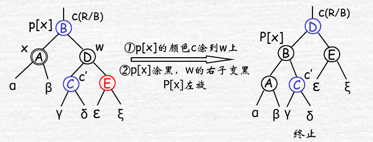

**算法**

```python
RB_Delete_Fixup(T,x)
	while x!=T.root && x.color == BLACK
		if x == x.p.left #case1~4
 			w=x.p.right
 			if w.color == RED #case 1
 				w.color=BLACK
  				x.p.color=RED
  				Left_Rotate(T,x.p)
  				w=x.p.right
  			if w.left.color == BLACK && w.right.color == BLACK #case 2
 				w.color=RED
  				x=x.p
  			else #case 3,4 
            	if w.right.color == BLACK #case 3
 					w.left.color=BLACK
  					w.color=RED
 					Right_Rotate(T,w)
			 	 	w=x.p.right
  				w.color=x.p.color
  				x.p.color=BLACK
  				w.right.color=BLACK
  				Left_Rotate(T,x.p)
  				x=T.root
    	else 
        	#将left/right交换即可
	x.color=BLACK
```

含$n$个结点的红黑树的高度$h\le 2\log(n+1)$也就是说$h=O(\log n)$, 不用`RB_Delete_Fixup`总运行时间为$O(\log n)$, 后面的调整算法至多旋转3次，也可能上升到根但是没有旋转，所以总时间为$O(\log n)$

## 10. Augmenting Data Structures

### (1)  Dynamic order statistics

顺序统计树，在红黑树的基础上，增加一个`size`域
$$
x.size=
\begin{cases}
0 & if\ x=T.nil \\
x.left.size+x.right.size+1 & other
\end{cases}
$$


**查找**

```python
OS_Select(x,i)
	r=x.left.size+1
	if i == r
		return x
	else if i < r
		return OS_Select(x.left,i)
	else 
    	return OS_Select(x.right,i-r)
```

时间复杂度$O(\log n)$

**求秩**

```python
OS_Rank(T,x)
	r=x.left.size+1 #以x为根的子树中，x的秩
	y=x　#y代替x上溯
	while y!=T.root　#以y为根的树的秩
		if y == y.p.right　#为其父节点的右孩子
			r=r+y.p.left.size+1
		y=y.p
	return r
```

时间复杂度$O(\log  n)$

**插入**

- phase 1:

  从根向下搜索，每个遍历的节点，都`size++`

  $O(\log n)$

- phase 2:

  变色与旋转，向上调整。变色不改变，仅考虑旋转

  $O(\log n)$

  

  ```python
  #Left_Rotate(T,x)
  y.size=x.size
  x.size=x.left.size+x.right.size+1
  #Right_Rotate(T,y)
  x.size=y.size
  y.size=y.left.size+y.right.size+1
  ```

**删除**

- phase 1:

  物理上删除y, 从y上溯到根，所经历的节点均`size--`

  $O(\log  n)$

- phase 2:

  采用变色与旋转。只有旋转改变，至多３个旋转

  $O(\log  n)$

### (2)  Interval trees

`key=x.int.low`

附加信息: `x.max=max{x.int.high,x.left.max,x.right.max}`

```python
Interval_Search(T,i)
	x=T.root
	while x != T.nil && (i.low > x.int.high || i.high < x.int.low)
		if x.left != T.nil && x.left.max >= i.low
			x = x.left
		else
        	x =x.right
	return x
```

## 11. Dynamic Programming

### (1) Elementsof dynamic programming

**动态规划与分治法**

类似的：分解成若干子问题

不同的：动态规划的子问题有重叠

**求解步骤**

1. 找出最优解的性质，并刻画其最优子结构特征
2. 递归地定义最优值(写出动态规划方程)
3. 以自底向上的方式计算出最优值
4. 根据计算最优值时记录的信息，构造最优解。

**适用条件**

- 最优子结构

  问题的最优解是由其子问题的最优解来构造的

- 重叠子问题

### (2) Mutiple Stage Graph 


分成很多段，段内无连接，相邻段间有连接，$c(u,v)$为相应代价，没有连接的记为$\infty$

设$cost(i,j)$为$V_i$中节点$v_j$到汇点$t$的最小成本。显然满足最优子结构。并且有子问题重叠。
$$
cost(i,j)=
\begin{cases}
c(j,t) & i=k-1 \\
\min \limits_{v_l \in V_{i+1},<j,l> \in E(G)} {c(j,l)+cost(i+1,l)} & 1\le i <k-1
\end{cases}
$$

### (3)  Matrix-chain multiplication

一系列矩阵$A_1,A_2,...,A_n$相乘, 其中$A_i$维数为$p_{i-1} \times p_i (1 \le i \le n)$　对其加括号，得到最少的乘法次数方式。

矩阵$A_{p\times q},A_{q \times r}$相乘，普通乘法次数为$p\times q\times r$

设$m[i][j]$为计算$A[i:j]$的最小乘法数，原问题的最优值为$m[1][n]$
$$
m[i][j]=
\begin{cases}
0 & i=j \\
\min \limits_{i \le k < j}\{m[i][k]+m[k+1][j]+p_{i-1}p_kp_j\} & i<j
\end{cases}
$$
其中，第二式第一项为$(A_iA_{i+1}...A_k)_{p_{i-1}\times p_k}$, 第二项为$(A_{k+1}A_{k+2}...A_j)_{p_k\times p_j}$

取得$k$为最优的分割位置，记录$s[i][j]=k$

```python
Matrix_Chain_Order(p)
	n=p.length-1
	new m[1..n][1..n],s[1..n-1][2..n]
	for i=1 to n
		m[i][i]=0
	for l=2 to n #l为矩阵链中矩阵的个数
		for i=1 to n-l+1
			j=i+l-1
			m[i][j]=Inf
			for k=i to j-1
				q=m[i][k]+m[k+1][j]+p[i-1]*p[k]*p[j]
				if q < m[i][j]
					m[i][j]=q
					s[i][j]=k
	return m,s
```

```python
Print_Optimal_Parens(s,i,j)
	if i==j
    	print("A",i)
    else
    	print("(")
        Print_Optimal_Parens(s,i,s[i,j])
        Print_Optimal_Parens(s,s[i,j]+1,j)
        print(")")
```

### (4) Max Substring Sum

整数序列$a_1,a_2,...,a_n$, 求解如下式子
$$
\max_{1\le i\le j\le n}\{ \max\{0,\sum_{k=i}^{j}a_k \}\}
$$
考虑所有以$j$结束的最大子段和$b[j]$即
$$
b[j]=\max_{1\le i\le j}\{\max\{0,\sum_{k=i}^{j}a_k \}\}
$$
原问题与子问题的关系为
$$
\max_{1\le i\le j\le n}\{ \max\{0,\sum_{k=i}^{j}a_k \}\} =
\max_{1\le j\le n}\{\max_{1\le i\le j}\{\max\{0,\sum_{k=i}^{j}a_k \}\}\}=
\max_{1\le j\le n}\{b[j]\}
$$
子问题的递归解为
$$
b[j]=
\begin{cases}
\max\{a_1,0\}& j=1\\
\max\{b[j-1]+a_j,0\} & j>1
\end{cases}
$$

```python
MaxSubSum(n,a)
	sum=0, b=0 #sum存储当前最大的b[j], b存储b[j]
	for j=1 to n
		b+= a[j];
		if b<0 
        	b=0 #b[j]
		if b>sum
        	sum=b;
	return sum
```

### (5) Longest Common Subsequence

设$c[i,j]$为$X_i,Y_j$的最长公共子序列，则
$$
c[i,j]=
\begin{cases}
0 & i=0\ or\ j=0\\
c[i-1,j-1]+1& i,j>0\ and\ x_i=y_j\\
\max\{c[i,j-1,c[i-1][j]\} & i,j>0\ and\ x_i \ne y_j
\end{cases}
$$

### (6) 0-1 Knapsack

 原问题$Knap(1,n,c)$

定义$Knap(l,n,c)$
$$
\max \sum_{i=l}^{n}v_ix_i \qquad v_i>0 \\
\begin{cases}
\sum_{i=l}^{n}w_ix_i \le c & w_i>0\\
x_i\in \{0,1\} & l\le i\le n
\end{cases}
$$
定义子问题$m(i,j)$为背包容量$j$,　可选物品为$i,i+1,...,n$的背包最优值
$$
m(i,j)=
\begin{cases}
\max\{m(i+1,j),m(i+1,j-w_i)+v_i\}&j\ge w_i \\
m(i+i,j)& 0\le j < w_i
\end{cases}
$$
第一式前一个表示不选$i$, 后一个表示选$i$

临界条件为
$$
m(n,j)=
\begin{cases}
v_n & j\ge w_n\\
0& 0\le j < w_n
\end{cases}
$$

## 12. Greedy Algorithms

### (1)Activity Selection

设`c[i,j]`为任务i结束后，任务j开始前的时间段内，任务分配的最大数，则递归式为
$$
c[i,j]=
\begin{cases}
0 & \text{if}\ S_{ij}=\varnothing	\\
\max_{a_k \in S_{ij}} \{c[i,j]+c[k,j]+1\} &\text{if}\ S_{ij}\ne\varnothing
\end{cases}
$$

贪心算法，每次选择最早结束的那个。如果不选最早结束的那个，而选比它稍晚结束的，那么剩下的时间比选它要短，不如选它。

迭代算法

```pseudocode
Recursive_Activity_Selection(s,f,k,n)
	m=k+1
	while m<=n and s[m]<f[k] // find the first activity in Sk to finish
		m++
 	if m<=n
 		return {a[m]}+Recursive_Activity_Selection(s,f,m,n)
	else 
		return {}
```

参数k表示当前选择活动k.

迭代算法

```pseudocode
Greedy_Activity_Selection(s,f)
	n=s.length
	A={a[1]}
	k=1
	for m=2 to n
		if s[m]>=f[k]
			A=A+{a[m]}
			k=m
	return A
```

假设已经按照最早结束时间排序好了

运行时间$\Theta(n)$

### (2) Fractional Knapsack

可装的份额为小数，每次先装金额最大的即可。

最优性证明

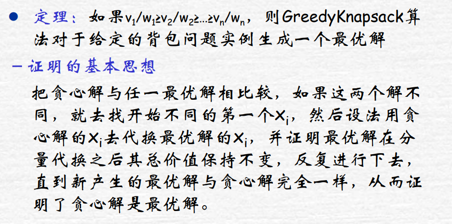


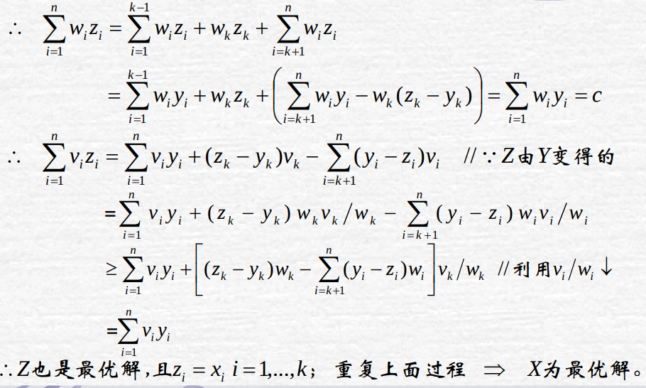


## 13. Backtracking

### (1) Subset Tree

```pseudocode
Backtrack(int t)//搜索到树的第t层
	if t>n
		output(x) //为可行解
	else
		for i in X
			x[t]=i
			if Constraint && Bound
				Backtrack(t+1)
```

执行时候是`Backtrack(1)`

**案例**: n皇后问题

```pseudocode
NQueen(int k)
	if k>n
		print(x)
	else
		for i=1 to n
			x[k]=i
			if Place_Test(k)
				NQueen(k+1)
				
Place_Test(int k)
	for i=1 to k-1
		if x[i]=x[k] || abs(x[i]-x[k])=abs(i-k)
			return false
	return true
```

**案例**：0-1背包选择生成一棵树

### (2) Permutation Tree

```pseudocode
Backtrack(int t)
	if t>n
		output(x)
	else
		for i=t to n
			swap(x[t],x[i])
			if Constraint && Bound
				Backtrack(t+1)
			swap(x[t],x[i])
```

**案例**： 排列生成问题

```pseudocode
for i=1 to n
	x[i]=i
Backtrack(1)
```

**案例**： TSP问题，即有权重的树，从1走完所有节点回到1的权重和最小。

使用`Backtrack(2)`生成所有排列连起来就是一个环。

## 14. Amortized Analysis

### (1) Aggregate Analysis

一个n个操作序列最坏情况下花费的总时间为$T(n)$, 那么在最坏情况下，每个操作的平均代价为$T(n)/n$, 所有的操作都有相同的摊还代价

**栈操作**

`pop push multipop`

n次操作，最多代价为n, 所以一个操作的代价为$O(n)/n=O(1)$

**二进制计数器递增**

`A[0..k-1]`, 其中`A[0]`为低位

```pseudocode
Increament(A)
	i=0
	while i<A.length && A[i]==1
		A[i]=0
		i++
	if i<A.length
		A[i]=1
```

$n$次递增，$A[0]$翻转$n$次，$A[1]$翻转$\lfloor n/2 \rfloor$, $A[2]$翻转$\lfloor n/4 \rfloor$....所以总的代价为
$$
\sum_{i=0}^{k-1}\left \lfloor\frac{n}{2^i} \right \rfloor \le n\sum_{i=0}^\infty \frac{1}{2^i}=2n
$$
所以最坏情况下代价为$O(n)$, 每个操作代价为$O(1)$

### (2) Accounting Method

相当于每次操作都付钱，多余的钱存起来下次用，但是不能赊账。

此时，不同操作可能有不同的摊还代价。

**栈操作**

实际的代价为

```ps
push	 1
pop 	 1
multipop min(k,stack_size)
```

定义摊还代价（每次操作支付的费用）

```
push	 2
pop 	 0
multipop 0
```

即每次push都支付1为当前的操作代价，然后存1为以后pop该数的代价。

n次操作总的摊还代价为$O(n)$

**二进制计数器递增**

给置1支付2，给清0支付0

这样注意到一次Increment最多有一个置1, 其他的清0均用之前存的钱来支付。

n次操作总的摊还代价为$O(n)$

### (3) Potential Method 

给数据结构设定一个势能，要求$\Phi(D_i) \ge \Phi(D_0)=0$. 然后定义操作的摊还代价为
$$
\hat{c}_i=c_i+\Phi(D_i)-\Phi(D_{i-1})
$$
这样总的摊还代价就是总实际代价的一个上界。

**栈操作**

定义势能为栈对象的数量$\Phi(D_i)=s\ge 0$

可计算

```
push 		2
pop 		0
multipop 	0
```

## 15. Binomial Heap

主要解决的问题是二叉堆的`Union`操作效率很低。

在图论算法的应用：用于实现最小优先队列：在Prim算法中找距离当前树最短的结点。在Dijkstra算法中找距离当前集合的最短的外部结点。在Johnson算法中使用了Dijkstra算法，也可以使用。

| 过程         | 二叉堆(最坏情况) | 二项堆(最坏情况) |
| ------------ | :--------------: | :--------------: |
| Make_Heap    |   $\Theta(1)$    |   $\Theta(1)$    |
| Insert       | $\Theta(\log n)$ | $\Omega(\log n)$ |
| Minimum      |   $\Theta(1)$    | $\Omega(\log n)$ |
| Extract_Min  | $\Theta(\log n)$ | $\Theta(\log n)$ |
| Union        |   $\Theta(n)$    | $\Omega(\log n)$ |
| Decrease_Key | $\Theta(\log n)$ | $\Theta(\log n)$ |
| Delete       | $\Theta(\log n)$ | $\Theta(\log n)$ |

### (1) Binomial Tree


$B_k$性质如下：

1. 共有$2^k$个结点

   由$B_k$的double递归构造可得知

2. 树的高度为$k$

   同上

3. 在深度$i$处恰有$\binom{k}{i}$个结点

   由double递归可知
   $$
   \begin{aligned}
   D(k,i)	&= 	D(k-1,i)+D(k-1,i-1)	\\
   &= \binom{k-1}{i}+\binom{k-1}{i-1}	\\
   &=\binom{k}{i}
   \end{aligned}
   $$

4. 根的度数为$k$, 其子树从左到右依次为$B_i, i=k-1,...,0$

### (2) Binomial Heap

H性质

1. H中有多个二项树，每个二项树都是最小堆，子大于父
2. 多个二项树中没有相同的

类似于二进制表示，比如13=1101


### (3) Operations on a Binomial Heap

**创建新二项堆**

```pseudocode
Make_Binomial_Heap()
	H.head=NIL
	return H
```

$\Theta(1)$

**寻找最小关键字**

```pseudocode
Binomial_Heap_Minimum(H)
	y=NIL
	x=H.head
	min=INF
	while x!=NIL
		if x.key < min
			min=x.key
			y=x
		x=x.sibling
	return y
```

假设有$n$个结点的H, 那么其子二项树最多有$\lfloor \log n\rfloor+1$

可以考虑$n$的二进制表示来计算这个

从而运行时间为$O(\log n)$

**合并两个二项堆**

下面的`Link`将以结点`y`为根的$B_{k-1}$树与以结点`z`为根的$B_{k-1}$树连接起来。也就是，`z`成为`y`的父节点，并成为一棵$B_k$树

```pseudocode
Binomial_Link(y,z)
	y.p=z
	y.sibling=z.chid
	z.chid=y
	z.degree++
```

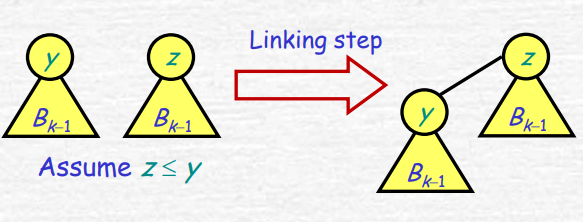

```pseudocode
Binomial_Heap_Union(H1,H2)
	//very complicated
	return H
```

案例更加清晰


总运行时间为$O(\log n)$

**插入一个结点**

```pseudocode
Binomial_Heap_Insert(H,x)
	H1=Make_Binomial_Heap()
	x.p=NIL
	x.child=NIL
	x.sibling=NIL
	x.degree=0
	H1.head=x
	H=Binomial_Heap_Union(H,H1)
```

总运行时间为$O(\log n)$

**抽取具有最小关键字的结点**

```pseudocode
Binomial_Heap_Extract_Min(H)
	1.在root list中找到最小的x, 去除
	2.以x为根的子树，倒序形成新Heap H1
	3.H=Binomial_Heap_Union(H,H1)
```


**减小关键字的值**

```pseudocode
Binomial_Heap_Decrease_Key(H,x,k)
	x.key=k
	y=x
	z=y.p
	while z!=NIL && y.key < z.key
		exchange(y.key,z.key)
		y=z
		z=y.p
```

$O(\log n)$

**删除一个关键字**

```pseudocode
Binomial_Heap_Delete(H,x)
	Binomial_Heap_Decrease_Key(H,x,-INF)
	Binomial_Heap_Extract_Min(H)
```

$O(\log n)$

## 16. Data Structures for Disjoint Sets

应用：最小生成树，Kruskal算法：先对每个结点形成一棵树，然后按升序检查所有边，不在同一棵树的边连接两棵树。

### (1) Linked List Representation

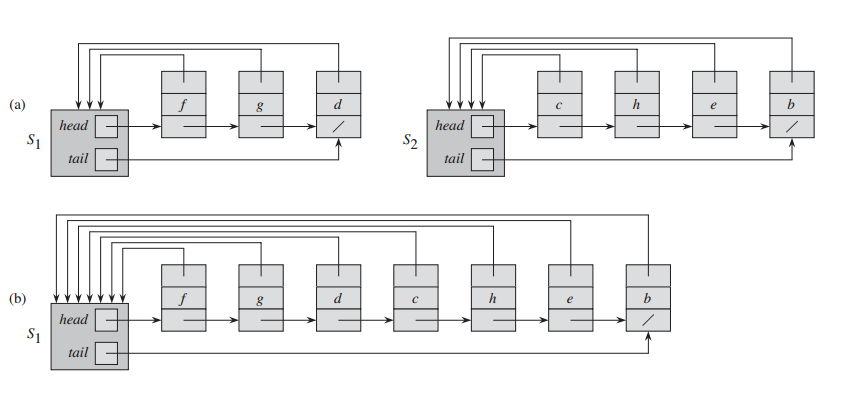

主要的操作`Make_Set(x), Union(x,y), Find_Set(x)`

 `Make_Set(x)`返回一个表头加`x`就可以了

`Find_Set(x)` 先直达表头，然后返回表头指向的第一个元素即可

`Union(x,y)`  将小的表添加到大的表上面

$m$个以上操作，其中`Make_Set(x)`为$n$次。则总耗时为$O(m+n\log n)$

考虑`x`的指回表头的指针，第一次更新后至少为2的集合，第二次更新后为至少为4的集合.... 所以最多更新$\lfloor \log n\rfloor$次。所以对于所有的n个元素，最多更新$O(n\log n)$

### (2) Disjoint-Set Forest


两种启发式优化策略

**按秩合并**

每棵树都保存一个`rank`相当于某种高度，大的`rank`成为新的根

**路径压缩**

每次`Find_Set(x)`就将路径上的所有点指向根节点


```pseudocode
Make_Set(x)
	x.p=x
	x.rank=0

Union(x,y)
	Link(Find_Set(x),Find_Set(y))

Link(x,y)
	if x.rank > y.rank
		y.p=x
	else
		x.p=y
		if x.rank == y.rank
			y.rank = y.rank+1

Find_Set(x)
	x.p=Find_Set(x.p)
	return x.p
```

## 17. Graphic Algorithms

### (1) Elementary Graph Algorithms

#### I. BFS


```pseudocode
BFS(G,s)
	for u in G.V-{s}
		u.color=WHITE;u.d=Inf;u.p=NIL
	s.color=GRAY;s.d=0;s.p=NIL
	Q=new Queue
	Q.in(s)
	while !Q.empty()
		u=Q.out()
		for v in G.Adj[u]
			if v.color==WHITE
				v.color=GRAY;v.d=u.d+1;v.p=u
				Q.in(v)
		u.color=BLACK
```

其中`WHITE`表示Undiscovered, `GRAY`表示Discovered, `BLACK`表示Finished

时间代价为$O(V+E)$

#### II. DFS


```pseudocode
DFS(G)
	for u in G.V
		u.color=WHITE
		u.p=NIL
	time=0
	for u in G.V
		if u.color==WHITE
			DFS_Visit(G,u)

DFS_Visit(G,u)
	time++
	u.d=time
	u.color=GRAY
	for v in G.Adj[u]
		if v.color==WHITE
			v.p=u
			DFS_Visit(G,v)
	u.color=BLACK
	time++
	u.f=time
```

其中`WHITE`表示Undiscovered, `GRAY`表示Discovered, `BLACK`表示Finished

`u.d`表示discovered时间，`u.f`表示finished时间

执行时间$\Theta(V+E)$

### (2) Minimum Spanning Trees

#### I. Kruskal

每次选择一个不构成环的最小的边。使用不相交集合来实现，每个集合内部的点等价于形成一棵树。

在同一个集合的点，不能再有边相连。

```pseudocode
MST_Kruskal_(G,w)
	A={}
	for v in G.V
		Make_Set(v)
	for (u,v) in sorted(G.E)
		if Find_Set(u) != Find_Set(v)
			A=A+{(u,v)}
			Union(u,v)
	return A
```

总运行时间$O(E\log E)$或者$O(E\log V)$

#### II. Prim

类似于Dijkstra算法，选择，当前的树，与，剩下的点中，最小的那条边。

使用最小优先队列，保存的`key`值为暂时不在树中的点到数的最短距离

```pseudocode
MST_Prim(G,w,r)
	for u in G.V
		u.key=Inf
		u.p=NIL
	r.key=0
	Q=G.V
    while ! Q.empty()
    	u=Extract_Min(Q)
    	for v in G.Adj[u]
    		if v in Q && w(u,v)<v.key
    			v.p=u
    			v.key=w(u,v) //Q will change
```

总运行时间，$O(E\log V)$

### (3) Single-Source Shortest Paths

下面的算法使用邻接表表示

#### I. Bellman-Ford Algorithms

边权重可以为负，如果有权重为负的环，返回`False`, 否则返回`True`, 而且`u.p`等等构成最短路径

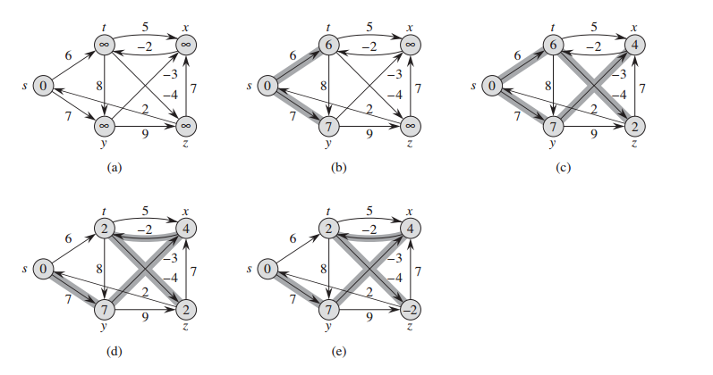

```pseudocode
Bellman_Ford(G,w,s)
	Initialize_Single_Source(G,s)
	for i=1 to |G.V|-1
		for (u,v) in G.E
			Relax(u,v,w)
	for (u,v) in G.E
		if v.d > u.d + w(u,v)
			return False
	return True
	
Initialize_Single_Source(G,s)
	for v in G.V
		v.d=Inf
		v.p=NIL
	s.d=0

Relax(u,v,w)
	if v.d > u.d + w(u,v)
		v.d = u.d + w(u,v)
		v.p=u
```

每次对全部的边进行Relax测试，总共`|G.V|-1`次。

算法正确的原因：对于任意一条最短路径`s,v1,v2 ...,vk` 最长`k=n-1，`每次对全部边遍历测试，至少保证增加一个结点到`s`为最短路径，执行`|G.V|-1`次后，保证了`s`到`vk`的最短路径成立。

算法执行时间$O(VE)$

#### II. Directed Acyclic Graph Scenario

有向无环图，权重可为负。


```pseudocode
DAG_Shortest_Paths(G,w,s)
	Initialize_Single_Source(G,s)
	for u in Topologically_Sorted(G.V)
		for v in G.Adj[u]
			Relax(u,v,w)
```

其中的拓扑排序可以使用`DFS`中的`u.f`即finished时间作为顺序。

初始化: $\Theta(V)$

拓扑排序（即`DFS`）: $\Theta(V+E)$

遍历恰好每个边：$\Theta(E)$

所以总的时间为$\Theta(E+V)$

#### III. Dijkstra Algorithms

权重非负。


```pseudocode
Dijkstra(G,w,s)
	Initialize_Single_Source(G,s)
	S={}
	Q=G.V
	while ! Q.empty()
		u=Extract_Min(Q)
		S=S+{u}
		for v in G.Adj[u]
			Relax(u,v,w)
```

其中Q为最小优先队列，维护的`key`是到`s`的距离。

### (4) All-Pairs Shortest Paths

下面的算法使用邻接矩阵表示

#### I. Shorted Paths & Matrix Multiplication

假定没有权重为负值的回路。输入图为邻接矩阵$W=(w_{ij})$

定义$l_{ij}^{(m)}$为$i\to j$的中间边个数不多于$m$的路径的权重。

初始值为
$$
l_{ij}^{(0)}=
\begin{cases}
0 & \text{if}\ i=j	\\
\infty & \text{if}\ i\ne j
\end{cases}
$$
这是由于中间没有边，只有当为同一个点的时候才认为有路径。

递归定义如下（使用最短路径的子路径也最短的性质）
$$
l_{ij}^{(m)}=\min\left(l_{ij}^{(m)},\min_{1\le k \le n}\left\{l_{ik}^{(m-1)}+w_{kj}	\right\}	\right) =
\min_{1\le k \le n}\left\{l_{ik}^{(m-1)}+w_{kj}	\right\}
$$
但是中间的边数最多为$n-1$, 所以最短路径的权重为
$$
\delta(i,j)=l_{ij}^{(n-1)}=l_{ij}^{(n)}=l_{ij}^{(n+1)}=\cdots
$$

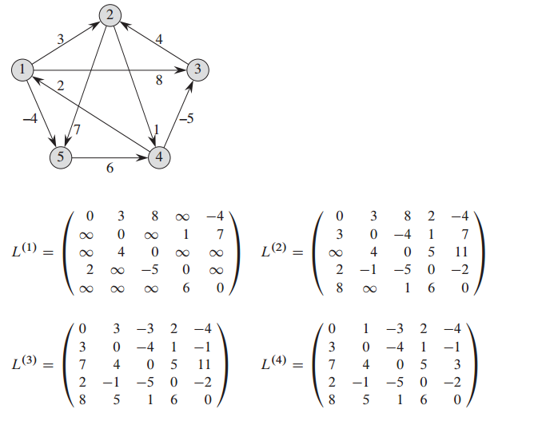


$$
\begin{aligned}
& \text{Slow_All_Paths_Shortest_Paths}(W)	\\
&1 \qquad n=W.rows	\\
&2 \qquad L^{(1)}=W	\\
&3 \qquad \mathbf{for}\ m=2\ \mathbf{to}\ n-1	\\
&4 \qquad \qquad L^{(m)}=\text{Extend_Shortest_Paths}(L^{(m-1)},W)	\\
&5 \qquad \mathbf{return}\ L^{(n-1)}	\\
\\
&\text{Extend_Shortest_Paths}(L,W)	\\
&1 \qquad n=L.rows	\\
&2 \qquad L'=\mathbf{new}\ \text{int}[n][n]	\\
&3 \qquad \mathbf{for}\ i=1\ \mathbf{to}\ n	\\
&4 \qquad \qquad \mathbf{for}\ j=1\ \mathbf{to}\ n	\\
&5 \qquad\qquad\qquad l_{ij}'=\infty	\\
&6 \qquad\qquad\qquad \mathbf{for}\ k=1\ \mathbf{to}\ n	\\
&7 \qquad\qquad\qquad\qquad l_{ij}'=\min \left(l_{ij}',l_{ik}+w_{kj}	\right)	\\
&8 \qquad \mathbf{return} L'
\end{aligned}
$$

下方的算法与矩阵乘法非常类似。也就是上述递归算法的实现。

时间复杂度为$\Theta(n^4)$

注意到需要的并不是中间的结果，而是最终的$l_{ij}^{(m)}\quad m\ge n-1$.

所以可以使用矩阵乘法的结合性
$$
\begin{aligned}
& \text{Faster_All_Paths_Shortest_Paths}(W)	\\
&1 \qquad n=W.rows	\\
&2 \qquad L^{(1)}=W	\\
&3 \qquad m=1\\ 
&4 \qquad \mathbf{while}\ m< n-1	\\
&5 \qquad \qquad L^{(2m)}=\text{Extend_Shortest_Paths}(L^{(m)},L^{(m)})	\\
&6 \qquad \qquad  m=2m	\\
&7 \qquad \mathbf{return}\ L^{(m)}	\\
\end{aligned}
$$

这种反复平方法，计算“矩阵乘法”最多$\lceil \log(n-1)\rceil$.所以时间复杂度为$\Theta(n^3\log n)$


#### II. Floyd-Warshall Algorithms

可含负值边，但是不含负权重回路。

定义$d_{ij}^{(k)}$为$i\to j$的中间结点在集合$\{1,2,\cdots k\}$内的路径的权重。

那么递归的下一步就是，如果中间结点包含$k$会怎么样？
$$
d_{ij}^{(k)}=
\begin{cases}
w_{ij}& \text{if}\ k=0	\\
\min \left(d_{ij}^{(k-1)},d_{ik}^{(k-1)}+d_{kj}^{(k-1)}	\right) & \text{if}\ k \ge 1
\end{cases}
$$
最后结果就是$\delta(i,j)=d_{ij}^{(n)}$. 而$D^{(n)}=(d_{ij}^{(n)})$

算法如下
$$
\begin{aligned}
&\text{Floyd_Warshall}(W)	\\
&1\qquad n=W.rows	\\
&2 \qquad D^{(0)}=W	\\
&3 \qquad \mathbf{for}\ k=1\ \mathbf{to}\ n	\\
&4 \qquad\qquad D^{(k)}=\mathbf{new}\ \text{int}[n][n]	\\
&5 \qquad\qquad \mathbf{for}\ i=1\ \mathbf{to}\ n	\\
&6 \qquad\qquad\qquad \mathbf{for}\ j=1\ \mathbf{to}\ n	\\
&7 \qquad\qquad\qquad\qquad d_{ij}^{(k)}=\min \left(d_{ij}^{(k-1)},d_{ik}^{(k-1)}+d_{kj}^{(k-1)}	\right)	\\
&8  \qquad\mathbf{return}\ D^{(n)}
\end{aligned}
$$
时间复杂度为$\Theta(n^3)$.

如果要找到最短路径中间的结点，就需要使用前驱矩阵。

定义$\pi_{ij}$为$i\to j$的最短路径的$j$的前驱。

那么初始化如下：
$$
\pi_{ij}^{(0)}=
\begin{cases}
\text{NIL}& \text{if}\ i=j\ \text{or}\ w_{ij}=\infty	\\
i	&\text{if}\ i\ne j\ \text{and}\ w_{ij}< \infty
\end{cases}
$$
递归定义如下：
$$
\pi_{ij}^{(k)}=
\begin{cases}
\pi_{ij}^{(k-1)}&\text{if}\ d_{ij}^{(k-1)}\le d_{ik}^{(k-1)}+ d_{kj}^{(k-1)}	\\
\pi_{kj}^{(k-1)}&\text{if}\ d_{ij}^{(k-1)}> d_{ik}^{(k-1)}+ d_{kj}^{(k-1)}
\end{cases}
$$
添加到上述算法中，也就是每次求$\min$的时候记下来。

#### III. Johnson Algorithms for Sparse Graph

针对稀疏图，使用邻接矩阵表示，权重可为负，若存在负权重的回路，则回错。

主要思想是，将负权重加上某个势，使之为非负，然后调用Dijkstra算法计算。

新权重的定义如下
$$
\hat{w}(p)=w(p)+h(v_0)-h(v_k)
$$
其中$p$表示$v_0\to v_k$的路径


后面势的定义方式为，引入新的节点$s$，然后用Bellman-Ford算法计算到每个节点的$\delta(s,v)=h(v)$

具体算法如下

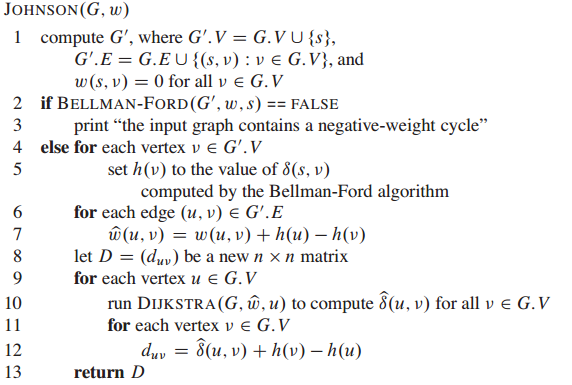

## 18. Number-Theoretic Algorithms

### (1) Elementary Number-Theoretic Notions

***Theorem 1.1*** 任意大于$0$的整数$a,b$, 则$\gcd(a,b)$是$a,b$的线性组合$\{ax+by:x,y \in \mathbb{Z} \}$中的最小正元素。

*Proof*　令$s$是这个集合的最小正元素，目标就变成证明$s=\gcd(a,b)$. 可以分成两个部分。

1. $\gcd(a,b)\ge s$

   下面证明$s$也是$a,b$的公约数。否则取余数：(下面的$q=\lfloor a/s \rfloor$)
   $$
   a\bmod s=a-qs=a-q(ax+by)=a(1-qx)+b(-qy)
   $$
   这说明该余数也是属于上述集合，那么$0\le a \bmod s\le s$. 由于$s$已是该集合的最小正元素，必有该余数为$0$，从而$s\mid a$, 同理对$b$取余数，也可以证明$s\mid b$. $s$为$a,b $的公约数。

   而$\gcd(a,b)$是公约数中最大的，所以不等式成立。

2. $\gcd(a,b)\le s$

   $a,b$的约数自然整除$a,b$的线性组合，从而有$\gcd(a,b) \mid s$, 自然不等式成立。

***Corollary 1.1.1***　$d|a,d|b \implies d|\gcd(a,b)$

*Proof* 由于$\gcd(a,b)$是$a,b$的线性组合。

***Corollary 1.1.2*** $\gcd(an,bn)=n\gcd(a,b)\quad n\in \mathbb{Z}^+$

*Proof* 将线性组合的值乘以$n$即可

***Corollary 1.1.3*** $n,a,b\in \mathbb{Z}^+$, $n\mid ab, \gcd(a,n)=1\implies n\mid b$

*Proof* $ab=nk \implies b=nk/a$ 但是$n/a$不是整数，只有$k/a$为整数，否则$b$不是整数，从而$b=n(k/a)$即$n\mid b$

***Theorem 1.2*** $a,b,p\in \mathbb{Z}, \gcd(a,p)=1 ,\gcd(b,p)=1\implies \gcd(ab,p)=1$

*Proof* 由$ax+py=1,bx'+py'=1$相乘得$ab(xx')+p(ybx'+y'ax+pyy')=1$

***Theorem 1.3*** $a,b,p\in \mathbb{Z}$且$p$为素数，$p|ab\implies p|a\ \text{or}\ p|b$

*Proof* 反证法可得，$\gcd(a,p)=\gcd(a,b)=1$　(由于$p$的约数只有$1,p$)

### (2) Greatest Common Divisor

***Theorem 2.1*** (GCD递归定理)$a\in \mathbb{Z}^*,b\in \mathbb{Z}^+$
$$
\gcd(a,b)=\gcd(b,a\bmod b)
$$
*Proof* 证明左右相等，可以用整除来分

1. $\gcd(a,b)|\gcd(b,a\bmod b)$

   令左边为$d$, $a\bmod b=a-qb$ 其中$q=\lfloor a/b \rfloor$

   由线性组合的整除性可证。

2. $\gcd(b,a\bmod b)|\gcd(a,b)$

   令左边为$d$, $a=qb+a\bmod b$ 其中$q=\lfloor a/b \rfloor$

   由线性组合的整除性可证。

**欧几里得算法**

```pseudocode
Euclid(a,b)
	if b==0
		return a
	else
		return Euclid(b,a%b)
```

**欧几里得算法的运行时间**

观察到欧几里得算法的执行与斐波那契数列的相似性。可以证明的是：如果$a>b\ge 1$并且`Euclid(a,b)`算法执行了$k\ge 1$次递归调用，则$a\ge F_{k+2},b\ge F_{k+1}$.由这里性质可以直接推出：如果$a>b\ge 1$并且$b<F_{k+1}$, 那么`Euclid(a,b)`递归调用次数少于$k$次。其中$F_k \approx \phi^k/\sqrt{5}, \phi=(1+\sqrt{5})/2$

使用数学归纳证明，核心是，将递归调用反过来看，即$\cdots, (a\bmod b), b, a,\cdots$ 即变化的形式为$a_{n+2}=f(a_{n+1},a_n)$, 只需要证明$a=f(b,a\bmod b)\ge b+a\bmod b$, 后面的加法即斐波那契数列的递推公式，该式证明如下
$$
b+a\bmod b=b+(a-b\lfloor a/b \rfloor)=a-b(\lfloor a/b \rfloor-1 )\le a
$$
**扩展欧几里得算法**

目的是$d=\gcd(a,b)=ax+by$现在需要知道$x,y$的取值

```pseudocode
Extended_Euclid(a,b)
	if b==0
		return (a,1,0)
	else
		(d1,x1,y1)=Extended_Euclid(b,a%b)
		(d,x,y)=(d1,y1,x1-floor(a/b)*y1)
		return (d,x,y)
```

证明如下
$$
d'=bx'+(a\bmod b)y'=bx'+(a-\lfloor a/b \rfloor b)y'=ay'+b(x'-\lfloor a/b \rfloor y')=ax+by=d
$$


### (3) Modular Arithmetic

**有限群**

群$(S,\oplus)$满足性质：封闭性，存在单位元，结合律，逆元存在且唯一。

如果满足交换律，称为交换群。

定义模加法和模乘法
$$
\begin{align*}
[a]_n+[b]_n&=[a+b]_n \pmod{n}	\\
[a]_n \cdot [b]_n&=[ab]_n \pmod{n}
\end{align*}
$$
***Theorem 3.1*** $(\mathbf{Z}_n,+_n)$为有限交换群。

*Proof* 按照交换群的定义直接可得。单位元为$[0]_n$

***Theorem 3.2*** $(\mathbf{Z}_n^*,\cdot_n)$为有限交换群。其中$\mathbf{Z}_n^*=\{[a]_n\in \mathbf{Z}_n:\gcd(a,n)=1\}$

*Proof* 封闭性由 ***Theorem 1.2***可得。单位元为$[1]_n$ 结合律与交换律由模乘法的定义可得。关键在于逆元。由于$\gcd(a,n)=1$, 可得$ax+ny=1$即$ax \equiv 1 \pmod{n}$. 而$x\cdot a+n\cdot y=1$也表明$\gcd(x,n)=1$从而逆元为$x$. 唯一性留到后面。

定义$a$的逆元为$a^{-1}$, 定义除法$a/b\equiv ab^{-1}\pmod{n}$

定义$\phi(n)=|\mathbf{Z}_n^*|$ 假设初始有集合$\{0,1,\cdots n-1\}$, 现在取能整除$n$的所有素数$p$，并且划掉相应的倍数$p,2p,3p,\cdots$。那么可得
$$
\phi(n)= n\prod_{p:p\text{ is prime and }p|n}\left(1-\frac{1}{p}	\right)
$$
如果$p$是素数，那么$\phi(p)=p(1-1/p)=p-1$

***Theorem 3.3***  有限群的非空封闭子集是一个子群

***Theorem 3.4*** 拉格朗日定理：如果$(S,\oplus)$是有限群，$(S',\oplus)$是它的一个子群，那么$|S'|$是$|S|$的一个约数。

***Corollary 3.4.1*** 真子群$|S'|\le |S|/2$

**一个元素的生成子群**

$\langle a \rangle=\{a^{(k)}:k\ge 1\}$其中$a^{(k)}=a\oplus a\oplus a\oplus \cdots\oplus a$

定义$a$的阶为满足$a^{(t)}=e$的最小正整数$t$, 记为$\operatorname{ord}(a)$.

***Theorem 3.5*** $\operatorname{ord}(a)=|\langle a \rangle|$

*Proof* 分成两个部分

1. $t\ge |\langle a \rangle|$

   对于$k>t$那么可以知道$k\equiv l \pmod t$且$a^{(k)}=a^{(l)}$, 重复，从而不会大于$t$

2. $t\le |\langle a \rangle|$

   如果群大小小于$t$, 比如$1\le i <j \le t$有$a^{(i)}=a^{(j)}$那么有$a^{(i+t-j)}=a^{(j+t-j)}=a^{(t)}=e$而$i+t-j < t$与$t$是满足这样结果的最小正整数矛盾

***Corollary 3.5.1*** $a^{(i)}=a^{(j)} \iff i \equiv j \pmod t$即周期为$t$

***Corollary 3.5.2*** $a^{|S|}=e$

*Proof* 由上面的拉尔朗日定理可知，$t||S|$

### (4) Solving Modular Linear Equations

模方程$ax\equiv b \pmod n$有解等价于$b\in \langle a \rangle$

***Theorem 4.1*** $d=\gcd(a,n)$
$$
\langle a \rangle =\langle d \rangle=\{0,d,2d,\cdots,(n/d-1)d	\}
$$
分成两个部分

1. $\langle d \rangle\subseteq \langle a \rangle$

   由$ax+ny=d$ 得$ax\equiv d \pmod n$这样对于任意$k$均有$dk\equiv a(xk) \pmod n$.

2. $\langle a \rangle\subseteq \langle d \rangle$

   对于$m\equiv ax \pmod n$有$ax+ny=m$, 从而$d|m$

***Corollary 4.1.1*** $d|b \iff ax\equiv b \pmod n$有解

***Corollary 4.1.2*** 上述模方程有解时，有模$n$的$d$个解

*Proof* $ai \pmod n$的周期为$t=n/d$ (生成元子群的性质)，从而$ai\equiv b \pmod n$有$d$个这个样的$i$. ($(n/d)d=n $)

***Theorem 4.2*** 该模方程的一个特解为$x_0=x'(b/d) \pmod n$其中$ax'+ny'=d$

*Proof* 

$$
\begin{aligned}
ax_o &\equiv ax'(b/d)	\\
&\equiv d (b/d)	\\
&\equiv b \pmod n
\end{aligned}
$$
***Theorem 4.3*** 若$x_０$为某个解(可为上面构造的特解)，则通解为$x_i=x_0+i(n/d)\pmod n$

*Proof*
$$
\begin{aligned}
ax_i &\equiv  a(x_0+i(n/d))	\\
 &\equiv ax_0 + i(a/d)n \\
  &\equiv  ax_0 	\\
   &\equiv  b \pmod n
\end{aligned}
$$
那么得到计算该模方程全部解的算法

```pseudocode
Modular_Linear_Equation_Solver(a,b,n)
	(d,x1,y1)=E(xtended_Euclid(a,n)
	if d|b
		x0=x1*(b/d) mod n
		for i=0 to d-1
			print(x0+i*(n/d) mod n)
	else
		print("No Solution")
```

### (5) The Chinese Remainder Theorem

如果$n_1,n_2,\cdots,n_k$两两互素，且$n=n_1n_2\cdots n_k$, 则方程$x\equiv a_i \pmod{n_i}$有模$n$唯一解

定义$m_i=n/n_i$以及$c_i m_i \equiv 1 \pmod{n_i}$则解为
$$
x=\sum_{i=1}^k a_i c_im_i \pmod n
$$

### (6) Powers of an  Element  

上面关注的是$\mathbf{Z}_n$的加法生成子群$\langle a \rangle$下面是$\mathbf{Z}_n^*$的乘法生成子群$\langle a \rangle$

***Theorem 6.1*** $a,n$互素，则$a^{\phi(n)}\equiv 1 \pmod n$

***Corollary 6.1.1*** $a,p$互素，则$a^{p-1} \equiv 1 \pmod p$

***Theorem 6.2*** $p$是奇素数$e\ge 1$
$$
x^2 \equiv 1 \pmod{p^e}
$$
仅两个平凡解$\pm1$

*Proof* 上式等价于$p^e | (x-1)(x+1)$, 则$p|(x+1)$或$p|(x-1)$仅一个成立，否则$p|((x+1)-(x-1))$即$p|2$矛盾。后面易得。

***Corollary 6.2.1*** 如果$x^2 \equiv 1 \pmod n$有非平方根，则$n$为合数。 

反复平方法计算$a^b \pmod n$

```pseudocode
Modular_Exponentiation(a,b,n)
	d=1
	<b[k],b[k-1],...,b[0]>=b //二进制表示，b[k]为高位
	for i=k downto 0
		d=d*d mod n
		if b[i]==1
			d=d*a mod n
	return d
```

### (7) The RSA Public-Key Cryptosystem

公钥秘钥，创建过程如下

1. 随机大素数$p,q,p\ne q$
2. $n=pq$
3. 选取小奇数$e$与$\phi(n)=n(1-1/p)(1-1/q)=(p-1)(q-1)$互素
4. 计算$d$，其中$ed\equiv 1 \pmod{\phi(n)}$
5. 公钥$P=(e,n)$
6. 私钥$S=(d,n)$

则$M\in \mathbf{Z}_n$且$P(M)=M^e \pmod n ,S(C)=C^d \pmod n$

需要证明$P(S(M))=S(P(M))=M^{ed}=M \pmod n$

由于$ed=1+k(p-1)(q-1)$

如果$M \not\equiv 0 \pmod p $则有
$$
\begin{aligned}
M^{ed} &\equiv M(M^{p-1})^{k(q-1)}	\\
 &\equiv M(M^{p-1} \mod p)^{k(q-1)}	\\
  &\equiv M(1)^{k(q-1)}	\\
  &\equiv M
\end{aligned}
$$
对于$M\equiv 0 \pmod p$也有$M^{ed}\equiv M \pmod p$

同理也有$M^{ed}\equiv M \pmod q$

由中国剩余定理，上两式成立，等价于

$M^{ed}\equiv M \pmod n$

### (8) Primality Testing

**一个伪素数的判定算法**

利用的是，如果$p$为素数，且$a,p$互素，则$a^{p-1}\equiv 1 \pmod p$那么，如果同余结果不为$1$就一定不是素数，如果结果是$1$**很有可能**是素数

```pseudocode
Pseudoprime(n)
	if Modular_Exponentiation(2,n-1,n)!=1
		return "Composite" //definitely
	else
		return "Prime"	//we hope!
```

虽然这个算法犯错的概率比较低，但是可以更加低

改进

```pseudocode
Miller_Rabin(n,s)
	for j=1 to s //随机实验s次
		a=Random(1,n-1)
		if Witness(a,n)
			return "Composite" //definitely
	return "Prime" //almost surely

Witness(a,n)
	n-1=(2**t)*u //u为奇数，t>=1,相当于n-1的二进制表示中，除去后面的0的部分
	x[0]=Modular_Exponentiation(a,u,n)
	for i=1 to t　//中间计算a**(n-1)
		x[i]=x[i-1]**2 mod n
		if x[i]==1 && x[i-1]!=1 && x[i-1]!=n-1 
		//表示非平凡根，见Corollary 6.2.1，必为合数
			return True
	if x[t]!=1
		return True
	return False
```

算法复杂度，如果$n$是$\beta$位数字，那么需要$O(s\beta)$算法计算和$O(s\beta^3)$的

## 19. String Matching

| Algorithms         | Preprocessing Time | Matching Time |
| ------------------ | :----------------: | :-----------: |
| Naive              |        $0$         | $O((n-m+1)m)$ |
| Rabin-Karp         |    $\Theta(m)$     | $O((n-m+1)m)$ |
| Finite Automaton   |   $O(m|\Sigma|)$   |  $\Theta(n)$  |
| Knuth-Morris-Pratt |    $\Theta(m)$     |  $\Theta(n)$  |

 ### (1) The Naive String-Matching Algorithms

```pseudocode
Naive_String_Matcher(T,P)
	n=T.length
	m=P.length
	for s=0 to n-m
		if P[1...m]==T[s+1...s+m]
			print("Pattern Occurs with Shift ",s)
```

### (2) The Rabin-Karp Algorithms

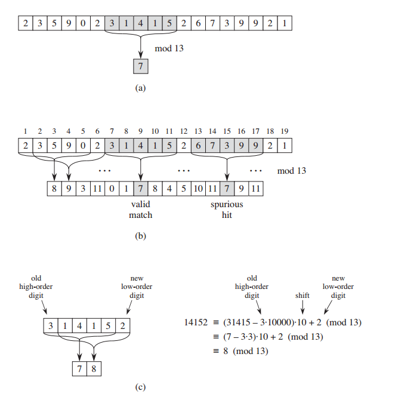

上面假设所有的为十进制表示。由于$p$可能比较大，所以取模，如果相等，则再仔细比较，如果不等，就一定不匹配。

```pseudocode
Rabin_Karp_Matcher(T,P,d,q)//d进制表示，模q
	n=T.length
	m=P.length
	h=d**(m-1) mod q //用于滑动窗口后计算
	p=0
	t[0]=0
	for i=0 to m	//预处理
		p=(d*p+P[i]) mod q
		t[0]=(d*t[0]+T[i]) mod q
	for s=0 to n-m //匹配
		if p==t[s]
			if P[1...m]==T[s+1...s+m]
				print("Pattern Occurs with Shift ",s)
		if s<n-m
			t[s+1]=(d*(t[s]-T[s+1]*h))+T[s+m+1] mod q 
			//减去最高位，然后乘以进制d表示左移，然后加上最低位
```

预处理计算模式$P$对应的$p$时间为$\Theta(m)$然后依次计算和比较花费$O((n-m+1)m)$

### (3) String Matching with Finite Automata

状态表示当前匹配的字符数

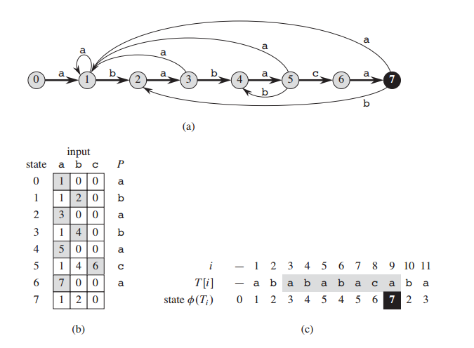

```pseudocode
Finite_Automaton_Matcher(T,d,m)//d表示转移函数
	n=T.length
	q=0
	for i=1 to n
		q=d(q,T[i])
		if q==m
			print("Pattern Occurs with Shift ",i-m)

Compute_Transition_Function(P,E)//E表示字母表
	m=P.length
	for q=0 to m
		for a in E
			k=min(m+1,q+2)
			repeat
				k=k-1
			until P[1...k]>>P[..q]a //表示P[1..k]为P[..q]a的后缀
			d(q,a)=k
	return d
```

### (4) The Knuth-Morris-Pratt Algorithms


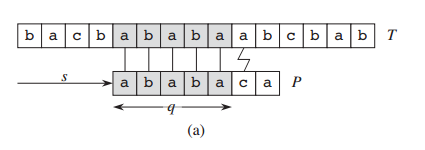

```pseudocode
KMP_Matcher(T,P)
	n=T.length
	m=P.length
	d=Compute_Predix_Function(P)	//此处d表示\pi
	q=0		//匹配的数目
	for i=1 to n	//从左到右遍历
		while q>0 && P[q+1]!=T[i]
			q=d[q]	//下一个字符不匹配
		if P[q+1]==T[i]
			q++	//下一个字符匹配
		if q==m
			print("Pattern Occurs with Shift ",i-m)
			q=d[q]	//寻找下一个匹配
			
Compute_Prefix_Function(P)
	m=P.length
	new d[1..m]
	d[1]=0
	k=0	//当前已匹配（前缀）的位置
	for q=2 to m　//q表示当前已输入的位置
		while k>0 && P[k+1]!=P[q]
			k=d[k]
		if P[k+1]==P[q]
			k++
		d[q]=k
	return d
```

## 20. Models and NPC

略


# Part II. CLRS Exercise

## I. Foundations

## II. Sorting and Order Statistics

## III. Data Structures

## IV. Advanced Design and Analysis Techniques

