# 数据库复习

闭卷(50%)

## 1. Introduction

## 2. Database Architecture

ANSI/SPARC体系结构——三级模式结构＋两级映象

外模式(子模式、用户模式)

概念模式(模式、逻辑模式)

内模式(存储模式)


数据的逻辑独立性：概念模式变化，仅外模式/模式映象变化，外模式（用户模式）不变

数据的物理独立性：内模式变化，仅模式/内模式映象变化，模式不变

## 3. Relational Data Model

关系模型的三类完整性规则

- 实体完整性(Entity Integrity)

- 参照完整性(Referential Integrity)

- 用户自定义完整性(User-Defined Integrity)


关系代数

- 并$R \cup S$

  $R\cap S=R-(R-S)$

- 交$R \cap S$	

- 差$R - S$	

- 笛卡儿积$R \times S$

- 选择$\sigma_{\text{age}\ge 18 }(R)$	选取满足要求的元组

- 投影$\pi_{\text{name,age}(R)}$	仅抽取需要的属性

- 自然联接$R \infty S$	联接$R,S$所有公共属性都相同的元组	

  对于R(X,Y), S(Y,Z) : $R\infty S=\pi_{X,Y,Z}(\sigma _{R.Y=S.Y}(R\times S))$

- $\theta$联接$R.\text{age}\gt S.\text{age}$ 抽取满足限制的，并联接

- 等值连接$R.\text{name}=S.\text{name}$ 是$\theta$联接的特殊化

- 除$\div $ ($R(X,Y), S(Y)$) 意思是在$R$中选择这样的$X$: 使得它与在$S$的$Y$的笛卡儿积在$R$中.

  $R\div S=\pi_X(R)-\pi_X[\pi_X(R)\times S-R]$

- 重命名 $\rho_{X(A_1,A_2,\cdots,A_n)}(E)$ :将关系代数表达式$E$重命名为$X$, ,并且各属性更名为$A_1,A_2,\cdots A_n$

- 聚集函数SUM,COUNT,AVG,MAX,MIN	$\pi_{\text{COUNT}(\text{E#})\to \text{employee_count}}(\text{Employee})$

- 分组$\gamma_{\text{C#,AVG(grades)}\to \text{avg_grade}}(R)$

- 排序$\tau_{\text{grades}}(R)$

- 赋值 $\text{temp}\leftarrow \pi_{\text{sno}}(R)$

- 删除$\text{Student}\leftarrow \text{Student}-\rho_{\text{name='Rose'}}(\text{Student})$

- 插入$S \leftarrow S\cup \{('001','\text{Rose}',19)\}$

- 更新: $S\leftarrow \pi_{C\#,city='\text{Hefei}'} (\sigma _{C\#=1}(S))\cup (S-(\sigma_{S\#=1}(S)))$

## 4. SQL

见`README.md`

习题p14 开始的3个题目以及最后的小测,非常重要


> Employees (SSN, Name, Dno, Age, Salary)  //Dno是外键
> Departments (Dno, Name, Location, Manager_SSN)  //Manager_SSN是外键     
> Projects (Proj_no, Name, Proj_Location, Manager_SSN)  //Manager_SSN是外键     
> Works_on (SSN, Proj_no, hours)  //SSN、Proj_no都是外键


>（1）求每个部门的部门号、部门名以及该部门所有员工的平均工资；

```sql
select Departments.Dno,Departments.name,avg(Salary)
from Employees,Departments
where Employees.Dno=Departments.Dno
group by Departments.Dno
```

>（2）求所有40岁以下（包括40岁）员工都参加的由‘李四’所负责的项目名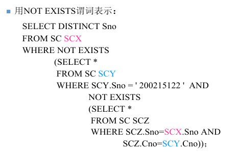；


>（3）求没有参加‘王五’所参加的任何一个项目的员工姓名；

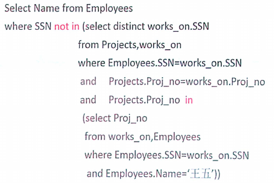

>（4）求未参加任何项目的姓‘赵’的员工姓名。

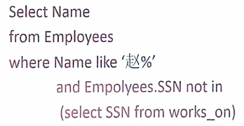


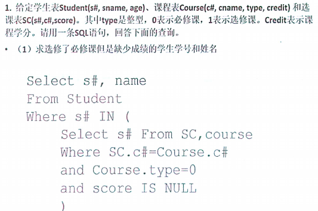

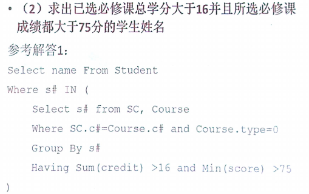

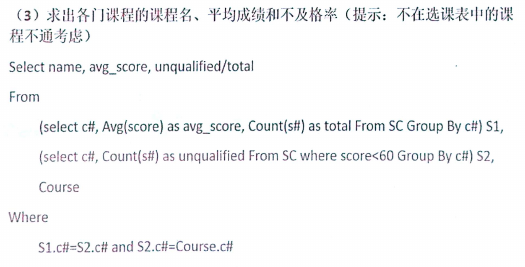


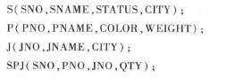

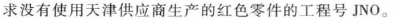

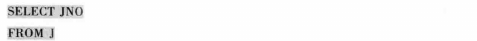

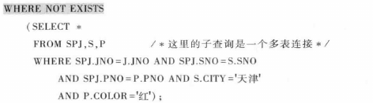

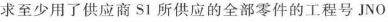

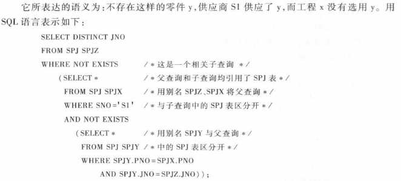


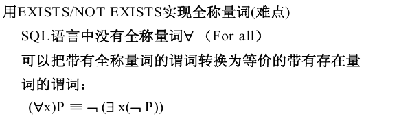

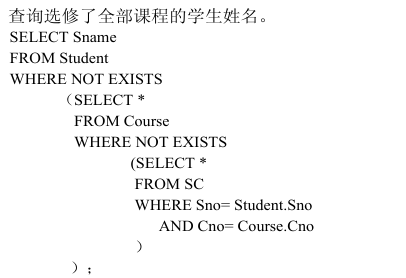

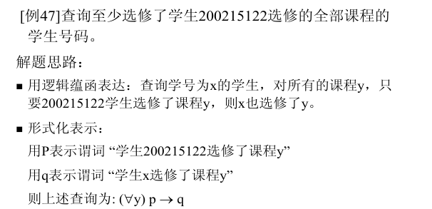

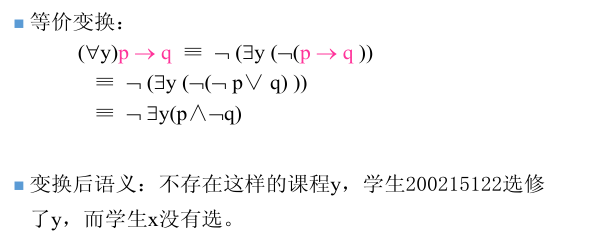


## 5. PL/SQL

见`README.md`

## 6. Schema Design

需要重看

1NF: 属性值只有一个值,无二义

2NF: 只有一个候选码/主码, 满足1NF, 且非主属性均**完全依赖**于主码

3NF: 只有一个候选码/主码, 满足2NF, 且非主属性**不传递依赖**于主码

BCNF: 关系模式R的所有不平凡的、完全的函数依赖的决定因素（左边的属性集）都是候选码


保持函数依赖地分解到3NF: 按最小函数依赖集的左边分成不同的关系. 有包含的去除.

无损连接且保持函数依赖地分解到3NF: 在上面的基础上,加上原R的主码. 有包含的去除.

无损连接地分解R到BCNF: 从R开始,有不满足BCNF性质的X$\to$ A, 将原来的S(U)分解为S1(X,A)与S2(U-A)

## 7. Database Design

实体: 矩形; 属性: 椭圆; 关系: 菱形

标注对应关系

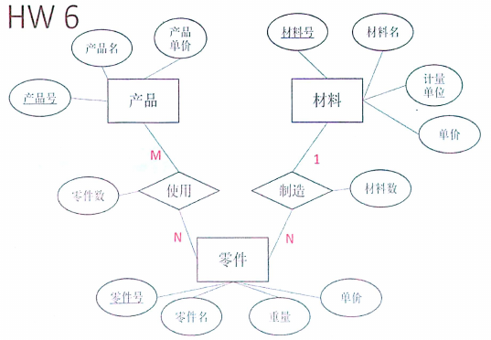

1:N的直接加入表,M:N的建新表


## 8. Developing Database Applications

## 9 Transaction Management I: Intro

## 10 Transaction Management II: Log & Recovery

## 11 Transaction Management III: Concurrency Control

ACID: 原子性, 一致性, 隔离性, 持久性


## 12 Database Security

## 13 Database Integrity


