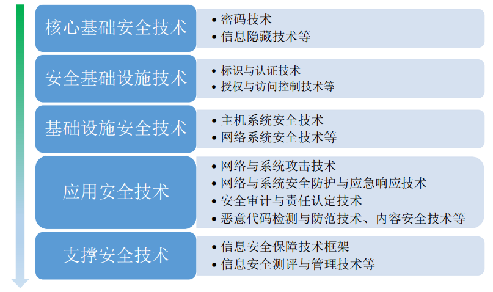

## 1 绪论

### 1.1 信息安全的概念

> 机密性、完整性、可用性也称为信息安全的三 要素。

信息安全属性

> 机密性、完整性、真实性、不可否认性、可靠性、可用性、可控性

信息安全威胁

> 信息泄露、非授权的篡改、拒绝服务、非法使用（非授权访问）、假冒、抵赖、网络与系统攻击、恶意代码、自然灾害、人为失误和故意破坏

### 1.2 信息安全发展历程

### 1.3 信息安全技术体系

> 信息安全保障技术框架、密码技术、标识与认证技术、授权与访问控制技术、信息隐藏技术、网络与系统攻击技术、网络与系统安全防护及应急响应技术、安全审计与责任认定技术、主机系统安全技术、网络系统安全技术、恶意代码检测与防范技术、内容安全技术、信息安全测评技术、信息安全管理技术

### 1.4 信息安全模型

## 2 密码技术

## 3 身份认证

## 4 授权与访问控制技术

## 5 信息隐藏技术

## 6 主机系统安全技术

## 7 网络与系统攻击技术

## 8 网络与系统安全防护技术

## 9 安全审计与责任认定技术

## 10 Internet 安全

## 11 无线网络安全

## 12 恶意代码检测与防范技术

## 13 内容安全技术