# 《并行计算》课程总结与复习

## 第一篇 并行计算硬件平台：并行计算机

### Ch1 并行计算与并行计算机结构模型

#### 1.1 计算与计算机科学

#### 1.2 单处理机与指令级并行

#### 1.3 多核处理器与线程级并行

> 何谓多核处理器

将功能复杂的单一核处理器划分为若干个功能相对简单的多个处理器内核，这些多处理器集中在一块芯片上，最初称为单芯片多处理器CMP，Intel公司将其商用名定为**多核处理器**

>  多核处理器的意义

- 解决单处理器瓶颈：密集晶体管集成，功耗剧增；设计指令级并行体系结构来利用晶体管资源，但软件与硬件设计复杂
- 具有自己的优势：CMP设计验证周期短、开发风险成本低，相对较低的主频功耗也相对较低、单处理器程序移植容易，通过布局能够改善多处理器内核之前延迟和带宽

> 微处理器中的并行方式

- ILP: 指令级并行(Instruction-level Parallelism ILP):乱序(out of order)执行、分支预测、指令多发射、硬件预取等
- TLP: (Thread-Level Parallelism)线程级并行，多处理器多线程执行
  - 多线程处理器(Multithreaded Processor):可以有效地减少垂直浪费情形。
  - 单片多处理器CMP(Chip MultiProcessor):是指在单个芯片上的多个处理器核构成的多处理器系统,允许线程在多个处理器核上并行执行。
  - 同时多线程SMT(Simultaneous Multithreaded)处理器:允许在一个时钟周期内发射多个线程的多条指令执行。可以同时减少水平和垂直浪费。
- 多任务OS: 抢占式或时间片轮转的多任务OS
- SMT: 同时多线程技术，超标量与多线程的结合，同时发射多个线程中的多条不相关指令。多线程技术(simultaneous Multi-Threading, SMT),超线程(Hyper-Threading, HT)技术,超线程技术实际上只有一个物理处理器,但从软件的角度来看,存在多个逻辑处理器。
- CMP: 单芯片多处理器。多核处理器技术:采用单芯片多处理器(Chip Multiprocessor, CMP)的设计,多核多线程(有别于单核上的超线程)
- 虚拟化技术: 异构平台，剥离指令集结构和处理器依赖关系（运行时虚拟化JVM、系统虚拟化）。创建一个虚拟计算环境,应用程序在该独立的环境或者虚拟机上执行,这些虚拟机能够运行完整、独立的OS并充分利用多线程技术。可分为两类:
  - 运行时虚拟化
    这类虚拟机可以看作是OS之上的一种容器或者执行程序。如,Java虚拟机和微软的通用语言运行时环境(Common Language Runtime, CLR)。
  - 系统虚拟化
    这类虚拟机为应用软件重新创建了一个完整的执行环境,并且运行了一个属于自己的操作系统实例。
- Intel超线程技术：单核心模拟双核心环境执行多线程，是一种SMT

#### 1.4 并行计算机体系结构 

##### 并行计算机结构模型

- 结构类型
  - SISD：单指令流单数据流计算机（冯诺依曼机）
  - SIMD：单指令流多数据流计算机
  - MISD：多指令流单数据流计算机
  - MIMD：多指令流多数据流计算机

- 几种MIMD
  - PVP并行向量处理机：多VP（向量处理器）通过交叉开关和多个SM（共享内存）相连
  - SMP对称多处理机：多P/C（商品微处理器）通过交叉开关/总线和多个SM（共享内存）相连
  - MPP大规模并行处理机：处理节点有商品微处理器+LM（分布式本地内存），节点间通过高带宽低延迟定制网络互联，异步MIMD，多个进程有自己的地址空间，通过消息传递机制通信
  - COW工作站机群：节点是完整操作系统的工作站，且有磁盘
  - DSM分布共享存储处理机：高速缓存目录DIR确保缓存一致性，将物理分布式LM组成逻辑共享SM从而提供统一地址的编程空间

注：对称指所有处理器都能同等地访问I/O很同样的运行程序（如OS和I/O服务程序），而非对称主从式是仅有主处理器运行OS和控制访问I/O并监控从处理器执行

##### 并行计算机访存模型

- UMA（Uniform Memory Access）均匀存储访问：物理存储器被所有处理器均匀共享，所有处理器对所有SM访存时间相同，每台处理器可带有高速私有缓存，外围设备共享。
- NUMA非均匀存储访问：共享的SM是由物理分布式的LM逻辑构成，处理器访存时间不一样，访问LM或
- CSM（群内共享存储器）内存储器比访问GSM（群间共享存储器）快
- COMA（Cache-Only MA）全高速缓存存储访问：NUMA的特例、全高速缓存实现
- CC-NUMA（Coherent-Cache NUMA）高速缓存一致性NUMA：NUMA＋高速缓存一致性协议
- NORMA（No-Remote MA）非远程存储访问：无SM，所有LM私有，通过消息传递通信

不同存储结构的并行机系统(P20)

#### 1.5 更多的并行计算概念

衡量并行计算机性能单位：

FLOPS: floating point operations per second 

每秒xxx (10^y) 次的浮点运算

PFLOPS($10^{15}$), TFLOPS($10^{12}$), GFLOPS($10^{9}$)

TOP500前500名超级计算机排名指标(GFLOPS)：

- Rmax － 能够达到的最大LINPACK的FLOPS
- Rpeak － 理论上的峰值FLOPS

### Ch2 并行计算机系统互连与基本通信操作

#### 2.1 并行计算机互连网络

**互连网络**是并行计算机系统中各处理器与内存模块等之间传输的机制

##### 静态互连

- 一维线性阵列LA/LC：二邻近串联
- 二维网孔MC：四邻近连接（Illiac连接、2D环绕）
- 树连接TC：二叉树、星型网络、二叉胖树（节点通路向根节点方向逐渐变宽，解决通信瓶颈）
- 超立方HC：3立方、4立方
- 立方环：3立方顶点用环代替

| 网络名称     | 网络规模                  | 网络直径                     |
| ------------ | ------------------------- | ---------------------------- |
| 线性阵列     | $N$                       | $N-1$                        |
| 环形         | $N$                       | $\lfloor N/2 \rfloor$        |
| 二维网孔     | $\sqrt{N}\times \sqrt{N}$ | $2(\sqrt{N}-1)$              |
| 二维环绕网孔 | $\sqrt{N}\times \sqrt{N}$ | $2\lfloor \sqrt{N}/2\rfloor$ |
| 二叉树       | $N$                       | $2(\lceil \log N\rceil-1)$   |
| 超立方       | $N=2^n$                   | $\log N=n$                   |

##### 动态互连

交换开关构成的，可按应用程序要求动态改变连接组态

- 总线(Bus)：连接处理器、存储模块、I/O外围设备等的一组导线和插座，分时工作、多请求总线仲裁，多总线（本地、存储、数据、系统）和多层总线（板级、底板级、I/O级）
- 交叉开关(Crossbar Switcher)：高带宽的开关控制的专用连接通路网络，NxN的开关网络同时只能接通N对源目的通信
- 多级互联网络MIN(Multistage Interconnection Networks)：每一级用多个开关单元，各级之间有固定的级联拓扑

##### 标准网络互连

- FDDI光纤分布式数据接口
- 快速以太网
- Myrinet：商用千兆位包开关网
- InfiniBand：交换式通信结构


#### 2.2-2.5 通信代价公式

##### SF和CT基本公式

###### SF(Store & Forward Routing)

$$
t(SF)=t_s+(mt_w+t_h)l\approx t_s+mt_wl
$$

###### CT(Cut-Through Routing)

$$
t(CT)=t_s+mt_w+lt_h\approx t_s+mt_w
$$

##### 单一信包一到一传输

| 网络结构     | l                      | SF                              | CT                                     |
| ------------ | ---------------------- | ------------------------------- | -------------------------------------- |
| 环形         | $\lfloor p/2 \rfloor$  | $t_s+t_wm \lfloor p/2 \rfloor$  | $t_s +mt_w + t_h \lfloor p/2 \rfloor$  |
| 环绕正方网孔 | $2\lfloor p/2 \rfloor$ | $t_s+2t_wm \lfloor p/2 \rfloor$ | $t_s +mt_w + 2t_h \lfloor p/2 \rfloor$ |
| 超立方体     | $\log p$               | $t_s+t_w m \log p$              | $t_s+mt_w +t_h \log p$                 |

##### 通信时间一览表(CT方式)

p64

| 通信操作   | $p$-环                      | $\sqrt{p}\times \sqrt{p}$-二维环绕网孔 | $p$-超立方             |
| ---------- | --------------------------- | -------------------------------------- | ---------------------- |
| 一到多播送 | $(t_s+mt_w)\log p+t_h(p-1)$ | $(t_s+mt_w)\log p+2t_h(\sqrt p-1)$     | $(t_s+mt_w) \log p$    |
| 多到多播送 | $(t_s+mt_w)(p-1)$           | $2t_s(\sqrt p-1)+mt_w(p-1)$            | $t_s\log p+mt_w (p-1)$ |


### ~~Ch3 典型并行计算机系统介绍（略）~~

### Ch4 并行计算性能评测

#### 4.1 基本性能指标

#### 4.2 加速比性能定律

##### Amdahl

计算负载固定不变
$$
\begin{align}
S=\frac{W_s+W_p}{W_s+W_p/p+W_o}=\frac{W}{fW+\frac{W(1-f)}{p}+W_o}=\frac{p}{1+f(p-1)+W_op/W}\longrightarrow \frac{1}{f+W_O/p}\quad (p\to \infty)
\end{align}
$$

##### Gustafson

放大问题规模
$$
\begin{align}
S'=\frac{W_s+pW_p}{W_s+W_p+W_o}=\frac{f+p(1-f)}{1+W_o/W}
\end{align}
$$

##### Sun&Ni

并行部分规模按$G(p)$扩放
$$
\begin{align}
S''=\frac{fW+(1-f)WG(p)}{fW+(1-f)WG(p)/p+W_o}=\frac{f+(1-f)G(p)}{f+(1-f)G(p)/p+W_o/W}
\end{align}
$$

#### ~~4.3 可扩放性评测标准（略）~~

#### ~~4.4 基准测试程序（略）~~

## 第二篇 并行计算理论基础：并行算法设计

### Ch5 并行算法与并行计算模型

#### 5.1 并行算法的基础知识

##### 并行算法的定义

> 并行算法:一些可同时执行的诸进程的集合,这些进程互相作用和协调动作从而达到给定问题的求解。

##### 并行算法的表达

```c
for i=0 to n par-do
for all Pi, where i in 0,..,k do
```

##### 并行算法的复杂度

- 运行时间$t(n)$: 包含**计算时间**和**通讯时间**,分别用计算时间步和选路时间步作单位。$n$问题实例的输入规模。
- 处理器数$p(n)$
- 并行算法成本$c(n)$: $c(n)=t(n)p(n)$
- 成本最优性:若$c(n)$等于在**最坏情形下串行算法所需要的时间**,则并行算法是成本最优的。
- 总运算量$W(n)$: 并行算法求解问题时所完成的总的操作步数。


加速比、并行效率、工作量及工作量最优
并行算法的WT表示

##### Brent定理

令$W(n)$是某并行算法A在**运行时间**$T(n)$内所执行的运算量,则A使用$p$台处理器可在$t(n)=O(W(n)/p+T(n))$时间内执行完毕。

(1)揭示了并行算法工作量和运行时间的关系;
(2)提供了并行算法的WT(Work-Time)表示方法;
(3)告诉我们:设计并行算法时应尽可能将每个时间步的工作量均匀地分摊给p台处理器,使各处理器处于活跃状态。

#### 5.2 并行计算模型

##### PRAM模型

> PRAM(Parallel Random Access Machine)并行随机存取，又称为SIMD-SM

- 特征
  - 存在容量无限大的SM
  - 有限或无限个功能相同的处理器，且均有简单算术运算和逻辑判断功能
  - 任何时刻各处理器可通过SM交换数据

- 分类

  - PRAM-CRCW并发读并发写
    - CPRAM-CRCW(Common PRAM-CRCW):仅允许写入**相同数据**

    - PPRAM-CRCW(Priority PRAM-CRCW):仅允许**优先级最高**的处理器写入

    - APRAM-CRCW(Arbitrary PRAM-CRCW):允许**任意**处理器自由写入
  - PRAM-CREW并发读互斥写
  - PRAM-EREW互斥读互斥写

- 计算能力比较
PRAM-CRCW是最强的计算模型,PRAM-EREW可$\log p$倍模拟PRAM-CREW和PRAM-CRCW
$$
T_{EREW}\ge T_{CREW}\ge T_{CRCW}\\
T_{EREW}=O(T_{CREW}\cdot \log p)=O(T_{CRCW}\cdot \log p)
$$

##### 异步APRAM模型

> 同步障分隔，通过全局存储器通信。MIMD-SM

异步APRAM模型假设：

- 每个处理器有LM、局部时钟、局部程序
- 处理器通信经过SM
- 无全局时钟，各处理器异步执行各自指令
- 处理器之间的指令相互依赖关系必须显式加入同步障
- 一条指令可以在非确定但有界时间内完成

指令类型有：

- 全局读：从SM读到LM
- 局部操作：LM操作存入LM
- 全局写：LM写入SM
- 同步：各处理器需等到其他处理器到达后才能继续执行

APRAM比PRAM更加接近实际并行机

##### BSP模型

> MIMD-DM, 块内异步并行，块间显式同步, 使用选路器通讯，且通讯消耗带宽

BSP（Bulk Synchronous Parallel）大同步并行机（APRAM算作轻量）是一个分布式存储的MIMD模型，它的计算由若干全局同步分开的、周期为L的超级步组成，各超级步中处理器做LM操作并通过选路器接收和发送消息；然后做一次全局检查，以确定该超级步是否已经完成（块内异步并行，块间显式同步）

参数：处理器数p、选路器吞吐率g、全局同步间隔L、一个超级步中一个处理器至多发送或接收h条消息

##### LogP模型

> MIMD-DM，点到点通讯

分布式存储、点到点通信的多处理机模型。参数为

- L(Latency): 消息从源到目的的延迟
- o(overhead): 发送或接收一条消息的额外开销，此期间内不能做其他操作
- g(gap): 可连续进行发送或接收消息的最小时间间隔. 1/g 为通信带宽
- P(Processor): 处理器/存储器个数

LogP模型是分布式存储、点到点通信的MIMD模型

LogP采取隐式同步，而不显式同步障

### Ch6 并行算法基本设计策略

#### 串改并

PRAM-CRCW上快排序算法 

- 构造一棵二叉排序树，其中主元是根 
- 小于等于主元的元素处于左子树，大于主元的元素处于右子树 
- 其左、右子树分别也为二叉排序树

```pascal
//input: A[1,...,n],n processors
//output:root,LC[1,...,n],RC[1,...,n]共享变量，构成树
//f[1,...,n]可为私有变量
for each processor i par-do
    root=i //竞争写，仅能写入一个
    f[i]=root //当前根，所有的f[i]都被写入了
    LC[i]=RC[i]=n+1

repeat for each processor i!=root par-do
	if (A[i]<A[f[i]] || (A[i]==A[f[i]]&&i<f[i]))
		LC[f[i]]=i //竞争写，作为左孩子
		if i==LC[f[i]]　//当前i已经在树中
			exit
		else
			f[i]=LC[f[i]]　//没有竞争上，那么就用新的根来判断
	else
		RC[f[i]]=i　//竞争写，作为右孩子
		if i== RC[f[i]]　//当前i已经在树中
			exit
		else
			f[i]=RC[f[i]]　//没有竞争上，那么就用新的根来判断
```

每次迭代，在$\Theta(1)$内构造一级树，树高为$\Theta(\log n)$, 从而时间为$O(\log n)$(PPT)　$\Theta(\log n)$ (课本)

#### 全新设计

基本并行k着色算法 算法: SIMD-EREW模型

```c
//input c[i] 1-n着色
//output c_[i]
for i=0 to n par-do
	k是c[i],c[i的后继]最低的不同二进制位
	c_[i]=2*k+c[i]_k

//压缩到3着色
//每个颜色5的处理器选一个与前驱后继不冲突的最小颜色
//...    4 ...
```

#### 借用法


### Ch7 并行算法常用设计技术

~~划分设计技术：均匀划分(PSRS排序)、对数划分(并行归并排序)、方根划分(Valiant归并排序)，功能划分( (m,n)-选择（略）~~
~~分治设计技术：双调归并网络（略）~~

#### 平衡树设计技术

##### 求最大值

SIMD-SM

```c
//输入 n=2^m 个数存在数组A[n:2n-1]
//输出 最大数在 A[1]
for k=m-1 to 0 do
    for j=2^k to 2^{k+1}-1 par-do
        A[j]=max{A[2j],A[2j+1]}
```

算法时间$O(\log n)$ 总比较次数$O(n)$ 最大处理器数$n/2$

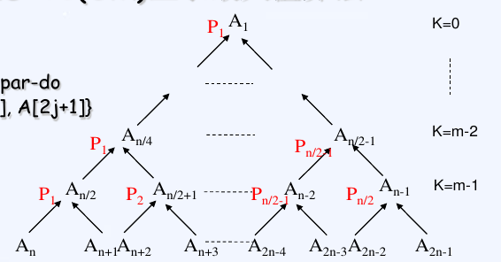

##### 计算前缀和

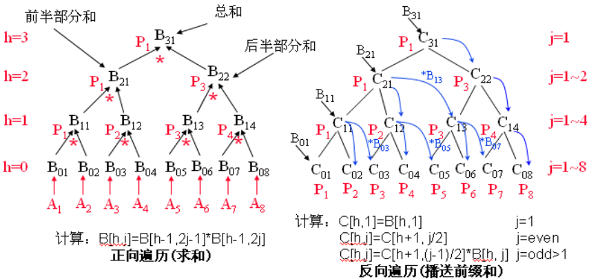

```c
//A[1:n],n=2^m
//B[h,i],C[h,i]分别为正向和反向遍历的节点值. 
//h=0,1,...,log n
//j=1,2,...,n/2^h
//输入 n=2^m数组A
//输出 数组C, C[0,j]为第j个前缀和

//(1)初始化
for j=1 to n par-do
    B[0,j]=A[j]
//(2)正向遍历
for h=1 to log n do
    for j=1 to n/2^h par-do
        B[h,j]=B[h-1,2j-1]*B[h-1,2j]
//(3)反向遍历
for h=log n to 0 do
    for j=1 to n/2^h par-do
        if j==1
            C[h,1]=B[h,1]
        else if even(j)
            C[h,j]=C[h+1,j/2]
         else if odd(j)
             C[h,j]=C[h+1,(j-1)/2]*B[h,j]
```

时间(1) $O(1)$; (2)$O(\log n)$; (3)$O(\log n)$ 

则$t(n)=O(\log n)$, $p(n)=n$, $c(n)=O(n\log n)$

#### 倍增设计技术

##### 表序问题


SIMD-EREW

```c
//输入 n个元素的表列L
//输出 rank(k)
for all k in L par-do
    P[k]=next[k] //初始化P[k],表示上图的箭头
    if P[k]!=k
    	distance[k]=1 //表示箭头的跨度
    else distance[k]=0
repeat log n times
	for all k in L par-do
        if P[k]!=P[P[k]]
        	distance[k]+=distance[P[k]]
        	P[k]=P[P[k]]
	for all k in L par-do
        rank[k]=distance[k]
```

$t(n)=O(\log n), p(n)=n$

##### 求森林的根

SIMD-CREW

```c
//输入 森林F, 弧由(i,P[i])指定
//输出 对每个节点i, S[i]为其根
for i in [1,...,n] par-do
    S[i]=P[i]
    while S[i]!=S[S[i]] do
        S[i]=S[S[i]]
```

$t(n)=O(\log n), W(n)=O(n\log n)$

~~流水线技术：五点的DFT计算，4流水线编程实例（略）~~

### Ch8 并行算法一般设计过程

#### PCAM的含义

- 划分(Partitioning) 分解成小的任务，开拓并发性
- 通讯(Communication) 确定诸任务间的数据交换，检测划分的合理性
- 组合(Agglomeration) 依据任务的局部性，组合成更大的任务
- 映射(Mapping)　将每个任务分配到处理器上，提高算法的性能。 

~~PCAM设计方法的四个阶段和每个阶段的任务与目标（略）~~
~~域分解和功能分解（略）~~

## 第三篇 并行计算理论基础：并行数值算法

### Ch9 稠密矩阵运算 

#### 9.1 矩阵的划分

##### 带状划分

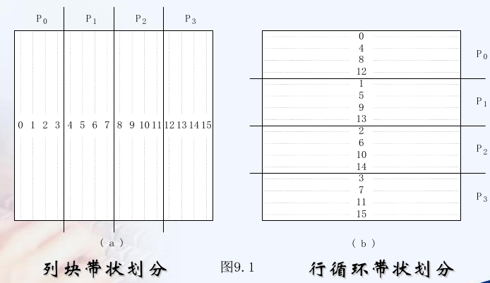

##### 棋盘划分


#### 9.2 矩阵转置

#####  网孔

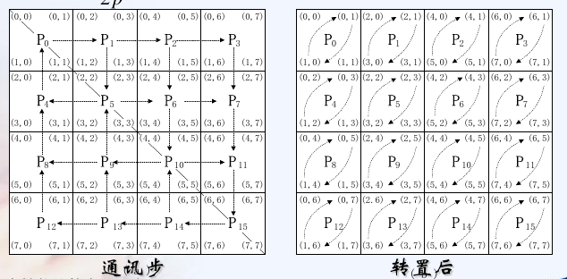

第一步，对子块全局转置。对角线下的，先上再右；对角线上的，先下再左。

第二步，子块内局部转置，串行算法。

时间分析

第一步最长路径为$2\sqrt{p}$ 每个子块大小为$n^2/p$ 从而时间为$2\sqrt{p} (t_s +t_w n^2/p)$

第二步花费$n^2/(2p)$

从而总的时间为
$$
T_p=\frac{n^2}{2p}+2t_s \sqrt{p}+2t_w\frac{n^2}{\sqrt{p}}
$$

##### 超立方

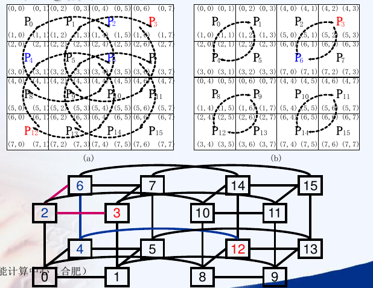

先是分成4个块，然后左下与右上交换，比如$P_{12}$与$P_6$交换，路径长为2. 

然后递归各个子块内部的交换，也是路径为2.

递归的次数为$\log_4 p=(\log p)/2$

每次递归的时间为$2(t_s+t_w n^2/p)$, 而最终的局部块大小为$n^2/p$. 从而最后总时间为
$$
T_p=\frac{n^2}{2p}+(t_s+t_w\frac{n^2}{p})\log p
$$

#### 9.3 矩阵向量乘法

##### 带状划分

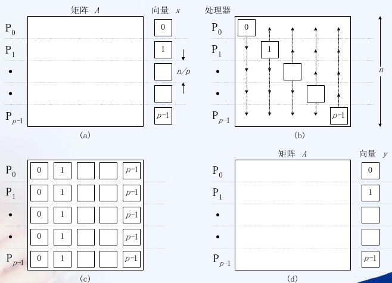

矩阵A和向量x都分$n/p$给每个处理器，所以先要多到多播送**向量元素**，时间分析可查表。

播送成功后，每个处理器计算乘-加所需的时间为$n^2/p$ 

###### 超立方

多到多播送时间为$t_s \log p+ m t_w (p-1)$
$$
\begin{align}
T_p&=\frac{n^2}{p}+t_s \log p+ \frac{n}{p}t_w (p-1)\\
&=\frac{n^2}{p}+t_s \log p+ nt_w
\end{align}
$$

###### 二维环绕网孔

多到多播送时间为$2(\sqrt{p}-1)t_s +mt_w (p-1)$
$$
\begin{align}
T_p&= \frac{n^2}{p}+2(\sqrt{p}-1)t_s +\frac{n}{p}t_w (p-1)\\
&= \frac{n^2}{p}+2(\sqrt{p}-1)t_s +nt_w 
\end{align}
$$

##### 棋盘划分

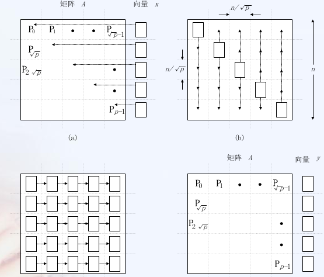

无环绕网孔CT选路法

第一步，将最后一列的$n/\sqrt{p}$个向量元素发送到主对角线
$$
t_s+\frac{n}{\sqrt{p}}t_w+t_h\sqrt{p}
$$
第二步，按列一到多播送
$$
\left(t_s+\frac{n}{\sqrt{p}}t_w	\right)\log \sqrt{p}+t_h (\sqrt{p}-1)
$$
第三步，按行单点累积
$$
\left(t_s+\frac{n}{\sqrt{p}}t_w \right)\log \sqrt{p}+t_h (\sqrt{p}-1)
$$
假定乘-加取单位时间$n^2/p$ 
$$
\begin{align}
T_p&=\frac{n^2}{p}+(1+\log p)t_s+\frac{n}{\sqrt{p}}(1+\log p)t_w+(3\sqrt{p}-2)t_h\\
&\approx \frac{n^2}{p}+t_s\log p+t_w\frac{n}{\sqrt{p}}\log p+3t_h\sqrt{p}
\end{align}
$$
棋盘划分要比带状划分快

~~Systolic算法(略)~~

#### 9.4 矩阵乘法

##### 简单并行分块算法

处理器为$\sqrt{p}\times \sqrt{p}$. 每个处理器有块$A_{i,j},B_{i,j}$. 先需要按行对$A_{i,k}$进行多到多播送，按列对$B_{k,j}$进行多到多播送。

然后每个$P_{i,j}$各自计算

###### 超立方

每行每列也是一个超立方，多到多播送计算公式为$t_s\log p+mt_w(p-1)$, 从而对$A,B$多到多播送时间为
$$
2\left(t_s\log \sqrt{p}+\frac{n^2}{p}t_w(\sqrt{p}-1)\right)\approx t_s\log p+2t_w\frac{n^2}{\sqrt{p}}
$$
播送后的计算时间为
$$
\sqrt{p}\times \left(\frac{n}{\sqrt{p}}	\right)^3=\frac{n^3}{p}
$$
从而最终的时间为
$$
T_p=\frac{n^3}{p}+t_s\log p+2t_w\frac{n^2}{\sqrt{p}}
$$

###### 二维环绕网孔

每行每列为环，多到多播送时间为$(t_s+mt_w)(p-1)$
$$
\begin{align}
T_p&=\frac{n^3}{p}+2(t_s+\frac{n^2}{p}t_w)(\sqrt{p}-1)\\
&\approx \frac{n^3}{p}+2t_s\sqrt{p}+2t_w \frac{n^2}{\sqrt{p}}
\end{align}
$$
缺点存储要求过大，每个处理器$2\sqrt{p}$个块，每个块$n^2/p$, 总共需要$O(n^2/\sqrt{p})$. $p$个处理器共需要$O(n^2\sqrt{p})$, 是串行算法的$\sqrt{p}$倍

##### Cannon算法

循环移位方式

1. 将块$A_{i,j}$左循环$i$步。将块$B_{i,j}$上循环移位$j$步
2. $P_{i,j}$乘-加，然后将块左/上循环移位一步，重复$\sqrt{p}$步

###### 超立方

循环移位$t_s+mt_w+t_h(\log p -q)$
$$
2\left(t_s+t_w\frac{n^2}{p}	+t^h\log \sqrt{p}\right)
$$
单步移位，直接计算为
$$
2\left(t_s+t_w\frac{n^2}{p}	\right)\sqrt{p}
$$
子块乘法为$\sqrt{p}\times (n/\sqrt{p})^3=n^3/p$. 从而总时间为
$$
T_p=\frac{n^3}{p}+2\sqrt{p}t_s+2t_w \frac{n^2}{\sqrt{p}}
$$

###### 二维网孔

循环移位
$$
2\left(t_s+t_w\frac{n^2}{p}	\right)\sqrt{p}
$$
单步移位时间同上。从而总时间为
$$
T_p=\frac{n^3}{p}+4\sqrt{p}t_s+4t_w\frac{n^2}{\sqrt{p}}
$$

##### Fox算法

$A$行进行一到多播送，$B$列进行循环单步上移

超立方，一到多播送时间为$(t_s+mt_w)\log p$, 进行$\sqrt{p}$次。忽略循环单步上移，总时间为
$$
\begin{align}

T_p&=\sqrt{p}\left((t_s+\frac{n^2}{p}t_w )\log\sqrt{p} +(\frac{n}{\sqrt p} )^3\right) \

&= \frac{n^3}{p}+\frac{1}{2}t_s\sqrt{p}\log p+\frac{1}{2}t_w\frac{n^2}{\sqrt{p}}\log p

\end{align}
$$

~~DNS算法及其计算示例（略）~~
~~Systolic算法(略)~~

### Ch10 线性方程组的求解

#### 上三角方程组回代解法

p个处理器行循环带状划分

```c
for i=n downto 1 do
    x[i]=b[i]/a[i,i]
    for all P[j] par-do
        for k=j to i-i step p do
            b[k]-=a[k,j]*x[i]
            a[k,i]=0
```

$p(n)=p,t(n)=n$

#### 三对角方程组的奇偶规约求解法

见p260. 书上仅有并行化的思路

#### Gauss-Seidel迭代法

原理
$$
x_i^{k+1}=-\frac{1}{a_{ii}}\left[\sum_{j<i}a_{ij}x_j^{k+1}+\sum_{j>i}a_{ij}x_j^k-b_i	\right]
$$
MIMD异步并行算法

```c
//N个处理器(N≤n)生成n个进程, 每个进程计算x的一个分量
(1)old[i]=x[i]0,new[i]=x[i]0
(2)//生成进程i
(3)//进程i
	repeat
	(i) old[i]=new[i]
	(ii)new[i] = (b[i]-∑_{k<i}a[i,k]*old[k]-∑_{k>i}a[i,k]*old[k])/a[i,i]
	until ∑_{i=1~n}|old[i]-new[i]|<c
	x[i]=new[i]
```


小规模并行化算法(针对五点格式产生的线性方程组)
红黑着色并行算法(针对五点格式产生的线性方程组)

### Ch11 快速傅立叶变换FFT

离散傅里叶变换(DFT)定义及其$O(n^2)$算法

给定向量$A=(a_0,a_1,\cdots,a_{n-1})^\top$, DFT将$A$变换为$B=(b_0,b_1,\cdots,b_{n-1})^\top$
$$
b_j=\sum_{k=0}^{n-1}a_k\omega ^{kj}\quad 0\le j \le n-1\\
\omega=e^{2\pi i /n},i=\sqrt{-1}
$$
写成矩阵形式为
$$
\begin{bmatrix}
b_0\\ b_1 \\ \vdots \\ b_{n-1 }
\end{bmatrix}
=
\begin{bmatrix}
&\omega^0 &\omega^0 &\omega^0 &\cdots &\omega^0 \\
&\omega^0 &\omega^1 &\omega^2 &\cdots &\omega^{n-1}\\
&\vdots &\vdots &\vdots &\cdots &\vdots \\
&\omega^0 &\omega^{n-1} &\omega^{2(n-1)} &\cdots &\omega^{(n-1)(n-1)}
\end{bmatrix}
$$

```c
for j=0 to n-1 do
    b[j]=0
    for k=0 to n-1 do
        b[j]+=w^{k*j}*a[k]
```

```c
w=w^0
for j=0 to n-1 do
    b[j]=0,s=w^0
    for k=0 to n-1 do
        b[j]+=s*a[k]
        s=s*w
    w=w*w
```

串行FFT蝶式分治算法的计算原理、伪代码及其递归计算流图

串行FFT分治递归算法的计算原理
~~SIMD-MC上的FFT算法(略)~~

SIMD-BF上的FFT算法及其时间分析

### ~~Ch12 数值计算的基本支撑技术（略）~~

## 第四篇 并行计算软件支撑：并行编程

### Ch13 并行程序设计基础

基本概念和术语

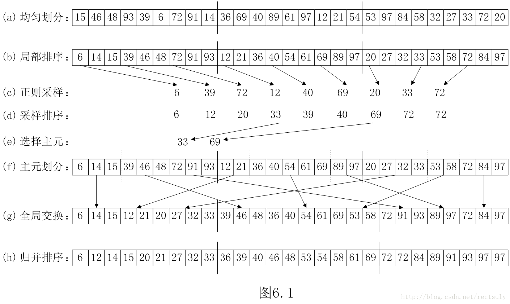

### Ch14 共享存储系统并行编程

OpenMP编程

p386 开始讲述。p404库函数

```c++
#define THREADS_NUM 3
void PSRS(vector<int>& array){
    vector<int>regular_sample;//正则样本
    int length_per_part=array.size()/THREADS_NUM;//每部分的长度
    omp_set_num_threads(THREADS_NUM);
    #pragma omp parallel
    {
        int id=omp_get_thread_num();//局部排序
        sort(array.begin()+id*length_per_part,(id+1)*length_per_part-1>array.size()?array.end():array.begin()+(id+1)*length_per_part-1);

        #pragma omp critical
        for(int k=0;k<THREADS_NUM;k++){//正则采样
            regular_sample.push_back(array[(id-1)*length_per_part+(k+1)*length_per_part/(THREADS_NUM+1)]);
        }
    }
    sort(regular_sample.begin(),regular_sample.end());//采样排序
    vector<int>pivot;
    for(int m=0;m<THREADS_NUM-1;m++){
        pivot.push_back(regular_sample[(m+1)*THREADS_NUM]);//选择主元
    }

    vector<int> pivot_array[THREADS_NUM][THREADS_NUM];
    #pragma omp parallel
    {
        int id=omp_get_thread_num();

        for(int k=0;k<length_per_part;k++){//全局交换
            for(int m=0;m<THREADS_NUM;m++){
                if(array[id*length_per_part+k]<pivot[m]){
                    pivot_array[id][m].push_back(array[id*length_per_part+k]);
                    break;
                }
                else if(m==THREADS_NUM-1){
                    pivot_array[id][m].push_back(array[id*length_per_part+k]);
                }
            }
        }
    }
    vector<int>array_per_thread[THREADS_NUM];
    #pragma omp parallel
    {
        int id=omp_get_thread_num();
        for(int k=0;k<THREADS_NUM;k++){
            for(auto item:pivot_array[k][id]){
                array_per_thread[id].push_back(item);
            }
        }
        sort(array_per_thread[id].begin(),array_per_thread[id].end());//局部排序
    }
    for(int i=0;i<THREADS_NUM;i++){
        for(auto item:array_per_thread[i]){
            cout<<item<<" ";
        }
    }
    cout<<endl;
}
```


### Ch15 分布存储系统并行编程

MPI编程

p411 开始讲述。p447库函数

```c++
int cmp(const void *a,const void *b){
    if(*(int *)a < *(int *)b) return -1;
    else if(*(int *)a > *(int *)b) return 1;
    else return 0;
}
void PSRS(int array[],int N){
    int thread_num,ID;
    MPI_Comm_size(MPI_COMM_WORLD,&thread_num);//总thread数目
    MPI_Comm_rank(MPI_COMM_WORLD,&ID);//thread ID
    int *pivot=(int *)malloc(thread_num*sizeof(int));
    int start_index,end_index;
    start_index=ID*N/thread_num;//计算每个线程对应的start/end index
    if(thread_num==ID+1) end_index=N;
    else end_index=(ID+1)*N/thread_num;
    int sub_array_size=end_index-start_index;//片段长度
    //MPI_Barrier(MPI_COMM_WORLD);
    qsort(array+start_index,sub_array_size,sizeof(array[0]),cmp);//局部排序
    for(int i=0;i<thread_num;i++){//正则采样
        pivot[i]=array[start_index+(i*(N/(thread_num*thread_num)))];
    }

    if(thread_num>1){
        int *collected_pivot=(int *)malloc(thread_num*thread_num*sizeof(pivot[0]));
        int *final_pivot=(int *)malloc((thread_num-1)*sizeof(pivot[0]));
        //0进程收集各个进程得到的主元
        MPI_Gather(pivot,thread_num,MPI_INT,collected_pivot,thread_num,MPI_INT,0,MPI_COMM_WORLD);
 //MPI_Gather(SendAddr,SendCount,SendDataType,RecvAddr,RecvCount,RecvDataType,Root,Comm)     
        if(ID==0){
            qsort(collected_pivot,thread_num*thread_num,sizeof(pivot[0]),cmp);//样本排序
            for(int i=0;i<thread_num-1;i++){//选择主元
                final_pivot[i]=collected_pivot[(((i+1) * thread_num) + (thread_num / 2)) - 1];
            }
        }
        MPI_Bcast(final_pivot,thread_num-1,MPI_INT,0,MPI_COMM_WORLD);
       	//MPI_Bcast(Addr,Count,DataType,Root,Comm)
        int index=0;
        int *partition_size=(int *)malloc(thread_num*sizeof(int));
        for(int i=0;i<thread_num;i++){
            partition_size[i]=0;
        }
        for(int i=0;i<sub_array_size;i++){//主元划分
            if(array[start_index+i]>final_pivot[index]){
                index++;
            }
            if(index==thread_num){
                partition_size[thread_num-1]=sub_array_size-i+1;
                break;
            }
            partition_size[index]++;
        }
        free(collected_pivot);
        free(final_pivot);

        int *new_partition_size=(int *)malloc(thread_num*sizeof(int));
        MPI_Alltoall(partition_size,1,MPI_INT,new_partition_size,1,MPI_INT,MPI_COMM_WORLD);
        //MPI_Alltoall(SendAddr,SendCount,SendDataType,RecvAddr,RecvCount,RecvDataType,Comm)
        int total_size=0;
        for(int i=0;i<thread_num;i++){
            total_size+=new_partition_size[i];
        }
        int *new_partition=(int *)malloc(total_size*sizeof(int));

        int *send_disp = (int *) malloc(thread_num * sizeof(int));
        int *recv_disp = (int *) malloc(thread_num * sizeof(int));
        int *recv_ends = (int *) malloc(thread_num * sizeof(int));
        send_disp[0]=0;recv_disp[0]=0;
        for(int i=1;i<thread_num;i++){
            send_disp[i]=partition_size[i-1]+send_disp[i-1];
            recv_disp[i]=new_partition_size[i-1]+recv_disp[i-1];
            recv_ends[i-1]=recv_disp[i];
        }
        recv_ends[thread_num-1]=total_size;
        //全局交换
        MPI_Alltoallv(&(array[start_index]),partition_size,send_disp,MPI_INT,new_partition,new_partition_size,recv_disp,MPI_INT,MPI_COMM_WORLD);
        free(send_disp);
        free(partition_size);
        free(new_partition_size);
        int *sorted_sub_array=(int*)malloc(total_size*sizeof(int));
        //归并排序
        for(int i=0;i<total_size;i++){
            int lowest=INT_MAX;
            int ind=-1;
            for(int j=0;j<thread_num;j++){
                if((recv_disp[j]<recv_ends[j]) && (new_partition[recv_disp[j]]<lowest)){
                    lowest=new_partition[recv_disp[j]];
                    ind=j;
                }
            }
            sorted_sub_array[i]=lowest;
            recv_disp[ind]++;
        }
        int *sub_array_size=(int *)malloc(thread_num*sizeof(int));
        // 发送各子列表的大小回根进程中
        MPI_Gather(&total_size,1,MPI_INT,sub_array_size,1,MPI_INT,0,MPI_COMM_WORLD);

        // 计算根进程上的相对于recvbuf的偏移量
        if(ID==0){
            recv_disp[0]=0;
            for(int i=1;i<thread_num;i++){
                recv_disp[i]=sub_array_size[i-1]+recv_disp[i-1];
            }
        }
        //发送各排好序的子列表回根进程中
 MPI_Gatherv(sorted_sub_array,total_size,MPI_INT,array,sub_array_size,recv_disp,MPI_INT,0,MPI_COMM_WORLD);
        free(recv_disp);
        free(recv_ends);
        free(sorted_sub_array);
        free(sub_array_size);
    }
    if(ID==0){
        for(int i=0;i<N;i++){
            printf("%d ",array[i]);
        }
    }
    printf("\n");
    free(pivot);
    MPI_Finalize();
}
int main(int argc,char *argv[]){
    int N=36;
    int array[N];
    srand(100);
    for(int i=0;i<N;i++){
        array[i]=rand()%100;
    }
    MPI_Init(&argc,&argv); //MPI初始化
    PSRS(array,N);
}
```


### ~~Ch16 并行程序设计环境与工具(略)~~

Intel的Parallel Studio

### 补充篇 GPU体系结构及编程

#### 术语

- GPU： 图形处理器(GPU, Graphics Process Unit)
- GPGPU： 用于通用计算的GPU(General-Purpose Computing on GPU,GPGPU)

#### NVIDIA G80的体系结构

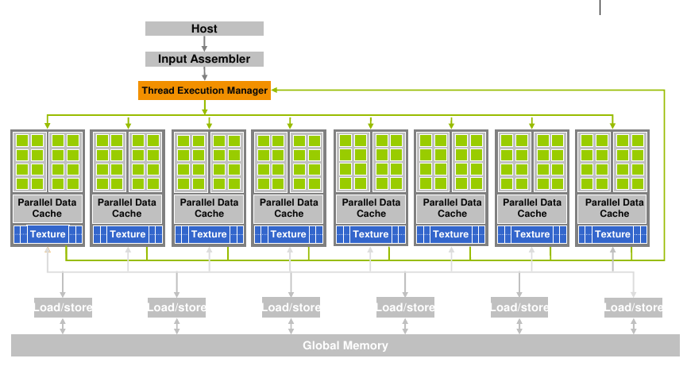

#### SM的组成

> SM(stream multiprocessor)

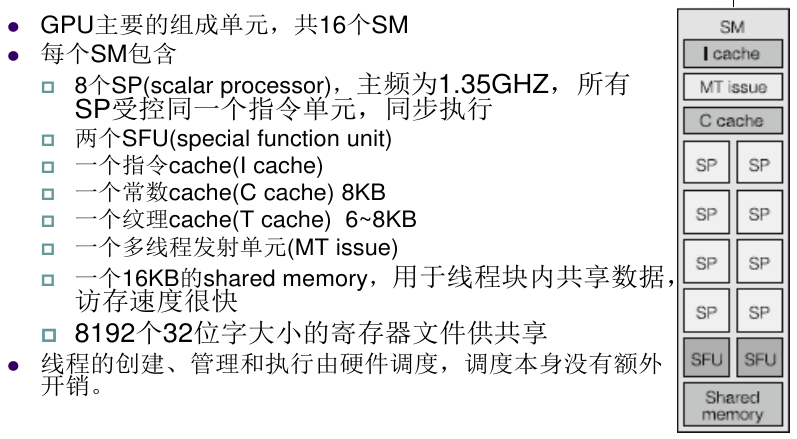

存储器

> 层次结构和特点，全局存储器的coalesced memory access，共享存储器的存储体冲突

##### 存储器层次结构

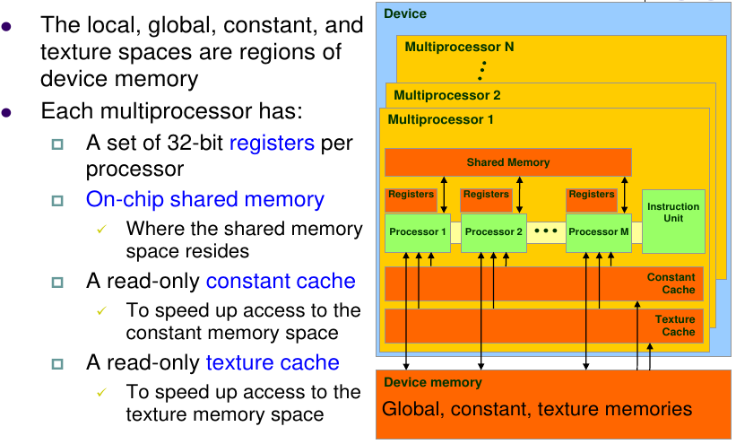

##### 共享存储器与存储体冲突

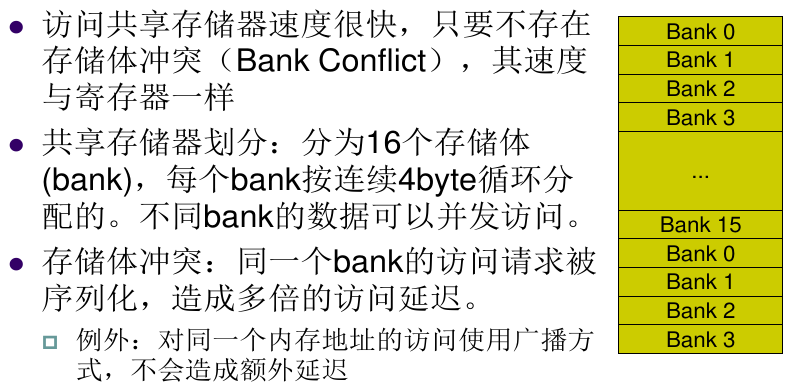

#### 线程组织结构

##### CUDA中的线程层次

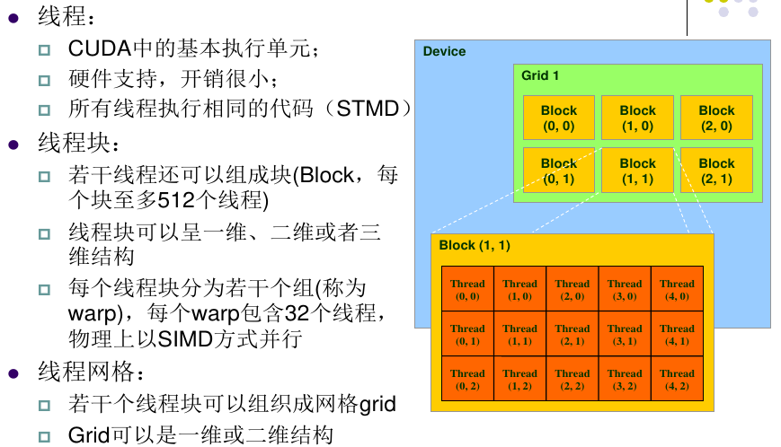

##### 线程块ID和线程ID

线程id

- local id: block中的线程id
- global id: grid中的线程id: blockDim*blockId+threadId

#### 同步

##### CPU和GPU间的同步

CPU启动内核kernel是异步的,即当CPU启动GPU执行kernel时,CPU并不等待GPU完成就**立即返回**,继续执行后面的代码。

```c
kernel<<<gridDim, blockDim>>>(arg1, arg2);
cudaThreadSynchronize();//实现CPU与GPU之间的同步
c=a+b;
```

##### 同一个block内的同步

同一个block内的线程可以通过shared memory共享数据。同一个block内的线程还可以快速同步

```c
__global__ void kernel(arg1, arg2)
{
int tid=threadIdx.x;
...
__syncthreads(); //用于实现同一个块内线程的同步
...
}
```

只有当同一个块内的所有线程都到达函数`__syncthreads()`时才会继续往下执行

##### 不同block之间的同步

同一个grid中的不同线程块之间不能同步,即CUDA运行时库中没有提供此类函数但可以通过终止一个kernel来实现同步

#### ~~CUDA编程（略）~~

#### CUDA程序的性能优化

#### 矩阵乘法及其优化

```c++
//array+array
#define BLOCK_NUM 256
#define BLOCK_SIZE 256
__global__ void deviceParallel(int *A,int *B,int *C,int length){
    int index=blockIdx.x*blockDim.x+threadIdx.x;//计算当前的线程index
    int stride=blockDim.x*gridDim.x;//总线程数目
    for(int i=index;i<length;i+=stride){//循环带状划分
        C[i]=A[i]+B[i];
    }
}
void parallel(int *A,int *B,int *C,int length){
    int *CA,*CB,*CC;
    cudaMalloc(&CA,sizeof(int)*length);//mem分配
    cudaMalloc(&CB,sizeof(int)*length);
    cudaMalloc(&CC,sizeof(int)*length);
    cudaMemcpy(CA,A,sizeof(int)*length,cudaMemcpyHostToDevice);//mem传递
    cudaMemcpy(CB,B,sizeof(int)*length,cudaMemcpyHostToDevice);
    deviceParallel<<<BLOCK_NUM,BLOCK_SIZE>>>(CA,CB,CC,length);
    cudaDeviceSynchronize();//同步
    cudaMemcpy(C,CC,sizeof(int)*length,cudaMemcpyDeviceToHost);
    cudaFree(CA);cudaFree(CB);cudaFree(CC);
}
```

```c++
//matrix * matrix
#define BLOCK_SIZE 16
__global__ void deviceParallel1(int *A, int *B, int *C,int BLOCK_NUM){
    int row = blockIdx.y * blockDim.y + threadIdx.y;
    int col = blockIdx.x * blockDim.x + threadIdx.x;
    int sum = 0;
    for (int i = 0; i < BLOCK_NUM * BLOCK_SIZE; i++){
        sum += A[row * BLOCK_NUM * BLOCK_SIZE + i] * B[i * BLOCK_NUM * BLOCK_SIZE + col];
    }
    C[row * BLOCK_NUM * BLOCK_SIZE + col] = sum;
}
void parallel1(int *A, int *B, int *C,int BLOCK_NUM){
    int *CA, *CB, *CC;
    cudaMalloc(&CA, sizeof(int) * BLOCK_NUM * BLOCK_SIZE * BLOCK_NUM * BLOCK_SIZE);
    cudaMalloc(&CB, sizeof(int) * BLOCK_NUM * BLOCK_SIZE * BLOCK_NUM * BLOCK_SIZE); 
    cudaMalloc(&CC, sizeof(int) * BLOCK_NUM * BLOCK_SIZE * BLOCK_NUM * BLOCK_SIZE);
    cudaMemcpy(CA, A, sizeof(int) * BLOCK_NUM * BLOCK_SIZE * BLOCK_NUM * BLOCK_SIZE, 
                                        cudaMemcpyHostToDevice);
    cudaMemcpy(CB, B, sizeof(int) * BLOCK_NUM * BLOCK_SIZE * BLOCK_NUM * BLOCK_SIZE, 
                                        cudaMemcpyHostToDevice);
    dim3 dimBlock(BLOCK_SIZE, BLOCK_SIZE); 
    dim3 dimGrid(BLOCK_NUM, BLOCK_NUM);
    deviceParallel1<<<dimGrid,dimBlock>>>(CA, CB, CC,BLOCK_NUM);
    cudaDeviceSynchronize();
    cudaMemcpy(C, CC, sizeof(int) * BLOCK_NUM * BLOCK_SIZE * BLOCK_NUM * BLOCK_SIZE, 
                                        cudaMemcpyDeviceToHost);
    cudaFree(CA);cudaFree(CB);cudaFree(CC);
}
__global__ void deviceParallel2(int *A, int *B, int *C,int BLOCK_NUM){
    //获得线程块号
    int blkRow = blockIdx.y; 
    int blkCol = blockIdx.x;
    //获得块内的线程号 
    int row = threadIdx.y; 
    int col = threadIdx.x;
    int var = 0;
    //循环，遍历所有子矩阵
    for (int i = 0; i < BLOCK_NUM; i++) {   
        const int *ASub = A + blkRow * BLOCK_SIZE * BLOCK_NUM * BLOCK_SIZE + i * BLOCK_SIZE; 
        const int *BSub = B + i * BLOCK_SIZE * BLOCK_NUM * BLOCK_SIZE + blkCol * BLOCK_SIZE;
        __shared__ int Ads[BLOCK_SIZE][BLOCK_SIZE]; //共享内存
        __shared__ int Bds[BLOCK_SIZE][BLOCK_SIZE];
        Ads[row][col] = *(ASub + row * BLOCK_SIZE * BLOCK_NUM + col); 
        Bds[row][col] = *(BSub + row * BLOCK_SIZE * BLOCK_NUM + col);
        __syncthreads();
        for (int k = 0; k < BLOCK_SIZE; k++) {
            var += Ads[row][k] * Bds[k][col]; 
        }
        __syncthreads();
    }
    int *CSub = C + blkRow * BLOCK_SIZE * BLOCK_NUM * BLOCK_SIZE + blkCol * BLOCK_SIZE;
    *(CSub + row * BLOCK_SIZE * BLOCK_NUM + col) = var;
}
void parallel2(int *A, int *B, int *C,int BLOCK_NUM){
    int *CA, *CB, *CC;
    cudaMalloc(&CA, sizeof(int) * BLOCK_NUM * BLOCK_SIZE * BLOCK_NUM * BLOCK_SIZE);
    cudaMalloc(&CB, sizeof(int) * BLOCK_NUM * BLOCK_SIZE * BLOCK_NUM * BLOCK_SIZE); 
    cudaMalloc(&CC, sizeof(int) * BLOCK_NUM * BLOCK_SIZE * BLOCK_NUM * BLOCK_SIZE);
    cudaMemcpy(CA, A, sizeof(int) * BLOCK_NUM * BLOCK_SIZE * BLOCK_NUM * BLOCK_SIZE, 
                                        cudaMemcpyHostToDevice);
    cudaMemcpy(CB, B, sizeof(int) * BLOCK_NUM * BLOCK_SIZE * BLOCK_NUM * BLOCK_SIZE, 
                                        cudaMemcpyHostToDevice);
    dim3 dimBlock(BLOCK_SIZE, BLOCK_SIZE); 
    dim3 dimGrid(BLOCK_NUM, BLOCK_NUM);
    deviceParallel2<<<dimGrid,dimBlock>>>(CA, CB, CC,BLOCK_NUM);
    cudaDeviceSynchronize();
    cudaMemcpy(C, CC, sizeof(int) * BLOCK_NUM * BLOCK_SIZE * BLOCK_NUM * BLOCK_SIZE, 
                                        cudaMemcpyDeviceToHost);
    cudaFree(CA);cudaFree(CB);cudaFree(CC);
}
```

```c++
//matrix * array
#define BLOCK_SIZE 4
__global__ void matvec_kernel(int *dA, int *dx,int *dy, int nRows, int nCols){
    int tid=threadIdx.x + blockIdx.x * blockDim.x;
   __shared__ int x_shared[BLOCK_SIZE];
   int y_val = 0;
   #pragma unroll
   for (int m = 0; m < ((nCols + BLOCK_SIZE - 1)/ BLOCK_SIZE); ++m){
       if ((m * BLOCK_SIZE + threadIdx.x) <  nCols) 
           x_shared[threadIdx.x] = dx[threadIdx.x + m * BLOCK_SIZE];
       else                                         
           x_shared[threadIdx.x] = 0;
       __syncthreads();
       #pragma unroll
       for (int e = 0; e < BLOCK_SIZE; ++e) {
           // --- Column-major ordering - faster
           //y_val += dA[tid + (e + BLOCK_SIZE * m) * nRows] * x_shared[e];
           // --- Row-major ordering - slower
           y_val += dA[tid * nCols + (e + BLOCK_SIZE * m)] * x_shared[e];
       }
       __syncthreads();
   }
   if (tid < nRows) dy[tid] = y_val;
}
__host__ void matvec( int * dA, int *dx,int *dy, int nRows, int nx){
    int *CdA,*Cdx,*Cdy;
    cudaMalloc(&CdA,sizeof(int)*nRows*nx);
    cudaMalloc(&Cdx,sizeof(int)*nx);
    cudaMalloc(&Cdy,sizeof(int)*nRows);
    cudaMemcpy(CdA,dA,sizeof(int)*nRows*nx,cudaMemcpyHostToDevice);
    cudaMemcpy(Cdx,dx,sizeof(int)*nx,cudaMemcpyHostToDevice);
    dim3 grid((nRows+BLOCK_SIZE-1)/BLOCK_SIZE);
    dim3 block(BLOCK_SIZE);
    matvec_kernel<<<grid,block>>>(CdA,Cdx,Cdy,nRows,nx);
    cudaDeviceSynchronize();
    cudaMemcpy(dy,Cdy,sizeof(int)*nRows,cudaMemcpyDeviceToHost);
    cudaFree(CdA);cudaFree(Cdx);cudaFree(Cdy);
}
```

