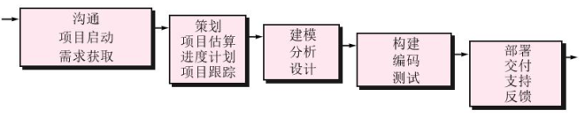
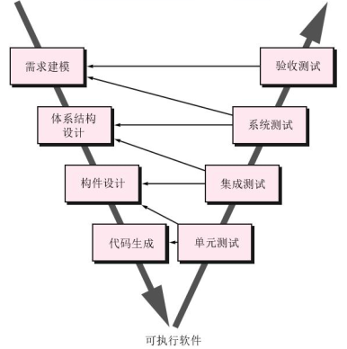
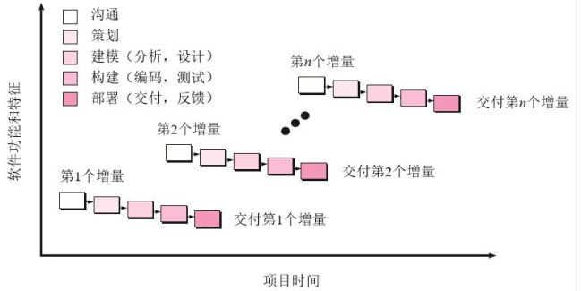
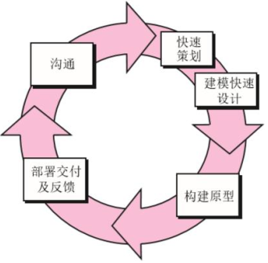
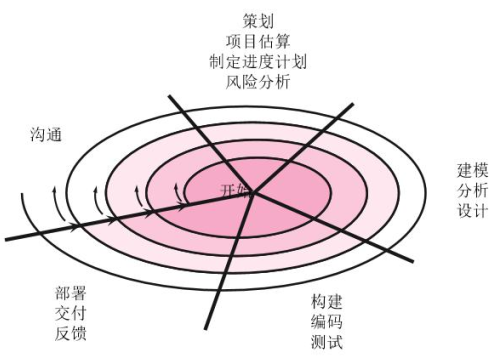
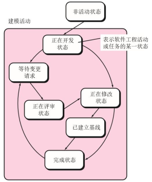
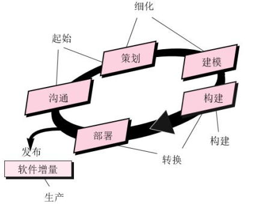
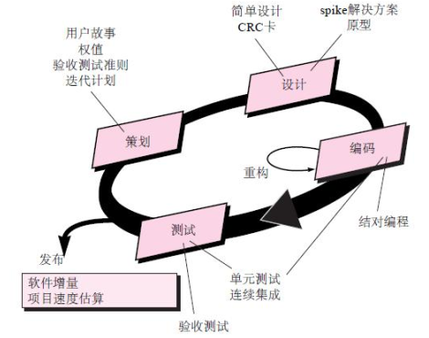
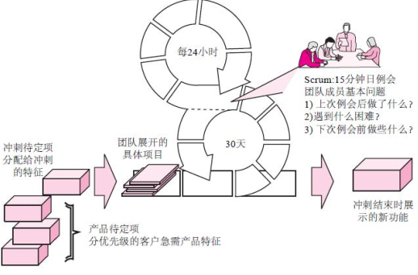

## 1 软件的本质

## 2 软件工程

## 3 软件过程结构

## 4 过程模型

### 4.1 惯用过程模型

#### 4.1.1 瀑布模型

**V模型**

软件开发中的循环迭代。

具有一些缺点。

#### 4.1.2 增量过程模型

#### 4.1.3 演化过程模型

**演化模型：原型模型**

**演化模型：螺旋模型**

**演化模型：并行模型**

### 4.2 专用过程模型

- 基于构件的开发—能够使软件复用
- 形式化方法—注重需求的数学规格说明
- 面向方面的软件开发—为定义、 说明、 设计和构建方面提供过程和方法
- 统一过程—一种“用例驱动、 以构架为中心的迭代和增量”软件过程和统一建模语言(UML)紧密结合

### 4.3 统一过程

## 5 敏捷开发

### 5.3 敏捷过程

#### 5.3.1 敏捷原则

1. 我们最优先要做的是通过尽早、 持续交付有价值的软件来使客户满意。
2. 即使在开发的后期， 也欢迎需求变更。 敏捷过程利用变更为客户创造竞争优势。
3. 经常交付可运行软件， 交付的间隔可以从几个星期到几个月， 交付的时间间隔越短越好。
4. 在整个项目开发期间， 业务人员和开发人员必须天天都在一起工作。
5. 围绕有积极性的个人构建项目。 给他们提供所需的环境和支持， 并且信任他们能够完成工作。
6. 在团队内部， 最富有效果和效率的信息传递方法是面对面交谈。
7. 可运行软件是进度的首要度量标准。
8. 敏捷过程提倡可持续的开发速度。 责任人(sponsor)、 开发者和用户应该能够长期保持稳定的开发度。
9. 不断地关注优秀的技能和好的设计会增强敏捷能力。
10. 简单——使不必做的工作最大化的艺术——是必要的。
11. 最好的架构、 需求和设计出自于自组织团队。
12. 每隔一定时间， 团队会反省如何才能更有效地工作， 并相应调整自己的行为。

### 5.4 极限编程(XP)

#### 5.4.1 极限编程过程

使用最广泛的敏捷过程， 由Kent Beck提出。

- XP 策划
  - 开始于倾听， 倾听产生一系列“用户故事”。
  - 团队成员评估每一个故事， 并给出以开发周数为度量单位的成本。
  - 团队共同决定如何将故事分组， 并置于将要开发的下一个软件增量中。
  - 给出对下一个发布版本的基本承诺（就包括的故事、交付日期和其他项目事项）
  - 项目的第一个发行版本（也称为一个软件增量）交付之后， XP团队计算项目的速度， 用于帮助估计后续发行版本的发布日期和进度安排。

- XP 设计
  - 严格遵循KIS（Keep It Simple， 保持简洁）原则。
  - 鼓励使用CRC卡（第10章）。
  - 如果在设计中碰到困难， 推荐使用“ Spike解决方案” ——一种设计原型。
  - 鼓励“ 重构” —以不改变代码外部行为而改进其内部结构的方式来修改软件系统的过程。
- XP 编程
  - 推荐在编码开始之前建立单元测试。
  - 鼓励“ 结对编程” 。

- XP 测试
  - 所有单元测试应当使用一个可以自动实施的框架。
  - “验收测试” 由客户规定技术条件， 并且着眼于客户可见的系统级特征和功能。

#### 5.4.2 工业极限编程(IXP)

IXP与原来XP的主要差别在于其管理具有更大的包容性， 它扩大了用户角色， 升级了技术实践。
IXP合并了六个新实践：准备评估, 项目社区, 项目特许, 测试驱动管理, 回顾, 持续学习

### 5.5 其他敏捷过程模型

#### 5.5.1 Scrum

由Schwaber and Beedle提出

- Scrum—基本特征
  - 开发活动由工作单元(packets)组成
  - 测试和文档编制工作贯穿始终
  - 发生于一个过程模式中的工作任务称为一个冲刺(sprint)， 其来源于待定项(backlog)中定义的需求
  - 例会时间很短， 有时甚至站立开会
  - 在规定时间段内将演示软件交付给用户

#### 5.5.2 动态系统开发方法(DSDM)

- 由DSDM 协会提出(www.dsdm.org)
- DSDM—基本特征
  -  在很多方面类似极限编程
  - 九条基本原则
    - 用户必须持续参与。
    - 必须授予DSDM团队制定决策的权力。
    - 注重产品的经常交付。
    -  满足业务用途是接受交付品的主要依据。
    - 迭代和增量式开发对得到正确的业务解决方案是必不可少的。
    - 开发过程中的所有变化可逆。
    - 在高层次上制定需求的基线。
    - 测试自始自终贯穿于开发周期之中。
    - 所有项目涉众间的通力合作是不可或缺的。

#### 5.5.3 敏捷建模

## 6 软件工程的人员方面

### 6.1 软件工程师的特质

- 个人责任感
- 对团队成员和利息相关者的需求有敏锐的意识
- 对有缺陷的设计， 用诚实且有建设性的方式指出错误
- 抗压能力
- 高度的公平感
- 注重细节
- 务实

### 6.2 软件工程心理学

### 6.3 软件团队

### 6.4 团队结构

### 6.5 敏捷团队

#### 6.5.1 通用敏捷团队

#### 6.5.2 XP团队

### 6.6 社交媒体的影响

### 6.7 软件工程中云的应用

### 6.8 协作工具

### 6.9 全球化团队

## 7 指导实践的原则

## 8 理解需求

## 9 需求建模：基于场景的方法

## 10 需求建模：基于类的方法

## 11 需求建模：行为、模式和Web移动应用

## 12 设计概念

## 13 体系结构设计

## 14 构件级设计

## 15 用户界面设计

## 16 基于模式的设计

## 17 WebApp 设计

## 18 移动应用系统设计

## 19 质量概念

## 20 评审技术

## 21 软件质量保证（SQA）

## 22 软件测试策略

## 23 测试传统的应用系统

## 24 测试面向对象的应用系统

## 25 测试Web应用系统

## 26 测试移动应用系统

## 27 安全性工程

## 28 形式化建模与验证

## 29 软件配置管理

## 30 产品度量

## 31 项目管理概念

## 32 过程度量和项目度量

## 33 软件项目估算

## 34 项目进度安排

## 35 风险分析

## 36 维护与再工程

## 37 软件过程改进

## 38 软件工程的新趋势

## 39 结束语