## PART 1:Web Search

### 一. Introduction
1. Web 搜索的概念与挑战

   大规模 (Volume)、高价值信息的发现 (Value)、异构数据 (Variety)、无结构信息、数据的分布性、 数据的不稳定性、 数据的质量。

2. 信息检索(IR)的概念、与Web 搜索之间的关系

   Information Retrieval

   > Given a query and a corpus, find relevant documents.

   Web搜索

   >  given a keyword and a web crawler, find relevant URLs

   两个之间的关系

   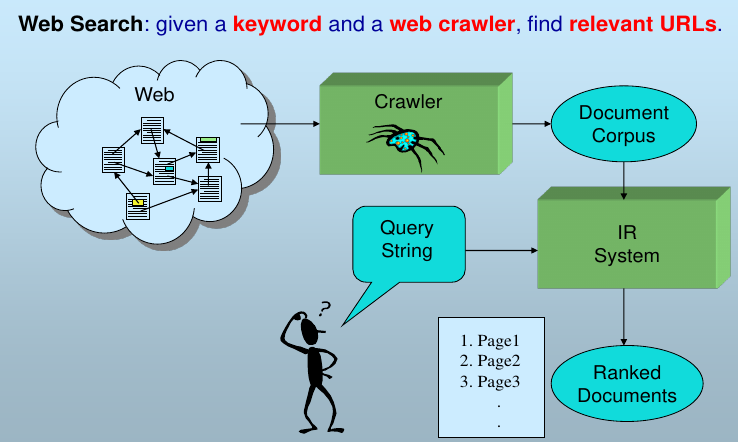

3. IR 与DB 之间的区别

   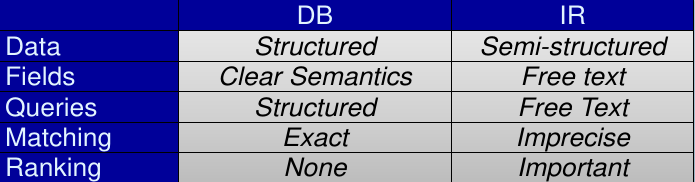

4. IR 的任务与基础性问题

   IR的任务：

   - **随机搜索**(Ad hoc Search,也称特殊搜索)
     查询的范围巨大而且事先没有约定,是搜索引擎研究的主要任务
   - **信息过滤** (Information Filtering)
     从动态的信息流中选取满足用户兴趣的信息——IR+用户模型
   - **分类** (Classification)
   - **问答** (Question Answering)
     “珠穆朗玛峰的高度是多少?”、“亚马逊河流有多长?”

   IR的基础性问题

   -  相关性计算 (Relevance)

   -  检索模型(Retrieval Model) :抽象地表示document, queries以及它们之间的关系

   -  评价(Evaluation)

   -  信息需求(Information Need)

   -  检索性能(Efficiency)

### 二. Web Crawler
1. 网络爬虫的概念和基本过程

   网络爬虫的概念:

   > 从一个种子站点集合开始,从 web 中寻找并且下载网页,获取排序需要的相关信
   > 息,并且剔除低质量的网页

   网络爬虫基本过程:

   > 种子装入桶中、每次从桶中取出一个网页、提取出网页所有  放入桶中、重复

2. 网络爬虫的主要需求

   - 快 Fast: Bottleneck? Network utilization
   - 可扩展性 Scalable: Parallel , distributed
   - 友好性 Polite: DoS(Deny of Service Attack), robots.txt
   - 健壮 Robust: Traps, errors, crash recovery
   - 持续搜集 Continuous: Batch or incremental
   - 时新性Freshness

3. 网络爬虫的常用策略

   用栈深度优先、用队列广度优先

4. 网络爬虫涉及的协议

    HTTP/HTML, DNS/URL, **Robots Exclusion(排斥协议), Sitemap(允许协议)**

5. 分布式爬虫与一致性 Hash 的概念

   分布式爬虫：

   > 如何有效地把 N 个网站的搜集任务分配到 M 个机器上去使得分配比较均匀

   一致性Hash: 

   > 将网页和机器都映射到环路 Hash 空间,每个机器负责自身位置与后继的网页搜集

### 三. Text Processing
1. 文本处理的概念

   > 将原始文档转换成词项集以方便索引以及query与document内容的匹配

2. 字符编码:ASCII、Unicode、UTF‐8

   - ASCII: 美国信息交换标准代码
   - Unicode: 统一码,满足跨语言、跨平台的需求
   - UTF-8: 针对 Unicode 的可变截屏长度字符编码

3. 分词、分词歧义、未登录词、停用词等概念

   - 分词:将文档的**字符串序列**变成**词序列**
   - 语素:最小的语音语义结合体,是最小的语言单位
   - 词:代表一定的意义,具有固定的语音形式,可以独立运用的最小的语言单位
   - **交集型歧义**(交叉歧义):网球/场/——网/球场/ AB+BC: AB/C/   A/BC/
   - **组合型歧义**(组合歧义):我/个人/——三/个/人/ AB+A+B: AB/ A/B/
   - 未登录词:未包括在分词词表中但必须切分出来的词,包括各类专名、术语、缩略语等
   - 停用词:在文档中**频繁**出现或与**语料库特性**有关的词

4. 中文分词的挑战

   - 英语——词的集合 vs. 汉语——**字的集合**
   - 汉字之间存在着不同的**组词**方式
     如“发展中国家兔的饲养”一句,现有的汉语词就可能导致有两组分隔结果: 发展中国家/兔/的/饲养,发展/中国/家兔/的/饲养。
   - 汉语**虚词**众多,而且绝大多数汉字当与不同的汉字组词时,其词可能为关键词,也可能为停用词
     如,“非”与“洲”、“常”分别组成不同意义的词“非洲”(关键词)、“非常”(停用词)。
   - **分词歧义(交集型歧义, 组合型歧义)**
   - **未登录词**

5. 常用的分词方法

   - 基于字符串匹配的方法

     > 又叫机械分词方法,它按照一定的策略将待分析的汉字串与一个“充分大的”机器词典中的词条进行匹配,若在词典中找到某个字符串,则匹配成功(识别出一个词)

     - 正向最大匹配分词( Forward Maximum Matching method, FMM)

       >  从左至右尽可能查找最长的词,直到当前字符与已经处理的字符串不构成词,输出已经识别的词,并从识别出来的词后面接着查找词。
       >

       分词速度比较快

       分词错误率比较高,错误率约 1/169

     - 反向最大匹配分词(Backward Maximum Matching method, BMM ,RMM)

       > 从右至左尽可能查找最长的词

       实验表明分词效率优于正向最大匹配分词方法1/245

     - 双向最大匹配分词(Bi-direction Matching method, BM:FMM+RMM)

       > 比较FMM法与BMM法的切分结果,从而决定正确的切分

       可以识别出分词中的交叉歧义

     - 最少切分分词

       > 使句子中切出的词数目最少

   - 基于理解的方法

     > 在分词的同时进行句法、语义分析,利用句法信息和语义信息来处理歧义现象

   - 基于统计的方法

     >  字与字相邻共现的频率或概率能够较好的反映成词的可信度。
     >  如果某两个词的组合,在概率统计上出现的几率非常大,那么我们就认为分词正确。

     - N元文法模型(N-gram)

       > 当前状态只跟(N-1)阶马尔可夫状态有关
       > N-gram = (N-1)阶马尔可夫模型

       词序列$w=w_1\cdots w_n$

       $P(w)=p(w_1)p(w_2|w_1)p(w_3|w_1w_2)\cdots p(w_n|w_1w_2\cdots w_{n-1})$

       - N=1:一元文法模型,最大概率模型

         $P(w)\approx p(w_1)\cdots p(w_n)$

       - N=2:bigram

         $P(w)\approx p(w_1)p(w_2|w_1)p(w_3|w_2)\cdots p(w_n|w_{n-1})$

         其中$p(w_n|w_{n-1})=\frac{C(w_{n-1}w_n)}{C(w_{n-1})}$

       - N=3:trigram

         $P(w)\approx p(w_1)p(w_2|w_1)p(w_3|w_1w_2)\cdots p(w_n|w_{n-2}w_{n-1})$

     - 隐马尔可夫模型(HMM)

6. 词根化(Stemming)和编辑距离的概念

   - 词根化:使用一系列后缀变换规则对单词进行变换
   - 编辑距离:从 s 转换为 t 使用增加、删除、替换三种操作的最小次数

### 四. Indexing
1. 布尔检索、关联矩阵的概念

   布尔检索的概念:

   > 利用 AND、OR 或者 NOT 操作符将词项连接起来的查询

   关联矩阵的概念:

   > 行为词项,列为文档,词项在文档中出现为 1 不出现为 0

2. 倒排索引:概念、结构、构建算法、存储等

   倒排索引的概念和结构:

   > 以词项(Vocabulary)为索引,每个词项维护一个链表(Postings List),表示其出现过的文档集(从小到大)
   > 可以加入扩展项:某词在某文档中的出现词频 TF、某词出现过的文档频数 DF

   倒排索引的构建:

   > 写出每个文档的 词项 -> 文档 索引
   > 合并所有的索引,词项和文档号均从小到大排列

   倒排索引的存储:

   > 词项与链表存储在同一个文件中/不同文件中

   词汇表存储结构:

   > 顺序存储、Hash table、B+树、Trie 树

   Zipf’ Law:

   > 任意一个词项,其频度和频度的排名的乘积大致是一个常数

### 五. Queries
1. 查询表达的难点

   - 一个查询可以代表非常不同的信息需求
   - 一个查询可能是其真正需求的一种非常差的表述

2. 相关性反馈:概念、基本过程

   > 用户在查询后标记相关/不相关文档,然后迭代更新查询以获得更好的结果

3. 相关性反馈的分类及其各自的概念与特点

   - 显式反馈(Explicit Feedback):

     > 用户显式参加交互过程,即用户反馈

     问题:开销大、查询长、用户不愿意、反馈逻辑难理解

   - 隐式反馈(Implicit Feedback):

     > 系统跟踪用户的行为来推测返回文档的相关性,从而反馈

     鼠标键盘动作:点击链接、加入收藏夹、拷贝粘贴、停留、翻页等等
     用户眼球动作: Eye tracking可以跟踪用户的眼球动作拉近、拉远、瞟、凝视、往某个方向转

     好处: 省却了用户的显式参与过程

     问题: 对分析的要求高、准确度难保证、可能需要额外设备

   - 伪相关反馈(Pseudo Feedback): 

     > 没有用户参与,系统直接假设返回文档的前k篇是相关的,然后进行反馈。

     好处:不用考虑用户因素,处理简单,平均效果也不错

     问题:准确率难以保证,可能出现查询漂移

4. Ricchio 算法

   向量空间模型：文档与查询均表示为**词项权重构成的向量**。向量相似度。

   新查询向相关文档靠拢而远离非相关文档
   $$
   \vec{q}_m=\alpha \vec{q}_0 + \beta \frac{1}{|D_r|}\sum_{\vec{d}_j\in D_r} \vec{d}_j -\gamma  \frac{1}{|D_{nr}|}\sum_{\vec{d}_j\in D_{nr}}\vec{d}_j
   $$
   其中,

   $q_m$: modified query vector

   $q_0$: original query vector

   $\alpha,\beta,\gamma$: weights

   $D_r$: 已知的relevant doc vectors 集合

   $D_{nr}$: 已知的irrelevant doc vectors集合

    计算过程中若出现负的权重一律设为0

5. 查询扩展的概念

   > 通过**在查询中加入同义或相关的词项**来提高检索结果
   >
   > 相关词项的来源: 人工编辑的同义词词典、自动构造的同义词词典、查询日志等等。

6. 查询扩展的几种方法

   - Manual thesaurus
     人工构建同(近)义词词典: 如 PubMed
   - Automatically derived thesaurus
     自动导出同(近)义词词典: 比如,基于词语的共现统计信息
   - Refinements based on query log mining
     基于查询日志挖掘出的查询等价类: Web上很普遍

### 六. Ranking
1. Ranking 的难点

   - Web 网页的质量参差不齐,大量的网页组织性、结构性比较差
   - 大部分检索用户是没有任何经验的
   - 用户的查询需求存在着巨大差异

2. 信息检索模型的概念、分类

   信息检索模型的概念:

   > 用来描述文档和用户查询的标识形式以及它们之间相关性的框架

   形式化表示为:$[ D, Q, F, R(D_i,q) ]$

   即[文档表达, 查询表达, 匹配框架, 相关性度量函数]

   信息检索模型的分类:

   - 基于集合论的模型

     - 布尔模型(Boolean Model)

       词袋模型。二元相关。

   - 基于代数论的模型

     - 向量空间模型(Vector Space Model)

   - 基于概率论的模型

     - 概率模型(Probabilistic Model)
     - 语言模型(Language Model)
     - 推理网络(Inference Network)

   相关性分类:

   - 相关性
     - 主题(topical)相关(一篇文档被判定和一个查询是同一主题)
     - 用户(user)相关 (考虑用户在判定相关性时涉及的所有因素)

   - 相关性
     - 二元(binary)相关(简单判定一篇文档是相关还是非相关)
     - 多元(multi-valued)相关 (从多个层次判断相关性)

   **相关性排序**

   - Jaccard系数
   - 词项频率tf
   - 文档频率df
   - tf-idf

3. Jaccard 系数

   计算两个集合的重合度
   $$
   \text{Jaccard}(A,B)=\frac{|A\cap B|}{|A\cup B|}
   $$
   Jaccard系数的缺点

   - 不考虑词项频率 ,即词项在文档中的出现次数
   - 没有仔细考虑文档的长度因素
   - 罕见词比高频词的信息量更大,Jaccard系数没有考虑这个信息

4. tf、df、tf‐idf 的概念与计算

   - tf 词项$t$在文档$d$中出现的次数$\text{tf}_{t,d}$

     - 原始tf值。不合适

     - 对数词频
       $$
       \text{w}_{t,d}=
       \begin{cases}
       1+\log_{10}\text{tf}_{t,d}&\text{if tf}_{t,d}>0	\\
       0 & \text{otherwise}
       \end{cases}
       $$
       得分是所有词频之和（同时出现在查询和文档中的词）。

   - df 出现词项$t$的文档数目$\text{df}_t$

     idf: inverse document frequency
     $$
     \text{idf}_t=\log_{10}\frac{N}{\text{df}_t}
     $$
     其中$N$为文档总数目。idf反映了词项的信息量。

   - tf-idf

     tf与idf的乘积
     $$
     \text{w}_{t,d}=(1+\log_{10}\text{tf}_{t,d})\cdot \log_{10}\frac{N}{\text{df}_t}
     $$
     随着词项频率的增大而增大
     随着词项罕见度的增加而增大

5. 向量空间模型

   > 每篇文档表示成一个**基于tf-idf权重的实值向量** $d∈R^{|V|}$.

6. 余弦相似度的定义
   $$
   \cos\alpha=\frac{\mathbf{x}\cdot \mathbf{y}}{|\mathbf{x}|\cdot|\mathbf{y}|}
   $$

7. 概率模型的概念

   > 定义3个随机变量$R、Q、D$:相关度$R=\{0,1\}$,查询$Q=\{q_1,q_2,...\}$,文档$D=\{d_1,d_2,...\}$,则可以通过计算条件概率$P(R=1|Q=q,D=d)$来度量文档和查询的相关度。

8. PageRank
   $$
   \text{PR}(a)=(1-d)+d\cdot\sum_{i=1}^n\frac{\text{PR}(T_i)}{\text{C}(T_i)}
   $$
   其中$\text{PR(a)}$: 页面a的PageRank值

   $\text{PR}(T_i)$: 页面$T_i$的PageRank值，且$T_i$指向(链接向)a

   $\text{C}(T_i)$: 页面$T_i$的链出的链接数量

   $d$: 阻尼系数, 范围$[0,1]$

   计算方法：

   先赋初值，然后迭代，直到变化值小于某个阈值。

   - 优点:给网页提供重要性排序 + 可以离线完成 + 独立于主题
   - 缺点:未区分链接种类 + 对新网页不公平 + 不能单独用于排序

9. HITS

   - 基本假设1
     一个好的“Authority”页面会被很多好的“Hub”页面指向

   - 基本假设2:
     一个好的“Hub”页面会指向很多好的“Authority”页面;

   在HITS算法中,对每个网页都要计算两个值: 权威值(authority)与中心值(hub)

   计算过程有两个步骤:I步骤和O步骤: 

   在I步骤中每个页面的Authority值为所有指向它的页面的Hub值之和。

   在O步骤中每个页面的Hub值为所有它指向的页面的Authority值之和。

   - 优点:能更好地描述互联网的组织特点 + 主题相关,Query-dependent + 可以单独用于网页排序
   - 缺点: 需要在线计算,时间代价较大 + 容易受到“链接作弊”的影响 + 稳定性较差,容易被链接结构变化影响

### 七. Evaluation
1. 信息检索评价概述

   > 评价受主观、情景、认知、时间的影响,重点在于保持公平

2. 信息检索评价指标的分类

   - 效率:时间开销、空间开销、响应速度
   - 效果:准确率、召回率、是否靠前
   - 其他:覆盖率、访问量、数据更新速度

3. 效果评价指标

   - 基于集合:

     - 正确率 Precison: 返回的相关文档占返回的总文档的比比例

     - 召回率 Recall: 返回的相关文档占相关总文档的比例

       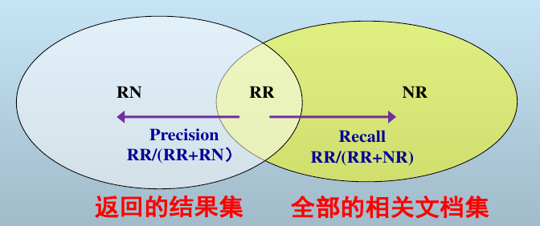

     - $F$ 值: 召回率 $R$ 和正确率 $P$ 的调和平均
       $$
       F=\frac{2}{\frac{1}{P}+\frac{1}{R}}=\frac{2PR}{P+R}
       $$

     - $F_β$ 值: 召回率 $R$ 和正确率 $P$ 的加权调和平均, 其中 $R$ 的权为$β^2$,$P$ 的权为 $1$
       $$
       F_\beta=\frac{1+\beta^2}{\frac{\beta^2}{R}+\frac{1}{P}}=\frac{(1+\beta^2)PR}{\beta^2P+R}
       $$

   - 基于序:

     - P@N: 只考虑返回的前 N 个文档时的正确率

       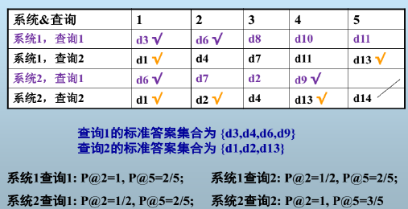

     - R-Precision: 即 P@相关文档总数，其中相关文档为原本全部的相关文档。

       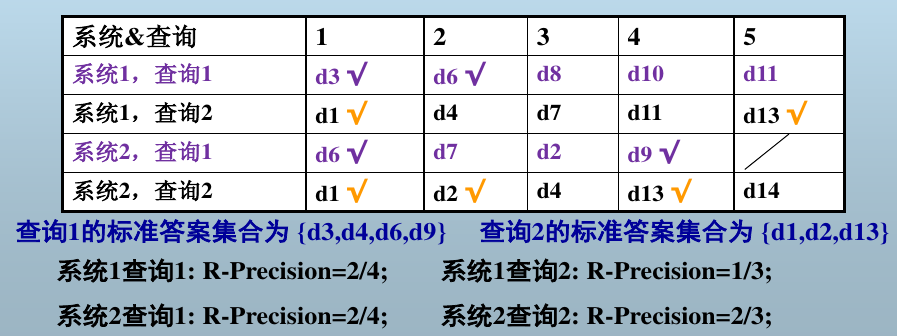

     - 未插值 AP(Average Precision): (P@相关文档出现位置)的平均，未出现的相关文档也计入。

     - 插值 AP: 在召回率 0,0.1,0.2......1.0 上十一点的正确率平均。不存在某召回率点时,取该点到下一个点之间最大正确率

     - 简化 AP: 在未插值 AP 中**忽略**未出现的相关文档

       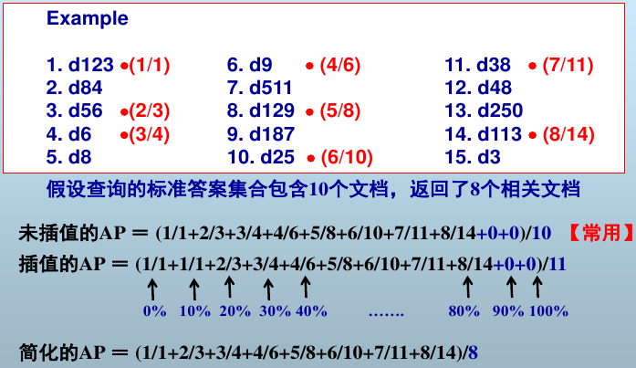

   - **多个查询**:

     - MAP(Mean AP): 所有查询的 AP 的算术平均

       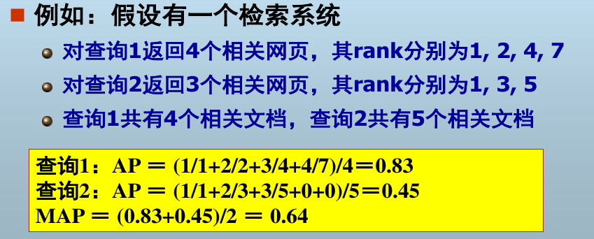

     - MRR(Mean Reciprocal Rank): 第一个相关文档返回的位置的倒数的算术平均。只关心地一个标准答案的位置。

       

   - 其他:

     -  CG(Cumulativa Gain): 位置 1 到位置 p 的检索结果的(文档与查询的)相关度之和
     $$
     CG_p=\sum_{i=1}^prel_i
     $$
       没有考虑相关文档出现的位置。

     - DCG(Discounted Cumulative Gain): 相关度要先除以 $\log_2i$作为惩罚,其中 i 为出现的位置
       $$
       DCG_p=rel_1+\sum_{i=2}^p\frac{rel_i}{\log_2 i}
       $$
       另一种计算方法
       $$
       DCG_p=\sum_{i=1}^p\frac{2^{rel_i}-1}{\log_2(1+i)}
       $$
       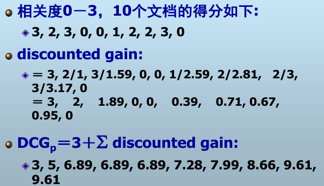

       DCG的值与具体查询有关,和结果列表的长度有关,不利于检索系统之间的对比

     - NDCG(Normalized DCG): DCG 的值除以理想化的 IDCG 的值,规范化为[0,1]

       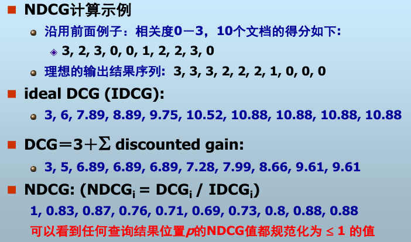

## PART 2: Web Information Extraction

### 一. Named Entity Recognition
1. 信息抽取(Information Extraction, IE)的概念以及与IR 的关系

   信息抽取的概念:

   > 从语料中抽取指定的事件、事实等信息,形成结构化的数据
   > 能作为一种浅层的文本理解,是信息检索的进一步深化

   信息抽取与信息检索的关系:

   > 检索是从文档集合中找文档子集,抽取是从文本中获取用户感兴趣的事实信息
   > 检索通常利用统计与关键词等技术,抽取借助于自然语言处理技术
   > 检索通常与领域无关,抽取通常与领域相关

2. MUC‐7 定义的信息抽取任务

   - 命名实体 NE:现实世界中具体或抽象的实体,还包括日期、时间、数量等
   - 模板元素 TE:实体属性,通过槽描述命名实体的基本信息
   - 共指关系 CR:命名实体的等价关系
   - 模板关系 TR:实体之间的各种关系,又称为事实
   - 背景模板 ST:实体发生的事件

3. 信息抽取的内容

   > 实体、属性、关系、事件
   > 关键在于“抽取实体,确定关系”

4. NER(Named Entity Recognition) 的概念与难点

   命名实体识别 NER 的概念:

   > 识别文本中的人名、地名等专有名称和有意义的时间、日期等数量短语并加以归类

   命名实体识别 NER 的难点:

   > 命名实体类型多样、新命名实体不断出现、命名实体歧义、命名实体结构复杂

5. MUC‐7 中定义的NER 内容

   - 实体类:人名、地名、机构名
   - 时间类:日期、时间
   - 数值类:货币、百分比
   - 注意:人造物、重复指代的普通名词、派生词、以人命名的法律和奖项等不算!
     - 人造物:如Wall Street Journal、MTV
     - 重复指代的普通名词:如飞机、公司等
     - 人的团体名称以及以人命名的法律、奖项等:如共和国、诺贝尔奖等
     - 从名词派生出来的形容词:如Chinese、American等
     - 非时间、日期、货币、百分比的数字

6. NER 的性能评价指标

   正确率 P:正确数 / 总数     ( 正确数 + (1/2)部分正确数 ) / 总数
   召回率 R:正确数 / 总正确数 ( 正确数 + (1/2)部分正确数 ) / 总(部分)正确数
   F 值: P 与 R 的调和平均

7. NER 的常用方法

   - 基于词典:词典匹配;难以枚举命名实体、构建词典代价大、难以处理歧义
   - 基于规则:自行构造模板匹配;依赖性强、代价大、建设周期长、可移植性差
   - 基于统计:隐马尔可夫 HMM、最大熵 ME、支持向量机 SVM、条件随机场 CRF
   - 混合方法:混合使用词典、规则和统计

### 二. Relation Extraction
1. 关系抽取的概念和意义

   关系抽取的概念:

   > 从文本中识别出两个实体或多个实体之间存在的事实上的关系

   关系抽取的意义:

   > 提高搜索引擎发现知识的能力
   > 广泛应用于各种知识库的构建
   > 支持知识推理和问答系统研究

2. 关系的表示方法

   二元组( <subject, objects>)、三元组(<subject, predicate, object>)、多元组(<subject, predicate, object, time>)

3. 关系抽取的常用方法

   - 基于规则:针对特定领域的特定关系,设计针对性的抽取规则,代价大,难移植
   - 基于模式:种子关系生成关系模式,基于关系模式抽取新的关系,再迭代生成新的模式和新的关系
   - 基于机器学习:特征向量、核函数

## PART 3: Web Data Mining

### 一. 概述(Introduction)
1. 网络挖掘的概念,包含哪些方面的内容,分别有哪些重要应用?

   网络挖掘的概念:

   > 从 web 中挖掘有用的信息和有用的模式

   网络挖掘的内容与应用:

   - 网络内容挖掘:数据挖掘、数据分类、数据聚类
   - 网络结构挖掘:社区分析、影响力分析
   - 网络用途挖掘:推荐系统

### 二. 网络内容挖掘(Web Content Mining)
#### **数据(Data)**

1. 概念:数据对象(Objects),属性(Attributes),维度(Dimensions),特征(features)

   > 数据对象是一个数据实例,其属性、维度、特征意思相同,均为描述数据的一个域

2. 高维诅咒(Curse of dimensionality)现象。

   > 当维度增加，在数据所在的空间，数据点变得异常稀疏。数据的密度与距离变得没有意义。

3. 对于数据的预处理有哪些方法?其中需要掌握采样(Sampling),特征选择(Feature selection)及降维(Dimensionality reduction)的基本原理。

    - **采样**:使用有代表性的样本,使得样本与总体在属性上有相似的性质
    - **特征选择**:剔除冗余和无关特征
    - **降维**:避免高维诅咒、降低数据挖掘的代价、使数据更加容易可视化、消除不相关特征或噪声（方法如PCA: Principal Components Analysis）

#### **分类(Classification)**

4. 监督学习(Supervised learning)与无监督学习(Unsupervised learning)的关系与区别。

   > 监督学习:使用训练样本训练模型,再利用模型解析未知数据进行分类
   > 无监督学习:无训练样本,直接按照未知数据的相似程度建模聚类

5. 分类(Classification)的基本原理。

   > 选定模型后,使用训练数据训练模型参数,之后用模型解析输入数据得到分类

6. 数据的向量表示(Vector space representation)

   > 用数据的频数或者 tf-idf 表示

7. 熟练掌握 k 近邻算法,包括影响算法性能的要素——近邻个数及距离(相似度)度量。

   > 找到与待分类数据距离最近的 K 个数据,然后将其分入频数最高的类中
   > KNN 无法免疫高维诅咒现象,但是在高维特征独立数较小时,KNN 也适用

   距离度量：Euclidian距离（m维实值数据）、Hamming距离（m维binary数据，即不同features的数目）、tf-idf向量的cosine相似度（文本数据）

8. 熟练掌握 Logistic regression 分类方法。

   Binary分类
   $$
   \begin{aligned}
   p(y=1|\mathbf{x})&=\sigma (\mathbf{w}^\top\mathbf{x})=\frac{1}{1+\exp{(-\mathbf{w}^\top\mathbf{x})}}	\\
   p(y=0|\mathbf{x})&=1-p(y=1|\mathbf{x})=\frac{1}{1+\exp{(\mathbf{w}^\top\mathbf{x})}}
   \end{aligned}
   $$
   Log odds for logistic regression
   $$
   \log \frac{p(y=1|\mathbf{x})}{1-p(y=1|\mathbf{x})}=\mathbf{w}^\top\mathbf{x}
   $$
   likelihood: 给定模型$\mathbf{w}$，每个样本属于其真实类别的概率
   $$
   \begin{aligned}
   p(y_i|\mathbf{x}_i;\mathbf{w})&=
   \begin{cases}
   \sigma(\mathbf{w}^\top\mathbf{x}_i)&\text{if }y_i=1, \\
   1-\sigma(\mathbf{w}^\top\mathbf{x}_i)&\text{if }y_i=0	\\
   \end{cases}\\
   &=\sigma(\mathbf{w}^\top\mathbf{x}_i)^{y_i}(1-\sigma(\mathbf{w}^\top\mathbf{x}_i))^{1-y_i}
   \end{aligned}
   $$
   从而得到conditional log-likelihood of $\mathbf{w}$
   $$
   \begin{aligned}
   \mathcal{L}(\mathbf{w})&=\sum_{i=1}^N\log p(y_i|\mathbf{x}_i;\mathbf{w})	\\
   &= \sum_{i=1}^{N}y_i\log \sigma (\mathbf{w}^\top \mathbf{x}_i)  +(1-y_i) \log (1-\sigma (\mathbf{w}^{\top} \mathbf{x}_i))
   \end{aligned}
   $$
   所以训练目标就是
   $$
   \begin{aligned}
   \min_{\mathbf{w}} J(\mathbf{w}) &= \min_{\mathbf{w}}- \mathcal{L}(\mathbf{w})\\
   & = \min_{\mathbf{w}} -\Bigg[ \sum_{i=1}^{N}y_i\log \sigma (\mathbf{w}^\top \mathbf{x}_i)  +(1-y_i) \log (1-\sigma (\mathbf{w}^{\top} \mathbf{x}_i)) \Bigg] \\
   \end{aligned}
   $$

   更新的方式为：
   $$
   \mathbf{w}=\mathbf{w}-\alpha \frac{\partial}{\partial \mathbf{w}} J(\mathbf{w})
   $$

   现在来计算微分，首先简化一下表达式
   $$
   \begin{aligned}
   J(\mathbf{w}) &= \sum_{i=1}^{N} -\Bigg[y_i \log \sigma (\mathbf{w}^\top \mathbf{x}_i)  +(1-y_i) \log (1-\sigma (\mathbf{w}^{\top} \mathbf{x}_i)) \Bigg] \\
   
   &=\sum_{i=1}^{N} -\Bigg [-y_i\log \Big(1+e^{- \mathbf{w}^{\top}\mathbf{x}_i}\Big ) -(1-y_i)\Big[\log \Big(1+e^{- \mathbf{w}^{\top}\mathbf{x}_i}\Big)\Big]\Bigg] \\
   
   &= \sum_{i=1}^{N} \Bigg[\log \Big(1+e^{- \mathbf{w}^{\top} \mathbf{x}_i} \Big)+ \mathbf{w}^{\top} \mathbf{x}_i  -y_i \mathbf{w}^{\top} \mathbf{x}_i  \Bigg] \\
   
   &= \sum_{i=1}^{N} \Bigg [\log \Big( 1+e^{\mathbf{w}^{\top} \mathbf{x}_i}\Big)-y_i \mathbf{w}^{\top} \mathbf{x}_i \Bigg] \\
   \end{aligned}
   $$
   然后求导
   $$
   \begin{aligned}
   \frac{\partial }{\partial  \mathbf{w}} J( \mathbf{w}) 
   &= \sum_{i=1}^N \Bigg[\frac{ \mathbf{x}_ie^{ \mathbf{w}^\top  \mathbf{x}_i}}{1+e^{ \mathbf{w}^\top  \mathbf{x}_i}}-y_i  \mathbf{x}_i \Bigg] \\
   &= \sum_{i=1}^N \Bigg[\Big(\sigma( \mathbf{w}^\top  \mathbf{x}_i)-y_i\Big)  \mathbf{x}_i  \Bigg]
   \end{aligned}
   $$
   最终得到更新方程：
   $$
   \mathbf{w}=\mathbf{w}+\alpha \sum_{i=1}^N \Bigg[\Big( y_i-\sigma( \mathbf{w}^\top  \mathbf{x}_i)\Big)  \mathbf{x}_i  \Bigg]
   $$
   Logistic Regression是一个有参数的线性分类模型

9. 如何评价分类效果?理解训练错误率,测试错误率以及泛化错误率的区别。

   > - 训练误差:训练数据的过程中的误差
   > - 测试误差:测试的过程中的误差 accuracy 为测准率
   > - 泛化误差:使用模型在未知记录上造成的期望误差

#### **聚类(Clustering)**

10. 聚类(Clustering)的基本原理及准则。

    聚类的概念:

    > 聚类是一个把现实或抽象的对象和与它相似的对象组织到一起的过程

    聚类的基本原理:

    > 聚类内部相似性很高,聚类之间相似性很低

    聚类的准则：

11. 层次式聚类算法流程,两个类之间的距离定义。

    层次式聚类算法流程:

    > 计算距离矩阵,默认所有数据点都是一个类
    > 每次找到距离最近的两个类,将其合并,并更新距离矩阵,重复直到只有一个类

    类间距离定义:

    > - Single-link:使用两个聚类之间最近的点作为聚类的距离
    > - Complete-link:使用两个聚类之间最远的点作为聚类的距离
    > - Average-link:使用所有跨聚类的结点对的平均距离
    > - Centroid:使用聚类重心之间的距离

12. 熟练掌握 K-means 算法——算法流程,优化目标,收敛性分析。

    K-means 算法流程:

    > 1. 随机产生 k 个聚类中心点
    > 2. 每个数据点归类到与它最近的那个中心所代表的类
    > 3. 每个类重新计算中心点,返回第2步
    > 4. 算法迭代到所有数据点的类归属不再改变

    K-means 算法优化目标:

    > 每个数据点到它所属的类中心距离的平方和最小

    K-Means算法的流程如下：

    随机初始化k个中心
    $$
    \mu^{(0)}=\mu^{(0)}_1,\cdots,\mu^{(0)}_k
    $$
    对于每个点$j=1,\cdots,n$划分到离它最近的中心
    $$
    C^{(t)}(j)\leftarrow \arg \min_i ||\mu_i-\mathbf{x}_j||^2
    $$
    重新选择中心
    $$
    \mu_i^{(t+1)}\leftarrow \arg \min_{\mu} \sum_{j\in \text{cluster }i}||\mu-\mathbf{x}_j||^2	\\ 
    \Longrightarrow \mu_i^{(t+1)}=\sum_{j\in \text{cluster }i}\frac{\mathbf{x}_j}{C_i}
    $$
    所以实际上在优化
    $$
    \min_{\mu}\min_{C}F(\mu,C)
    $$
    其中
    $$
    F(\mu,C)=\sum_{j=1}^n||\mu_{C(j)}-\mathbf{x}_j||^2
    $$
    那么固定$\mu$然后优化$C$就是在为每个点找最近的中心，固定$C$优化$\mu$就是在重新计算中心点。

    K-means 收敛性分析:

    > 均方差函数单调递减而有界
    >
    > 非凸函数，意味着我们不能保证算法取得的最小值是全局最小值，也就是说k-means对质心初始位置的选取比较敏感。

13. 聚类算法的评价标准。

    - (Intra-cluster cohesion, Compactness)凝聚度:计算各聚类的均方差的和
    - (Inter-cluster separation, Isolation)分离度:不同聚类的重心要尽可能相互远离
    - 专家评判

### 三. 网络结构挖掘(Web Structure Mining)
1. 网络结构如何用图来表示?图的组成部分以及相关性质。

   图的表示、组成部分以及相关性质:

   > 点、边(有向、无向)

#### **社区分析(Community)**

2. 社区(Community)的概念

   > 一组结点集,集合内的点之间有很多联系,而集合内的点与集合外的点联系很少

3. 社区发现与聚类的关系。

   > 基于结构相似性通过使用层次式聚类或分割式聚类

4. 如何计算结构相似度?

   $A$: Adjacency matrix of undirected G

   如果$(i,j)$是一条边的话$A_{ij}=1$，否则为$0$

    - (Structural Dissimilarity Measure)结构差异测度 $d_{ij}$:取两点关联向量的差,向量中两点所在的位置清零,取模
      $$
      d_{ij}=\sqrt{\sum_{k\ne i,j}(A_{ik}-A_{jk})^2}
      $$

    - (Jaccard Similarity)Jaccard 相似度:两点公共邻居数 / 两点无重总邻居数
      $$
      Jaccard(\mathbf{v}_i,\mathbf{v}_j)=\frac{|N_i \cap N_j|}{|N_i \cup N_j|}
      $$

    - (Cosine Similarity)余弦相似度:两点关联向量的余弦
      $$
      cosine(\mathbf{v}_i,\mathbf{v}_j)=\mathbf{v}_i\cdot\mathbf{v}_j=\frac{\sum_kA_{ik}A_{jk}}{\sqrt{\sum_s A_{is}^2}\sqrt{\sum_t A_{jt}^2}}
      $$

5. Divisive Hierachical Algorithms: GIrvan and Newman(GN算法)

   > 一对结点之间的**最短路径为路上的边贡献一个流**
   > 若最短路径有多条,则均分
   > 每次切除一条**流量最大**的边,然后重新计算流量,迭代进行,直到无边

6. 图分析的一些重要矩阵:邻接(Affinity)矩阵,拉普拉斯(Laplacian)矩阵,以及它们的一些重要性质。

   > - 邻接矩阵$W$:相邻为 1,不相邻为 0. 或者为权重矩阵。
   >
   > - 度数矩阵$D$:对角线放每个结点的度数(或者权重和),其余地方为 0
   >   $$
   >   D=
   >   \begin{bmatrix}
   >   d_1		&\cdots &0	\\
   >   \vdots	&\ddots &\vdots	\\
   >   0		&\cdots &d_n
   >   \end{bmatrix}
   >   $$
   >   其中$d_i=\sum_j w_{i,j}$
   >
   > - 拉普拉斯矩阵$L=D-W$:度数矩阵减去邻接矩阵,是半正定的
   >
   >   特征值$0=\lambda_1\le \lambda_2\le\cdots \le \lambda_n$
   >
   >   其中特征值0对应特征向量$\mathbf{e}$
   >   $$
   >   L\mathbf{e}=D\mathbf{e}-W\mathbf{e}=
   >   \begin{bmatrix}
   >   d_1	\\ d_2 \\ \vdots \\ d_n
   >   \end{bmatrix}
   >   -
   >   \begin{bmatrix}
   >   \sum_j w_{ij}	\\	\sum_j w_{2j}	\\ \vdots\\ \sum_j w_{nj}	
   >   \end{bmatrix}
   >   =0
   >   $$
   >
   >
   >
   >
   >
   >
   >

7. Cut 概念;ratio cut 以及 normalized cut 的定义及推导。

   - cut切割的边数和(或权重和)
     $$
     cut(A,B)=\sum_{i\in A,j\in B}w_{ij}
     $$
     首先定义一个示性函数
     $$
     y(u)=
     \begin{cases}
     1 &\text{if }u\in A	\\
     -1 &\text{if }u\in B
     \end{cases}
     $$
     所以可以推导为
     $$
     \begin{aligned}
     cut(A,B)&=\frac{1}{4}\sum_{i\in A,j\in B}w(i,j)(y(i)-y(i))^2\\
     &=\frac{1}{8}\sum_{i,j}w(i,j)(y(i)-y(i))^2	\\
     &=\frac{1}{4}\sum_{i,j}w(i,j)(1-y(i)y(j))	\\
     &=\frac{1}{4}(\mathbf{y}^\top D \mathbf{y}-\mathbf{y}^\top W \mathbf{y})	\\
     &=\frac{1}{4}\mathbf{y}^\top(D-W)\mathbf{y}	\\
     &=\frac{1}{4}\mathbf{y}^\top L \mathbf{y}
     \end{aligned}
     $$
     如果仅仅是求解$\min cut(A,B)$的话，很有可能是分割为一个点在一边。

   - Balanced min-cut
     $$
     \min cut(A,B)\quad \text{subject to }|A|=|B|
     $$

   - Ratio Cut
     $$
     RatioCut(A,B)=cut(A,B)\left(\frac{1}{|A|}+\frac{1}{|B|}	\right)
     $$
     其中$|A|,|B|$分别表示两个集合中点的数量。

     最终可以得到
     $$
     \min_{\mathbf{h}}\frac{\mathbf{h}^\top(D-W)\mathbf{h}}{\mathbf{h}^\top \mathbf{h}}\quad \text{s.t.}\quad \mathbf{h}^\top \mathbf{e}=0
     $$
     $\mathbf{h}$的解为$D-W$的第二个特征向量(特征值第二小)。使用其元素的符号划分。

   - Normalized Cut
     $$
     NCut(A,B)=cut(A,B)\left(\frac{1}{Vol(A)}+\frac{1}{Vol(B)}	\right)
     $$
     其中$Vol()$表示集合中点的**度数和**。$Vol(A)=\sum_{i\in A}d_i$

     可以得到
     $$
     \min_{\mathbf{g}'}\frac{\mathbf{g'}^\top D^{-\frac{1}{2}}(D-W)D^{-\frac{1}{2}}\mathbf{g'}}{\mathbf{g'}^\top \mathbf{g'}}
     \quad \text{s.t.}\quad \mathbf{g'}^\top D^{\frac{1}{2}}\mathbf{e}=0
     $$
     $\mathbf{g'}$的解为$D^{-\frac{1}{2}}(D-W)D^{-\frac{1}{2}}$的第二个特征向量(特征值第二小)。使用其元素的符号来划分。

8. Modularity 概念及其推导。与 spectral clustering 的相同点及不同点。

   > 一种测量网络划分为社区的好坏程度的指标

   两结点的实际边数：$A_{ij}$, 期望边数为$\frac{d_id_j}{2m}$

   而
   $$
   \begin{aligned}
   &Q\propto \sum_{s\in S}[(\text{# edges within group s})-(\text{expected # edges within group s})]	\\
   &Q(G,S)=\frac{1}{2m}\sum_{s\in S}\sum_{i\in s}\sum_{j\in s}\left(A_{ij}-\frac{d_id_j}{2m}\right)
   \end{aligned}
   $$
   其中$Q(G,S)\in [-1,1]$而且$0.2<Q<0.7$表示$S$代表很强的社区结构。

   首先计算全部的期望边数和
   $$
   \frac{1}{2}\sum_{i\in V}\sum_{j\in V}\frac{d_id_j}{2m}
   =\frac{1}{2}\cdot \frac{1}{2m}\sum_{i\in V}d_i\left(\sum_{j\in V}d_j	\right)
   = \frac{1}{4m}2m\cdot 2m=m
   $$
   从而使用矩阵计算为(下面的$y(u)$函数定义与上面的相同)
   $$
   \begin{aligned}
   Q(G,S)&=\frac{1}{2m}\sum_{i,j\in V}\left(A_{ij}-\frac{d_id_j}{2m}\right)\frac{y_iy_j+1}{2}	\\
   &=\frac{1}{4m}\sum_{i,j\in V}\left(A_{ij}-\frac{d_id_j}{2m}\right)y_iy_j	\\
   &=\frac{1}{4m}\mathbf{y}^\top\left(A-\frac{\mathbf{d}\mathbf{d}^\top}{2m}\right)\mathbf{y}
   \end{aligned}
   $$
   令$B=A-\mathbf{d}\mathbf{d}^\top/2m\quad (B_{ij}=A_{ij}-d_id_j/2m)$

   那么问题就变成了
   $$
   \max_{\mathbf{y}}\frac{\mathbf{y}^\top B\mathbf{y}}{\mathbf{y}^\top\mathbf{y}}
   $$
   其解为$B=A-\mathbf{d}\mathbf{d}^\top/2m\quad (B_{ij}=A_{ij}-d_id_j/2m)$的最大的特征值对应的特征向量。

#### **影响力分析(Influence)**

8. 几种度量节点中心性的标准。

   - Degree centrality:结点的度,可以除以$ n-1$ 标准化
     $$
     \begin{aligned}
     C_D(v_i)&=d_i=\sum_j A_{ij}	\\
     C_D'(v_i)&=\frac{d_i}{n-1}
     \end{aligned}
     $$

   - Closeness centrality:结点到其他结点的平均测地距离的倒数
     $$
     C_C(v_i)=\left[\frac{1}{n-1}\sum_{j\ne i}^ng(v_i,v_j)\right]^{-1}
     $$

   - Betweenness centrality:该结点通过的流量,可除以$(n-1)(n-2)/2$ 标准化
     $$
     \begin{aligned}
     C_B(v_i)&=\sum_{v_s\ne v_i \ne v_t\in V,s<t}\frac{\sigma_{st}(v_i)}{\sigma_{st}}	\\
     C_B'(v_i)&=\frac{C_B(v_i)}{(n-1)(n-2)/2}
     \end{aligned}
     $$
     其中$\sigma_{st}$表示结点$s\to t$最短路径的条数。$\sigma_{st}(v_i)$表示$s\to t$最短路径中经过$v_i$的条数。

   - Eigenvector centrality: Ax = λx,其中 x 是所有结点的 Eigenvector centrality

     某个结点的影响力取决于与之相邻的结点的影响力之和
     $$
     C_E(v_i)\propto \sum_j A_{ij}C_E(v_i)
     $$
     将$\mathbf{x}$定义为每个结点的影响力
     $$
     \mathbf{x}\propto A\mathbf{x} \Longrightarrow A\mathbf{x}=\lambda \mathbf{x}
     $$
     取最大特征值的那个特征向量。

9. 关系强度:

   - 删除后会造成结点对不连通的边叫桥

   - 删除后造成的结点对的距离增量越大,该关系越不牢固

   - 邻居 overlap 函数:两结点公共邻居数 / ( 两结点无重总邻居数 – 2 ).减2表示排除i,j两个结点
     $$
     overlap(v_i,v_j)=\frac{|N_i\cap N_j|}{|N_i\cup N_j|-2}
     $$

10. 两种影响力**传播模型**——**线性阈值模型(Linear Threshold Model),层级传播模型(Independent Cascade Model)**的传播过程及区别。

    公共特征：针对有向图，每个结点开始都是active或inactive, 每个active的结点可以激活周围的节点，被激活的结点不能退激活。

    - 线性阈值模型 LTM:关联到某结点的激发边的总激发值大于阈值,则该结点被激发
    - 层级传播模型 ICM:激发结点按照边权概率激发周围的结点
    - 区别:
      - LTM 是基于接收者的,ICM 是基于发送者的
      - LTM 依赖于所有邻居结点,ICM 影响到所有邻居结点
      - LTM 状态只依赖于阈值,ICM 的状态存在随机性
      - 但是他们都具有子模性质!

11. 最大影响节点集(Most influential set)——问题建模,贪心算法以及算法的近似度。

    $f(S)$是结点集 $S$ 最终能够影响的结点集的大小
    最优化问题:
    $$
    \max_{|S|=k}f(S)
    $$
    贪心算法(近似的):每次选取一个对影响集的大小增量最大的结点，即每次都选择
    $$
    \max_u f(S_{i-1}\cup \{u\})
    $$
    近似度:$f(S) ≥ (1 – 1/e)*OPT = 0.63*OPT$,严格成立,数据无关

12. 子模性质(submodularity)。

    $\forall A\subseteq B$,对于函数 $f( )$
    如果:$f(A+e)-f(A)\ge f(B+e)-f(B)$成立,则说 f()函数是子模的,即增益递减

### 四. 推荐系统
1. 推荐系统基本模型及一般工作流程:
   用户兴趣建模 + 推荐算法 + 效果评估 + 大数据库

2. 基于内容的推荐算法流程:

   - 分别对用户和项目建立配置文件
   - 通过分析已购买过的内容,建立或更新用户的配置文件
   - 比较用户与项目配置文件的相似度,并直接向用户推荐与其配置文件最相似的项目

   Item profile: $\mathbf{i}$,   User profile: $\mathbf{x}$
   $$
   u(\mathbf{x},\mathbf{i})=\cos(\mathbf{x},\mathbf{i})=\frac{\mathbf{x}\cdot\mathbf{i}}{||\mathbf{x}||\cdot||\mathbf{i}||}
   $$

3. 基于内容的推荐算法分析:

   - 优点:简单、冷启动、不受打分稀疏性问题约束、可以解释为什么这么推荐
   - 缺点:多媒体数据难提取、用户潜在偏好难发现、新闻系统等不适用

4. 协同过滤(基于用户)推荐算法流程:

   > - 利用历史评分信息计算用户之间的相似性
   > - 根据相似度得到邻居用户集,利用邻居用户在目标项上的评分信息来预测目标用户
   > - 根据计算所得的喜好程度对目标用户进行推荐

   $r_x$表示用户$x$打分了的项目,$S_{xy}$表示$x,y$同时打分了的项目。

   Person Correlation Coefficient
   $$
   sim(x,y)=\frac{\sum_{s\in S_{xy}}(r_{xs}-\bar{r}_x)(r_{ys}-\bar{r}_y)}{\sqrt{\sum_{s\in S_{xy}}(r_{xs}-\bar{r}_x)^2(r_{ys}-\bar{r}_y)^2}}
   $$
   $N$表示与$x$最相似的$k$个给$i$打过分的用户
   $$
   r_{xi}=\frac{\sum_{y\in N}r_{yi}}{k}\text{ or }=\frac{\sum_{y\in N}sim(x,y)r_{yi}}{\sum_{y\in N}sim(x,y)}
   $$

5. 协同过滤(基于用户)推荐算法分析:
   - 优点:对于任何item都适用，不需要选择features
   - 缺点: Cold Start(刚开始没有评分，难以推荐)，Sparsity(打分太稀疏了)，无法推荐新的item，倾向于热门的item

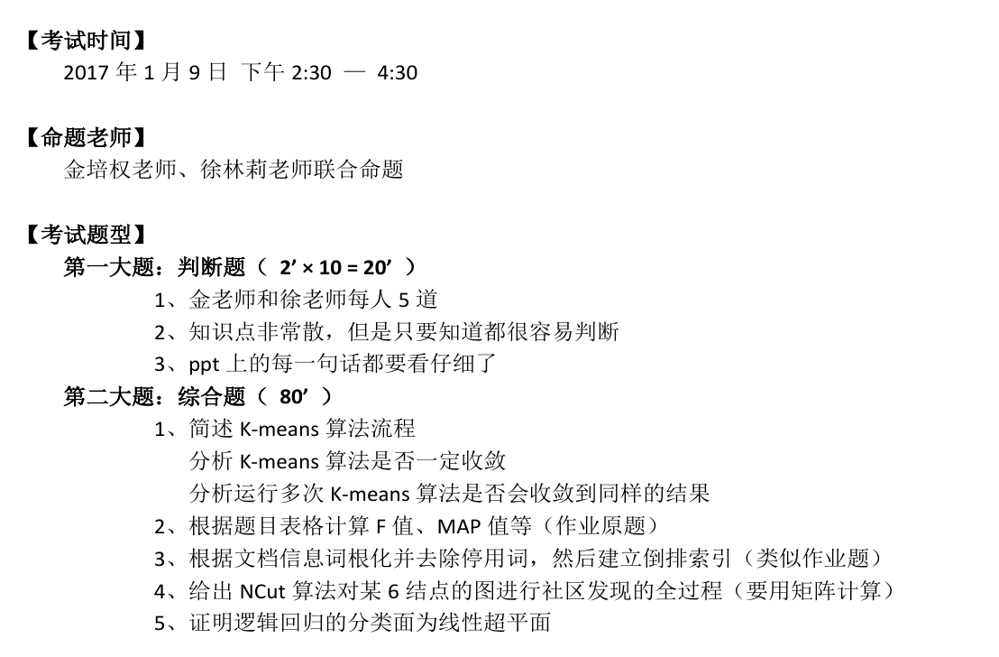

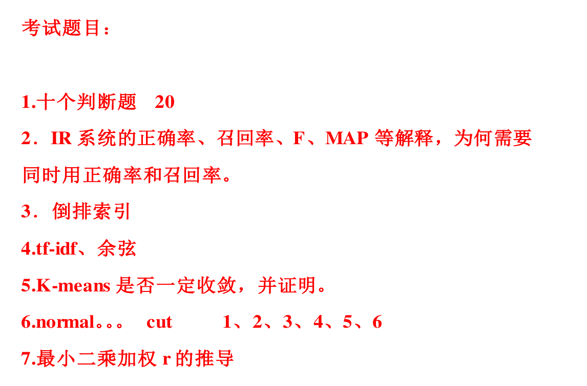

