## 实验题目

 图书馆数据库的基本操作

## 实验环境 

```
OS: win10
CPU: Intel(R) Core(TM) i5-8250U CPU @ 1.60GHz 1.80GHz
oracle12c
pl/sql developer
```

## 实验内容与结果

### 创建基本表插入测试数据

比较显然，没有什么特别的

```plsql
Create Table Book(
    ID char(8) Constraint PK_BID Primary Key,
    name varchar2(10) Not NULL,
    author varchar2(10),
    price float,
    status int default 0
);

Create Table Reader(
    ID char(8) constraint PK_RID Primary Key,
    name varchar2(10),
    age int,
    address varchar2(20)
);

Create Table Borrow(
    book_ID char(8) Constraint FK_BID References Book(ID),
    reader_ID char(8) Constraint FK_RID References Reader(ID),
    borrow_Date date,
    return_Date date,
    Constraint PK_Bo Primary Key(book_ID,reader_ID)
);

--book
Insert Into Book Values('b1','Oracle1','Ullman',13.6,0);
Insert Into Book Values('b2','2Oracle','Ullman',34,0);
Insert Into Book Values('b3','database','drdh',234,0);
Insert Into Book Values('b4','system','drdh',22,0);
Insert Into Book Values('b5','webinfo','jpq',34,0);
Insert Into Book Values('b6','os','osh',33,0);

Insert Into Book Values('b10','os2','os2',33,0);

--reader
Insert Into Reader Values('r1','Rose',18,'Hefei');
Insert Into Reader Values('r2','jack',21,'Hefei');
Insert Into Reader Values('r3','李林',21,'Beijing');
Insert Into Reader Values('r4','张三',21,'Beijing');

--borrow
Insert Into Borrow 
       Values('b1','r1',to_date('01-03-2019','dd-mm-yy'),
                   to_date('03-03-2019','dd-mm-yy'));
                   
Insert Into Borrow(book_ID,reader_ID,borrow_Date) 
       Values('b2','r1',to_date('01-03-2019','dd-mm-yy'));
 
Insert Into Borrow(book_ID,reader_ID,borrow_Date) 
       Values('b3','r2',to_date('01-03-2019','dd-mm-yy'));
       
Insert Into Borrow(book_ID,reader_ID,borrow_Date) 
       Values('b3','r3',to_date('01-03-2019','dd-mm-yy'));
       
Insert Into Borrow 
       Values('b4','r3',to_date('01-03-2019','dd-mm-yy'),
                   to_date('03-03-2019','dd-mm-yy'));
        
Insert Into Borrow 
       Values('b5','r3',to_date('01-03-2019','dd-mm-yy'),
                   to_date('03-03-2019','dd-mm-yy'));
               
Insert Into Borrow 
       Values('b6','r3',to_date('01-03-2019','dd-mm-yy'),
                   to_date('03-03-2019','dd-mm-yy'));       
```

### 完整性测试

#### 实体完整性

primary key必须要指定

```plsql
insert into book(ID,name,author)values('b9','fun','drdh');
insert into book(name,author)values('fun','drdh');--error
```

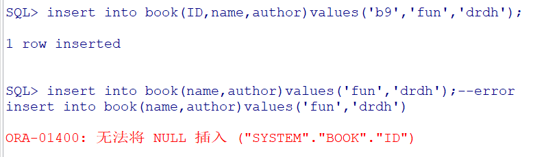

#### 参照完整性

由于`b1`被另一个表引用，所以不能直接删除

```plsql
delete from book where ID='b1';
```

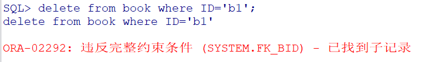

#### 用户自定义完整性

用户自定义书名不能为空

```plsql
insert into book(ID,author)values('b9','drdh');
```

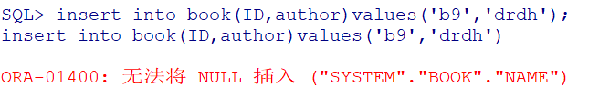

### 小题

#### (1) Rose 读者号和地址

```plsql
Select ID,address
       from Reader
       where name='Rose';
```

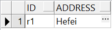

#### (2)Ros所借书的图书名和借期

```plsql
Select bk.name,br.borrow_Date
       from Book bk,Reader rd,Borrow br
       where br.book_ID=bk.ID
             and br.Reader_ID=rd.ID
             and rd.name='Rose';
```

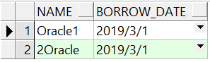

#### (3)未借阅图书的读者姓名

```plsql
Select rd.name
       from Reader rd
       where rd.ID not in (select distinct br.reader_ID from Borrow br); 
```


#### (4)Ullman所写书的书名和单价

```plsql
select name,price
       from Book 
       where author='Ullman';
```


#### (5)李林借阅未还的图书号和书名

```plsql
select bk.ID,bk.name
       from Book bk,Reader rd,Borrow br
       where bk.ID=br.book_id
             and rd.ID=br.reader_id
             and rd.name='李林'
             and br.return_date is null; 
```

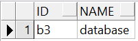

#### (6)借阅图书超过3本的读者姓名

```plsql
select rd2.name 
       from (select br.reader_ID,count(br.book_ID) as count_bk 
                    from Borrow br
                    group by br.reader_ID)br2, Reader rd2
        where br2.reader_ID=rd2.ID
              and br2.count_bk>3; 
```

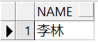

#### (7)没有借阅李林所借阅任何一本书的读者姓名和读者号

```plsql
select rd.name,rd.ID
       from Reader rd
       where not exists
             (select * from Borrow br
                     where br.book_ID in (
                           select distinct br2.book_ID
                                  from Borrow br2,Reader rd2
                                  where br2.reader_id=rd2.ID
                                        and rd2.name='李林'
                               
                     ) and br.reader_id=rd.ID
                     );
```

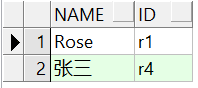

#### (8)书名中包含Oracle的图书名和图书号

```plsql
select name,ID
       from Book
       where name like '%Oracle%';
```

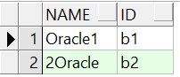

#### (9)创建视图

```plsql
Create view Info(reader_ID,reader_name,book_ID,book_name,borrow_date)
       as Select rd.ID,rd.name,bk.ID,bk.name,br.borrow_date
                 from Book bk,Reader rd,Borrow br
                 where bk.ID=br.book_ID
                       and rd.ID=br.reader_id;


Select reader_ID,count(distinct book_ID)
       from Info
       where borrow_date>=add_months(sysdate,-12)
       group by reader_ID;
```

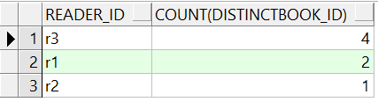

### 存储过程

需要注意的是，ID作为外键，因而需要另外修改Borrow才能成立。

```plsql
create or replace procedure ChangeBookID(
       old_id in char,new_id in char) as
begin
       execute immediate 'alter table Borrow disable constraint FK_BID';
       update Book
              set ID=new_id
              where ID=old_id;
              
       update Borrow
              set book_Id=new_id
              where book_Id=old_id;
       
       execute immediate 'alter table Borrow enable constraint FK_BID';
end ChangeBookID;
```

```plsql
select * from book;
Execute ChangeBookID('b10','b12');
select * from book;
```

下面的图表示成功将ID修改

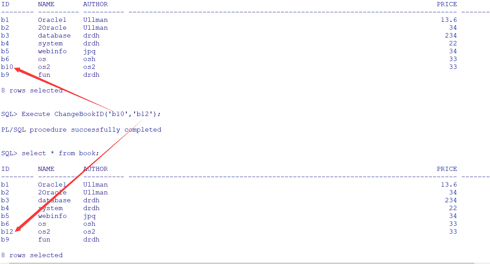

### 触发器

```plsql
create or replace trigger UpdateBook
  after insert or update
  on borrow 
  for each row
declare
  -- local variables here
begin
     if :new.return_date is not null then
        update book set status=0 where id=:new.book_id;
     else 
        update book set status=1 where id=:new.book_id;
     end if;
end UpdateBook;
```

```plsql
insert into borrow(book_ID,reader_ID,borrow_date)values('b3','r1',to_date('01-03-2019','dd-mm-yy'));

select * from book;

update borrow set return_date=to_date('01-03-2019','dd-mm-yy') where reader_ID='r2' and book_id='b3';

select * from book;
```

下面的图表明，在借书之后status标为1，而使用update还书之后status变为0

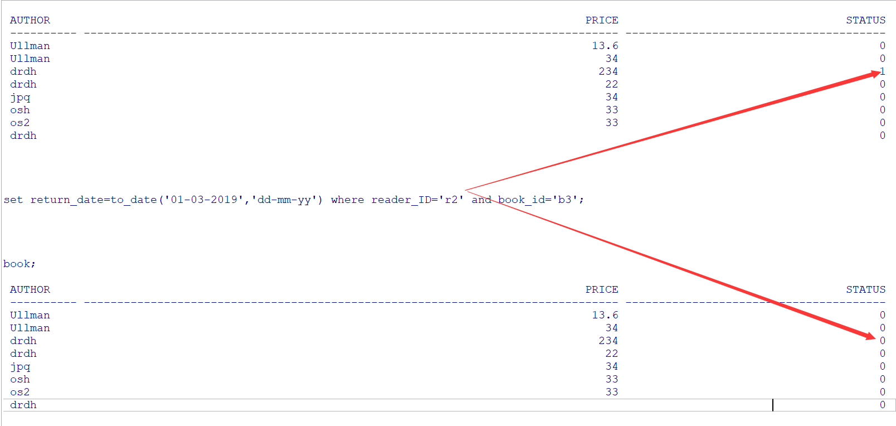

## Ref

[带外键的change](<https://blog.csdn.net/u014030117/article/details/46333751>)


