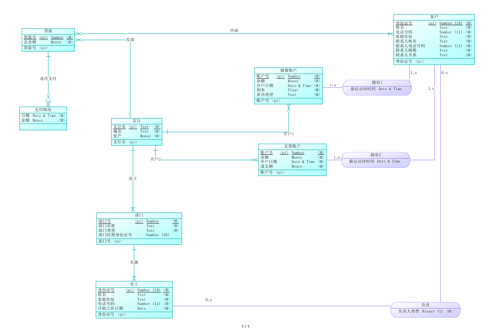
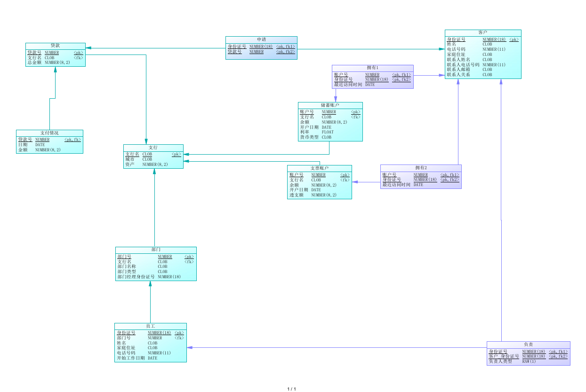

 

# Lab 2 数据库系统设计 银行业务管理系统

> 董恒 PB16111545

## 1. 实验要求

> 根据下面的需求描述，使用Sybase Power Designer设计相应的数据库概念模型，并转换成Oracle或MS SQL Server上的物理数据库结构。

## 2. 背景需求

> 某银行准备开发一个银行业务管理系统，通过调查，得到以下的主要需求：

> 银行有多个支行。各个支行位于某个城市，每个支行有唯一的名字。银行要监控每个支行的资产。 银行的客户通过其身份证号来标识。银行存储每个客户的姓名及其居住的街道和城市。客户可以有帐户，并且可以贷款。客户可能和某个银行员工发生联系，该员工是此客户的贷款负责人或银行帐户负责人。 银行员工也通过身份证号来标识。员工分为部门经理和普通员工，每个部门经理都负责领导其所在部门的员工，并且每个员工只允许在一个部门内工作。每个支行的管理机构存储每个员工的姓名、电话号码、 家庭地址及其经理的身份证号。银行还需知道每个员工开始工作的日期，由此日期可以推知员工的雇佣期。 银行提供两类帐户——储蓄帐户和支票帐户。帐户可以由2个或2个以上客户所共有，一个客户也可有两个或两个以上的帐户。每个帐户被赋以唯一的帐户号。银行记录每个帐户的余额 、开户的支行以及每个帐户所有者访问该帐户的最近日期。另外，每个储蓄帐户有其利率，且每个支票帐户有其透支额。 每笔贷款由某个分支机构发放，能被一个或多个客户所共有。每笔贷款用唯一的贷款号标识。银行需要知道每笔贷款所贷金额以及逐次支付的情况（银行将贷款分几次付给客户）。虽然贷款号不能唯一标识银行所有为贷款所付的款项，但可以唯一标识为某贷款所付的款项。对每次的付款需要记录日期和金额。

## 3. 需求分析

### 3.1. 实体的确定

1. 比较容易确定的**支行**, **客户**, **员工**, **账户**, **贷款**, **部门**
2. 关于账户，分为储蓄账户和支票账户，本来是可以直接作为账户的继承，但是考虑到本设计中需要考虑一个分行只能给一个账户开一个储蓄账户和支票账户，因而需要分开。
3. 关于逐次支付情况，可以依赖与贷款

### 3.2. 联系的确定

确定的联系如下

支行：账户——(1 : N) ——开户

支行：贷款——(1 : N)——发放

客户：贷款——(1 : N)——拥有

员工：员工——(1 : N)——经理

贷款：支付情况——(1 : N)——逐次支付

**有属性的联系**

支行：员工——(1 : N ，开始工作日期)——工作

员工：客户——(M : N，负责人类型)——负责

客户：账户——(M : N，最近访问日期)——拥有

## 4. 概念模型设计

使用powerdesign 设计概念模型为

清晰图见附件`ConceptualDataModel.pdf`




## 5. 物理模型生成

转化成物理模型为

清晰图见附件`PhysicalDataModel.pdf`




## 6. 物理数据库的生成

使用上述的物理模型进一步生成数据库。为了兼容性将中文转化为英文，见`bank.sql`

```plsql
/*==============================================================*/
/* DBMS name:      ORACLE Version 11g                           */
/* Created on:     2019/5/29 23:10:09                           */
/*==============================================================*/


alter table "Account"
   drop constraint FK_ACCOUNT_OPEN_ACCO_BRANCH;

alter table "Check_Account"
   drop constraint FK_CHECK_AC_ACOUNT_IN_ACCOUNT;

alter table "Employee"
   drop constraint FK_EMPLOYEE_MANAGE_EMPLOYEE;

alter table "Employee"
   drop constraint FK_EMPLOYEE_WORK_FOR_BRANCH;

alter table "Loan"
   drop constraint FK_LOAN_BRANCH_LO_BRANCH;

alter table "Payment"
   drop constraint FK_PAYMENT_PAY_LOAN;

alter table "Saving_Account"
   drop constraint FK_SAVING_A_ACOUNT_IN_ACCOUNT;

alter table "borrow"
   drop constraint FK_BORROW_BORROW_CUSTOMER;

alter table "borrow"
   drop constraint FK_BORROW_BORROW2_LOAN;

alter table "depositor"
   drop constraint FK_DEPOSITO_DEPOSITOR_ACCOUNT;

alter table "depositor"
   drop constraint FK_DEPOSITO_DEPOSITOR_CUSTOMER;

alter table "responsible"
   drop constraint FK_RESPONSI_RESPONSIB_EMPLOYEE;

alter table "responsible"
   drop constraint FK_RESPONSI_RESPONSIB_CUSTOMER;

drop index "open_account_FK";

drop table "Account" cascade constraints;

drop table "Branch" cascade constraints;

drop table "Check_Account" cascade constraints;

drop table "Customer" cascade constraints;

drop index "manage_FK";

drop index "work_for_FK";

drop table "Employee" cascade constraints;

drop index "branch_loan_FK";

drop table "Loan" cascade constraints;

drop table "Payment" cascade constraints;

drop table "Saving_Account" cascade constraints;

drop index "borrow2_FK";

drop index "borrow_FK";

drop table "borrow" cascade constraints;

drop index "depositor2_FK";

drop index "depositor_FK";

drop table "depositor" cascade constraints;

drop index "responsible2_FK";

drop index "responsible_FK";

drop table "responsible" cascade constraints;

/*==============================================================*/
/* Table: "Account"                                             */
/*==============================================================*/
create table "Account" 
(
   "acount_id"          NUMBER               not null,
   "branch_name"        CLOB                 not null,
   "balance"            NUMBER(8,2),
   "open_date"          DATE,
   constraint PK_ACCOUNT primary key ("acount_id")
);

/*==============================================================*/
/* Index: "open_account_FK"                                     */
/*==============================================================*/
create index "open_account_FK" on "Account" (
   "branch_name" ASC
);

/*==============================================================*/
/* Table: "Branch"                                              */
/*==============================================================*/
create table "Branch" 
(
   "branch_name"        CLOB                 not null,
   "city"               CLOB,
   "asset"              NUMBER(8,2),
   constraint PK_BRANCH primary key ("branch_name")
);

/*==============================================================*/
/* Table: "Check_Account"                                       */
/*==============================================================*/
create table "Check_Account" 
(
   "acount_id"          NUMBER               not null,
   "branch_name"        CLOB,
   "balance"            NUMBER(8,2),
   "open_date"          DATE,
   "overdraft"          NUMBER(8,2),
   constraint PK_CHECK_ACCOUNT primary key ("acount_id")
);

/*==============================================================*/
/* Table: "Customer"                                            */
/*==============================================================*/
create table "Customer" 
(
   "customer_id"        NUMBER               not null,
   "name"               CLOB,
   "phone"              NUMBER,
   "address"            CLOB,
   "contact_name"       CLOB,
   "contact_phone"      NUMBER,
   "contact_email"      CLOB,
   "contact_relation"   CLOB,
   constraint PK_CUSTOMER primary key ("customer_id")
);

/*==============================================================*/
/* Table: "Employee"                                            */
/*==============================================================*/
create table "Employee" 
(
   "employee_id"        NUMBER               not null,
   "branch_name"        CLOB                 not null,
   "Emp_employee_id"    NUMBER,
   "name"               CLOB,
   "addree"             CLOB,
   "phone"              NUMBER,
   "start_date"         DATE,
   constraint PK_EMPLOYEE primary key ("employee_id")
);

/*==============================================================*/
/* Index: "work_for_FK"                                         */
/*==============================================================*/
create index "work_for_FK" on "Employee" (
   "branch_name" ASC
);

/*==============================================================*/
/* Index: "manage_FK"                                           */
/*==============================================================*/
create index "manage_FK" on "Employee" (
   "Emp_employee_id" ASC
);

/*==============================================================*/
/* Table: "Loan"                                                */
/*==============================================================*/
create table "Loan" 
(
   "load_id"            NUMBER(11)           not null,
   "branch_name"        CLOB                 not null,
   "amount"             NUMBER(8,2),
   constraint PK_LOAN primary key ("load_id")
);

/*==============================================================*/
/* Index: "branch_loan_FK"                                      */
/*==============================================================*/
create index "branch_loan_FK" on "Loan" (
   "branch_name" ASC
);

/*==============================================================*/
/* Table: "Payment"                                             */
/*==============================================================*/
create table "Payment" 
(
   "load_id"            NUMBER(11)           not null,
   "paymen_id"          NUMBER               not null,
   "payment_date"       DATE,
   "amount"             NUMBER(8,2),
   constraint PK_PAYMENT primary key ("load_id", "paymen_id")
);

/*==============================================================*/
/* Table: "Saving_Account"                                      */
/*==============================================================*/
create table "Saving_Account" 
(
   "acount_id"          NUMBER               not null,
   "branch_name"        CLOB,
   "balance"            NUMBER(8,2),
   "open_date"          DATE,
   "interest_rate"      FLOAT,
   "currency_type"      CLOB,
   constraint PK_SAVING_ACCOUNT primary key ("acount_id")
);

/*==============================================================*/
/* Table: "borrow"                                              */
/*==============================================================*/
create table "borrow" 
(
   "customer_id"        NUMBER               not null,
   "load_id"            NUMBER(11)           not null,
   constraint PK_BORROW primary key ("customer_id", "load_id")
);

/*==============================================================*/
/* Index: "borrow_FK"                                           */
/*==============================================================*/
create index "borrow_FK" on "borrow" (
   "customer_id" ASC
);

/*==============================================================*/
/* Index: "borrow2_FK"                                          */
/*==============================================================*/
create index "borrow2_FK" on "borrow" (
   "load_id" ASC
);

/*==============================================================*/
/* Table: "depositor"                                           */
/*==============================================================*/
create table "depositor" 
(
   "acount_id"          NUMBER               not null,
   "customer_id"        NUMBER               not null,
   "access_date"        DATE,
   constraint PK_DEPOSITOR primary key ("acount_id", "customer_id")
);

/*==============================================================*/
/* Index: "depositor_FK"                                        */
/*==============================================================*/
create index "depositor_FK" on "depositor" (
   "acount_id" ASC
);

/*==============================================================*/
/* Index: "depositor2_FK"                                       */
/*==============================================================*/
create index "depositor2_FK" on "depositor" (
   "customer_id" ASC
);

/*==============================================================*/
/* Table: "responsible"                                         */
/*==============================================================*/
create table "responsible" 
(
   "employee_id"        NUMBER               not null,
   "customer_id"        NUMBER               not null,
   "type"               CLOB,
   constraint PK_RESPONSIBLE primary key ("employee_id", "customer_id")
);

/*==============================================================*/
/* Index: "responsible_FK"                                      */
/*==============================================================*/
create index "responsible_FK" on "responsible" (
   "employee_id" ASC
);

/*==============================================================*/
/* Index: "responsible2_FK"                                     */
/*==============================================================*/
create index "responsible2_FK" on "responsible" (
   "customer_id" ASC
);

alter table "Account"
   add constraint FK_ACCOUNT_OPEN_ACCO_BRANCH foreign key ("branch_name")
      references "Branch" ("branch_name");

alter table "Check_Account"
   add constraint FK_CHECK_AC_ACOUNT_IN_ACCOUNT foreign key ("acount_id")
      references "Account" ("acount_id");

alter table "Employee"
   add constraint FK_EMPLOYEE_MANAGE_EMPLOYEE foreign key ("Emp_employee_id")
      references "Employee" ("employee_id");

alter table "Employee"
   add constraint FK_EMPLOYEE_WORK_FOR_BRANCH foreign key ("branch_name")
      references "Branch" ("branch_name");

alter table "Loan"
   add constraint FK_LOAN_BRANCH_LO_BRANCH foreign key ("branch_name")
      references "Branch" ("branch_name");

alter table "Payment"
   add constraint FK_PAYMENT_PAY_LOAN foreign key ("load_id")
      references "Loan" ("load_id");

alter table "Saving_Account"
   add constraint FK_SAVING_A_ACOUNT_IN_ACCOUNT foreign key ("acount_id")
      references "Account" ("acount_id");

alter table "borrow"
   add constraint FK_BORROW_BORROW_CUSTOMER foreign key ("customer_id")
      references "Customer" ("customer_id");

alter table "borrow"
   add constraint FK_BORROW_BORROW2_LOAN foreign key ("load_id")
      references "Loan" ("load_id");

alter table "depositor"
   add constraint FK_DEPOSITO_DEPOSITOR_ACCOUNT foreign key ("acount_id")
      references "Account" ("acount_id");

alter table "depositor"
   add constraint FK_DEPOSITO_DEPOSITOR_CUSTOMER foreign key ("customer_id")
      references "Customer" ("customer_id");

alter table "responsible"
   add constraint FK_RESPONSI_RESPONSIB_EMPLOYEE foreign key ("employee_id")
      references "Employee" ("employee_id");

alter table "responsible"
   add constraint FK_RESPONSI_RESPONSIB_CUSTOMER foreign key ("customer_id")
      references "Customer" ("customer_id");
```


