#  银行业务管理系统系统设计报告

> 学号：PB16111545
> 姓名：董恒

## 1 概述

### 1.1 系统目标

开发一个银行业务管理系统，使用数据库作为后台的数据存储，使用图形界面操作。其他更加具体的需求见下面的需求说明。

### 1.2 需求说明

#### 1.2.1 数据需求

1. 银行有多个支行。各个支行位于某个城市,每个支行有唯一的名字。银行要监控每个支行的资产。 

2. 银行的客户通过其身份证号来标识。银行存储每个客户的姓名、联系电话以及家庭住址。为了安全起见,银行还要求客户提供一位联系人的信息,包括联系人姓名、手机号、Email 以及与客户的关系。客户可以有帐户,并且可以贷款。客户可能和某个银行员工发生联系,该员工是此客户的贷款负责人或银行帐户负责人。

3. 银行员工也通过身份证号来标识。员工分为部门经理和普通员工,每个部门经理都负责领导其所在部门的员工,并且每个员工只允许在一个部门内工作。每个支行的管理机构存储每个员工的姓名、电话号码、家庭地址及部门经理的身份证号。银行还需知道每个员工开始工作的日期,由此日期可以推知员工的雇佣期。

4. 银行提供两类帐户——储蓄帐户和支票帐户。帐户可以由多个客户所共有,一个客户也可开设多个账户,但在一个支行内最多只能开设一个储蓄账户和一个支票账户。每个帐户被赋以唯一的帐户号。银行记录每个帐户的余额、开户日期、开户的支行名以及每个帐户所有者访问该帐户的最近日期。另外,每个储蓄帐户有利率和货币类型,且每个支票帐户有透支额。 

5. 每笔贷款由某个分支机构发放,能被一个或多个客户所共有。每笔贷款用唯一的贷款号标识。银行需要知道每笔贷款所贷金额以及逐次支付的情况(银行将贷款分几次付给客户)。虽然贷款号不能唯一标识银行所有为贷款所付的款项,但可以唯一标识为某贷款所付的款项。对每次的付款需要记录日期和金额。

#### 1.2.2 功能需求

1. 支行管理:提供支行所有信息的增、删、改、查功能;如果支行存在着关联信息,如员工、账户等,则不允许删除;
2. 员工管理:提供支行员工所有信息的增、删、改、查功能;如果员工存在着关联数据,则不允许删除;

3. 客户管理:提供客户所有信息的增、删、改、查功能;如果客户存在着关联账户或者贷款记录,则不允许删除;

4. 账户管理:提供账户开户、销户、修改、查询功能,包括储蓄账户和支票账户;账户号不允许修改;

5. 贷款管理:提供贷款信息的增、删、查功能,提供贷款发放功能;贷款信息一旦添加成功后不允许修改;要求能查询每笔贷款的当前状态(未开始发放、发放中、已全部发放);处于发放中状态的贷款记录不允许删除;

6. 业务统计:按业务分类(储蓄、贷款)和时间(月、季、年)统计各个支行的业务总金额和用户数(选做:对统计结果以饼图或曲线图显示)。

#### 1.2.3 其他需求

1. 后台 DBMS 允许使用 Oracle、MySQL 或者 Microsoft SQL Server;
2. 前端开发工具不限,可以是 C/S 架构也可以是 B/S 架构;
3. 查询功能允许自行设计,但要求尽可能灵活设计,考虑用户多样化的查询需求;
4. 系统实现时要保证数据之间的一致性。

### 1.3 本报告的主要贡献

本报告先陈述主要的需求，然后详细描述总体设计，之后简要说明实现的结果与测试结果，最后是本设计的总结与讨论。

## 2 总体设计

### 2.1 系统模块结构

本系统各个模块的情况如下

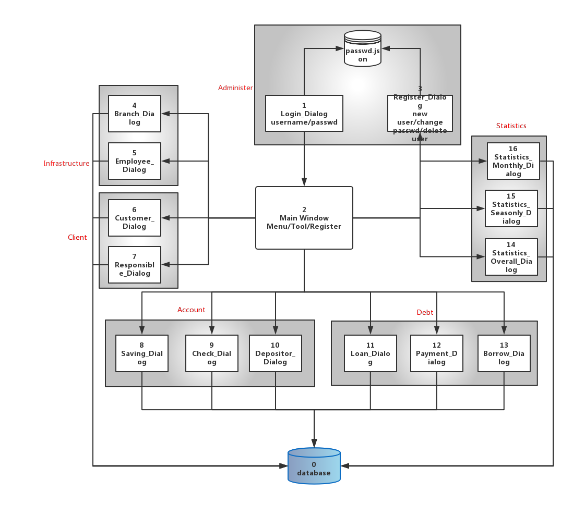

本系统的各个部件的数据传递是使用数据库而不是使用函数调用，所以上图中除了与database以及与`passwd.json`的交互是数据外，其他均为控制流。所以接口部分不需要额外指出。

本系统分为如下的模块

- Main_Window： 主窗口，除了login外，其他的窗口均是从此窗口衍生出来
- Administer：对管理员的管理
  - Login_Dialog：登录，需要用户名和密码，否则不允许进入系统
  - Register：用于修改密码、设置新的管理员、删掉旧的管理员
- Infrastructure：银行的基本的设施
  - Branch_Dialog：分行的信息管理
  - Employee_Dialog：工作人员的信息管理
- Client：客户
  - Customer_Dialog：顾客的信息管理
  - Responsible_Dialog：工作人员对顾客的负责
- Transaction：业务管理
  - Account：账户业务
    - Saving_Dialog：储蓄账户信息管理
    - Check_Dialog：支票帐号信息管理
    - Depositor_Dialog：账户与客户的关联
  - Debt：贷款业务
    - Loan_Dialog：贷款信息管理
    - Payment_Dialog：逐次支付管理
    - Borrow_Dialog：借贷信息管理
- Statistics：业务数据管理
  - Overall_Dialog：总共统计的业务数据
  - Seasonly_Dialog：按照季度统计的业务数据
  - Monthly_Dialog：按照月份统计的业务数据

### 2.2 系统工作流程

整个系统的工作流程如下图

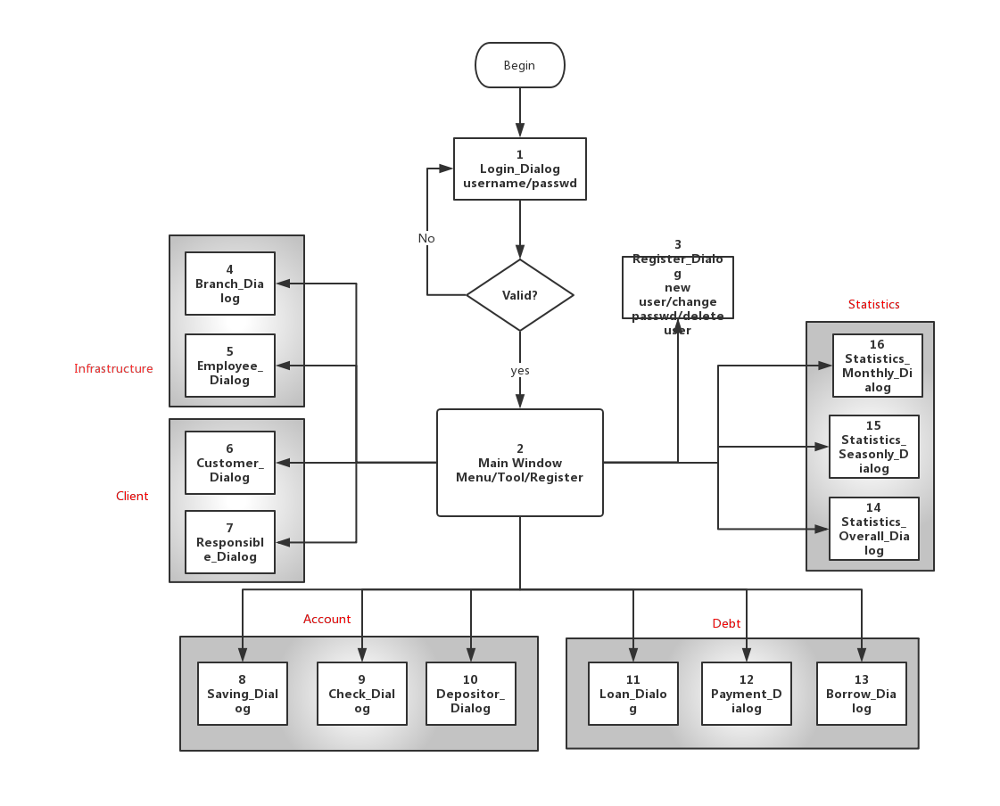

需要指出的是，本流程图仅仅给出最基本的流程，不包括各个功能的错误处理/子功能以及结束程序。

### 2.3 数据库设计

#### 2.3.1 概念模型

更加清晰的图见附件`conceptual_model.pdf`

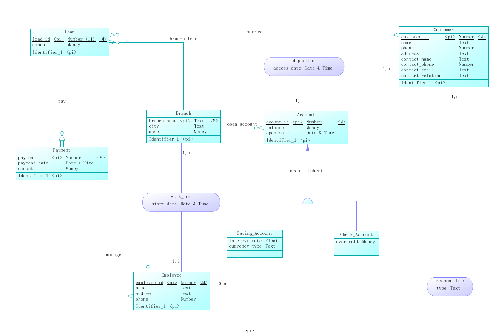

#### 2.3.2 物理模型

更加清晰的图见附件`physical_model.pdf`


#### 2.3.3 数据库表

完整的数据库表述见附件`bank.sql`

```sqlite

/*==============================================================*/
/* Table: "Account"                                              */
/*==============================================================*/
create table "Account" 
(
   "Account_id"         integer               not null,
   "branch_name"        text                  not null,
--   "balance"            real,
--   "open_date"          text,
   constraint PK_Account primary key ("Account_id")
--   constraint FK_ACCOUNT_OPEN_ACCO_BRANCH foreign key ("branch_name")
--      references "Branch" ("branch_name")
);

/*==============================================================*/
/* Table: "Branch"                                              */
/*==============================================================*/
create table "Branch" 
(
   "branch_name"        text                 not null,
   "city"               text,
   "asset"              real,
   constraint PK_BRANCH primary key ("branch_name")
);

/*==============================================================*/
/* Table: "Check_Account"                                       */
/*==============================================================*/
create table "Check_Account" 
(
   "Account_id"         integer               not null,
   "branch_name"        text                 not null,
   "balance"            real,
   "open_date"          text     "2019-6-11 19:23:45",
   "overdraft"          real,
   constraint PK_CHECK_ACCOUNT primary key ("Account_id"),
   constraint FK_CHECK_AC_Account_IN_Account foreign key ("Account_id")
      references "Account" ("Account_id"),
   constraint FK_Check_ACCOUNT_OPEN_ACCO_BRANCH foreign key ("branch_name")
      references "Branch" ("branch_name")
);

/*==============================================================*/
/* Table: "Customer"                                            */
/*==============================================================*/
create table "Customer" 
(
   "customer_id"        integer               not null,
   "name"               text,
   "phone"              text,
   "address"            text,
   "contact_name"       text,
   "contact_phone"      text,
   "contact_email"      text,
   "contact_relation"   text,
   constraint PK_CUSTOMER primary key ("customer_id")
);

/*==============================================================*/
/* Table: "Employee"                                            */
/*==============================================================*/
create table "Employee" 
(
   "employee_id"        integer               not null,
   "branch_name"        text                 not null,
   "manager_id"         integer,
   "name"               text,
   "address"            text,
   "phone"              text,
   "start_date"         text,
   constraint PK_EMPLOYEE primary key ("employee_id"),
   constraint FK_EMPLOYEE_MANAGE_EMPLOYEE foreign key ("manager_id")
      references "Employee" ("employee_id"),
   constraint FK_EMPLOYEE_WORK_FOR_BRANCH foreign key ("branch_name")
      references "Branch" ("branch_name")
);

/*==============================================================*/
/* Table: "Loan"                                                */
/*==============================================================*/
create table "Loan" 
(
   "loan_id"            integer           not null,
   "branch_name"        text                 not null,
   "amount"             real,
   "total"              real     default 0,
   constraint PK_LOAN primary key ("loan_id"),
   constraint FK_LOAN_BRANCH_LO_BRANCH foreign key ("branch_name")
      references "Branch" ("branch_name")
);

/*==============================================================*/
/* Table: "Payment"                                             */
/*==============================================================*/
create table "Payment" 
(
   "loan_id"            integer           not null,
   "payment_id"         integer               not null,
   "payment_date"       text,
   "amount"             real,
   constraint PK_PAYMENT primary key ("loan_id", "payment_id"),
   constraint FK_PAYMENT_PAY_LOAN foreign key ("loan_id")
      references "Loan" ("loan_id")
);

/*==============================================================*/
/* Table: "Saving_Account"                                       */
/*==============================================================*/
create table "Saving_Account" 
(
   "Account_id"         integer               not null,
   "branch_name"        text                 not null,
   "balance"            real,
   "open_date"          text,
   "interest_rate"      real,
   "currency_type"      text,
   constraint PK_SAVING_Account primary key ("Account_id"),
   constraint FK_SAVING_A_Account_IN_Account foreign key ("Account_id")
      references "Account" ("Account_id"),
   constraint FK_Saving_ACCOUNT_OPEN_ACCO_BRANCH foreign key ("branch_name")
      references "Branch" ("branch_name")
);

/*==============================================================*/
/* Table: "borrow"                                              */
/*==============================================================*/
create table "borrow" 
(
   "customer_id"        integer               not null,
   "loan_id"            integer           not null,
   constraint PK_BORROW primary key ("customer_id", "loan_id"),
   constraint FK_BORROW_BORROW_CUSTOMER foreign key ("customer_id")
      references "Customer" ("customer_id"),
   constraint FK_BORROW_BORROW2_LOAN foreign key ("loan_id")
      references "Loan" ("loan_id")
);

/*==============================================================*/
/* Table: "depositor"                                           */
/*==============================================================*/
create table "depositor" 
(
   "Account_id"         integer               not null,
   "customer_id"        integer               not null,
   "access_date"        text,
   constraint PK_DEPOSITOR primary key ("Account_id", "customer_id"),
   constraint FK_DEPOSITO_DEPOSITOR_Account foreign key ("Account_id")
      references "Account" ("Account_id"),
   constraint FK_DEPOSITO_DEPOSITOR_CUSTOMER foreign key ("customer_id")
      references "Customer" ("customer_id")
);

/*==============================================================*/
/* Table: "responsible"                                         */
/*==============================================================*/
create table "responsible" 
(
   "employee_id"        integer               not null,
   "customer_id"        integer               not null,
   "type"               text,
   constraint PK_RESPONSIBLE primary key ("employee_id", "customer_id"),
   constraint FK_RESPONSI_RESPONSIB_EMPLOYEE foreign key ("employee_id")
      references "Employee" ("employee_id"),
   constraint FK_RESPONSI_RESPONSIB_CUSTOMER foreign key ("customer_id")
      references "Customer" ("customer_id") 
);
```


#### 2.3.4 其他数据库要求

本设计使用数据库为`sqlite3`, 主要目的是减少配置的耗时，需要注意的是，本设计使用的`sql`语句以及接口设计可以直接迁移到其他的数据库，比如`oracle 12c/mysql`仅仅需要修改`QSql`的数据库设置，其他内容均不需要修改。

除此之外，本设计需要额外的触发器如下

```sqlite
create trigger insert_saving after insert on saving_account
begin
insert into account("Account_id","branch_name")
	values (new.Account_id,new.branch_name);
end;

create trigger insert_check after insert on check_account
begin
insert into account("Account_id","branch_name")
	values (new.Account_id,new.branch_name);
end;

create trigger delete_saving after delete on saving_account
begin
delete from account 
	where Account_id=old.Account_id;
end;

create trigger delete_check after delete on check_account
begin
delete from account 
	where Account_id=old.Account_id;
end;

create trigger add_payment after insert on payment
begin
update loan 
   set total=total+new.amount
   where loan_id=new.loan_id;
end;
```

## 3 详细设计

鉴于本设计中各个Dialog之间的相似性非常大，所以下面仅仅选取典型的模块进行说明，并不完全罗列设计。

### 3.1 Login_Dialog

本小节表示用户的登录界面，不登录成功不被允许进入下面的界面。

需要设计的部分包括输入窗口、按钮。核心的触发函数为

```python
def login(self):
        f=open("passwd.json","r")
        data=json.load(f)
        f.close()
        if self.userinput.text() == "lx" or self.passinput.text()=="lx":
            self.done(2)
        elif self.userinput.text() in data and data[self.userinput.text()]==self.passinput.text():
            self.done(2)
        else:
            QMessageBox.warning(self, 'Error', "Wrong Password or User doesn't Exist")
```

### 3.2 Main_Window

本小节表示主窗口，下面的Dialog均从此主窗口衍生出来。

需要实现的部分包括各种衍生的`menuBar`/`toolBar`以及管理员的管理。

需要注意的是，每一个额外衍生出来的窗口都需要在此处设计出发函数为

```python
def branch_dialog(self):
    dlg=Branch_Dialog()
    dlg.exec_()
```

### 3.3 XXX_Dialog

本章节代表诸多的窗口，包括

```
Branch_Dialog, Employee_Dialog, Customer_Dialog, Responsible_Dialog, Saving_Dialog, Check_Dialog, Depositor_Dialog, Loan_Dialog, Payment_Dialog, Borrow_Dialog
```

主要的结构很类似

需要注意的是，连接数据库的方式为

```python
if QSqlDatabase.contains('qt_sql_default_connection'):
    self.db=QSqlDatabase.database('qt_sql_default_connection')
else:
    self.db=QSqlDatabase.addDatabase('QSQLITE')
    self.db.setDatabaseName("../2_sqlite3_implement/data/test.db")
    self.db.open()
    self.db.exec("PRAGMA foreign_keys=ON;")
```

从而可以直接将数据库从`sqlite3`转移到其他的类似的数据库，而不需要额外的修改，具有良好的扩展性。

除此之外，需要设计5个函数为

```python
def view_event(self):
def update_event(self):
def add_event(self):
def new_event(self):
def delete_event(self):
```

分别对应5个按钮

### 3.4 Statistics_Dialog

本小节包括除了上面的以外的窗口，包括

```
Statistics_Overall_Dialog, Statistics_Seasonly_Dialog, Statistics_Monthly_Dialog
```

各个部分很类似，需要使用如下的语句来获得结果

```python
query_loan=QSqlQuery()
query_loan.exec("select branch_name,sum(amount) from loan group by branch_name;")
```

除此之外就是ui设计了

## 4 实现与测试

### 4.1 实现结果

使用方式`python main.py`

- Main_Window

  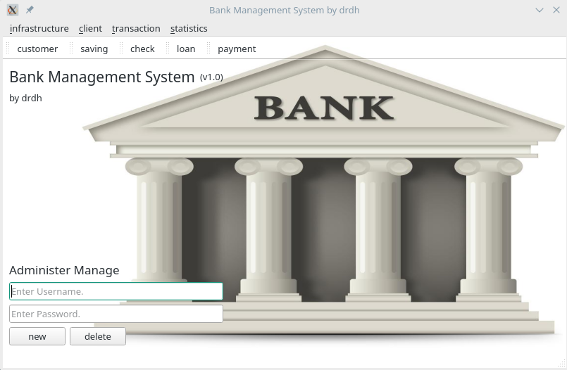

- Administer

  - Login_Dialog

    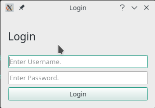

  - Register

    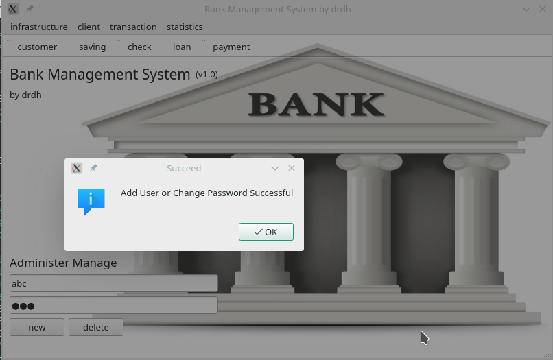

- Infrastructure

  - Branch_Dialog

    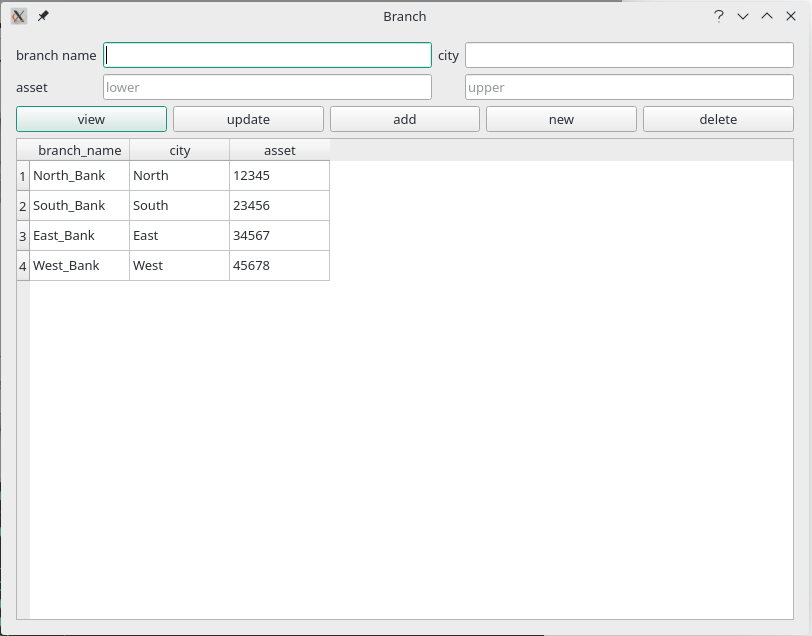

  - Employee_Dialog

    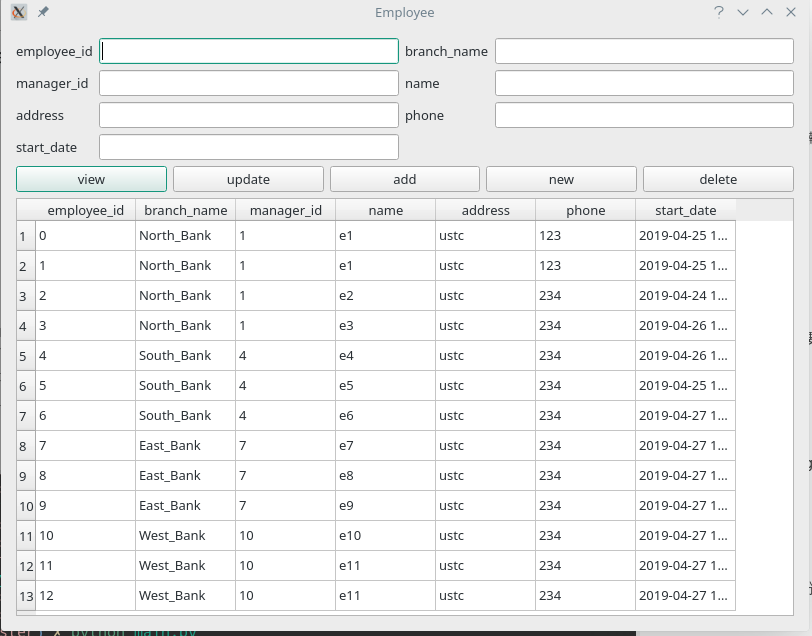

- Client

  - Customer_Dialog

    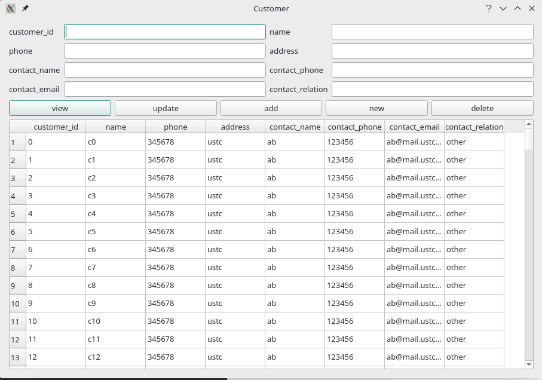

  - Responsible_Dialog

    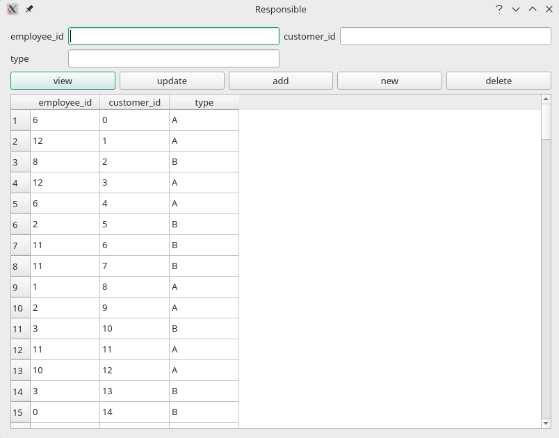

- Transaction

  - Account

    - Saving_Dialog

      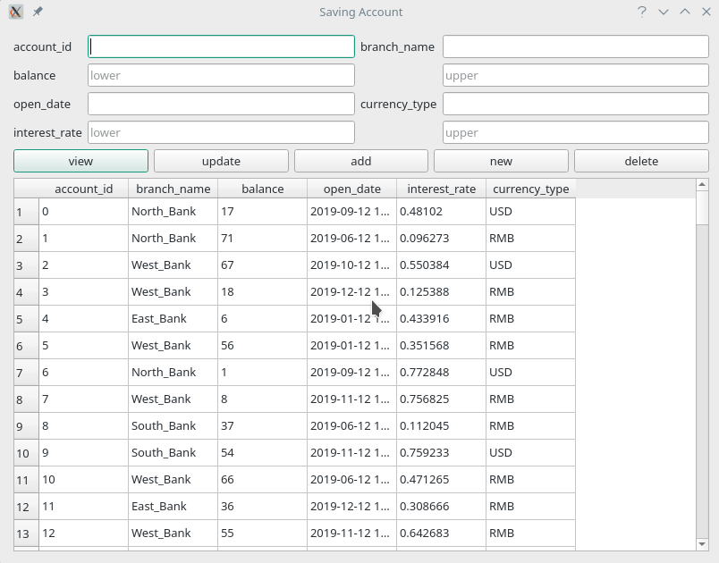

    - Check_Dialog

      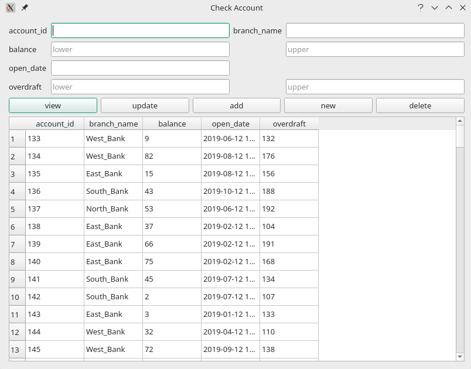

    - Depositor_Dialog

      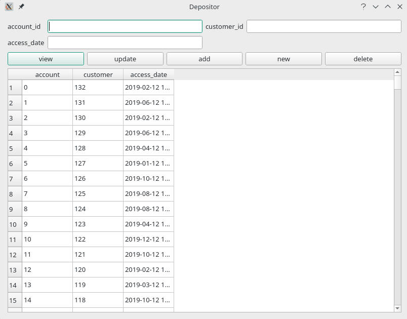

  - Debt

    - Loan_Dialog

      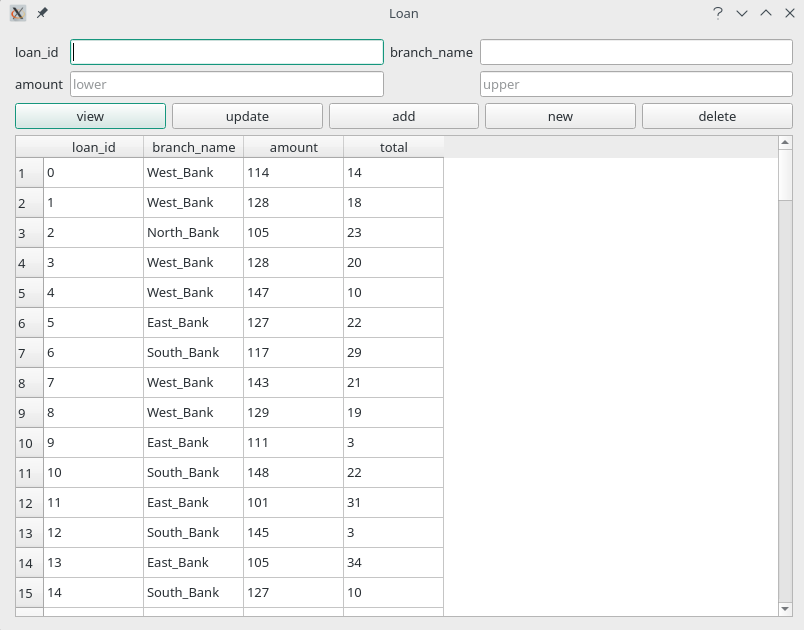

    - Payment_Dialog

      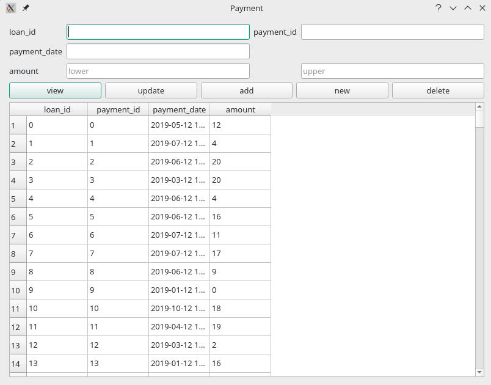

    - Borrow_Dialog

      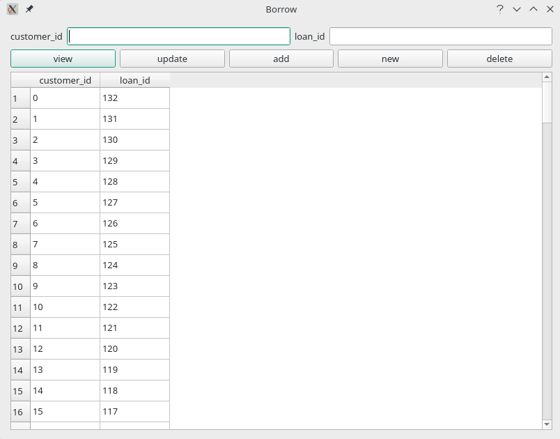

### 4.2 测试结果

- Statistics
  - Overall_Dialog

    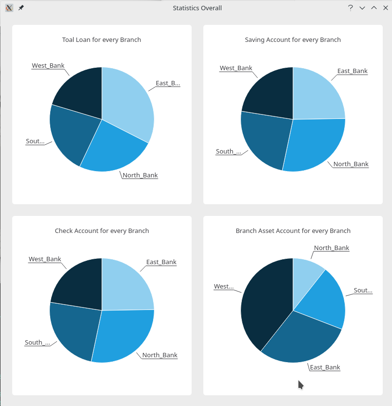

  - Seasonly_Dialog

    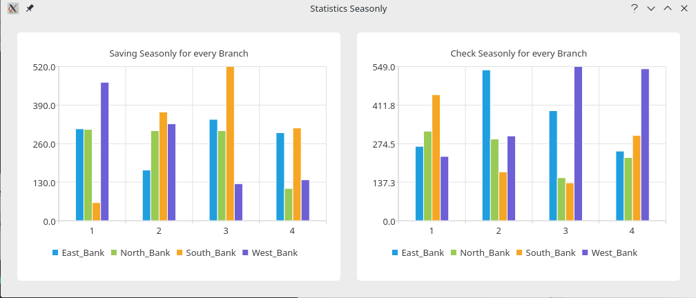

  - Monthly_Dialog

    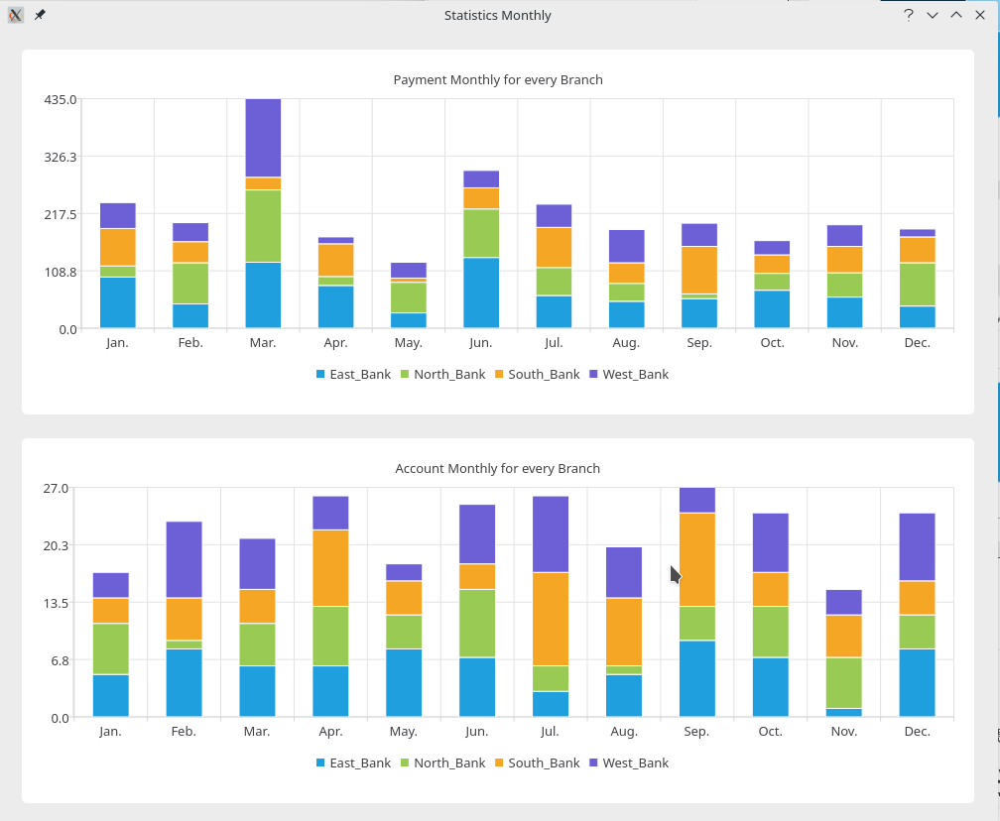

## 5 总结与讨论

1. 好的设计能节省大量的时间
2. 重复的单元应该尽量使用代码复用，不要复制粘贴。本设计由于偷懒，早期复制粘贴导致后期的设计有大量的体力劳动，最好的办法应该是使用类继承。

## 附录 团队介绍与工作分工

本系统由我一个人设计实现并完成。
