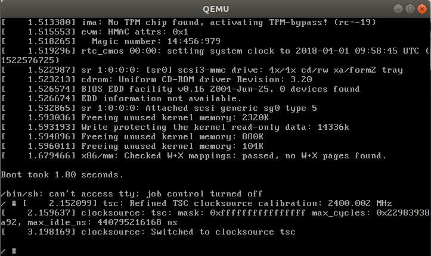
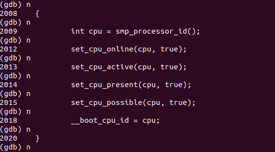

# 追踪linux内核启动过程
### 搭建内核调试环境
环境 ubuntu 17.10

采用的是qemu加上gdb的方式来追踪，期间碰到了很多坑，具体的太多记不太清，下面先写可用的环境搭建方式以及追踪内核记录。


安装 qemu
```
sudo apt install qemu
```
下载内核
```
wget http://www.kernel.org/pub/linux/kernel/v4.x/linux-4.14.tar.xz
```
解压
```
xz -d linux-4.14.tar.xz
tar -xvf linux-4.14.tar
```
编译内核
```
make menuconfig
```
此时需要进行一些设置，不然无法使用断点
```
--> kerel hacking
--> compile-time checks and compiler option
--> compile the kernel with debug info
```
使用调试信息
```
--> processor type and features
--> randomize the address of the kernel image
```
取消这一项，不然设置的断点不起作用

之后再继续编译
```
make
```
需要的时间非常长

**方式一** 利用本系统的initrd文件
```
cp /boot/initrd.img-4.13.0-37-generic .
```
启动qemu
```
qemu-system-x86_64 -s -kernel arch/x86/boot/bzImage -initrd initrd.img-4.13.0-37-generic  -S
```
-s表示 -gdb tcp::1234
-S表示 加载后立即暂停，否则会一直执行

打开一个新的终端
```
gdb vmlinux
```
再连上远程系统
```
target remote:1234
```

**修正**：但是使用这种方式只能运行到rest_init()之后出现挂载失败的情况，此时可借助[BusyBox](https://www.busybox.net/)构建极简的initramfs
```
cd busybox-1.28.0
make menuconfig
```

```
Settings -->
    [*]Build static binary(no shared libs)
```
静态编译版，可以不依赖动态链接库，独立运行，方便构建initamfs
```
make
make install
```
再创建initramfs，其中包含BusyBox可执行程序、必要的设备文件、启动脚本init.
init脚本只挂载了虚拟文件系统procfs和sysfs，没有挂载磁盘根文件系统，所有的调试都只在内存中进行，不落磁盘。

```
$ mkdir initramfs
$ cd initramfs
$ cp ../_install/* -rf ./
$ mkdir dev proc sys
$ sudo cp -a /dev/{null,console,tty,tty1,tty2,tty3,tty4} dev/
$ rm linuxrc
$ vim init
$ chmod a+x init
$ ls
$ bin   dev  init  proc  sbin  sys   usr
```

init文件的内容
```
#!/bin/busybox sh         
mount -t proc none /proc  
mount -t sysfs none /sys  

exec /sbin/init
```
打包initramfs
```
find . -print0 | cpio --null -ov --format=newc |gzip -9 > ../initramfs.cpio.gz
```
再启动内核方式为
```
qemu-system-x86_64 -s -kernel arch/x86/boot/bzImage -initrd ../initramfs.cpio.gz -S
```

**再次修正**
这种方式基本上可以达到shell的出现，但是其中仍然出现一个错误
```
can' run '/etc/init.d/tcS' no such file or directory
```
基本原因应该是直接使用了本地系统的内容，之后我又找到了另外一种构建根文件系统的方式

对BusyBox的配置编译和编译和之前一样，
```
make defconfig
make menuconfig
```

```
-> Busybox Settings
  -> Build Options
[*] Build BusyBox as a static binary (no shared libs)
```
编译
```
mkdir -pv /usr/local/os/rootfs
make CONFIG_PREFIX=/usr/local/os/rootfs install
cd /usr/local/os/rootfs

// 创建目录
mkdir -pv {dev,proc,sys,run}

//创建初始化设备节点
mknod -m 622 ./dev/console c 5 1
mknod -m 666 ./dev/null c 1 3
mknod -m 666 ./dev/zero c 1 5
mknod -m 666 ./dev/ptmx c 5 2
mknod -m 666 ./dev/tty c 5 0
mknod -m 666 ./dev/ttyS0 c 4 64
```

创建init程序
```
#!/bin/sh
mount -t proc none /proc
mount -t sysfs none /sys
echo -e "\nBoot took $(cut -d' ' -f1 /proc/uptime) seconds.\n"
exec /bin/sh
```

```
chmod +x init
find . | cpio -oHnewc | gzip > ../initramfs.gz
```
启动方式同上，只是-initrd参数后为initramfs.gz

最后仍然出现的一个错误是
```
/bin/sh: can't access tty;job control  turned off
```
如图所示
参照一些资料，目前未找到解决办法。


### 追踪过程分析
使用atom对照看init/main.c源码
```
b start_kernel
c
```
之后单步执行'n'，并且对照着内核代码，可以观察到一系列函数的运行,追踪过程如下：
一直观察到的一系列函数调用，其中
- `trap_init()`中断向量的初始化
- `mm_init()`内存管理的初始化
- `sched_init()`模块调度的初始化
- `console_init()` 控制台初始化

在`rest_init()`处加断点，然后执行到这个函数并进入，之后观察到
```
pid = kernel_thread(kthreadd, NULL, CLONE_FS | CLONE_FILES)
```
创建1号进程，即所谓的祖先进程。

### 进一步细化
根据参考资料[Linux 内核揭密](https://xinqiu.gitbooks.io/linux-insides-cn/)
下面进一步追踪内核启动的过程
为了字体清楚，使用直接在终端输出而不打开qemu窗口的方式，在启动qemu的时候加上参数:
```
-nographic -append "console=ttyS0"
```

- 与参考资料不同，我这个版本的linux内核，第一个函数是
```
set_task_stack_end_magic(&init_task);
```
而不是
```
lockdep_init();
```
这个函数功能是设置canary init 进程以检测堆栈溢出。
下一个函数是
```
smp_setup_processor_id();
```
追踪进去之后发现是一个空函数。之后进行追踪关键事件。

- 激活第一个CPU
```
boot_cpu_init();
```

内部函数如上图，

- 依赖于体系结构的初始化部分
`setup_arch(&command_line);`
这是一个很庞大的函数，没有完全明白具体的功能，暂放。

- trap_init
做体系相关的中断处理的初始化


- sched_init()
初始化系统调度进程，初始化定时器和时钟中断。

- time_init()
体系相关的timer初始化，根据硬件设计情况设置时钟中断号和时钟频率等。

- console_init()
控制台初始化，在这里来完成，主要是为了提前看到信息，便于看到错误。

- rest_init()
在start_kernel()里面最后一个函数是 `rest_init()`
这个函数做的事情包括
  - 调用kernel_thread函数启动了2个内核线程，分别是：kernel_init和kthreadd
  - 调用schedule函数开启了内核的调度系统，从此linux系统开始运行
  - 最终调用cpu_idle函数结束了整个内核的启动
  - linux内核最终的状态是：有事干的时候去执行有意义的工作（执行各个进程任务），没活干的时候死循环
