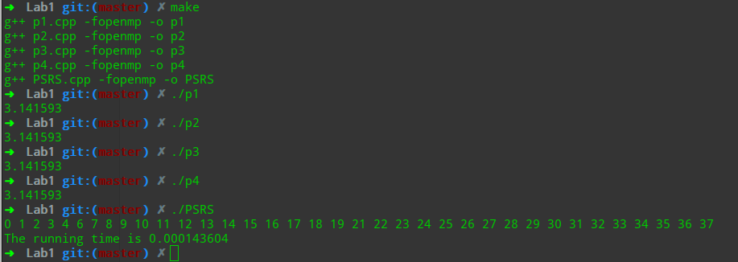

# Lab 1 openMP

## 算法设计

计算$\pi$的４种算法已经给出，不需要过多修改即可运行。

至于PSRS排序，根据Ref是那几个步骤即可。


## 实验环境

```
CPU: Intel Core i5-8250U @ 8x 3.4GHz
内存: 7704MiB
操作系统: Deepin 15.9.3 unstable
软件平台: gcc version 7.3.0 (Debian 7.3.0-19)
```

## 结果截图



## Ref

[OpenMP并行编程计算π值及PSRS排序](<https://blog.csdn.net/rectsuly/article/details/69788860>)