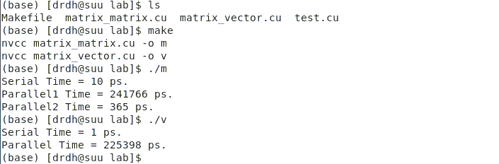

# Lab 3 GPU Cuda

## 算法设计


## 实验环境

```bash
CPU: Intel(R) Xeon(R) CPU E5-2680 v4 @ 2.40GHZ
GPU: GeForce GTX 1080
内存: 125G
操作系统: CentOS 9
软件平台: cuda10
#在实验室服务器中~/lx/lab使用cuda
#设置环境变量：
export PATH=/usr/local/cuda/bin:$PATH 
make
```

## 结果截图



## Ref

[StackoverFlow Matrix Vector Multiplication](<https://stackoverflow.com/questions/26417475/matrix-vector-multiplication-in-cuda-benchmarking-performance>)

[Cuda Example](<https://people.cs.pitt.edu/~melhem/courses/xx45p/cuda_examples.pdf>)