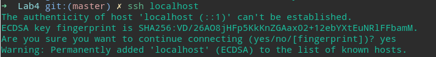
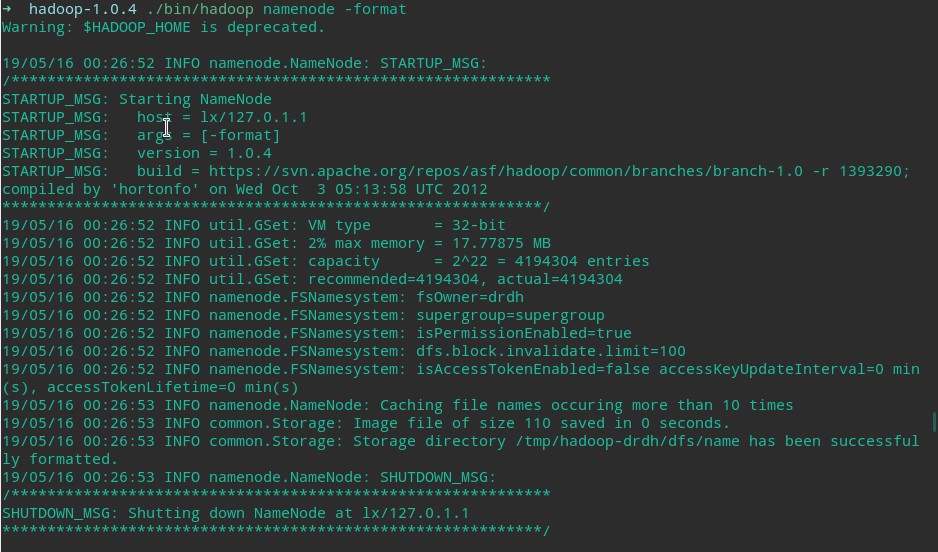
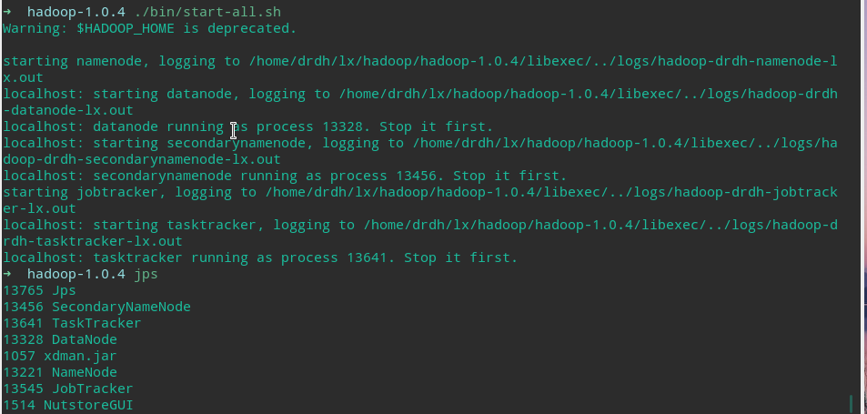
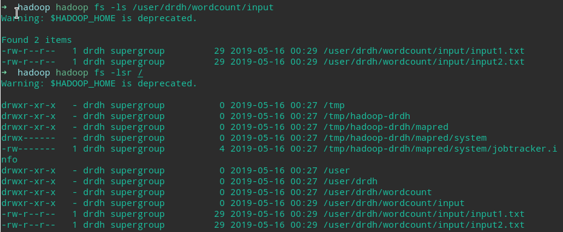
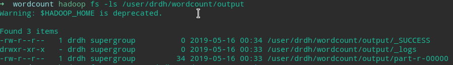
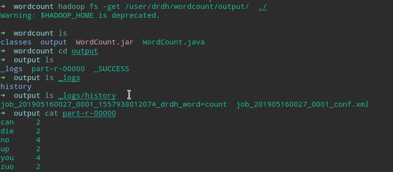
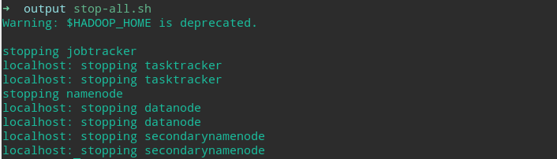
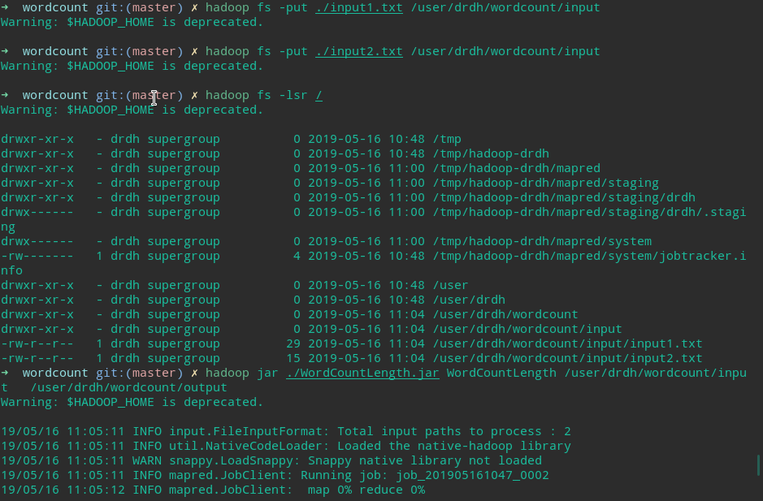
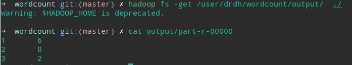

# Lab 4 MapReduce

## 环境配置

### 安装jdk

```bash
mkdir jdk
tar -zxvf ./jdk.tar.gz 
```

```bash
#~/.zshrc
export JAVA_HOME=~/lx/jdk/jdk1.7.0_09
export CLASSPATH=.:$JAVA_HOME/lib/*jar
export PATH=$JAVA_HOME/bin:$PATH
#source ~/.zshrc
```

```bash
java -version #检测是否成功
```

### 验证并安装ssh

```bash
which ssh
which sshd
which ssh-keygen
```

```bash
sudo systemctl enable sshd.service
sudo systemctl start sshd.service
```

### 生成ssh秘钥对

```bash
ssh-keygen -t rsa
cat ~/.ssh/id_rsa.pub >> ~/.ssh/authorized_keys
chmod 600 ~/.ssh/authorized_keys
```

检测公钥是否配置完成
`ssh localhost`
如果配置成功，则不需要密码就可以通过ssh进入localhost



### 安装hadoop

```bash
mkdir hadoop
tar -zxvf ./hadoop-1.0.4.tar.gz
```

```bash
#~/.zshrc
export HADOOP_HOME=~/lx/hadoop/hadoop-1.0.4
export PATH=$HADOOP_HOME/bin:
#source ~/.zshrc
```


修改`~/hadoop/hadoop-1.0.4/conf/hadoop-env.sh`
在该文件最后一行添加
`export JAVA_HOME=~/lx/jdk/jdk1.7.0_09`

### 配置单机模式

对conf目录下面的配置文件不做修改即为单机模式

### 配置伪分布模式

修改`core-site.xml`文件，内容如下

```xml
<?xml version="1.0"?>
<?xml-stylesheet type="text/xsl" href="configuration.xsl"?>
<configuration>
 <property>
     <name>fs.default.name</name>
     <value>hdfs://localhost:9000</value>
 </property>
</configuration>
```

修改`mapred-site.xml`文件，内容如下

```xml
<?xml version="1.0"?>
<?xml-stylesheet type="text/xsl" href="configuration.xsl"?>
<configuration>
    <property>
        <name>mapred.job.tracker</name>
        <value>localhost:9001</value>
    </property>
</configuration>
```

修改`hdfs-site.xml`文件，内容如下

```xml
<?xml version="1.0"?>
<?xml-stylesheet type="text/xsl" href="configuration.xsl"?>
<configuration>
    <property>
        <name>dfs.replication</name>
        <value>1</value>
    </property>
<configuration>
```

将localhost添加到hadoop conf目录下面的masters/slaves文件中

```
echo "localhost" >> masters
echo "localhost" >> slaves
```

### HDFS使用

#### 格式化HDFS

```bash
~/lx/hadoop/hadoop-1.0.4/bin/hadoop namenode -format
```



#### 启动hadoop

```bash
~/lx/hadoop/hadoop-1.0.4/bin/start-all.sh
```

检测hadoop是否成功启动

```bash
#jps
TaskTracker
SecondaryNameNode
NameNode
DateNode
JobTracker
```



#### 在HDFS中添加文件和目录

```bash
hadoop fs -mkdir /user/drdh/wordcount/input
```

在当前目录下面创建若干个文本文件，每个文件里面添加若干个英文单词，比如

```bash
#cat input2.txt
you can you up
no zuo no die
#cat input1.txt
no zuo no die
you can you up
```

将文本文件从本地目录上传到HDFS中

```bash
hadoop fs -put ./input1.txt /user/drdh/wordcount/input
hadoop fs -put ./input2.txt /user/drdh/wordcount/input
```

查看文件上传是否成功

```bash
hadoop fs -lsr /
```



### 测试实验

在当前目录下新建一个`WordCount.java`文件

编译WordCount.java

```bash
mkdir wordcount
cp ./WordCount.java ./wordcount
cd ./wordcount
mkdir classes

javac -classpath /home/drdh/lx/hadoop/hadoop-1.0.4/hadoop-core-1.0.4.jar:/home/drdh/lx/hadoop/hadoop-1.0.4/lib/commons-cli-1.2.jar -d ./classes/ ./WordCountLength.java

jar -cvf ./WordCountLength.jar -C ./classes  . #打包的时候一定不能忘记了上面命令最后的点号
```

运行Hadoop作业

```bash
hadoop jar ./WordCountLength.jar WordCountLength /user/drdh/wordcount/input   /user/drdh/wordcount/output
# 如果提示你说输出文件夹已经存在，那么则执行如下命令删除
hadoop fs -rmr /user/drdh/wordcount/output
```



获得运行结果

```bash
hadoop fs -ls /user/drdh/wordcount/output
hadoop fs -get /user/drdh/wordcount/output/  ./
```



### 关闭hadoop集群

```
stop-all.sh 
```




## 实验






可以看到结果符合预期。

## Ref

[Hadoop笔记之一：安装单节点集群](<https://blog.csdn.net/u010223750/article/details/52781271>)

[Hadoop笔记之二：运行WordCount实验](<https://blog.csdn.net/u010223750/article/details/52838186>)

[Hadoop笔记之三:WordCount实验续](<https://blog.csdn.net/u010223750/article/details/53126483>)


