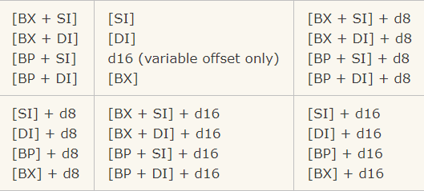
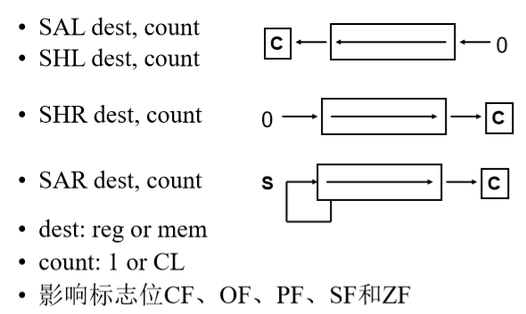
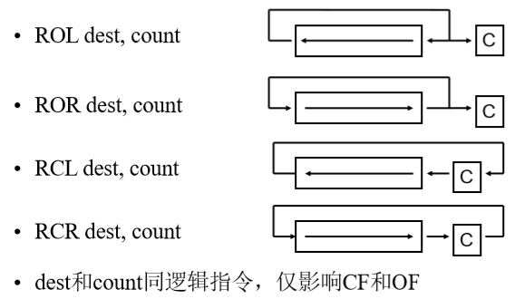
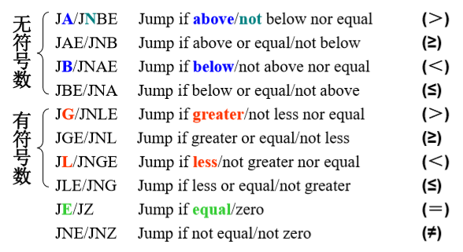
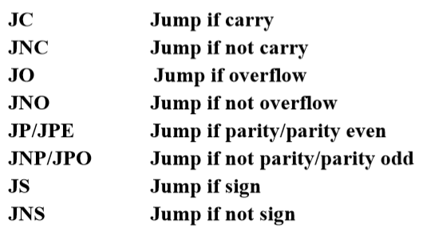
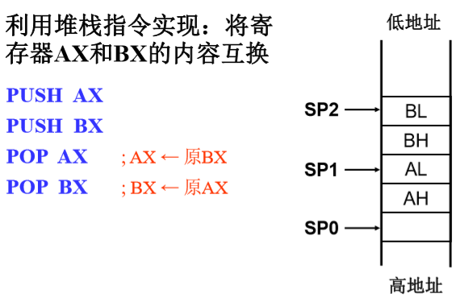
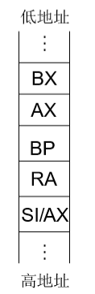

# 汇编基础

## 寄存器

### 概图


### 通用寄存器

8086CPU有8个 **通用寄存器**，每一个寄存器都有自己的名称：

- **AX** 累加寄存器 accumulator register（分为 **AH / AL**）.
- **BX** 基址寄存器 base address register （分为 **BH / BL**）.
- **CX** 计数寄存器 count register（分为 **CH / CL** ）.
- **DX** 数据寄存器 data register （分为 **DH / DL**）.
- **SI** 源变址寄存器 source index register.
- **DI** 目的变址寄存器 destination index register.
- **BP** 基址指针寄存器 base pointer.
- **SP** 堆栈寄存器 stack pointer.

### 段寄存器

- **CS** 代码段寄存器，用来存放当前正在运行的指令
- **DS** 数据段寄存器，用来存放当前运行程序所用的数据
- **ES** 附加段寄存器，由程序员决定用途
- **SS** 堆栈段寄存器，指出堆栈所在区域

默认下，**BX** **SI** 及 **DI** 与 **DS**协同工作，**BP SP**与 **SS** 寄存器协同工作。


其余的通用寄存器不能形成有效地址！同样，尽管**BX**可以形成有效地址，但是**BH BL**不能。

### 控制寄存器

- **IP** 指令指针寄存器 instruction pointer
- **Flags Register** 状态标志寄存器

**IP** 始终同**CS** 协同工作，指出当前执行的指令。

**Flags Register** 完成一次数学运算后，由CPU自动修改，通过它可以得到当前结果类型，也可以作为跳转语句条件。通常你无法直接访问它们。

## 寻址方式

### 概要



  **d8** - 表示８位偏移量

**d16** - 表示16位偏移量  


只有这些寄存器可以放入方括号中（作为内存指针）**BX, SI, DI, BP**  

### MOV

- 源和目的必须是同样大小，要么都是字节要么都是字

操作类型如下:

```asm
MOV REG, memory
MOV memory, REG
MOV REG, REG
MOV memory, immediate
MOV REG, immediate
```

> **REG**: AX, BX, CX, DX, AH, AL, BL, BH, CH, CL, DH, DL, DI, SI, BP, SP.
> **memory**: [BX], [BX+SI+7],变量, 等等
> **immediate**: 5, -24, 3Fh, 10001101b, 等等

只支持如下段寄存器:

```asm
MOV SREG, memory
MOV memory, SREG
MOV REG, SREG
MOV SREG, REG
```

> **SREG**: DS, ES, SS, 注意 CS 只能作操作源
> **REG**: AX, BX, CX, DX, AH, AL, BL, BH, CH, CL, DH, DL, DI, SI, BP, SP.
> **memory**: [BX], [BX+SI+7], variable, 等等  

**MOV**指令不能用来设置**CS**和**IP**寄存器的值

## 量

### 变量

```asm
#MAKE_COM#
ORG 100h
MOV AL, var1
MOV BX, var2
RET    ; stops the program.
VAR1 DB 7 ;7 7h 10b ? (not sure)
var2 DW 1234h ;db(byte 8bits),dw(word 16bits)
```

### 数组

```asm
a DB 48h, 65h, 6Ch, 6Ch, 6Fh, 00h
b DB 'Hello', 0 
c DW 5 DUP(9) ;the same as: c DB 9, 9, 9, 9, 9 
d DB 5 DUP(1, 2)
;the same as:d DB 1, 2, 1, 2, 1, 2, 1, 2, 1, 2 
```

如果需要存放超过255或者小于－128的数值，使用**DW**来代替 **DB**。但是**DW**不能用于声明字符串。**DUP**命令展开后不能超过1020个字符，如果需要声明请将它们分成两行（这样，内存中得到的仍然是一个大数组）。

### 取得变量地址

```asm
BYTE PTR [BX] ;按字节访问
WORD PTR [BX] ;按字访问
```

```asm
ORG 100h
MOV    AL, VAR1      ; 将变量var1的数值放入al以便检查
LEA    BX, VAR1              ; 将var1的地址存入 BX.
;or MOV    BX, OFFSET VAR1
MOV    BYTE PTR [BX], 44h    ; 修改变量var1的内容
MOV    AL, VAR1              ; 将变量VAR1的数值放入AL以便检查
RET
VAR1   DB  22h
END
```

### 常量

```asm
k EQU 5
MOV AX, k
```

## 中断

[参考](http://www.cnblogs.com/QuLory/archive/2012/11/07/2758054.html)

## 算逻指令

### 1. **ADD**, **SUB**,**CMP**, **AND**, **TEST**, **OR**, **XOR**

支持如下操作数:

```asm
REG, memory
memory, REG
REG, REG
memory, immediate
REG, immediate
```

> **REG（寄存器）**: AX, BX, CX, DX, AH, AL, BL, BH, CH, CL, DH, DL, DI, SI, BP, SP.
> **memory（内存）**: [BX], [BX+SI+7], 变量,等等...
> **immediate（立即数）**: 5, -24, 3Fh, 10001101b, 等等...

**CMP**和**TEST**指令只影响标志位，并不返回数值（这两条指令是用来在程序运行中判断的）上述指令只影响如下标志位：**CF**, **ZF**, **SF**, **OF**, **PF**, **AF**.

### 2. **MUL**, **IMUL**, **DIV**, **IDIV**

支持如下操作数:

```asm
REG
memory
```

> **REG（寄存器）**: AX, BX, CX, DX, AH, AL, BL, BH, CH, CL, DH, DL, DI, SI, BP, SP.
> **memory（内存）**: [BX], [BX+SI+7], variable, etc...

**MUL** and **IMUL** 指令只影响 **CF**, **OF**标志位。
运算后如果结果超出范围，这些标记位置**1**，如果没有超过范围，置**0**

**DIV** 和 **IDIV** 指令对于标志位无影响

> - **MUL** \- **无**符号乘:
>   当操作数是**字节**时: AX = AL * 操作数.
>   当操作数是**字**时: (DX AX) = AX * 操作数.
> - **IMUL** \- **有**符号乘法:
>   当操作数是**字节**时: AX = AL * 操作数.
>   当操作数是**字**时: (DX AX) = AX *  操作数.
> - **DIV** - **无**符号除法:
>   当操作数是**字节**时: AL = AX / 操作数, AH = 余数（取模后的余数).
>   当操作数是**字**时: AX = (DX AX) / 操作数, DX = 余数（取模后的余数）
> - **IDIV** - **有**符号除法:
>   当操作数是**字节**时: AL = AX / 操作数, AH =余数（取模后的余数）
>   当操作数是**字**时: AX = (DX AX) / 操作数 DX = 余数（取模后的余数） .

  ### 3.  **INC**, **DEC**, **NOT**, **NEG**

支持如下操作数:

```asm
REG
memory
```

> **REG（寄存器）**: AX, BX, CX, DX, AH, AL, BL, BH, CH, CL, DH, DL, DI, SI, BP, SP.
> **memory（内存）**: [BX], [BX+SI+7], variable, etc...

**INC**, **DEC** 指令只影响如下标志位: **ZF**, **SF**, **OF**, **PF**, **AF**.
**NOT** 指令不影响任何标志位(取反)
**NEG** 指令只影响如下操作位： **CF**, **ZF**, **SF**, **OF**, **PF**, **AF**.  （取反加一）

### 4. SAL, SHL, SHR, SAR,ROL,ROR,RCL,RCR





## 其他指令

### 跳转指令





### 堆栈指令



### 循环控制

```asm
LOOP   short-label ; Loop 
 	; DEC CX 
 	; JNZ  short-label 
JCXZ    short-label ; Jump if register CX=0	 
	; TEST CX, CX 
	; JZ short-label
```

## 程序结构

### 总结构

```asm
; 8086 Assembly Program “Hello.asm”
;------------------堆栈段------------------
;[名字]   伪指令 [参数] 
STACK	SEGMENT 
		DB   256 DUP(0)
STACK 	ENDS
;------------------数据段------------------
DATA	SEGMENT 
HELLO	DB  0DH,0AH,"Hello World!",0DH,0AH, "$" 
DATA 	ENDS
;------------------代码段------------------
CODE	SEGMENT 
;伪指令：段假设 - ASSUME 
		ASSUME CS:CODE, DS:DATA, SS:STACK 
;伪指令：过程定义 - PROC、ENDP 
;FAR：远过程，可以段间调用 
;NEAR：近过程，默认类型(可以省略)，仅段内调用
MAIN	PROC	FAR 
;指令语句格式
;[标号:]  操作码助记符 [操作数]
START: 	PUSH	DS ; 保存返回地址 
		XOR		AX,AX 
		PUSH	AX 
		MOV		AX, DATA    ; 初始化DS 
		MOV 	DS, AX 
		LEA 	DX, HELLO  ; 显示字符串 
		MOV 	AH, 09H 
		INT 	21H 
		RET 			; 返回DOS 
MAIN ENDP 
CODE ENDS 
;------------------结束------------------
;伪指令：汇编结束
;如果是主模块，END后可指定程序入口地址，又称启动地址 
	END START
```

### 分支

编程实现：将AL中的低4位，转换成十六进制数 的ASCII码，保存在AL中 – 0\~9和A~F的ASCII码分别为30H ~ 39H和41H ~ 46H)

```asm
	AND AL, 0FH 
	CMP AL, 9 
	JA A2F 
	OR AL, 30H 
	JMP   Done 
A2F: ADD AL, 37H 
Done: 
```

if-else

```asm
;if(AL== 'Y')
	CMP AL,"Y"
	JNE else_part
	...
	JMP end_if
else_part:
	...
end_if:
	...
```

复合条件

```asm
;情形一
;if(AL>='0' && AL <= '9')
	CMP AL,30h
	JB end_if
	CMP AL,'9'
	JA end_if
	...
endif:
	...
	
;情形二
;if(AX<-10 || AX >10)
	CMP AX,-10
	JL then_part
	CMP AX,10
	JLE end_if
then_part:
	...
end_if:
	...
```

### 循环结构

编程实现：将AX 中的无符号二进制 数，转换成十六进 制数的ASCII码串， 保存到以BX为指针 的存储器中(大端序 存储) – 0\~9和A~F的ASCII 码分别为30H ~ 39H 和41H ~ 46H 

```asm
;  初始化
		MOV CX, 0404H    ; 设置移位次数和循环次数  
;循环主体 
HNEXT:	ROL AX, CL ; 高4位移到低4位 
		MOV DX, AX ; 保护原始数据 
		AND AL, 0FH ; 低4位转换为 
		OR AL, 30H ; ASCII码 
		CMP AL, 3AH 
		JB SAVE 
		ADD AL, 07H 
SAVE: 	MOV [BX], AL ; 保存转换结果 
;  循环调整 
		INC BX ; 修改存储指针 
		MOV AX, DX ; 恢复原始数据 
		DEC CH ; 修改循环次数 
; 循环控制 
		JNZ HNEXT ; 已达4次？
```

累计while

```asm
;unsigned int  sum = 0, i = 1; 
;while ( i <= 100 ) { sum = sum + i; i++; }
;一种实现
		MOV  AX, 0      ; sum = 0 
		MOV  CX, 1 ; i = 1 
Next:   CMP  CX, 100 
		JA    Done          ; i > 100? 
		ADD  AX, CX    ; sum + i 
		INC   CX ; i + 1 
		JMP Next 
Done: 	...

;另一种实现
		XOR  AX, AX    ; sum = 0 
		MOV CX, 1 ; i = 1 
		JMP  Tst  
Next:	ADD  AX, CX    ; sum + i 
		INC   CX ; i + 1 
		Tst: CMP CX, 100 
		JBE Next ; i ≤100? 
Done: 	...
```

do-while

```asm
;unsigned int sum = 0, i = 1; 
;do  { sum = sum + i; i++; } while ( i <= 100 );
;一种实现
		XOR  AX, AX    ; sum = 0 
		MOV CX, 1 ; i = 1 
Next:  	ADD AX, CX ; sum + i 
		INC   CX ; i + 1 
		CMP CX, 100 
		JBE Next ; i ≤100? 
Done: 	...

;优化实现
;unsigned int sum = 0, i = 100;
;do  { sum = sum + i; i--; } while ( i != 0 );
		XOR  AX, AX    ; sum = 0 
		MOV CX, 100    ; i = 100 
Next: 	ADD AX, CX ; sum + i 
		DEC   CX ; i - 1 
		JNZ Next ; i≠0? 
Done: 	...
```

## 程序调用

### 子程序调用

案例求和

```C
int  total (int *arr, int n) {
    int  result = 0; 
    for( ; n>=0; n--) 
        result += arr [n] ; 
    return  result; 
} 

Sum = total(Array, 100);
```

利用寄存器参数传递

```asm
; 主程序段 
...
	LEA BX, ARRAY ; 设置入口参数 
	MOV CX, 100 
	CALL TOTAL ; 调用求和子程序 
	MOV SUM, AX ; 保存求和结果 
...
; 求和子程序 
; 入 口 参 数: BX－数组指针 ; CX－数组项数 
; 出 口 参 数: AX－数组和 
TOTAL 	PROC  NEAR 
		XOR AX, AX 
NEXT: 	ADD AX, [BX] 
		ADD BX, 2 
		LOOP   NEXT 
		RET 
TOTAL ENDP
```

利用堆栈参数传递

```asm
; 主程序段 
	...
	LEA  SI, ARRAY  
	PUSH SI ; 设置入口参数
	MOV CX, 100 
	CALL TOTAL ; 调用求和子程序 
	POP SUM ; 保存求和结果 
	...
; 求和子程序 
; 入 口 参 数: 堆栈－数组地址 
; 			  CX－数组项数 
; 出 口 参 数: 堆栈－数组和 
TOTAL: 	PUSH BP 
		MOV BP, SP 
		PUSH AX 
		PUSH BX 
		XOR AX, AX 
		MOV BX, [BP+4] 
NEXT:  	ADD AX, [BX] 
		ADD BX, 2 
		LOOP NEXT 
		MOV [BP+4], AX 
		POP BX 
		POP AX 
		POP BP 
		RET
```



### 中断

#### 输入

```asm
INT 21H
```

##### 带回显的字符输入 

- 功能：等待从键盘输入一按键，并显示在屏幕上 

- 入口参数：AH = 1 

- 出口参数：AL = 按键的ASCII码 

##### 不带回显的字符输入 

- 除AH=8和不显示键入的字符外，其他同上

##### 带回显的字符串输入 

- 功能：等待从键盘输入以回车结束的一串字符，并存 入设定的缓冲区，同时显示在屏幕上 
- 入口参数 ▪ AH = 0AH, DS : DX = 缓冲区首址, 其中 [DS : DX] = 缓冲区大小 (1~255) 
-  出口参数 ▪ [DS : (DX+1)] = 输入字符数(除回车外), 输入的字符 串从DS : (DX+2)开始存

#### 输出

```asm
INT 21H
```

##### 字符输出 

- 功能：在屏幕上显示一个字符 
- 入口参数：AH = 2, DL = 待显示ASCII码字符 
- 出口参数：无 

##### 字符串输出 

- 功能：在屏幕上显示一个字符串 
- 入口参数：AH = 9, DS:DX =以‘$’结束的ASCII码字符串的起始地址 
- 出口参数：无

## 简化段

```asm
	.model small
	.stack 64H
	.data
array dw 36 DUP(0)
msg	db "hello!",0DH,0AH,'$'
TEN	= 10
	
	.code
	.startup	
main:
	call func
	.exit
func proc
	...
	ret
func endp

end
```


## 附录

### 状态标记寄存器


> - **进位标志 Carry Flag (CF)** - 出现无符号（unsigned overflow）溢出该位设置成**1**。例如，计算 **255+1**（结果超出0...255）。没有溢出时该位为**0**。
> - **零标志 Zero Flag (ZF)** - 当结果为 **0** 时设置为**1**，结果不为 **0** 时设置为**0**。
> - **符号标志 Sign Flag (SF)** -  结果为**负**置1，结果为**正**置为0。事实上该位对于结果特别重要。
> - **溢出标志 Overflow Flag (OF)** -  当出现有符号数溢出设置为1。例如，计算**100+50**（结果超出－128－127的范围）。
> - **奇偶标志 Parity Flag (PF)** - 当结果操作数中1的个数为偶时置**1**，否则为**0**注意，如果结果是一个字，该标志只指示低8位。
> - **辅助进位标志 Auxiliary Flag (AF)** -  低4位向上进位时置**1**，否则为**0**（记录运算时第3位（半个字节）产生的进位值。例如，执行加法指令时，最高有效位有进位时置1，否则置0
> - **中断标志 Interrupt enable Flag (IF)** - 当cpu容许中断时为**1**，否则为**0** 
> - **Direction Flag (DF)** - 方向标志，在串处理指令中控制处理信息的方向用。当**DF**为1时，每次操作后使变址寄存器SI和DI减量，这样就使串处理从高地址向低地址方向处理。当**DF**为0时，则使SI和DI增量，使串处理从低地址向高地址方向处理。

# 汇编实验

## exp1 输出下三角

### 要求

> 把1~36的自然数按行顺序存入一个6*6的二维数组中，然后打印出该数组的左下半三角。

### 思路

#### 填数组

取地址，循环（以下内容仅仅截取）

```asm
array	DB 36 DUP(0)

	LEA	BX,array
	mov CX,36
	mov DL,1
fill_array:
	mov [BX],DL
	inc DL
	inc BX
	loop fill_array
```

#### 打印

```asm
print_num proc 
	mov	AL,[BX]	;AX to print
	mov	AH,0
	div	TEN	;AL=AX/10 AH=AX%10
	add AL,'0'
	add AH,'0'
	
	mov DX,AX	;print DL 
	mov AH,2	;select char print 
	INT 21H		;print tens
	
	SHR DX,8	;mov DL,DH
	INT 21H		;print ones
	
	mov DL,' '
	INT 21H		;print space
	ret
print_num endp	
```

```asm
print_CRLF proc
	mov AH,2
	mov DL,13 ;0DH
	INT 21H
	mov DL,10	;0AH
	INT 21H
	ret
print_CRLF endp
```

## exp2 文件内容读取与排序

### 要求

> 编程实现排序算法，对文件2.txt中的无符号整数进行排序，排序结果输出到屏幕。数据的个数不超过1024

### 思路

#### 读文件

```asm
file	db "2.txt",0 ;put the file in MyBuild
handle	dw 0	
buffer	db 0

	mov AH,3Dh ;open file
	mov AL,0	;read-only
	LEA	DX,file	;file name in DX
	INT 21h
	jc over		;all error in c
	;open successful
	mov handle,AX	;store the handle
	...
read_a_char:
	;read a char
	mov BX,handle
	mov AH,3Fh	;read char
	LEA DX,buffer
	mov CX,1	;only read one char
	INT 21h
	;test EOF-0
	test AX,AX
	jz finish_read
	
	mov DH,buffer ;DH the char read
	;test whether DH a digit
	...
	jmp read_a_char
	
finish_read:
	...
```

#### 冒泡排序

nothing special

## exp3 大整数阶乘

### 要求

> 计算N!（0<N<20）

### 思路

#### 输入N

有可能是两位数

```asm
input:
	;input a char @AL
	mov AH,1
	INT 21H
	
	sub AL,'0'
	js finish_input ;not a digit
	
	push AX
	mov AL,DL
	;mov DL,10
	mul TEN		;AL=AL*10
	mov DL,AL
	pop AX
	add DL,AL	;DL=DL*10+AL
jmp input
	
finish_input:
```

#### 阶乘

- 一个大数组ans, 一个位置代表一个位(0~9)
- m : N --> 2
  - 每个位都分别乘以m
  - 从低位到高位，除以10，商进位，余保留

```asm
	;current number to mul CL
	mov CL,N
	mov ans,1

;begin to calculate
fact:
	cmp CX,1
	jz	print	;CX==1, calculate over

	mov BX ,0 ;ans[BX] to store result
	multi:
		cmp BX,BIT
		jz	carry_init
		mov AL,CL	;AL,number like 3
		mul BYTE PTR ans[BX];AL=AL*ans[BX]
		mov ans[BX],AL
		inc BX 
	jmp multi
	
	carry_init:
		mov BX,0
	
	carry:
		cmp BX,BIT
		jz	carry_over
		mov AX,0
		mov AL,ans[BX]
		div BYTE PTR TEN
		mov ans[BX],AH
		add ans[BX+1],AL
		inc BX
	jmp carry

	carry_over:
		dec CX
jmp fact
print:...
```

#### 输出

从高位到低位，先找到第一个非零的数

打印数需要先加上`'0'`

```asm
print:
	mov BX,BIT+1 ;total bits
	
find_non_zero:
	dec BX
	mov DL,ans[BX]
	cmp DL,0
	jz find_non_zero
	
print_digit:
	add DL,'0'
	mov AH,2
	INT 21H
	
	dec BX
	js over 
	mov DL,ans[BX]
jmp print_digit
	
over:
```

## exp4 加减计算器

### 要求

> 编程计算任一整数加减运算表达式。其中，表达式从键盘输入，可带括号；操作数为字数据。表达式的长度不超过1024个字节

### 思路

#### 总体思路

- `main`

  - `input`

    - 输入一个char

      ```asm
      mov AH,1
      INT 21H
      mov present_char,AL
      ```

    - 判断是否合法`check_char`

      与一串合法字符数组一个接一个比较，没有匹配则不合法

    - 处理字符`process_char`

      - 当前char是number

        与`present_num`拼接。粗略就是`present_num=present_num*10+present_char`

      - 当前char不是number

        - 上一个char是char

          先保存上一个`present_num`

          再直达`not_unary`非一元运算符部分	

        - 上一个char不是char

          当前char是不是`+-`之一？

          - 是：有可能是一元运算符

            前一个char是不是`($`之一？

            - 是：一元运算符

              先插入一个0.`(-2) --> (0-2)`便于后续计算

            - 否：直达`not_unary`非一元运算符部分	

          - 否：直达`not_unary`非一元运算符部分	

      - `not_unary`部分

        插入当前char, 插入label

  - `calculate`

    使用栈实现。从右往左`<--`扫描.

    类似后缀表达式

    数字字符均入栈

    - `(`处理括号内容，直到`)`

      由于从右往左扫描，不可能出现嵌套。只会由内部向外消解

    - `$`处理内容会完全结束

      此时遇到的是`expression`的最左端的`$`

      依次处理栈内的内容，直到到达栈底的`$`

    - 计算完毕

  - `output`DX内容变成字符

    `output2result`依次取商

    - 将结果保存到一个数组，直接调用通用的`print_string`即可

#### 格式

##### expression 安排

原本的内容没有标点与分界

```asm
;1:Num,2:+,3:-,4:(,5:),6:$
;char/num label
;123-(-3-(-3))
'$',6  123,1  '-',3  '(',4  '-',3  3,1  0,1  '-',3  '(',4  0,1  '-',3  3,1  ')',5  ')',5  '$'	6  
;扫描<--
;插入了0
```

##### stack安排

```
top <--- base
以上内容的pair反过来，先pop label
括号会被直接消解
```

# dosbox 

使用dosbox再配合bcc可以由c语言生成8086汇编码. 但是生成的汇编可读性很差，输入输出也不知怎么用，所以仅仅做一部分介绍

1. 安装dosbox, 使用yaourt即可

2. 配置

```
[autoexec]
# Lines in this section will be run at startup.
# You can put your MOUNT lines here.
mount C ~/lx/dos
C:
C:/autoexec.bat
```

3. [下载tcc](https://www.ibiblio.org/pub/micro/pc-stuff/freedos/files/repositories/1.2/pkg-html/bcc.html)

[相关文档](https://linux.die.net/man/1/bcc)

解压到dos挂载的目录。

4. 使用

进入目录`dos/DEVEL/BCC/LIB`

使用的汇编命令为`BCC-CC1.EXE t.c -o t.s -0 -t`

# 注册码

[百度知道](https://zhidao.baidu.com/question/196219949.html)

```
User Name: www.weste.net
RegKey: 27R3-1I2UJHRJSF3C3FRTQZXJ 
```


