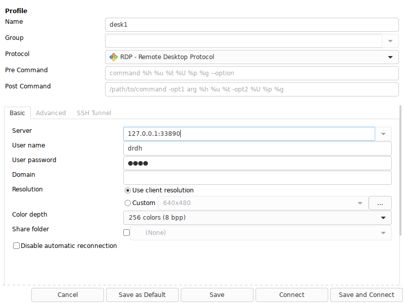
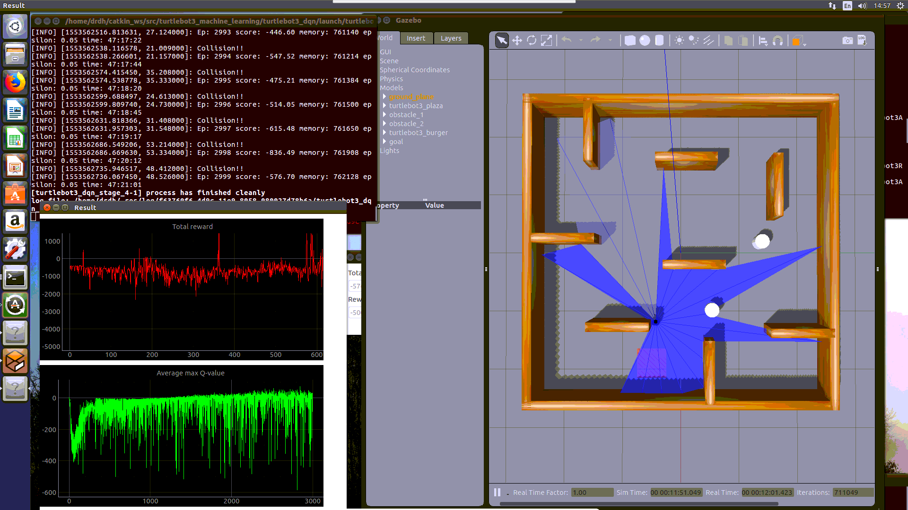

## 在服务器上复现

### 基本配置

登录服务器[SSH Tunnel扫盲(ssh port forwarding端口转发)](https://blog.51cto.com/sjitwant/1934069)

```bash
ssh -N -f -L localhost:8001:192.168.1.63:8000 222.195.92.204 -p 5555
# lsof -ti:8001 | xargs kill -9
#　或者不使用-f
```
然后浏览器中打开`http://localhost:8001/`

创建工作环境，先`source /home/user/ros_extra/install_isolated/setup.bash`

```bash
mkdir -p ~/catkin_ws/src
cd ~/catkin_ws/src
cd ~/catkin_ws/
catkin_make
```

然后构建默认激活

```bash
export LD_LIBRARY_PATH=$LD_LIBRARY_PATH:/usr/local/lib:/usr/local/lib64
source /home/user/ros_extra/install_isolated/setup.bash
```

### 远程桌面

进入root用户

```bash
su drdh
# 或者sudo 每个命令
# cat /etc/group | grep wheel
```

查看系统信息

```bash
cat /etc/centos-release
# CentOS Linux release 7.6.1810 (Core)
```


```bash
yum grouplist

安装GNOME桌面
yum groupinstall "GNOME Desktop" "Graphical Administration Tools"

#安装epel库
yum -y install epel-release
#安装xrdp
yum -y install xrdp

vim /etc/xrdp/xrdp.ini
#把max_bpp===32== 改为max_bpp===24==

#启动服务
systemctl start xrdp
#开机自启
#systemctl enable xrdp
#查看是否启动
systemctl status xrdp.service
#看xrdp和xrdp-sesman是否正常启动
netstat -antup|grep xrdp
#running 标示

#开启防火墙对应端口，也可以直接把防火墙关掉
firewall-cmd --permanent --zone=public --add-port=3389/tcp
firewall-cmd --reload


#安装配置vnc
yum install tigervnc tigervnc-server
#设置密码，注意设置的是当前用户的密码
vncpasswd #drdhlx
#如需为其他用户配置密码
#vncpasswd user

#拷贝配置文件
cp /lib/systemd/system/vncserver@.service /etc/systemd/system/vncserver@:1.service
#配置
vim /etc/systemd/system/vncserver@:1.service
#ExecStart=/sbin/runuser -l <USER>-c "/usr/bin/vncserver %i"
#PIDFile=/home/<USER>/.vnc/%H%i.pid
#<USER> 改为你所需要通过VNC登陆的服务的用户名。

#刷新服务
systemctl daemon-reload
#启动服务
systemctl start vncserver@:1.service
#设置自启
#systemctl enable vncserver@:1.service

#设置防火墙（如果开启了防火墙）
firewall-cmd --permanent --add-service vnc-server
systemctl restart firewalld.service
```

连接方式

```bash
ssh -N -L localhost:33890:192.168.1.63:3389 drdh@222.195.92.204 -p 5555
```

打开`remmina`

使用`rdp`的`127.0.0.1:33890`



或者直接使用Remmina的tunel


### 新的连接方式

[黑屏的解决](https://www.centos.org/forums/viewtopic.php?t=66886)从`.bashrc`中移除`Anaconda`相关的路径。。。

```bash
ssh -N -L localhost:5901:localhost:5901 222.195.92.204 -p 5555
```

使用一个 VNC client 连接 `vnc://localhost:5901` 即可.

```bash
systemctl restart vncserver@:1.service
```

### 重现过程

每次打开重启service后打开桌面，都需要将`anaconda`部分注释掉，然后打开新的`bash`，在重启service

```bash
systemctl restart vncserver@:1.service
```

重新打开shell

```bash
conda activate tf 
# conda deactivate 
```

```bash
pip2 install keras --user -i http://pypi.mirrors.ustc.edu.cn/simple/
```


实验的Demo代码下载与编译

```bash
cd ~/catkin_ws/src/
git clone https://github.com/ROBOTIS-GIT/turtlebot3_msgs.git
git clone https://github.com/ROBOTIS-GIT/turtlebot3.git
git clone https://github.com/ROBOTIS-GIT/turtlebot3_simulations
git clone https://github.com/ROBOTIS-GIT/turtlebot3_machine_learning
cd ~/catkin_ws && catkin_make
```

**依赖关系无法解决，暂时使用虚拟机**

下载`virtualbox rmp`包，然后使用`rmp -i xxx.rmp`安装即可。

[VirtualBox 6.0.4 platform packages]([VirtualBox](https://www.virtualbox.org/wiki/VirtualBox) 6.0.4 platform packages)


ubuntu使用之前搭建的环境export==>import即可。


memory size: 10240MB

Filesize: 100GB

Core:28





### Ref

[Centos7.3+Xfce桌面+VNC服务+XRDP服务 实现远程桌面连接](https://blog.51cto.com/13528032/2120925)

[CentOS 7 安装xrdp 远程桌面](https://my.oschina.net/u/3367404/blog/1920868)

[CENTOS7 基于XVNC和RDP配置远程桌面可访问与用户权限](https://www.nzwang-lab.net/2018/07/24/REMOTE-DESTOP-CENTOS7/)

[配置使用RDP over SSH提高远程桌面安全性](https://ngx.hk/2017/04/25/%E9%85%8D%E7%BD%AE%E4%BD%BF%E7%94%A8rdp-over-ssh%E6%8F%90%E9%AB%98%E8%BF%9C%E7%A8%8B%E6%A1%8C%E9%9D%A2%E5%AE%89%E5%85%A8%E6%80%A7.html)


