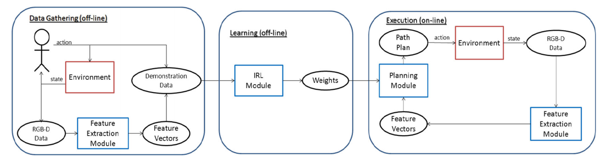
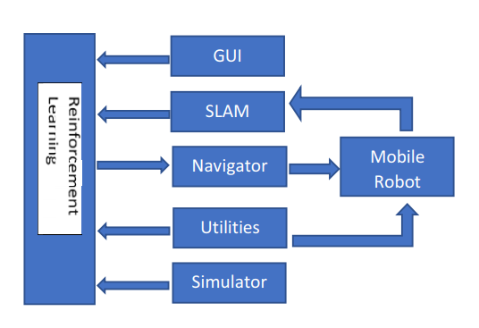

做一个RL在ROS上的文献调研，以此来确定idea方向。

激光 => 地图 => 路径规划：是否这就是经典方法擅长的？

[Towards Vision-Based Deep Reinforcement Learning for Robotic Motion Control](<https://arxiv.org/pdf/1511.03791.pdf>)

机械臂，输入为图像。与陈博士说的类似，转化成图像。

但是，使用RL不就是要追求它的动态性吗，要把一些人工难以规范化的规则使用自学习表达出来，如果把激光数据转换成地图，那直接用经典的SLAM可能算法更好？

所以我觉得使用RL在无人车上，就是使用它的动态性，不应该聚集在navigation而是reaction.

[Learning socially normative robot navigation behaviors with Bayesian inverse reinforcement learning](<https://ieeexplore.ieee.org/abstract/document/7487452>)

[Inverse Reinforcement Learning algorithms and features for robot navigation in crowds: An experimental comparison](<https://ieeexplore.ieee.org/abstract/document/6942731>)

[Socially Adaptive Path Planning in Human Environments Using Inverse Reinforcement Learning](<https://link.springer.com/article/10.1007/s12369-015-0310-2>)

> socially adaptive path planning in dynamic environments, by generating **human-like path trajectory**.
>
> 1. a feature extraction module
>
>    The feature extraction module extracts features necessary to characterize the state information, such as density and velocity of surrounding obstacles, from a RGB-depth sensor
>
> 2. **inverse reinforcement learning** (IRL) module
>
>    The inverse reinforcement learning module uses a set of demonstration trajectories generated by **an expert** to learn the expert’s behaviour when faced with different state features, and represent it as a cost function that respects social variables.
>
> 3. a path planning module
>
>    the planning module integrates a three-layer architecture, where **a global path** is optimized according to a classical shortest-path objective using a global map known a priori, **a local path** is planned over a shorter distance using the features extracted from a RGB-D sensor and the cost function inferred from IRL module, and **a low-level system handles avoidance** of immediate obstacles.

经典办法的不足(在动态环境中)

> if people move in a significantly different manner than the training data, then the motion predictor cannot generalize to such situations. More formally, this is due to the fact that the training data and test data are non-identically and independently distributed (non-iid), whereas the iid is standard assumption in supervised learning approaches. Unfortunately, for the human motion prediction, different environments will induce non-iid data

[Autonomous navigation of a mobile robot in dynamic indoor environments using SLAM and reinforcement learning](<https://iopscience.iop.org/article/10.1088/1757-899X/402/1/012022/meta>)

> 1. Global Navigation: this whereby the identifies its obstacles and its position relative to the **previously constructed map**. 
> 2. Local Navigation: the robot detects and identifies obstacles in relative to its current position. In this paper, local navigation is done with the use of the depth sensor, the Kinect camera. 
> 3. Path planning: this involves the finding the best way possible for navigation to avoid static and dynamic obstacles. Global path plan is required to first find the best path that allows the robot to reach the goal **avoiding static object.** Path re-planning is crucial to determine a different optimal path when a **dynamic obstacle** id detected. 
> 4. Motion execution refers to actuation of the dc motors that drives the mobile robot to accurately move the robot in its environment. This involves determining correct input current to the DC motors to give the mobile robot a proper acceleration and velocity. **Reinforcement** is used in this section using the Q-Learning algorithm for **dynamic obstacles avoidance**. 

本论文并没有详细说明这四点是怎么实现的

[Target-driven visual navigation in indoor scenes using deep reinforcement learning](<https://ieeexplore.ieee.org/abstract/document/7989381>)

> target-driven visual navigation.
>
> 1. lack of generalization capability to new goals
>
>    an actor-critic model whose policy is a function of **the goal as well as the current state**, which allows better generalization
>
>    Our model takes the visual task objective as an input. Thus we can avoid re-training for every new target. 
>
>    Our model learns a policy that jointly embeds the target and the current state. Essentially, an agent learns to take its next action conditioned on both its current state and target, rather than its current state only. Hence, there is no need to re-train the model for new targets. 
>
> 2. data inefficiency, i.e., the model requires several (and often costly) episodes of trial and error to converge, which makes it impractical to be applied to real-world scenarios
>
>    propose the AI2-THOR framework, which provides an environment with high-quality 3D scenes and a physics engine. Our framework enables agents to take actions and interact with objects. Hence, we can collect a huge number of training samples efficiently.
>
>    we developed one of the first simulation frameworks with high-quality 3D scenes, called The House Of inteRactions (AI2-THOR). Our simulation framework enables us to collect a large number of visual observations for action and reaction in different environments. For example, an agent can freely navigate (i.e. move and rotate) in various realistic indoor scenes, and is able to have low- and high-level interactions with the objects (e.g., applying a force or opening/closing a microwave)

[Model-based Q-learning for humanoid robots](<https://ieeexplore.ieee.org/abstract/document/8023674>)

Dynamic rather than static

MultiAgent

coorperation 

如果有专门的实验室在做navigation, 而且不用RL, 就说明RL在这方面确实表现不好，所以需要用在其他更加适合它的地方

